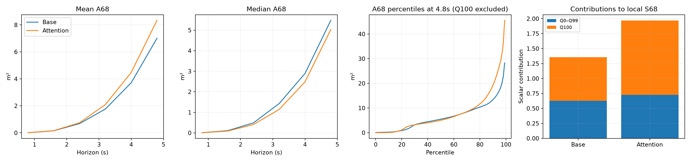

# Vì sao attention gốc cải thiện nhiều metric nhưng S68 kém hơn?

## Kết luận

Hai model trong phân tích này là `base_mdn` best epoch 1961 và `attention_mdn` best epoch 1740, covariance legacy (`sigma=exp(raw)`, `rho=tanh(raw)`). Không sử dụng checkpoint stable. Audit toàn bộ 56.694 test × sáu horizon, replay thứ tự sampling của evaluator gốc. Scalar S68/S95 tính lại khớp kết quả đã công bố trong sai số làm tròn. Không sửa model/loss/evaluator hoặc train thêm.

Attention không làm vùng 68% rộng hơn đồng loạt. Model có vùng nhỏ hơn ở nhiều mẫu, nhưng phần đuôi của phân bố diện tích lớn hơn. Một số Gaussian rộng có trọng số chi phối tạo vùng confidence rất lớn; phép tổng hợp S68 gồm phân vị cực đại nên khuếch đại tác động của các trường hợp này. Đây là cơ chế trực tiếp có bằng chứng; chưa chứng minh attention layer là nguyên nhân nhân quả của quá trình học covariance rộng.

## Phân rã chính xác điểm S68 test

| Phần | Base | Attention | Attention − base |
|---|---:|---:|---:|
| Q0–Q99 | 0.627170 | 0.725106 | +0.097936 |
| Q100 / maximum | 0.730348 | 1.242754 | +0.512407 |
| S68 | 1.357518 | 1.967861 | +0.610343 |

**83.95% mức tăng S68 đến từ phần chênh lệch Q100.** Các phân vị còn lại đóng góp 0.097936; không quy toàn bộ cho cực đại. Attention rộng hơn ở **27.85%** cặp mẫu–horizon trong audit replay.

Scalar local = (1/4.8) × Σ_h [mean của Q0,…,Q100(Area68 tại horizon h) / t_h]. Mỗi Q100 có trọng số 1/101, dù chỉ là cực đại của tập 56.694 mẫu. Đường sharpness evaluator vẽ median, nhưng scalar dùng trung bình 101 phân vị. Đây không phải mean area thông thường hay median. Phép tổng hợp và nhãn đơn vị được giữ theo repository; không gán sự chuẩn hóa đó cho paper khi chưa đối chiếu.



## Diện tích theo horizon

| Horizon | Base mean A68 | Attention mean A68 | Base median A68 | Attention median A68 | Base P99 | Attention P99 |
|---|---:|---:|---:|---:|---:|---:|
| 0.8 | 0.009 | 0.010 | 0.010 | 0.010 | 0.040 | 0.040 |
| 1.6 | 0.151 | 0.161 | 0.109 | 0.090 | 0.726 | 0.825 |
| 2.4 | 0.685 | 0.748 | 0.487 | 0.408 | 3.302 | 4.476 |
| 3.2 | 1.767 | 2.099 | 1.432 | 1.144 | 7.667 | 12.373 |
| 4.0 | 3.710 | 4.472 | 2.894 | 2.486 | 15.872 | 25.360 |
| 4.8 | 7.007 | 8.338 | 5.480 | 5.032 | 28.273 | 45.547 |

Diện tích là m² trong grid, không phải scalar S68. Mean/median/P99 trả lời các câu hỏi khác nhau; median thấp hơn vẫn có thể đi cùng mean và scalar cao hơn.

## Kiểm tra component ở trường hợp rộng lên mạnh

Trong replay, cặp tăng A68 lớn nhất là index **4881**, ID `test:imptc_0_00156_00152:4881`, horizon **4.8s**: baseline **11.297 m²**, attention **794.739 m²**.

| Model | k | Pi | mu x | mu y | sigma x | sigma y | rho |
|---|---:|---:|---:|---:|---:|---:|---:|
| Base | 0 | 0.311337 | 1.413 | 3.855 | 1.720 | 1.632 | -0.61678 |
| Base | 1 | 0.149424 | 0.267 | 0.895 | 0.499 | 0.957 | 0.50311 |
| Base | 2 | 0.539238 | 2.925 | 5.134 | 0.776 | 0.596 | -0.11253 |
| Attention | 0 | 0.930812 | 1.320 | 3.513 | 11.678 | 12.975 | -0.44874 |
| Attention | 1 | 0.069180 | 2.456 | 4.315 | 10.234 | 2.543 | -0.40444 |
| Attention | 2 | 0.000008 | 0.593 | 1.325 | 1.366 | 2.109 | 0.76082 |

Tham số raw lấy từ cache inference cùng checkpoint; batch khác có thể tạo sai số làm tròn float32 nhỏ. Mean/pi/sigma/rho phải đọc cùng nhau: sigma lớn với pi gần 0 chưa đủ để giải thích vùng 68% lớn. Gaussian có pi lớn và covariance rộng là bằng chứng trực tiếp hơn. Mean phân tán cũng có thể làm confidence region rộng, nhưng không được kết luận đó là nguyên nhân duy nhất.

Hình dưới từ audit MC độc lập có trước, không dùng để thay thế scalar replay. Nó minh họa vùng GMM và tham số của mẫu 4881; số diện tích trên hình có thể lệch nhẹ do lượt MC khác.


## Vì sao không mâu thuẫn với các metric tốt hơn?

- **NLL** đánh giá density tại GT, lấy trung bình trên mẫu và timestep. Model có thể tăng density ở nhiều mẫu để cải thiện NLL tổng thể, đồng thời thất bại uncertainty ở một số mẫu hiếm. NLL không tối ưu trực tiếp cực đại confidence area.
- **minADE20/minFDE20** đánh giá sai số nhỏ nhất trong các sample theo cách sắp xếp marginal của repo. Chúng không đo diện tích confidence region. Có sample gần GT và vùng xác suất rộng là hai điều có thể cùng xảy ra.
- **Reliability** đánh giá độ khớp giữa mức confidence và coverage thực nghiệm. Sharpness đánh giá diện tích vùng đó. Reliability tốt hơn không tự suy ra vùng nhỏ hơn. Ravg/Rmin ở bảng cũ dùng cách bin legacy, không được đọc như số từ evaluator stable đã sửa ECDF.
- **S68 và S95** là hai mức mass khác nhau. Vùng 68% nằm trong vùng 95% của từng distribution, nhưng thứ hạng *giữa hai model* ở hai mức không bắt buộc giống nhau. Việc tái phân bố mass/shape giữa component có thể làm S68 tăng và S95 giảm. Với các run này S95 giảm rất nhẹ, cần tránh diễn giải quá mạnh.

Vì vậy không có quy tắc yêu cầu mọi metric cùng cải thiện khi thêm attention. Trên kết quả hiện tại, cải thiện displacement/density đi cùng hạn chế ở phần đuôi uncertainty.

## Giới hạn và hướng xử lý

- Đây là một seed và best checkpoint mỗi model. Attention run dừng ở epoch1764 do covariance không hợp lệ; chưa có training ổn định tới2500 epoch.
- Grid [-18,18]² giới hạn diện tích ở1296 m². Nếu confidence region chạm biên, diện tích ngoài miền chưa được đo. Audit lưu touches_boundary.npy; đây là cờ hình học, không phải xác suất ngoài grid.
- Phân rã Q100 giải thích scalar tăng, không phải lý do bỏ metric, xóa mẫu hay loại cực trị khỏi báo cáo.
- Nếu tiếp tục: audit các trường hợp covariance cực trị trên validation, rồi chọn cách kiểm soát covariance/ổn định training bằng train/validation. Không chọn ngưỡng theo các mẫu test ở trên. Mọi variant cần đánh giá NLL, displacement, reliability và sharpness cùng nhau, có nhiều seed nếu muốn kết luận ổn định.

## Nguồn và tái tạo

```bash
.venv/bin/python analysis/audit_legacy_confidence.py --limit 8
.venv/bin/python analysis/audit_legacy_confidence.py
.venv/bin/python analysis/summarize_legacy_s68_exact.py
```

Audit replay ở `results/analysis/legacy_s68_exact/full/{base_mdn,attention_mdn}/test/`: areas_m2.npy, touches_boundary.npy, identifiers.npz, summary.json và progress.json. Metadata có hash checkpoint, seed, phiên bản Torch/device và sampling protocol. Audit MC độc lập trước đó ở `results/analysis/legacy_s68/`. Các score test gốc lấy từ `results/comparisons/imptc_m1_vs_m3/comparison.json` và attention run testing/evaluation.json, được giữ nguyên.
