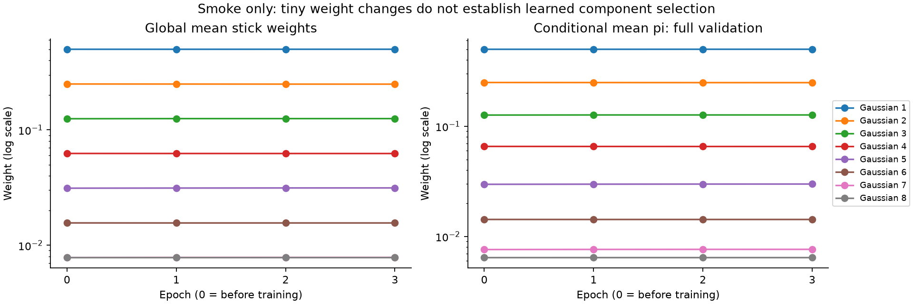
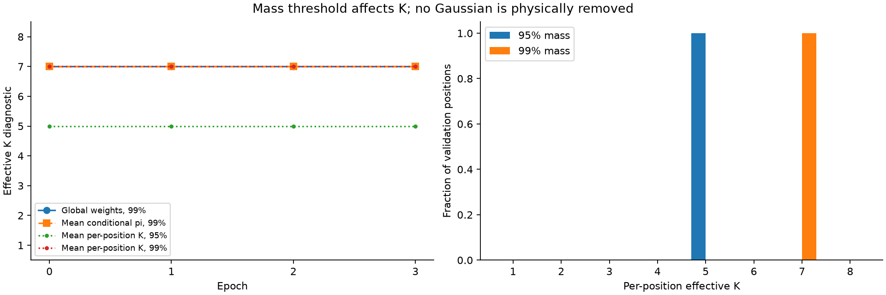
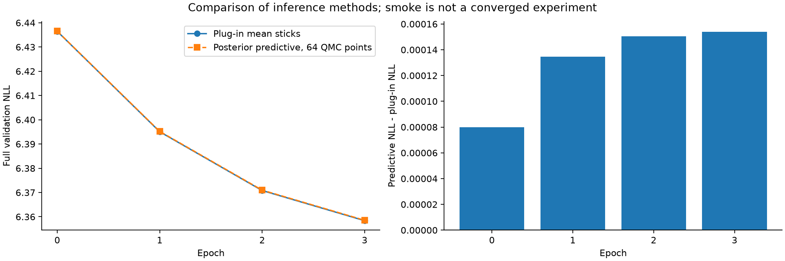
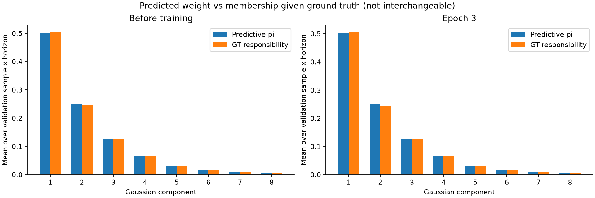

# Bayesian MDN: kiểm tra posterior predictive và K

Đã hoàn tất phần bổ sung và smoke mới 3 epoch. Sau khi kiểm tra đạt, đã khởi chạy full training trong tmux `bayesian_k8`; kết quả dưới đây chỉ là smoke. Baseline được kiểm tra bằng hash và không thay đổi.

## Những phần đã bổ sung

- Đánh giá trên **toàn bộ 19.148 mẫu validation**, tất cả 48 timestep: conditional pi, responsibility với ground truth, thống kê từng horizon và histogram K theo từng vị trí.
- Posterior predictive qua **64 điểm randomized QMC** (scrambled Sobol + Beta inverse CDF). Lấy trung bình normalized pi, giữ 8 Gaussian và covariance cũ.
- Snapshot **trước training ở epoch0**, gồm initial.pt, posterior và fixed predictions.
- Best checkpoint theo posterior-predictive full validation NLL; plug-in NLL ghi riêng.
- So sánh16/64/256 điểm và seeds2024/2025/2026 trên 8 fixed validation samples.

## Smoke thực tế

| Epoch | Validation plug-in NLL | Validation predictive NLL | K global99% | K mean conditional99% | Mean local K theo 99% |
|---|---:|---:|---:|---:|---:|
| 0 | 6.436461 | 6.436541 | 7 | 7 | 7.000 |
| 1 | 6.395061 | 6.395196 | 7 | 7 | 7.000 |
| 2 | 6.370822 | 6.370972 | 7 | 7 | 7.000 |
| 3 | 6.358384 | 6.358538 | 7 | 7 | 7.000 |

**K = 7 đã xuất hiện trước training.** Sau smoke K vẫn 7; chưa chứng minh tự học giảm K. Ở epoch3, ngưỡng 95% cho mean local K=5 còn 99% cho K = 7, thể hiện độ nhạy với ngưỡng. Forward vẫn dùng cả 8 Gaussian. Các thay đổi sau 3 epoch rất nhỏ, không phải kết quả model hội tụ.

### 1. Trọng số toàn cục và conditional pi qua epoch



### 2. Các cách đếm K và ảnh hưởng ngưỡng mass



### 3. So sánh hai cách inference



Predictive NLL hơi cao hơn plug-in trong smoke này. Không khẳng định posterior predictive cải thiện NLL hoặc calibration từ kiểm tra pipeline.

### 4. Pi và responsibility theo ground truth



Pi là trọng số dự đoán trước khi biết tương lai; responsibility tính sau khi biết ground truth, nên hai đại lượng có ý nghĩa khác nhau.

## Độ nhạy tích phân posterior

| Điểm QMC | Fixed validation NLL | Delta NLL so với 256 | Max delta pi so với 256 |
|---|---:|---:|---:|
| 16 | 3.34411955 | 0.00005007 | 0.007756 |
| 64 | 3.34408450 | 0.00001502 | 0.002268 |
| 256 | 3.34406948 | 0.00000000 | 0.000000 |

Với 64 điểm, chênh lệch trọng số lớn nhất so với 256 điểm khoảng 0,00227. Các seed 64 khác cũng được lưu trong JSON; đây là kiểm tra sai số hữu hạn, không chứng minh 256 điểm là tích phân chính xác. K gần ranh giới ngưỡng có thể đổi do sai số tích phân.

Đợt thử nghiệm trung gian dùng Beta.sample bị đổi các mẫu ngẫu nhiên khi tham số posterior thay đổi, làm biểu đồ nhiễu. Đợt cuối dùng cùng uniform Sobol points qua checkpoint, chuyển bằng inverse CDF để tránh hiện tượng đó. Giữ lại run trung gian để truy vết; biểu đồ ở đây chỉ lấy từ run QMC cuối.

## Kiểm tra đã đạt

- 6 unit tests: posterior predictive density đúng bằng trung bình density các mixture riêng; common points liên tục/prefix; normalized weights; gradient; RNG/state/batch invariance; conditional usage.
- Smoke3epoch, full validation 19.148 mẫu; cả 7 metric chính thức chạy trên 8fixed validation samples ở 3 epoch (MC = 64, mesh = 1 m). Đây không phải full official evaluation.
- initial, best, last, final và epoch1/2/3 checkpoints đầy đủ; optimizer/scheduler/RNG/loader state.
- 6 prediction archives với cùng 8sample IDs, observed/ground truth lưu ở inputs.npz; raw/decoded MDN parameters, covariance và posterior weight bank. Đã tái hiện prediction từ bank đã lưu.
- Inference posterior predictive trên 16test samples chỉ kiểm tra kỹ thuật, không dùng chọn cấu hình.
- Model state cuối khớp **từng tensor** với smoke cũ: thêm diagnostic không làm thay đổi tiến trình học.
- Hash baseline giữ nguyên.

## Artifact và lệnh

- Run: `results/trained_models/bayesian_mdn/imptc/smoke_bayesian_peds_imptc/runs/bayesian_k8_predictive_qmc_smoke_seed2024`.
- Báo cáo máy đọc: [PREDICTIVE_SMOKE.json](PREDICTIVE_SMOKE.json).
- Mô hình và giới hạn: [README](../README.md).

```bash
.venv/bin/python -m unittest bayesian_mdn.test_model
.venv/bin/python -m bayesian_mdn.review_smoke
.venv/bin/python -m bayesian_mdn.plot_usage
```

Sau review đã khởi chạy full run `bayesian_k8_qmc_seed2024_tmux` (2500 epoch). Initial/epoch1 checkpoint và usage đã kiểm tra. Full kết quả chưa hoàn tất. Không tự chọn hoặc thay prior/ngưỡng/bound để ép ra K mong muốn.
