# growing_mdn: học số thành phần K bằng cách tách dần (split-and-grow)

> **Trạng thái (2026-10-04).** Phương pháp đã được cài đặt trong [growing_mdn/](../../growing_mdn/README.md) (41 unit test, smoke run, 4 lần kiểm tra resume). Run đầu (v1, `growing_k12_seed2024`) đã bị **dừng** vì một lỗi thiết kế ở bước tách (mục 7). Run v2 `growing_k12_v2_seed2024` (sau bản sửa, K từ 1 đến 12, 2600 epoch) **đã xong**; K chọn trên validation là **11**, nhưng kết quả bị giới hạn bởi trần K = 12 và độ dài huấn luyện mỗi phase (mục 7.6). **Phương pháp này là phân tích về K, không phải cải tiến chính** (cải tiến chính hiện là [sparsemax_mdn](../sparsemax_mdn/SPARSEMAX_MDN.md)).
> Khi chạy thật, chúng tôi phát hiện **NLL không liên tục qua lần tách** như thiết kế dự định (mục 7). Tài liệu này mô tả ý tưởng, lỗi đó và cách sửa.
>
> **Cách đọc hình.** Mỗi hình có nhãn nguồn: **[thật]** là dữ liệu đọc từ artifact trong `results/`; **[đồ chơi]** là mô phỏng 2D tự sinh để giải thích ý tưởng, *không phải* dữ liệu IMPTC. Hình sinh bằng [generate_figures.py](generate_figures.py).

## Mục lục
1. [Tóm tắt trong một phút](#1-tóm-tắt-trong-một-phút)
2. [Baseline làm gì, và K nằm ở đâu](#2-baseline-làm-gì-và-k-nằm-ở-đâu)
3. [Động cơ: vì sao phải quan tâm đến K](#3-động-cơ-vì-sao-phải-quan-tâm-đến-k)
4. [Ý tưởng: bắt đầu từ K = 1 và tách dần](#4-ý-tưởng-bắt-đầu-từ-k--1-và-tách-dần)
5. [Cải tiến được thực hiện như thế nào](#5-cải-tiến-được-thực-hiện-như-thế-nào)
6. [Đã kiểm chứng những gì](#6-đã-kiểm-chứng-những-gì)
7. [Phát hiện khi chạy thật: bước tách làm NLL tăng vọt, và cách sửa](#7-phát-hiện-khi-chạy-thật-bước-tách-làm-nll-tăng-vọt-và-cách-sửa)
8. [Giới hạn và những điều chưa biết](#8-giới-hạn-và-những-điều-chưa-biết)
9. [Bản đồ file và cách tái tạo](#9-bản-đồ-file-và-cách-tái-tạo)

---

## 1. Tóm tắt trong một phút

| | Baseline `base_mdn` | `growing_mdn` (đề xuất) |
|---|---|---|
| Số thành phần Gaussian K | cố định K = 3 (đặt tay trong config) | bắt đầu K = 1, **mỗi phase tách thêm 1 thành phần**, tới K = 12 |
| K cuối cùng | 3 | **chọn sau**, bằng luật có phạt trên tập validation |
| LSTM, loss NLL, bộ giải mã, metric chính thức | giữ nguyên | giữ nguyên |
| Điều thay đổi | | kích thước lớp `fc`, lịch huấn luyện theo phase, cách chọn K |

Cải tiến **không đổi bài toán hay mô hình dự báo**. Nó đổi *cách quyết định K*: thay vì tin vào con số 3 mặc định, ta cho K tăng dần, mỗi lần tăng đều kèm một lần huấn luyện tiếp, rồi nhìn đường cong chất lượng theo K để chọn.

## 2. Baseline làm gì, và K nằm ở đâu

Baseline là bài toán dự báo quỹ đạo người đi bộ trên IMPTC: nhìn 32 bước quá khứ (mỗi bước 4 đặc trưng), dự báo 48 bước tương lai. Mô hình là **LSTM** (bộ mã hóa chuỗi) nối với một **đầu MDN** (lớp tuyến tính `fc`) để sinh tham số của một **hỗn hợp Gaussian 2D tại mỗi bước tương lai**.

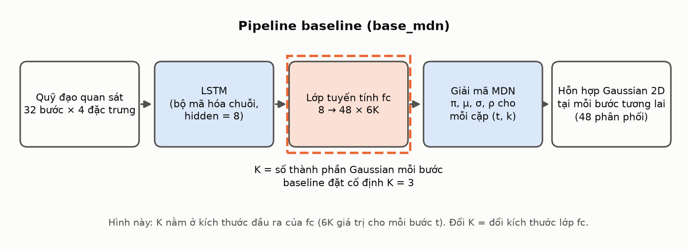

**Hình 1** *(sơ đồ)*. Ba thành phần cần phân biệt: LSTM là bộ mã hóa, `fc` cùng bước giải mã là đầu MDN, còn hỗn hợp Gaussian là phân phối đầu ra. K quyết định kích thước đầu ra của `fc`.

Mỗi Gaussian 2D được mô tả bởi trọng số $\pi$, tâm $(\mu_x,\mu_y)$, độ lệch chuẩn $(\sigma_x,\sigma_y)$ và tương quan $\rho$. Ma trận hiệp phương sai (đã kiểm tra với [mdn_distribution.py](../../base_mdn/utils/mdn_distribution.py)):

$$
\Sigma=\begin{pmatrix}\sigma_x^2 & \rho\,\sigma_x\sigma_y\\ \rho\,\sigma_x\sigma_y & \sigma_y^2\end{pmatrix},\qquad
p_t(y_t\mid X)=\sum_{k=1}^{K}\pi_{t,k}\,\mathcal N_2\!\left(y_t;\mu_{t,k},\Sigma_{t,k}\right).
$$

Đây là hỗn hợp **riêng cho từng bước thời gian**. Code không định nghĩa một hỗn hợp chung cho cả quỹ đạo, nên tài liệu này không dùng "mode" theo nghĩa một hành vi xuyên suốt 4,8 giây.

Đầu ra thô của `fc` có dạng `[48 bước, 6K]`. Với mỗi bước, 6K giá trị chia thành 6 khối, mỗi khối K số:

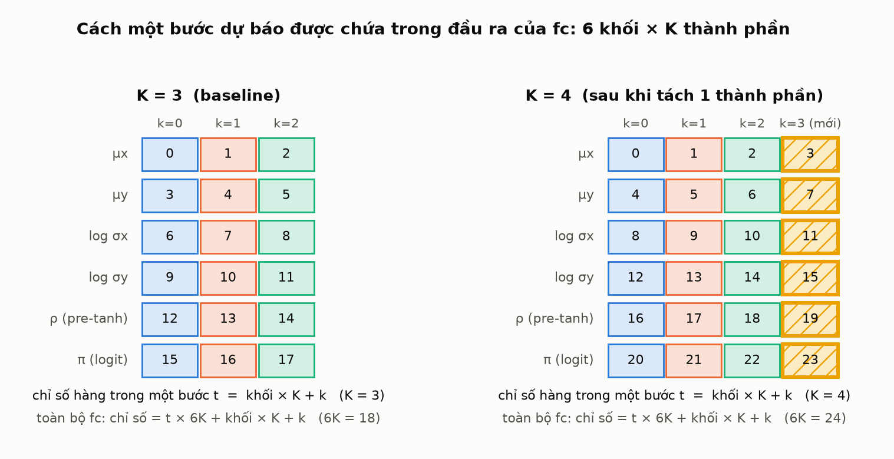

**Hình 2** *(sơ đồ, theo code `decode_mdn_output`)*. Bên trái: K = 3 như baseline. Bên phải: sau khi thêm một thành phần, mỗi khối rộng thêm một cột, nên chỉ số hàng của cả lớp `fc` bị xáo lại. Điều này quan trọng ở mục 5.

## 3. Động cơ: vì sao phải quan tâm đến K

**3.1. K = 3 là một lựa chọn mặc định, không phải kết quả tối ưu.** Paper và code đặt M = 3. Bản ghi trong `ablation.json` nêu rằng paper không báo cáo ablation số thành phần (config ETH/UCY chính thức còn dùng M = 5). Vì vậy câu hỏi "K nên là bao nhiêu" chưa được trả lời bằng dữ liệu.

**3.2. Quét K trên baseline cho thấy K = 3 chưa phải điểm dừng.** Chúng tôi đã train baseline với K = 1, 2, 3, 5, 8 (cùng seed, cùng protocol, mỗi K một model độc lập, một seed).

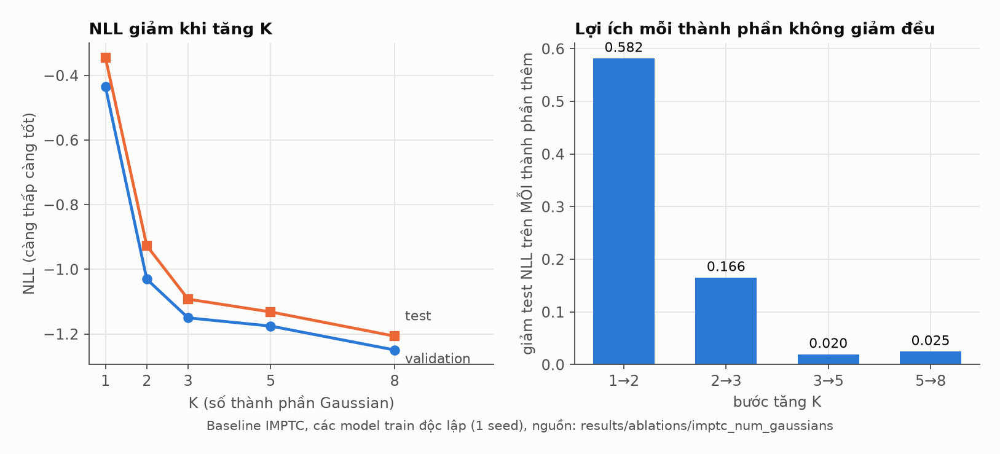

**Hình 3** **[thật]**, nguồn `results/ablations/imptc_num_gaussians/`. Trái: NLL giảm khi K tăng, trên cả validation lẫn test. Phải: giảm test NLL *trên mỗi thành phần thêm*. Lợi ích rất lớn khi đi từ 1 lên 2 và 3, rồi nhỏ hơn nhiều, nhưng từ K = 5 lên 8 vẫn là 0.025 mỗi thành phần, không nhỏ hơn bước 3 lên 5 (0.020). Với một seed, chưa kết luận được rằng đường cong đã bão hòa.

Các metric chính thức của repo cho thấy bức tranh không đơn giản bằng NLL:

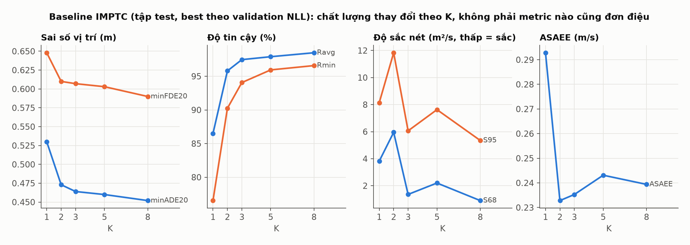

**Hình 4** **[thật]**, tập test. minADE/minFDE và độ tin cậy (Ravg, Rmin) tốt dần khi K tăng. Độ sắc nét (S68, S95) và ASAEE **không đơn điệu**: K = 2 và K = 5 xấu hơn K = 3 ở S68/S95 trong lần chạy này. Tăng K không bảo đảm mọi tiêu chí cùng cải thiện, nên không thể chọn K chỉ bằng NLL.

| K | test NLL | minADE20 (m) | Ravg (%) | S68 | số tham số |
|---:|---:|---:|---:|---:|---:|
| 1 | −0.345 | 0.530 | 86.5 | 3.82 | 3 040 |
| 2 | −0.927 | 0.473 | 95.8 | 5.95 | 5 632 |
| **3** | **−1.092** | **0.464** | **97.5** | **1.36** | **8 224** |
| 5 | −1.132 | 0.460 | 97.9 | 2.20 | 13 408 |
| 8 | −1.207 | 0.452 | 98.5 | 0.90 | 21 184 |

*(Số từ [BASE_MDN_K_COMPARISON.md](../BASE_MDN_K_COMPARISON.md).)*

**3.3. Với K = 8, mô hình không dùng đều 8 thành phần.** Trên 8 mẫu validation cố định của baseline K = 8:

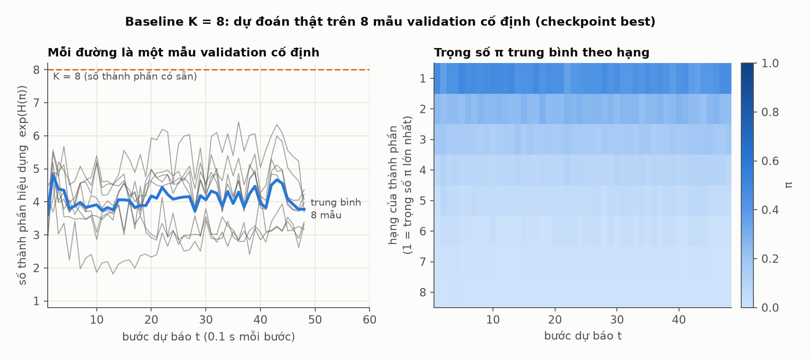

**Hình 5** **[thật]**, checkpoint best của baseline K = 8, tính từ $\pi$ trong `fixed_samples/predictions/best.npz`. Số thành phần hiệu dụng $\exp(H(\pi))$ nằm trong khoảng 1.8 đến 6.4 (trung bình 4.1), và cần trung bình 4.5 thành phần (tối đa 6) để phủ 95% khối lượng $\pi$. Heatmap bên phải: trọng số xếp hạng giảm dần, các hạng thấp nhận $\pi$ nhỏ. **Quan sát này chỉ trên 8 mẫu; nó gợi ý rằng K hiệu dụng khác K danh nghĩa, không chứng minh K = 8 là thừa.**

**3.4. Chi phí tăng tuyến tính theo K.** Mỗi thành phần thêm $6\times 48\times(8+1)=2592$ tham số (6 khối, 48 bước, 8 trọng số cộng 1 bias).

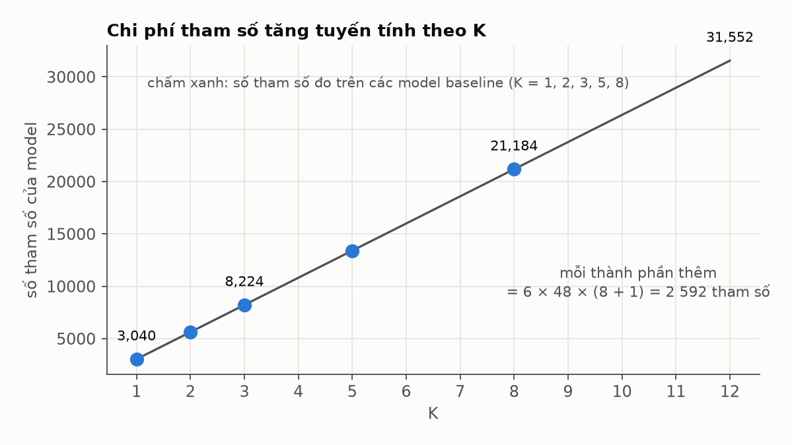

**Hình 6** **[thật]** (chấm xanh, đo trên các baseline) cùng đường thẳng $448+2592K$.

**3.5. Vì sao "chọn K bằng NLL nhỏ nhất" là chưa đủ.** NLL trên validation hầu như luôn giảm khi K tăng, vì mô hình hỗn hợp linh hoạt hơn. Nếu luật chọn là "K có NLL nhỏ nhất" thì kết quả luôn nghiêng về K lớn, dù K lớn chưa chắc làm dự báo bao quát dữ liệu tốt hơn (sắc nét hơn hay tin cậy hơn). Đây chính là băn khoăn mà chúng tôi nêu từ đầu: *K càng lớn thì càng được ưu tiên*. Vì vậy phương pháp mới cần **một luật chọn K có phạt**, không chỉ một cách train khác (mục 5.5).

## 4. Ý tưởng: bắt đầu từ K = 1 và tách dần

Chúng tôi đã cân nhắc bốn hướng độc lập với các cải tiến sẵn có của repo:

| Hướng | Ý tưởng | Vì sao chọn / không |
|---|---|---|
| A. Nested-K | train một model K lớn, mỗi bước chỉ giữ k thành phần đầu | rẻ, nhưng vẫn cần luật chọn K; chưa "học" K |
| **B. Split-and-grow** | bắt đầu K = 1, mỗi phase tách thành phần khớp kém nhất | **được chọn**: K tăng khi dữ liệu cần, có tiêu chí dừng rõ ràng |
| C. Router chọn đầu | nhiều đầu K khác nhau, bộ định tuyến chọn theo mẫu | khó train, để dành |
| D. BIC offline | ước lượng K từ dữ liệu bằng GMM + BIC | rẻ, chỉ làm tham chiếu |

Ý tưởng của B giống cách người ta tìm số cụm bằng cách tách dần trong EM: bắt đầu một thành phần phủ cả đám mây điểm, rồi chia nhỏ phần mô hình khớp kém nhất.

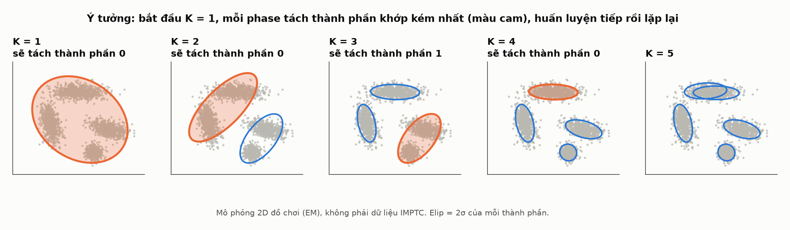

**Hình 7** **[đồ chơi]**, mô phỏng 2D với 4 cụm điểm, thuật toán EM có tách thành phần. Ở mỗi bước, thành phần khớp kém nhất (màu cam) được tách thành hai. Với dữ liệu này, validation NLL giảm rõ đến K = 4 rồi gần như phẳng (4.56, 4.06, 3.56, 3.32, 3.32, 3.32, 3.32 cho K = 1 đến 7). Ở K = 5 hai thành phần cùng phủ một cụm, tức là thêm không có lợi. **Thuật toán thật dùng huấn luyện bằng gradient trên đầu `fc`, không phải EM; hình này chỉ minh họa tinh thần.**

## 5. Cải tiến được thực hiện như thế nào

### 5.1. Tách một thành phần, giữ nguyên phân phối

Tách thành phần $j$ thành hai bản, mỗi bản có trọng số một nửa, hai tâm lệch ngược nhau một đoạn nhỏ $\delta$, còn $\sigma,\rho$ giữ nguyên:

$$
\pi_j\to\tfrac{\pi_j}{2},\ \tfrac{\pi_j}{2}\qquad \mu_j\to\mu_j+\delta,\ \ \mu_j-\delta\qquad \sigma,\rho\ \text{không đổi.}
$$

Nếu $\delta=0$, hai bản giống hệt nhau thì gradient của chúng cũng giống hệt nhau mãi mãi và chúng không bao giờ tách ra. Độ lệch nhỏ $\delta$ phá thế đối xứng đó, đồng thời (theo thiết kế) làm phân phối gần như không đổi.

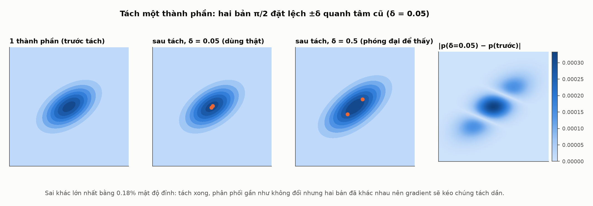

**Hình 8** **[đồ chơi]**, một Gaussian 2D bất kỳ. Với $\delta=0.05$ và $\sigma\approx 1$, sai khác lớn nhất chỉ bằng 0.18% mật độ đỉnh, nên mắt thường không thấy khác (cột 2). Với $\delta=0.5$ (cột 3) mới thấy hai bản tách. **Điều kiện "σ cỡ 1" là quan trọng; mục 7 cho thấy nó không đúng ở các bước dự báo đầu của model đã train.**

> **Cập nhật sau Revision 1 (mục 7).** Bản thiết kế ban đầu dùng $\delta=0.05$ m *tuyệt đối*. Bản hiện tại dùng $\delta_{t,\text{trục}}=0.05\times\tilde\sigma_{t,\text{trục}}$, trong đó $\tilde\sigma$ là trung vị σ của thành phần nguồn trên tập train ở từng bước $t$ và từng trục. Phần còn lại (chia π bằng $\ln 2$, σ và ρ giữ nguyên) không đổi.

Ở mức tham số, một lần tách làm đúng ba việc, đều đã có unit test:

**(a) Sao chép hàng của `fc` theo bản đồ chỉ số mới.** Vì K nằm trong chỉ số hàng ($\text{hàng}=t\cdot 6K+\text{khối}\cdot K+k$), thêm một thành phần làm các hàng của bước $t\ge 1$ bị đẩy sang vị trí khác. Cần một ánh xạ hàng cũ sang hàng mới:

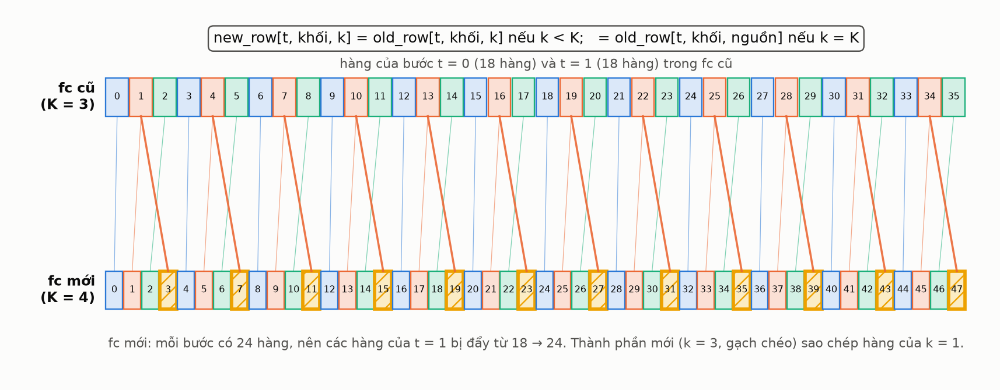

**Hình 9** **[sơ đồ từ code `fc_row_map`]**. Thành phần mới (gạch chéo, k = 3) sao chép hàng của thành phần nguồn (k = 1). Các hàng cũ giữ nguyên nội dung nhưng đổi vị trí (ví dụ hàng 18 của bước t = 1 thành hàng 24). Chỉ nối thêm hàng vào cuối sẽ làm sai toàn bộ các khối sau, nên test kiểm tra tham số *đã giải mã* (π, μ, σ, ρ) của từng thành phần chứ không chỉ kiểm tra kích thước.

**(b) Chia $\pi$ bằng $\ln 2$ trên logit.** Cả hai bản lấy logit $=\text{logit}_j-\ln 2$:

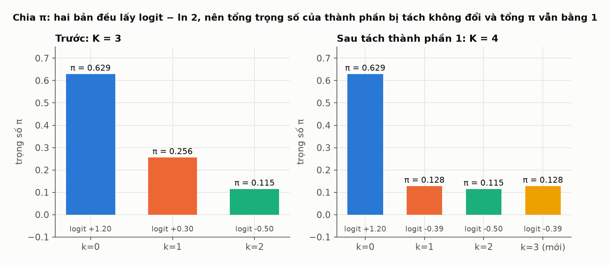

**Hình 10** **[sơ đồ với số minh họa]**. Tổng $\pi$ của hai bản đúng bằng $\pi_j$ trước khi tách (0.256 = 0.128 + 0.128), mẫu số của softmax không đổi, nên các thành phần khác giữ nguyên $\pi$.

**(c) Mang theo trạng thái của Adam.** Adam giữ moment bậc 1 và 2 cho từng hàng của `fc`. Nếu để trống, bước đầu sau khi tách sẽ khác thường, nên moment đi theo cùng bản đồ chỉ số:

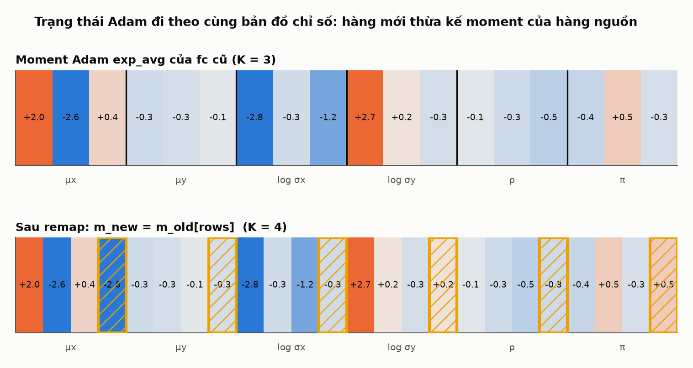

**Hình 11** **[sơ đồ với số minh họa]**. `m_new = m_old[rows]`: các hàng mới thừa kế moment của hàng nguồn. Có tùy chọn đặt bằng 0 cho hàng mới nếu cách thừa kế gây mất ổn định.

### 5.2. Chọn thành phần nào để tách

Sau mỗi phase, trên **tập train**, mỗi thành phần $k$ nhận một điểm: trung bình có trọng số responsibility của $-\log\mathcal N_k$ (độ "khó chịu" của các điểm mà nó phụ trách):

$$
\text{score}_k=\frac{\sum_{n,t} r_{n,t,k}\,\bigl(-\log\mathcal N_k(y_{n,t})\bigr)}{\sum_{n,t} r_{n,t,k}},\qquad
r_{n,t,k}=\frac{\pi_{n,t,k}\,\mathcal N_k(y_{n,t})}{\sum_j \pi_{n,t,j}\,\mathcal N_j(y_{n,t})}.
$$

Thành phần có điểm cao nhất (khớp các điểm của nó kém nhất) bị tách. Thành phần gần như không phụ trách điểm nào (tổng responsibility rất nhỏ) nhận điểm $-\infty$ để không bị chọn.

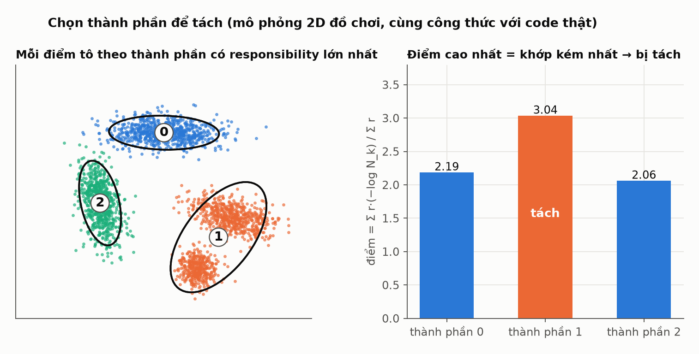

**Hình 13** **[đồ chơi]**, cùng công thức với code thật. Thành phần 1 phủ hai cụm cùng lúc nên điểm cao nhất và bị chọn. **Lưu ý:** "thành phần $k$" ở đây là *chỉ số đầu ra*, không phải một mode hành vi nhất quán giữa các mẫu và các bước.

### 5.3. Lịch huấn luyện

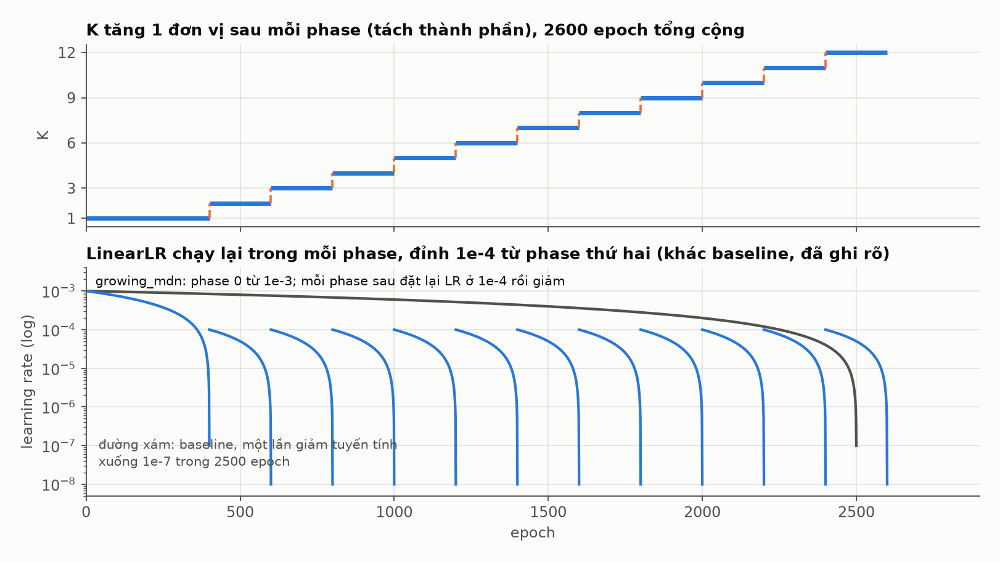

**Hình 12** **[theo config]**. Phase đầu K = 1 chạy 400 epoch; mỗi phase sau tách một thành phần rồi chạy 200 epoch; dừng ở K = 12. Tổng 400 + 11 × 200 = 2600 epoch, gần bằng 2500 epoch của baseline. LinearLR được **chạy lại trong mỗi phase** (khác baseline, vốn chỉ giảm một lần): phase 0 bắt đầu ở 1e-3, các phase sau bắt đầu ở 1e-4 (bản v1 từng đặt lại 1e-3, xem mục 7). Đây là một điểm lệch protocol đã được ghi rõ.

Một vòng của thuật toán:

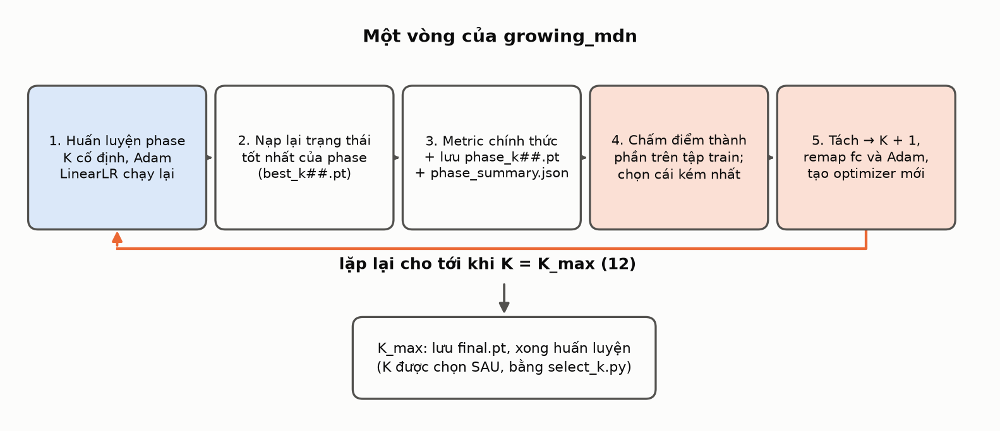

**Hình 14** **[sơ đồ]**. Điểm quan trọng: bước 2 nạp lại trạng thái tốt nhất của phase (theo validation NLL) trước khi chấm điểm và tách, nên mỗi phase dùng trạng thái tốt nhất chứ không phải epoch cuối.

### 5.4. Cái gì giữ nguyên, cái gì thay đổi

| Giữ nguyên so với baseline | Thay đổi (đã ghi rõ trong README) |
|---|---|
| LSTM (hidden 8), loss NLL, decoder legacy, ma trận Σ | số thành phần K thay đổi theo phase (1 → 12); độ lệch tâm khi tách tỉ lệ với σ |
| Adam, lr 1e-3, batch 4096, train reduction 0.5, seed 2024 | LinearLR chạy lại trong mỗi phase (đỉnh 1e-4 từ phase thứ hai); run dừng nếu NLL đổi hơn 0.01 sau một lần tách |
| 8 mẫu validation cố định, các metric chính thức | chọn best bằng **toàn bộ** validation (baseline dùng 50%) |
| `base_mdn/` không bị sửa (có hash kiểm tra) | metric chính thức chỉ tính ở cuối mỗi phase (12 lần), không phải mỗi 250 epoch |

### 5.5. Chọn K sau cùng, và bảo vệ tập test

Tất cả phase chạy hết đến K = 12 rồi mới chọn K. Luật chọn: **K nhỏ nhất có validation NLL không kém K tốt nhất quá $\varepsilon$**, rồi kiểm tra thêm độ tin cậy (Ravg, Rmin không giảm quá dung sai) và độ sắc nét (S68, S95 không tăng quá tỉ lệ cho phép) so với K tốt nhất. Ba dung sai ($\varepsilon=0.02$, 0.5 điểm phần trăm, 10%) là **đề xuất**, đã được đóng băng vào cấu hình của run trước khi chạy.

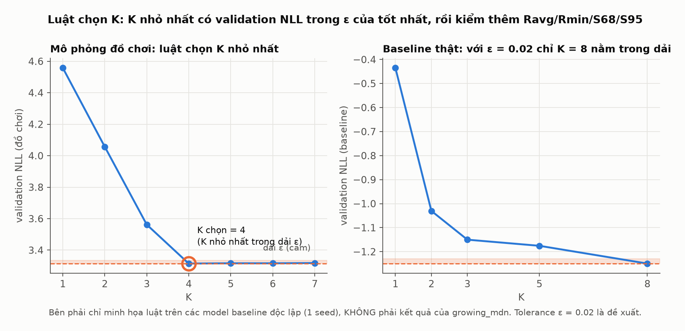

**Hình 15.** Trái **[đồ chơi]**: chọn K nhỏ nhất nằm trong dải $\varepsilon$ (cam) quanh NLL tốt nhất. Phải **[thật, baseline]**: cũng dải $\varepsilon=0.02$ trên validation NLL của các baseline độc lập, chỉ K = 8 nằm trong dải. *Đây chỉ minh họa luật trên số baseline (1 seed), không phải kết quả của growing_mdn.*

Dữ liệu test chỉ được dùng **một lần, cho K đã chọn**, và mã nguồn chặn các cách tắt:

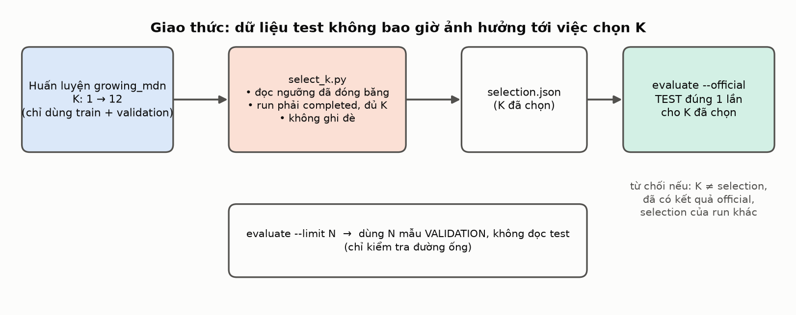

**Hình 16** **[sơ đồ]**. `select_k.py` chỉ đọc validation, dùng ngưỡng đã đóng băng, yêu cầu run đã hoàn tất đủ mọi K, không ghi đè. `evaluate --official` chỉ chạy cho K đã chọn và từ chối chạy lần hai. `--limit` dùng mẫu *validation*, không đụng test.

## 6. Đã kiểm chứng những gì

- **41 unit test** (ánh xạ hàng, π sau tách, ΔNLL liên tục trên mẫu từ chính model, **test hồi quy σ nhỏ** cho lỗi ở mục 7, remap Adam, chấm điểm, luật chọn K, kiểm tra cấu hình, các chốt bảo vệ test).
- **Smoke run** (K 1 đến 3, 4 epoch, tập train con rất nhỏ): đường ống chạy đủ, artifact đúng.

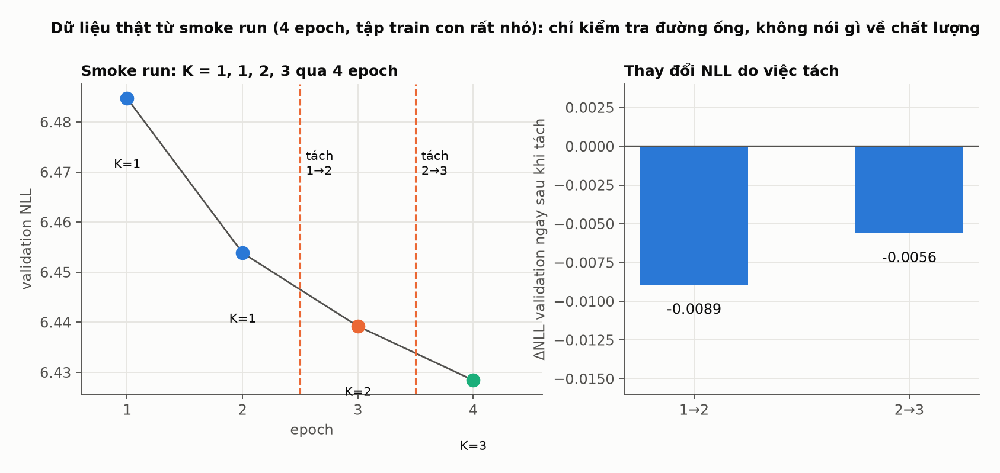

**Hình 17** **[thật]**. Chỉ kiểm tra đường ống, **không nói gì về chất lượng**. ΔNLL ngay sau tách là −0.0089 và −0.0056 (chạy lại sau Revision 1). Lưu ý rằng model chỉ train vài epoch nên σ còn cỡ 1, đúng điều kiện ở Hình 8; chính vì vậy smoke run **không phát hiện được vấn đề ở mục 7**.
- **Resume**: bốn lần dừng giữa chừng rồi tiếp tục (giữa phase, cuối phase, sau phase 0, và ở phase cuối) đều tái tạo chính xác run liền mạch (sai lệch validation NLL bằng 0.0 trên CPU), kiểm tra lại sau Revision 1.
- Hash của `base_mdn/` không đổi.

## 7. Phát hiện khi chạy thật: bước tách làm NLL tăng vọt, và cách sửa

Đây là phần quan trọng nhất của tài liệu về mặt trung thực khoa học. Đoạn dưới tách riêng **quan sát** (có dữ liệu), **nguyên nhân** và **cách sửa kèm kiểm chứng**.

### 7.1. Quan sát từ run v1 `growing_k12_seed2024` (đã dừng)

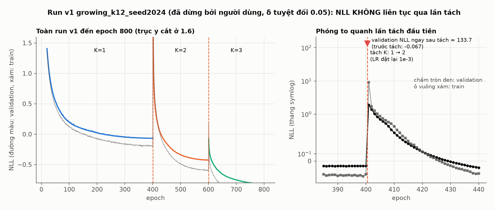

**Hình 18** **[thật]**. Trái: phase K = 1 hội tụ tới validation NLL −0.067, sau lần tách đầu tiên phase K = 2 bắt đầu rất cao rồi giảm, cuối phase đạt −0.425. Phải (thang symlog): quanh epoch 400.

1. **Ngay sau khi tách (trước khi train tiếp), validation NLL là 133.7**, trong khi ngay trước đó là −0.067 (ghi trong `growth_history.jsonl`). Thiết kế kỳ vọng sai khác nhỏ.
2. Lần tách thứ hai (K = 2 → 3) cũng không liên tục: −0.4255 trước tách, 2.52 sau tách.
3. Sau 1 epoch của phase mới, train NLL là 9.09 và validation NLL là 1.90. Mô hình hồi phục trong khoảng 30 epoch về mức tương đương K = 1 (validation NLL −0.0075 ở epoch 430), rồi tiếp tục giảm.
4. Phase K = 1 chỉ chạy 400 epoch và đạt validation NLL −0.067, trong khi baseline K = 1 train 2500 epoch đạt −0.435 (hai con số dùng tập validation khác nhau: toàn bộ so với 50%, nên không so sánh trực tiếp được về giá trị tuyệt đối).

### 7.2. Nguyên nhân

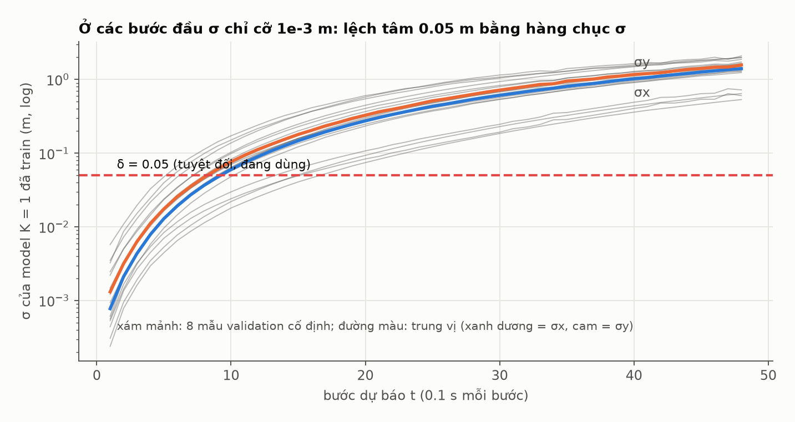

**Hình 19** **[thật]**, σ của model K = 1 cuối phase 0 trên 8 mẫu validation cố định. Ở các bước dự báo đầu, σ chỉ cỡ 0.001 m (trung vị ở t = 1: σx ≈ 0.0008 m, σy ≈ 0.0013 m), tăng dần tới khoảng 1.4 đến 1.6 m ở t = 48. Lệch tâm $\delta=0.05$ m là hằng số tuyệt đối, nên ở các bước đầu nó lớn gấp 40 đến 60 lần σ.

Một Gaussian bị lệch tâm $\delta$ so với dữ liệu mất khoảng $\tfrac12(\delta/\sigma)^2$ nat mỗi trục. Với $\delta/\sigma\approx 40\text{ đến }60$ ở các bước đầu, con số đó là hàng trăm, cùng bậc độ lớn với 133.7. Smoke run và unit test không thấy vì model chưa train nên σ ≈ 1 (Hình 8, Hình 17).

- **Nguyên nhân chính (số liệu ủng hộ, và được xác nhận ở 7.3):** lệch tâm tuyệt đối $\delta=0.05$ quá lớn so với σ rất nhỏ ở các bước đầu của model đã hội tụ.
- **Yếu tố phụ (chưa tách riêng bằng thí nghiệm):** đặt lại learning rate lên 1e-3 ở đầu mỗi phase, trên một model đang ở LR ≈ 1e-7, gây cú sốc huấn luyện (train NLL 9.09 ở epoch đầu).

### 7.3. Cách sửa (Revision 1) và kiểm chứng trên trọng số thật

Ba thay đổi, đã ghi vào spec:

1. **Lệch tâm tỉ lệ với σ:** $\pm0.05\times\tilde\sigma_{t,\text{trục}}$, trung vị σ của thành phần nguồn trên tập train (xem 5.1).
2. **Đặt lại LR thấp hơn:** các phase sau bắt đầu ở 1e-4 thay vì 1e-3 (Hình 12).
3. **Chốt kiểm tra liên tục:** sau mỗi lần tách, nếu validation NLL đổi quá 0.01 (hoặc không hữu hạn) thì ghi lại bản ghi tách với `aborted: true`, đặt trạng thái run `aborted_split_discontinuity` và dừng, thay vì chạy tiếp.

Kiểm chứng **không cần train lại**: áp dụng cả hai cách tách lên checkpoint đã hội tụ của run v1 (`phase_k01.pt`, `phase_k02.pt`) và đo validation NLL trước/sau.

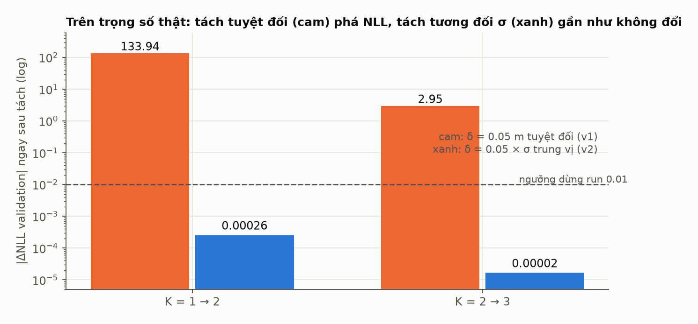

**Hình 20** **[thật]**, từ `growing_mdn/reports/SPLIT_CHECK.json`. Tách tuyệt đối làm NLL tăng 133.9 (K = 1 → 2) và 2.95 (K = 2 → 3), tái tạo đúng con số của run v1. Tách tương đối σ chỉ đổi 0.00026 và 0.00002, thấp hơn ngưỡng dừng 0.01 hơn 30 lần.

Có thêm một test hồi quy: model với σ ≈ 1e-3 ở các bước đầu, trong đó cách tách tuyệt đối làm NLL tăng hơn 10 còn cách tách tương đối làm NLL đổi dưới 0.01.

### 7.4. Hệ quả cho cách đọc kết quả

- Run v1 vẫn hồi phục (K = 2 tốt hơn K = 1) nhưng mỗi phase thực chất train lại một phần từ trạng thái bị phá; đường cong "NLL theo K" của v1 lẫn hai yếu tố (tác dụng của K và việc train thêm sau cú sốc). Vì vậy v1 bị dừng và không dùng để chọn K. Artifact của v1 được giữ làm bằng chứng.
- Run v2 dùng bản sửa, chạy lại từ đầu với cùng seed; phase K = 1 của v2 trùng khớp v1 (validation NLL −0.0667), nên mọi khác biệt về sau đến từ bước tách và LR.

### 7.5. Kết quả của run v2 quanh lần tách đầu tiên

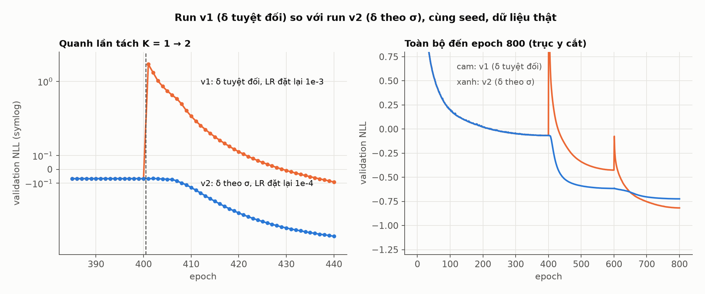

**Hình 21** **[thật]**, v1 chỉ có dữ liệu đến epoch 800 (bị dừng), v2 đã chạy xong; hình vẽ đến epoch chung ghi ở tiêu đề panel phải.

- Ghi trong `growth_history.jsonl` của v2: validation NLL trước tách −0.06717, **sau tách −0.06742** (đổi 0.00025), không bị chốt kiểm tra dừng lại.
- Không còn cú nhảy: epoch 401 của v2 có train NLL −0.194 và validation NLL −0.067, trong khi v1 ở cùng epoch là 9.09 và 1.90.
- Sau khoảng 5 epoch, v2 giảm đều: ở epoch 430 validation NLL là −0.423, trong khi v1 mới đạt −0.007 và chỉ chạm mức −0.4255 ở cuối phase (epoch 600).

- **Nhưng đến cuối phase K = 3 (epoch 800), v1 đã thấp hơn v2**: validation NLL −0.817 (v1) so với −0.723 (v2), như thấy ở panel phải của Hình 21. Nghĩa là việc đặt lại learning rate thấp hơn (1e-4 thay vì 1e-3) và/hoặc kiểu tách khác nhau làm v2 tiến chậm hơn về sau. Hai thay đổi này (độ lệch tâm theo σ và LR 1e-4) **bị lẫn với nhau** nên không tách riêng được tác dụng của từng cái. Bản sửa đạt mục tiêu "NLL liên tục qua lần tách", nhưng phải đánh đổi tốc độ tối ưu hóa.

Đây là quan sát trên một seed. Nó cho thấy bản sửa đạt đúng mục tiêu thiết kế về tính liên tục, **chưa** cho biết K nào tốt nhất.

### 7.6. Kết quả cuối của run v2

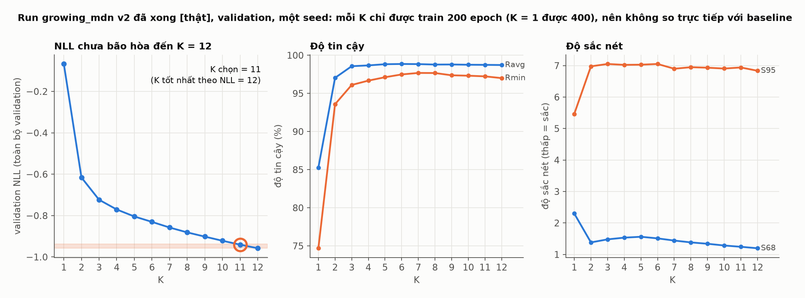

**Hình 22** **[thật]**, từ `phase_summary.json` của run v2, tập validation (toàn bộ), một seed.

- **Chốt kiểm tra liên tục:** cả 11 lần tách đều qua (`aborted: false`), |ΔNLL| lớn nhất ngay sau tách là 0.0016. Lỗi ở 7.1 đã được khắc phục.
- **Luật chọn K** (ε = 0.02, 0.5 điểm phần trăm, 10%, đã đóng băng trước khi chạy) chọn **K = 11**; K tốt nhất theo NLL là 12. Danh sách K đạt: {11, 12}.
- **Validation NLL vẫn giảm đều đến K = 12** (−0.067 ở K = 1, −0.616 ở K = 2, −0.723 ở K = 3, ..., −0.940 ở K = 11, −0.958 ở K = 12), tức là đường cong **chưa bão hòa** ở trần. Vì vậy K = 11 chỉ là K nhỏ nhất nằm trong ε của K = 12, và **trần K = 12 đang chặn kết quả**: không nên đọc K = 11 là "K tối ưu". Muốn trả lời câu hỏi đó phải nâng trần.
- **Độ tin cậy** vào khoảng 98.7% (Ravg) và 97% (Rmin) từ K = 3 trở đi và gần như phẳng; **độ sắc nét** S95 khoảng 6.9 không cải thiện theo K, S68 giảm dần.
- **Không so trực tiếp với baseline**: mỗi K chỉ được train 200 epoch (K = 1 được 400), còn baseline mỗi K train 2500 epoch; validation NLL của run này lại tính trên toàn bộ validation, baseline trên tập con 50%. Ví dụ NLL ở K = 12 (−0.958) kém baseline K = 3 (−1.150), điều phản ánh độ dài huấn luyện hơn là tác dụng của K.

**Kết luận về hướng growing_mdn:** nó cung cấp một đường cong "chất lượng theo K" từ các mô hình khởi động ấm nối tiếp, cho thấy NLL còn cải thiện đến K = 12 và độ tin cậy bão hòa sớm hơn nhiều (từ K khoảng 3). Nhưng do tiến độ huấn luyện mỗi phase ngắn và trần K thấp, nó **chưa đủ** để khẳng định K nào là tốt nhất, và về bản chất đây là chọn mô hình, không phải cải tiến.

## 8. Giới hạn và những điều chưa biết

- Kết quả K của growing_mdn (mục 7.6) bị giới hạn bởi trần K = 12 (NLL chưa bão hòa) và bởi độ dài huấn luyện mỗi phase; không phải kết luận về K tối ưu.
- Offset tách được áp dụng theo từng trục và bỏ qua ρ; với thành phần có |ρ| rất gần 1 độ lệch trong không gian chuẩn hóa có thể lớn hơn 0.05σ. Chốt kiểm tra liên tục sẽ dừng run an toàn nếu điều đó xảy ra.
- Không có test tự động riêng cho việc `split_step` truyền đúng offset tương đối vào `grow_model` (đã có test cho `grow_model` và chốt kiểm tra lúc chạy).
- K chọn được phụ thuộc vào $\varepsilon$, lịch huấn luyện và seed. Cần nhiều seed trước khi khẳng định khác biệt giữa các K.
- Các model được khởi động ấm nối tiếp nhau sẽ thấy nhiều epoch hơn trên các trọng số dùng chung; khi so với baseline K = 3 và K = 8 cần so theo tổng compute và nêu rõ.
- "Thành phần $k$" là chỉ số đầu ra, không phải mode hành vi nhất quán.
- Hình 5 chỉ trên 8 mẫu validation; Hình 3, 4 là một seed, các model baseline độc lập.
- File metric ở cuối mỗi phase mang tên epoch cuối nhưng tính từ trọng số best-epoch; `final.pt` là trạng thái tốt nhất của K = 12.
- Chưa tính BIC/AIC (có `parameter_count` và `validation_nll` trong `phase_summary.json` để tính sau).

## 9. Bản đồ file và cách tái tạo

| Việc | File |
|---|---|
| Dựng head K+1, ánh xạ hàng | [model.py](../../growing_mdn/model.py) |
| Remap Adam | [optim_state.py](../../growing_mdn/optim_state.py) |
| Chấm điểm thành phần, luật chọn K | [selection.py](../../growing_mdn/selection.py) |
| Trainer theo phase | [train.py](../../growing_mdn/train.py) |
| Chọn K (validation), đánh giá test một lần | [select_k.py](../../growing_mdn/select_k.py), [evaluate.py](../../growing_mdn/evaluate.py) |
| Cấu hình, smoke review | [configs/](../../growing_mdn/configs/imptc/), [review_smoke.py](../../growing_mdn/review_smoke.py) |
| Thiết kế và kế hoạch | [spec](../superpowers/specs/2026-10-04-growing-mdn-design.md), [plan](../superpowers/plans/2026-10-04-growing-mdn.md) |

Tạo lại toàn bộ hình trong tài liệu này (từ thư mục gốc repo):

```bash
.venv/bin/python docs/growing_mdn/generate_figures.py
```

Hình 18 và 19 đọc từ run v1 đã dừng; hình 21 và 22 đọc từ run v2 đã xong.
