# Kappa MDN từ đầu đến cuối: học số Gaussian bằng tham số κ

**Ý tưởng chính:** mô hình có sẵn tối đa 16 Gaussian ở mỗi bước tương lai, rồi học một tham số thực `kappa` để điều khiển có bao nhiêu Gaussian được mở. Khi train, cổng mở mềm để có gradient. Khi validation hoặc dự đoán, mô hình làm tròn `kappa` và đóng cứng các Gaussian vượt giới hạn.

**Điểm phải nhớ ngay:** code hiện tại học **48 giá trị κ cho 48 bước tương lai, dùng chung cho mọi mẫu**. κ không phải đầu ra của LSTM. Đây là khác biệt lớn với `sparsemax_mdn`, nơi số thành phần hoạt động phụ thuộc từng mẫu.

Tài liệu được cập nhật theo source v2 ngày 04/10/2026. Bản v1 và kết quả cũ không được dùng để mô tả công thức hiện tại. Có **17 hình**, gồm sơ đồ, ví dụ công thức và artifact thật. Phiên bản source hiện tại là **`kappa_mdn_v2`**. Run `kappa_k16_v2_seed2024` đang chạy khi kiểm tra; các hình dùng dự đoán cố định ở epoch 1, 5, 10 và snapshot history đến epoch 32. Metric lấy từ smoke run 3 epoch, ghi rõ để không nhầm với kết quả full training. Tài liệu này không khởi chạy, dừng, resume training hay đánh giá test.

## Mục lục

1. Bài toán và LSTM–MDN–GMM.
2. Vì sao đưa κ vào mô hình?
3. κ, K và K_max khác nhau thế nào?
4. Cổng mềm: công thức và ý nghĩa.
5. Cổng ảnh hưởng trọng số Gaussian ra sao?
6. Hàm loss: chất lượng dự đoán và giá phải trả cho số cổng.
7. Vì sao κ có thể học bằng gradient?
8. Validation/test và cổng cứng.
9. Lịch nhiệt độ, optimizer và kích thước tensor.
10. So sánh baseline, sparsemax và kappa.
11. Đọc artifact và 16 hình.
12. Giới hạn, bản đồ source và câu trả lời khi thuyết trình.

## 1. Bài toán của chúng ta

Ta biết quỹ đạo quá khứ của người đi bộ và muốn dự đoán vị trí tương lai. Một người có thể đổi hướng hoặc tốc độ, nên đầu ra là phân phối vị trí thay vì chỉ một đường duy nhất.

Theo [cấu hình full](../../kappa_mdn/configs/imptc/kappa_k16_peds_imptc.json): mỗi mẫu có 32 bước input, 4 đặc trưng mỗi bước, 48 bước tương lai và 2 tọa độ target. Khoảng thời gian mỗi bước là 0.1 s. Theo quy ước upstream, horizon được gọi là 3.2 s quan sát và 4.8 s dự báo.

```text
Input:  X [B, 32, 4]       B = số mẫu trong batch
Target: y [B, 48, 2]       hai tọa độ x, y
```

Dữ liệu đã tiền xử lý trong hệ human-ego-centric; vị trí cuối đoạn quan sát là gốc tọa độ. Hai kênh đầu X là tọa độ, phù hợp cách vẽ của baseline. Loader đọc X có sẵn từ pickle; không tự suy đoán ý nghĩa hai kênh còn lại khi chưa đọc bước tạo dataset.

Ba phần của pipeline có vai trò khác nhau:

| Phần | Vai trò |
|---|---|
| LSTM | Đọc chuỗi quá khứ, tạo trạng thái cuối h |
| MDN head, lớp `fc` | Sinh điểm số trọng số và tham số của các Gaussian |
| GMM | Phân phối hỗn hợp Gaussian 2D tại một bước tương lai |

Code dùng trạng thái LSTM cuối để sinh tham số cho cả 48 bước cùng lúc. Không huấn luyện 48 mạng riêng, không fit GMM bằng EM.

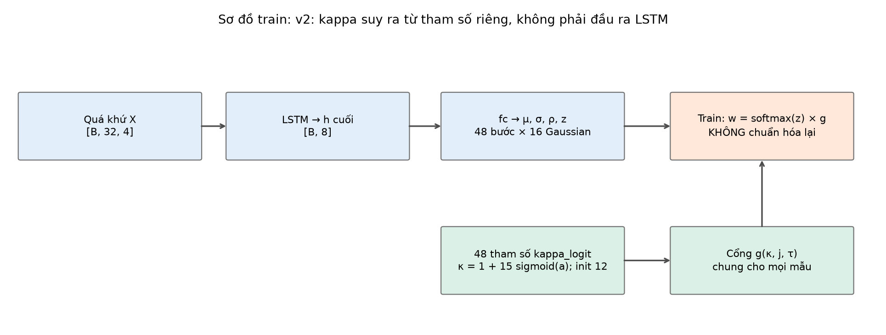

**Hình 1 — sơ đồ train.** Có hai nguồn: h của LSTM sinh tham số phân phối; vector κ riêng điều khiển cổng. Chúng gặp nhau tại khối tính trọng số hỗn hợp.

Tại mỗi bước t:

$$p(y_t\mid X)=\sum_{j=1}^{16}\pi_{t,j}(X)\,\mathcal N_2(y_t;\mu_{t,j}(X),\Sigma_{t,j}(X)).$$

Đây là 48 GMM vị trí theo bước, không phải 16 kịch bản quỹ đạo hoàn chỉnh có một chỉ số Gaussian chung xuyên suốt tương lai.

Một Gaussian có tâm μ, độ lệch chuẩn σ_x, σ_y và tương quan ρ. Decoder legacy trong [mdn_distribution.py](../../base_mdn/utils/mdn_distribution.py) dùng:

$$\sigma_x=e^{s_x},\quad\sigma_y=e^{s_y},\quad\rho=\tanh(r),$$

$$\Sigma=\begin{bmatrix}\sigma_x^2&\rho\sigma_x\sigma_y\\\rho\sigma_x\sigma_y&\sigma_y^2\end{bmatrix}.$$

Kappa MDN giữ cách giải mã này. Gaussian rộng hay hẹp do σ và ρ cùng tâm quyết định; số Gaussian không tự nói lên độ bất định.

### Sơ đồ tổng thể: LSTM → MDN → GMM và phần cải tiến kappa v2

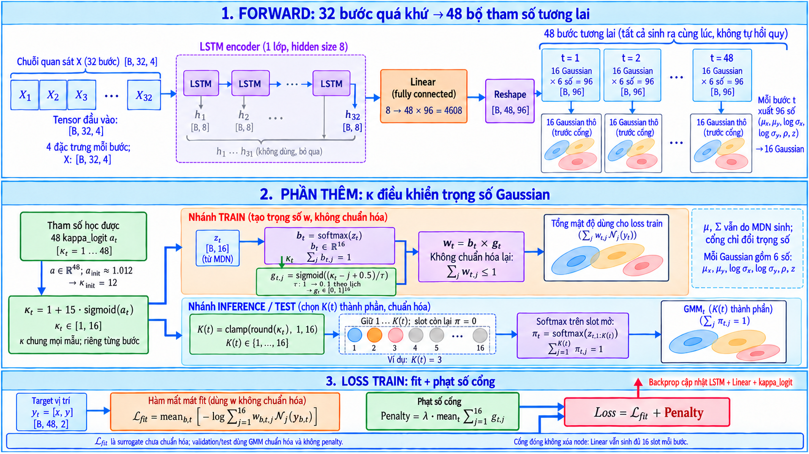

**Hình tổng thể — sơ đồ kiến trúc, không phải số đo.** Bố cục theo hình baseline bạn cung cấp, chia thành ba vùng để đọc lần lượt:

- **Vùng 1 — Forward:** 32 bước quan sát → LSTM → trạng thái cuối h₃₂ → Linear → 48 bộ tham số tương lai. Đây là luồng quen thuộc của baseline, với K_max tăng lên 16.
- **Vùng 2 — Phần thêm kappa:** 48 tham số riêng điều khiển cổng. Nhánh train dùng cổng mềm; nhánh test dùng cổng cứng rồi tạo GMM chuẩn hóa. κ không lấy từ đầu ra LSTM.
- **Vùng 3 — Loss train:** target đi vào hạng fit; cổng đi vào hạng penalty; hai hạng cộng thành một scalar loss. Backprop cập nhật LSTM, Linear và kappa_logit.

Màu tím chỉ LSTM/reshape, cam chỉ Linear và nhánh fit, xanh lá chỉ cơ chế kappa bổ sung. Các ellipse là hình minh họa Gaussian, không phải output của một mẫu thật.

1. **LSTM giữ nguyên:** đọc 32 bước quá khứ, lấy trạng thái cuối có 8 số.
2. **Đầu MDN dùng K_max=16:** `fc` sinh 48 × 16 × 6 số. So với baseline K=3, lớp đầu ra lớn hơn; mô hình vẫn tính đủ 16 slot.
3. **Thêm 48 tham số `kappa_logit`:** suy ra κ trong [1,16], riêng từng bước nhưng chung mọi mẫu. Nhánh này không nhận trạng thái LSTM làm đầu vào.
4. **Train thêm cổng mềm:** nhân `softmax(z)` với g và không chuẩn hóa lại. Loss dùng tổng mật độ chưa chuẩn hóa, cộng penalty số cổng mềm. μ và Σ cũng được dùng trong mật độ Gaussian của loss.
5. **Eval/test thêm cổng cứng:** làm tròn κ, đóng slot vượt K(t), chuẩn hóa trọng số slot mở rồi kết hợp với μ và Σ thành GMM 2D tại mỗi bước.

**Cổng tác động lên trọng số đóng góp của Gaussian, không xóa node hoặc bỏ tính tâm/covariance.** GMM chuẩn hóa ở góc dưới bên phải là đầu ra eval/test; nhánh train v2 dùng surrogate riêng như giải thích ở mục 6.

## 2. Vì sao thêm κ?

Baseline đặt trước số Gaussian K. Nếu K nhỏ, có thể thiếu khả năng biểu diễn; nếu K lớn, có thêm tham số và nhiều thành phần cùng chia trọng số. Tăng K không bảo đảm cải thiện mọi metric.

Kappa MDN muốn đặt câu hỏi:

> Có thể để mô hình học một giới hạn số Gaussian cho mỗi bước tương lai, bằng cách cân bằng NLL và chi phí mở thêm thành phần không?

Vấn đề là K nguyên: 1, 2, 3,... Một phép làm tròn không có gradient hữu ích để optimizer điều chỉnh K. Do đó code dùng số thực κ và cổng sigmoid khi train, rồi đổi sang K nguyên khi eval.

Đây là **làm mềm một quyết định rời rạc để học bằng gradient**. Tài liệu mô tả cơ chế trong repo, không khẳng định nhóm phát minh cơ chế cổng mềm hay đã chứng minh K tối ưu.

## 3. Ba đại lượng phải phân biệt

| Đại lượng | Trong code | Có được học không? |
|---|---|---|
| K_max | `num_gaussians = 16` | Không, cấu hình đặt trước |
| a_t | `model.kappa_logit[t]`, một số thực | Có, là `nn.Parameter` được Adam cập nhật |
| κ_t | `1 + 15·sigmoid(a_t)` | Được suy ra từ tham số học a_t, nằm trong [1,16] |
| K(t) | `round(κ_t)` rồi clamp từ 1 đến 16 | Suy ra từ κ đã học |

Ban đầu:

```text
κ = [12.0, 12.0, ..., 12.0]    tổng cộng 48 số
```

Cụ thể, code đặt `a_init = logit((12−1)/15) ≈ 1.012`, rồi lưu 48 số a_t trong `kappa_logit`. Khi đó `κ = 1 + 15·sigmoid(a)` khôi phục giá trị 12. Với số thực lý tưởng κ nằm trong (1,16); float32 có thể bão hòa tại biên. Khởi tạo phải thỏa `1 < init < K_max`.

Sau huấn luyện, có thể có **ví dụ giả định**:

```text
Bước tương lai:     1    2    3   ...   48
κ_t:              3.2  4.1  3.7  ...   5.3
K(t) khi eval:     3    4    4   ...    5
```

Vector này dùng chung cho tất cả mẫu. Tại bước 1, cả mẫu A và mẫu B đều được mở các slot 1,2,3; nhưng tâm, covariance và trọng số của ba Gaussian đó có thể khác nhau.

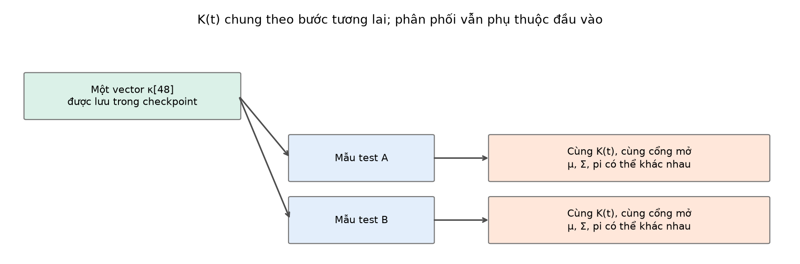

**Hình 2 — sơ đồ.** K(t) là đặc tính theo horizon của model đã học, không phải kết quả suy ra từ độ khó của từng người đi bộ.

Ở bước t có K=3, không có nghĩa model dự đoán cùng ba Gaussian cho mọi người: chỉ cùng **ba chỉ số được phép hoạt động**, còn tham số phân phối được sinh từ đầu vào mỗi người.

## 4. Cổng mềm được tính thế nào?

Mỗi Gaussian j ở bước t có cổng:

$$g_{t,j}=\operatorname{sigmoid}\left(\frac{\kappa_t-j+0.5}{\tau}\right),\qquad j=1,\ldots,16,$$

trong đó:

$$\operatorname{sigmoid}(a)=\frac1{1+e^{-a}}.$$

| Biến | Vai trò |
|---|---|
| κ_t | Vị trí giới hạn số thành phần mà model học |
| j | Chỉ số Gaussian, tính từ 1 |
| τ | Nhiệt độ: độ mềm của cổng, được đặt lịch trước |
| g_t,j | Mức mở từ 0 đến 1; chưa phải trọng số hỗn hợp |

Với κ=3.2 và τ=0.5:

| Gaussian j | Đối số sigmoid | Cổng g, xấp xỉ |
|---:|---:|---:|
| 1 | 5.4 | 0.9955 |
| 2 | 3.4 | 0.9677 |
| 3 | 1.4 | 0.8022 |
| 4 | −0.6 | 0.3543 |
| 5 | −2.6 | 0.0691 |
| 6 | −4.6 | 0.0100 |

Cổng giảm theo chỉ số. Mô hình ưu tiên giữ một **đoạn đầu liên tiếp**, không chọn một tập tùy ý như {2,5,9}.

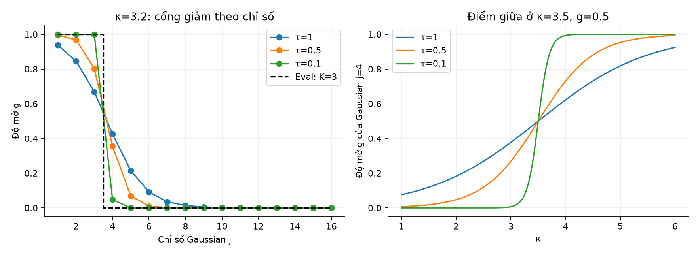

**Hình 3 — tính toán minh họa.** τ nhỏ làm chuyển tiếp sắc hơn. Khi τ lớn, nhiều cổng quanh ranh giới vẫn mở đáng kể.

### Vì sao có +0.5?

Khi eval, số thành phần được làm tròn. Ví dụ κ=3.2 làm tròn thành 3; κ=3.8 làm tròn thành 4. Gaussian thứ 4 nằm gần ranh giới mở tại κ=3.5.

Công thức cổng thứ j có mức mở 0.5 ở:

$$\kappa_t=j-0.5.$$

Vì vậy +0.5 đặt tâm chuyển tiếp tại ranh giới làm tròn. Đây là lựa chọn thiết kế của cổng, không phải ngưỡng sparsemax được tính từ z.

Tại điểm đúng nửa nguyên, `torch.round` dùng làm tròn về số chẵn: 2.5→2, 3.5→4. Không nên mô tả nó là luôn làm tròn .5 lên. Khi τ tiến về 0, cổng ngay tại ranh giới vẫn bằng 0.5; nhánh hard cần quy tắc xử lý tie riêng.

## 5. Cổng không phải trọng số: v2 KHÔNG chuẩn hóa lại khi train

Mạng sinh điểm số z từ LSTM. Trước hết, softmax tạo trọng số cơ sở hợp lệ:

$$b_{t,j}=\operatorname{softmax}_j(z_t),\qquad \sum_j b_{t,j}=1.$$

Sau đó cổng nhân vào trọng số:

$$w_{t,j}=b_{t,j}\,g_{t,j}.$$

**Trong nhánh train v2, w được dùng trực tiếp, không chia lại cho tổng.** Vì vậy:

$$Z_t=\sum_j w_{t,j}=\sum_j b_{t,j}g_{t,j}\le1.$$

Trong số học lý tưởng, Z thường nhỏ hơn 1 khi có cổng chưa mở hoàn toàn. w không phải vector trọng số của một GMM chuẩn hóa. Đây là điểm khác quan trọng so với bản v1.

- b phụ thuộc quỹ đạo: mức ưu tiên cơ sở do mạng sinh.
- g phụ thuộc κ và chỉ số: mức mở của slot chung theo bước.
- w là khối lượng còn lại sau cổng, không nhất thiết có tổng 1.

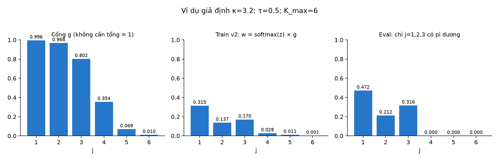

**Hình 4 — số giả định**, K_max=6. Trái là g; giữa là w khi train v2, có tổng nhỏ hơn 1; phải là pi khi eval, được chuẩn hóa trên các slot mở. `g=0.8` không có nghĩa w hoặc pi bằng 0.8.

Trong [model.py](../../kappa_mdn/model.py):

```python
pi_part = torch.log_softmax(logits, dim=-1) + log_gate(self.kappa, self.tau, k)
```

Khối cuối raw trong nhánh train là **log(w)**. `make_loss_fn` gọi:

```python
kappa_nll(raw, target, k, unnormalised_log_weights=model.training)
```

Khi cờ này là True, loss lấy thẳng `raw[..., 5*k:]` làm log-weights. Decoder chung vẫn được gọi để lấy μ và covariance, nhưng `params['pi']` mà decoder softmax tính **không được dùng làm trọng số của loss train**.

Đây là chi tiết rất dễ nhầm: nếu lấy output train rồi gọi decoder và đọc pi, bạn nhận `w/Z` đã chuẩn hóa, không phải w mà loss thực sự sử dụng. Fixed predictions được lưu trong nhánh eval nên pi ở các hình thật là trọng số GMM chuẩn hóa.

`logsigmoid` tính log(g) ổn định hơn lấy log của sigmoid quá nhỏ. Trong toán học, cổng mềm và b đều dương; train không mặc định có số 0 chính xác. Nhánh hard eval mới đóng slot bằng sentinel −1e9.

## 6. Loss v2: hạng fit có phạt mất khối lượng + phạt số cổng

Khi train:

$$\mathcal L_{train}=\underbrace{-\frac1{BH}\sum_{b,t}\log\left[\sum_j w_{b,t,j}\mathcal N_j(y_{b,t})\right]}_{\text{surrogate fit, history vẫn gọi train\_nll}}+\underbrace{\lambda\frac1H\sum_t\sum_j g_{t,j}}_{\text{penalty số cổng mềm}},\quad H=48.$$

**Hạng đầu không phải NLL của một GMM chuẩn hóa**, vì tổng w có thể nhỏ hơn 1. Nó là surrogate huấn luyện có thể tách thành hai phần để hiểu chính xác.

Đặt `q_j = w_j/Z`, là trọng số chuẩn hóa. Khi đó:

$$-\log\left[\sum_j w_j\mathcal N_j(y)\right]
=\underbrace{-\log\left[\sum_j q_j\mathcal N_j(y)\right]}_{\mathrm{NLL}_{normalized\ soft}}
+\underbrace{(-\log Z)}_{\text{phạt mất khối lượng}}.$$

Nếu cổng làm mất nhiều khối lượng, Z giảm và −log Z tăng. Ví dụ Z=0.5 tạo chi phí thêm 0.693 nat. Đây là cơ chế mới khiến việc đóng cổng có giá trong hạng fit, ngoài penalty số cổng vốn khuyến khích đóng.

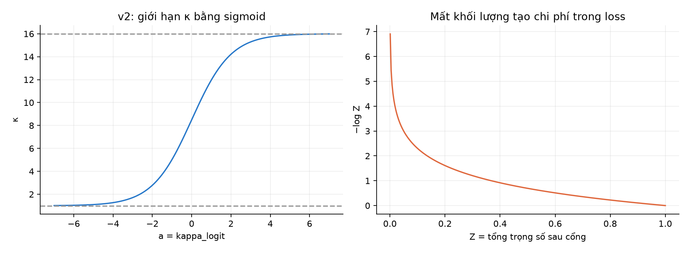

**Hình bổ sung — công thức v2.** Trái: κ bị giới hạn bởi sigmoid. Phải: chi phí −log Z tăng khi khối lượng còn lại giảm.

Trong v1, chuẩn hóa lại `exp(z)*g` làm mất hạng −log Z. Logit có thể bù cho cổng nhỏ, trong khi penalty vẫn đẩy κ giảm. V2 chuẩn hóa b trước cổng rồi giữ w nguyên. Mạng vẫn có thể chuyển b sang các slot mở hơn, nhưng khi giữ b và Gaussian cố định, giảm g chắc chắn làm giảm tổng mật độ chưa chuẩn hóa. **Điều này chưa chứng minh v2 không thể collapse.**

Penalty riêng vẫn là λ=0.01 nhân tổng độ mở mềm, trung bình trên 48 bước. Nếu số cổng mềm trung bình là 12, penalty gần 0.12; nếu là 4, gần 0.04. Nếu chỉ một bước tăng thêm một cổng, chi phí gần λ/48. Không có phép kiểm tra riêng từng Gaussian xem lợi ích có vượt đúng 0.01 hay không.

Tên trong history cần đọc như sau:

| Cột | Nghĩa trong v2 |
|---|---|
| `train_nll` | Surrogate fit không chuẩn hóa, đã chứa −log Z |
| `train_penalty` | λ × số cổng mềm trung bình |
| `train_objective` | Tổng hai hạng trên |
| `validation_nll` | NLL của GMM hard chuẩn hóa, không penalty |

**Không so trực tiếp train_nll v2 với NLL baseline rồi kết luận chất lượng**, vì định nghĩa khác nhau. Dùng evaluation NLL trên cùng split và cùng giao thức.

Loss vẫn dùng logsumexp để ổn định số học. Gaussian được tạo cho tất cả slot trước khi mask, nên covariance lỗi ở slot bị đóng vẫn có thể làm loss báo diverged.

## 7. Vì sao κ có thể học và gradient v2 khác v1 ra sao?

Optimizer cập nhật **a_t = kappa_logit[t]**, không cập nhật trực tiếp property `model.kappa`:

$$\kappa_t=1+15\operatorname{sigmoid}(a_t),\qquad
\frac{\partial\kappa_t}{\partial a_t}=15s_t(1-s_t),\quad s_t=\operatorname{sigmoid}(a_t).$$

Cổng có đạo hàm:

$$\frac{\partial g_{t,j}}{\partial\kappa_t}=\frac{g_{t,j}(1-g_{t,j})}{\tau}.$$

Đạo hàm penalty với κ_t:

$$\frac{\partial\mathcal P}{\partial\kappa_t}=\frac{\lambda}{H\tau}\sum_j g_{t,j}(1-g_{t,j})\ge0.$$

Penalty có xu hướng giảm κ. Với một target ở một bước, đặt trách nhiệm:

$$r_j=\frac{w_j\mathcal N_j(y)}{\sum_\ell w_\ell\mathcal N_\ell(y)}.$$

Trong nhánh train v2, giữ z và tham số Gaussian cố định:

$$\frac{\partial\mathcal L_{fit}}{\partial\kappa_t}
=-\sum_j r_j\frac{1-g_j}{\tau}\le0.$$

Vậy hạng fit có xu hướng **tăng κ**, mở thêm cổng; penalty có xu hướng **giảm κ**. Optimizer học từ tổng hai lực, sau khi trung bình batch/horizon và nhân đạo hàm chuỗi `∂κ/∂a`.

```text
Penalty: muốn ít cổng hơn ← κ → Surrogate fit: muốn giữ khối lượng
```

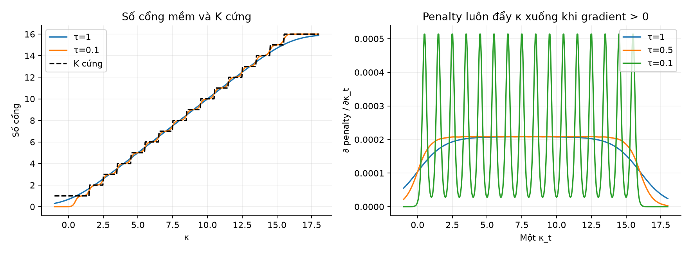

**Hình 5 — công thức minh họa.** Đồ thị đạo hàm đang thể hiện theo κ_t, chưa nhân `∂κ/∂a`. Cổng bão hòa làm gradient yếu; sigmoid của a cũng có thể bão hòa ở biên.

Công thức `(pi_j-r_j)*(1-g_j)/τ` của tài liệu v1 áp dụng cho nhánh được chuẩn hóa lại; **không còn là gradient fit của v2**. Việc thay loss đã thay đổi lực học κ, không chỉ đổi tên biến.

Có tham số và gradient không đồng nghĩa tìm được K tối ưu toàn cục. LR, λ, τ, khởi tạo và cập nhật các tham số còn lại đều ảnh hưởng kết quả.

## 8. Validation và test dùng cổng cứng

Code chuyển nhánh dựa trên `model.training`:

```python
if self.training:
    pi_part = logits + log_gate(self.kappa, self.tau, k)
else:
    pi_part = torch.where(hard_open(self.kappa.detach(), k),
                          logits, torch.full_like(logits, -1e9))
```

Số cổng được mở khi eval:

$$K(t)=\operatorname{clamp}(\operatorname{round}(\kappa_t),1,16).$$

Gaussian j≤K(t) được mở; Gaussian j>K(t) bị đưa logit về −1e9. Decoder softmax cho các slot bị đóng trọng số 0 trong float32, và chuẩn hóa trọng số các slot mở:

$$\pi_{t,j}=\begin{cases}\dfrac{e^{z_{t,j}}}{\sum_{\ell=1}^{K(t)}e^{z_{t,\ell}}},&j\le K(t),\\0,&j>K(t).\end{cases}$$

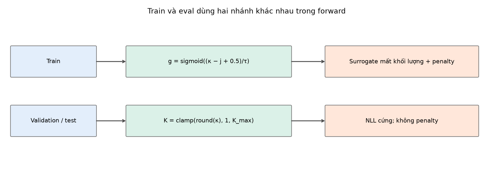

**Hình 6 — sơ đồ.** Validation/test dùng NLL thuần, không penalty. Best checkpoint được chọn theo validation NLL của mô hình hard, đúng với nhánh triển khai dự đoán.

### Khi test, không tối ưu loss thì K được xác định ra sao?

Từ checkpoint, ta đã có 48 giá trị κ học được. Chỉ cần làm tròn và clamp để lấy 48 giá trị K(t). Không cần ground truth để quyết định K.

Đầu vào test vẫn đi qua LSTM và fc để sinh μ, Σ, z mới, nên phân phối thay đổi theo mẫu. Nhưng **K(t) không đổi giữa các mẫu** vì κ không phụ thuộc input.

```text
Checkpoint: κ_t = 3.2 → K(t)=3
Mẫu test A: mở slot 1,2,3 → pi có thể [0.7,0.2,0.1,0,...]
Mẫu test B: mở slot 1,2,3 → pi có thể [0.1,0.3,0.6,0,...]
```

Đây là ví dụ giả định. Trong điều kiện số học bình thường, support pi dương bằng K(t). Nếu logit của slot mở cực thấp, softmax có thể underflow về 0, nên nên phân biệt **số cổng mở theo thiết kế** với **số pi dương đếm được trên tensor**.

Chỉ gọi `torch.no_grad()` chưa chuyển sang cổng cứng; phải gọi `model.eval()`. Hai thao tác có vai trò khác nhau: eval chọn nhánh mô hình, no_grad tắt xây dựng đồ thị gradient.

## 9. Nhiệt độ τ và learning rate

τ là buffer được lưu cùng model, không phải tham số được optimizer học. Theo cấu hình full:

$$\tau(e)=1.0+(0.1-1.0)\min\left(1,\max\left(0,\frac{e-1}{1250-1}\right)\right).$$

Epoch 1: τ=1.0. Epoch 1250: τ=0.1. Các epoch sau giữ 0.1. Mục đích là ban đầu cho cổng đủ mềm để điều chỉnh κ, sau đó làm chuyển tiếp sắc hơn. Lịch giảm không tự bảo đảm train và eval khớp nhau, vì z lớn vẫn có thể bù một cổng mềm rất nhỏ.

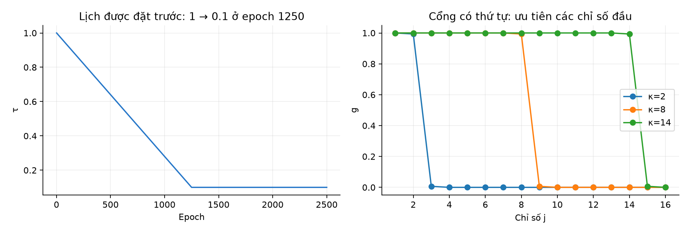

**Hình 7 — lịch đặt trước và công thức minh họa.** Đường τ không phải kết quả model học. Nhánh hard không dùng τ.

Optimizer có hai nhóm:

| Nhóm | LR ban đầu |
|---|---:|
| LSTM và fc | 0.001 |
| `kappa_logit` | 0.01, gấp 10 lần |

Cùng lịch LinearLR theo cấu hình baseline. LR của κ lớn hơn là lựa chọn thiết kế, không phải bảo đảm tốt hơn.

Các giá trị đặt trước khác: K_max=16, κ_init=12, λ=0.01, batch 4096, 2500 epoch, seed 2024, train/validation reduction 0.5, metric định kỳ mỗi 250 epoch. Smoke dùng cấu hình nhỏ riêng và giảm τ đến 0.1 trong 3 epoch; không lấy smoke để suy ra hành vi run full.

Một chi tiết tracker: history ghi τ đã dùng ở epoch hiện tại, sau đó cập nhật buffer τ cho epoch tiếp theo trước khi lưu checkpoint. Vì vậy τ trong checkpoint có thể khác τ của dòng history cùng epoch. Điều này phục vụ resume; nhánh hard của fixed predictions không phụ thuộc τ.

## 10. Đọc đúng tensor và code

Luồng kích thước với K_max=16:

```text
X                 [B, 32, 4]
LSTM output       [B, 32, 8]
h cuối            [B, 8]
fc output         [B, 4608]        48 × 6 × 16
reshape           [B, 48, 96]
kappa_logit       [48]             tham số optimizer học
κ                 [48]             suy ra qua sigmoid
g, log(g)         [48, 16]         broadcast chung qua batch B
pi                [B, 48, 16]
mu, sigma         [B, 48, 16, 2]
covariance        [B, 48, 16, 2, 2]
```

Đầu ra chia **6 khối**, không chia thành 16 nhóm mỗi nhóm 6 số:

| Slice | Nội dung |
|---|---|
| `0:16` | μ_x |
| `16:32` | μ_y |
| `32:48` | log σ_x |
| `48:64` | log σ_y |
| `64:80` | ρ_pre |
| `80:96` | Logit trọng số sau tác động cổng |

KappaMDN kế thừa LSTM baseline, giữ nguyên 5 khối đầu và chỉ chỉnh khối trọng số. Tuy nhiên khi so với baseline K=3, fc lớn hơn do K_max=16. Mạng K=16 baseline có 41,920 tham số; KappaMDN thêm 48 tham số `kappa_logit`, tổng **41,968**. Các cổng không giảm kích thước fc: model vẫn sinh đủ 16 Gaussian mỗi bước.

## 11. Khác sparsemax và baseline ở đâu?

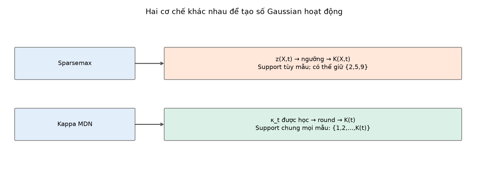

**Hình 8 — sơ đồ.** Hai cách đều có thể tạo pi=0 khi dự đoán, nhưng quyết định bằng cơ chế khác nhau.

| | Baseline | Sparsemax MDN | Kappa MDN |
|---|---|---|---|
| Điều khiển số thành phần | K đặt trước | Support từ z(X,t) | Tham số κ_t được học |
| K có đổi theo mẫu? | Số slot cố định | Có | Số cổng mở không |
| K có đổi theo bước? | Số slot cố định | Có | Có thể |
| Chỉ số được giữ | Mọi slot | Tập tùy z, không cần liên tiếp | Các slot đầu 1..K(t) |
| Train | Softmax | Sparsemax | b=softmax(z), w=b×g, không chuẩn hóa lại |
| Penalty K riêng | Không | Không | Có, λ × số cổng mềm |
| Eval | Softmax | Sparsemax | Cổng cứng rồi softmax trên slot mở |
| Tham số mới ngoài backbone cùng K | Không | Không | 48 số kappa_logit |

Sparsemax là học trọng số thưa rồi suy ra K hoạt động. Kappa MDN đưa 48 logit a_t vào optimizer để điều khiển số cổng qua κ_t bị giới hạn. Cả hai vẫn đặt trước K_max và không bảo đảm học số mode hành vi tối ưu.

## 12. Artifact thật: cơ chế đang làm gì?

### 12.1. κ đã đổi chưa?

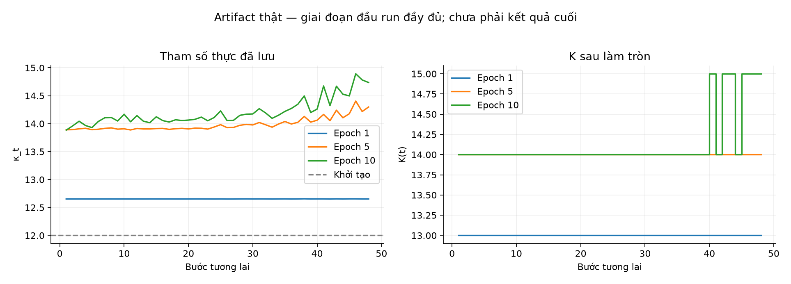

**Hình 9 — artifact thật**, run full, epoch 1,5,10. Trái là κ thực, phải là K cứng. Epoch 10 có K cứng trung bình **14.125**. Hình dùng checkpoint định kỳ cố định, không dùng `best.npz` đang có thể bị ghi đè khi run tiến triển.

κ thay đổi so với 12 chứng minh tham số có được cập nhật ở giai đoạn này. Chưa chứng minh hội tụ hay tìm được K tốt nhất.

### 12.2. NLL, objective và penalty

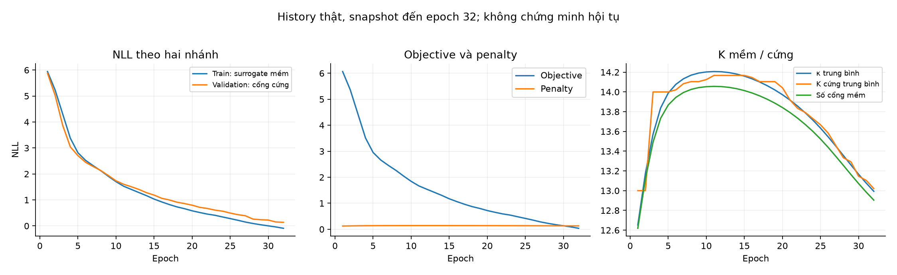

**Hình 10 — artifact thật**, history snapshot đến epoch 32. Ở mốc này, train surrogate fit khoảng **-0.093**, validation NLL khoảng **0.138**, κ trung bình **12.994**, K cứng trung bình **13.021**, số cổng mềm trung bình **12.904**. Đây là một lát cắt giai đoạn đầu, không phải kết quả cuối.

Hai đường không đo cùng định nghĩa: train là surrogate chưa chuẩn hóa, validation là GMM hard chuẩn hóa; dữ liệu đánh giá cũng khác. Không lấy chênh lệch này làm bằng chứng trực tiếp của overfit. Ở giai đoạn đầu τ còn gần 1; muốn đo soft/hard gap phải tính NLL soft **đã chuẩn hóa** và NLL hard trên cùng mẫu validation, đồng thời tách riêng −log Z.

`train_nll` trong history không phải NLL thuần của GMM chuẩn hóa; `train_penalty` là penalty cổng riêng; objective cộng hai cột này. Snapshot của bản v1 trước đây đã được thay bằng snapshot v2.

### 12.3. K chung, nhưng pi vẫn khác theo mẫu

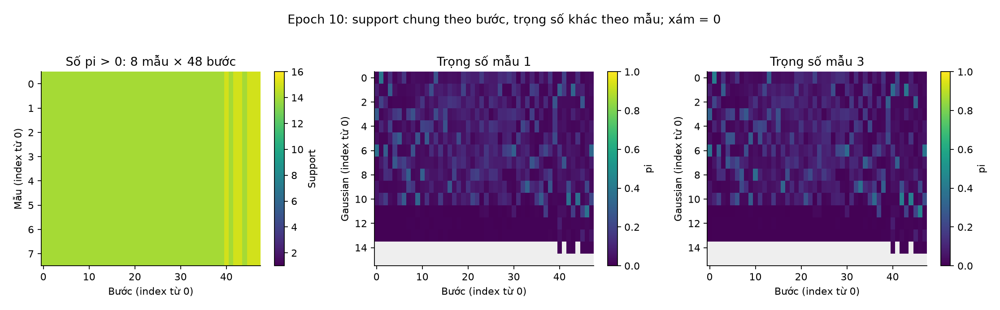

**Hình 11 — artifact thật**, epoch 10. Bản đồ support cho 8 mẫu giống nhau theo từng bước trong artifact này, phù hợp cổng chung. Hai bản đồ pi có thể khác nhau dù cùng slot được mở. Ô xám là pi=0.

Đừng đọc bản đồ support giống nhau thành “mọi mẫu có cùng dự đoán”. Support chỉ nói Gaussian nào được phép góp vào tổng, không nói tâm hay trọng số của nó.

### 12.4. Quỹ đạo: cả trường hợp tốt và khó trong mẫu cố định

Để vẽ một đường từ GMM, tài liệu dùng trung bình hỗn hợp:

$$\bar\mu_t=\sum_j\pi_{t,j}\mu_{t,j}.$$

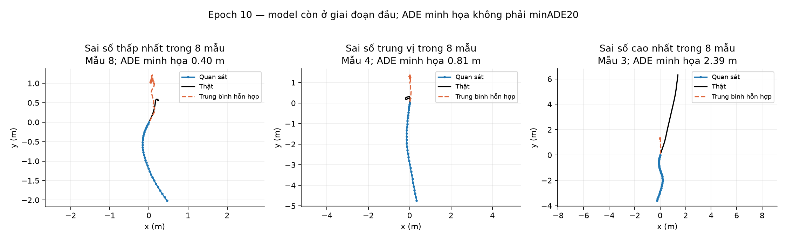

**Hình 12 — artifact thật**, epoch 10. Chọn sai số thấp nhất, trung vị và cao nhất **trong 8 mẫu cố định**, theo ADE của trung bình hỗn hợp. Đây là ADE minh họa, không thay metric minADE20 chính thức và không đại diện mọi mẫu validation.

Trung bình có thể nằm giữa các cụm mật độ, không trùng một hướng chuyển động khả dĩ. Model mới ở giai đoạn đầu; hình chưa phải đánh giá cuối hay bộ failure cases đại diện toàn dataset.

### 12.5. Cùng mẫu qua ba checkpoint

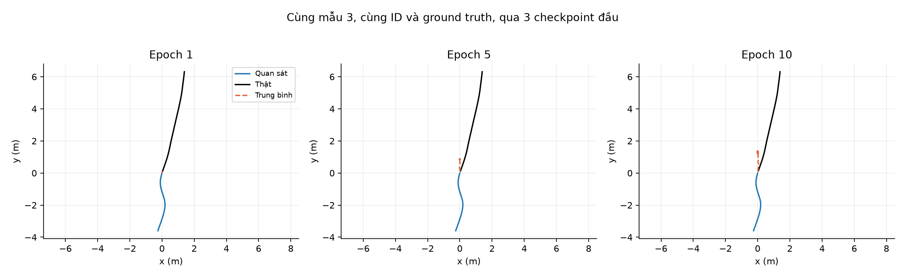

**Hình 13 — artifact thật**, cùng mẫu, epoch 1,5,10. Script kiểm tra ID trùng trước khi vẽ. Quan sát và ground truth giữ nguyên. Trục được co giãn riêng từng ô, cần đọc giá trị tọa độ để so mức sai lệch.

### 12.6. Gaussian và bất định ở các thời điểm

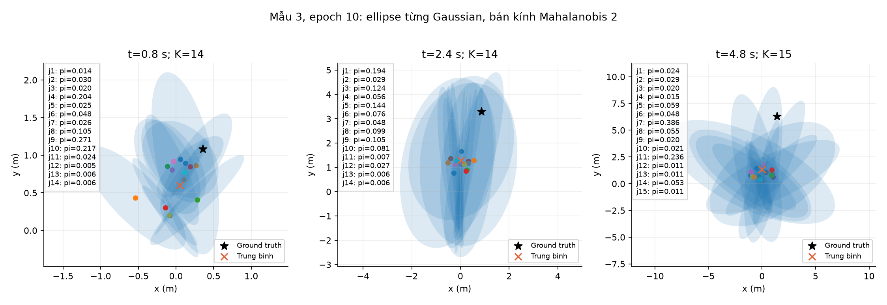

**Hình 14 — artifact thật**, cùng mẫu ở epoch 10, các mốc 0.8,2.4,4.8 s. Chỉ vẽ slot có pi>0, ghi trọng số và vị trí thật. Ellipse bán kính Mahalanobis 2 chứa khoảng 86.5% xác suất của **từng Gaussian**, không phải confidence set 68% hoặc 95% của toàn GMM.

Phân tán tổng thể phụ thuộc cả covariance nội thành phần và khoảng cách giữa các tâm:

$$\operatorname{Cov}(Y_t\mid X)=\sum_j\pi_{t,j}\left[\Sigma_{t,j}+(\mu_{t,j}-\bar\mu_t)(\mu_{t,j}-\bar\mu_t)^T\right].$$

Đây là công thức diễn giải, không phải metric chính thức mới. Không mặc định K tăng thì bất định tăng, hoặc bước xa hơn luôn có ellipse lớn hơn: phải đọc output thật.

### 12.7. Metric có sẵn hiện tại

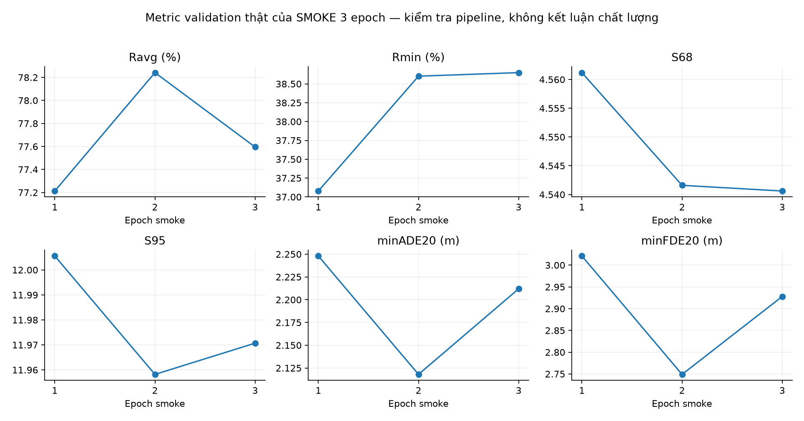

**Hình 15 — artifact thật của SMOKE**, chỉ 3 epoch. Nó chứng minh đường đánh giá có ghi metric hữu hạn, **không chứng minh chất lượng tốt hay kém so baseline full**. Trong snapshot full đến epoch 32, chưa tới mốc metric định kỳ 250.

Các metric cần đọc cùng nhau:

| Metric | Ý nghĩa khi đánh giá |
|---|---|
| NLL | Mật độ gán cho vị trí thật |
| minADE20, minFDE20 | Sai số tốt nhất trong 20 quỹ đạo lấy mẫu; 20 không phải K_max |
| Ravg, Rmin | Reliability theo định nghĩa code repo |
| S68, S95 | Sharpness của vùng tin cậy theo cách tổng hợp chính thức |
| ASAEE | Sai số tổng hợp theo code repo, không tự thay bằng ADE |

Sharpness chính thức tổng hợp qua lưới 101 phân vị diện tích theo mẫu; không tự thay bằng trung bình mẫu thông thường. Forecaster gốc dùng `Categorical(probs=pi)` có thể kẹp pi=0 khi tính log-prob; NLL riêng ở đây mask đúng 0. Khi đọc kết quả cần phân biệt đường tính NLL và đường metric gốc.

## 13. Những giới hạn thực tế cần báo cáo

1. **K chung cho mọi mẫu.** Không chọn ít Gaussian cho mẫu dễ và nhiều Gaussian cho mẫu khó ở cùng bước.
2. **Soft/hard mismatch.** Train có thể sử dụng slot mà eval sẽ đóng. Giảm τ giúp làm sắc cổng nhưng chưa loại bỏ mọi sai khác.
3. **Phụ thuộc λ, lịch τ và khởi tạo.** Đây là các lựa chọn đặt trước, không phải đại lượng đã được học tối ưu.
4. **Cổng có thứ tự theo chỉ số.** Code ưu tiên slot đầu; không sort Gaussian theo pi, chất lượng hay độ phù hợp target. Mạng phải thích nghi với cấu trúc này; chưa chứng minh slot 1 luôn “quan trọng nhất”.
5. **κ bị giới hạn nhưng gradient vẫn có thể bão hòa.** V2 dùng sigmoid để giữ κ trong [1,16]. Khi a rất âm hoặc dương, `∂κ/∂a` nhỏ. Cận κ≥1 tránh số lượng âm nhưng chưa bảo đảm fit tốt hoặc K không collapse về 1.
6. **Không làm mạng nhỏ đi.** fc vẫn tạo đủ 16 slot và loss tạo đủ Gaussian; cần đo runtime nếu muốn khẳng định nhanh hơn.
7. **Tắt thành phần có thể mất tình huống hiếm.** Trọng số nhỏ không chứng minh thành phần vô ích. Phải kiểm tra reliability, không chỉ NLL.
8. **Chưa xử lý mọi lỗi covariance/overfit.** Cơ chế cổng không tự chặn sigma quá nhỏ, exp tràn hay rho bão hòa.
9. **So baseline K=3 còn khác dung lượng.** Kappa K_max=16 có fc lớn hơn; chưa tách riêng tác động cổng nếu thiếu đối chứng cùng K.
10. **Không bảo đảm joint trajectory nhất quán.** Không có latent chung chọn một Gaussian xuyên suốt 48 bước trong code này.

Run đang chạy không đủ để kết luận cuối. Sau khi hoàn thành, cần đọc checkpoint best/final, metric chính thức, soft/hard gap và các trường hợp đại diện. Không dùng kết quả test để điều chỉnh λ rồi báo cáo như đánh giá độc lập.

## 13a. Vì sao có v2 và checkpoint nào dùng được?

Source hiện tại ghi `architecture = kappa_mdn_v2`. Run v1 đã được giữ tại `kappa_k16_init8_ABORTED_collapse`, dừng ở epoch 247. Theo spec và history lưu lại, κ không giới hạn đã giảm xuống âm, K hard collapse về 1 và validation NLL tăng mạnh trong khi train NLL vẫn thấp. Đây là kết quả của bản cũ, không phải v2.

Ba thay đổi chính của v2:

| | v1 | v2 hiện tại |
|---|---|---|
| Tham số | κ tự do | a=kappa_logit; κ=1+15·sigmoid(a) |
| Khởi tạo cấu hình | 8 trong run v1 đã dừng | 12 |
| Train | Chuẩn hóa lại sau cổng | w=softmax(z)×g, dùng trực tiếp |
| Eval | Hard gate và softmax slot mở | Giữ cùng cơ chế |
| Metadata checkpoint | kappa_mdn_v1 | kappa_mdn_v2 |

Spec giải thích giả thuyết collapse do chuẩn hóa sau cổng cho phép bù logit, cùng penalty và κ không giới hạn. Đây là giả thuyết từ công thức, chưa phải phân tích nhân quả tách từng thay đổi bằng ablation. Không đọc checkpoint v1 như v2: state_dict v1 có `kappa`, v2 có `kappa_logit`; train.py kiểm tra architecture khi resume.

SMOKE.json đã được cập nhật cho v2. Smoke 3 epoch xác nhận đường ghi artifact và finite metrics, không chứng minh các thay đổi đã giải quyết chất lượng trên full dataset. Run v2 đang chạy; bảng và hình ở tài liệu này chỉ chụp một giai đoạn đầu.

## 14. Bản đồ file để tự đọc code

| File | Cần đọc gì? |
|---|---|
| [base_lstm.py](../../base_mdn/base_lstm.py) | LSTM, fc, trạng thái cuối, reshape |
| [mdn_distribution.py](../../base_mdn/utils/mdn_distribution.py) | 6 khối tham số, exp, tanh, covariance, softmax |
| [model.py](../../kappa_mdn/model.py) | `kappa_logit`, property `kappa`, `tau`, `log_gate`, `hard_k`, hai nhánh forward |
| [loss.py](../../kappa_mdn/loss.py) | Cờ `unnormalised_log_weights`, surrogate train, NLL hard và penalty |
| [artifacts.py](../../kappa_mdn/artifacts.py) | Lịch τ, history, checkpoint, fixed predictions |
| [train.py](../../kappa_mdn/train.py) | Hai nhóm LR, scheduler, tracker, kiểm tra resume |
| [test_kappa.py](../../kappa_mdn/tests/test_kappa.py) | Các kiểm tra công thức cổng, gradient, trọng số hard |
| [README](../../kappa_mdn/README.md) | Hướng dẫn module; trạng thái trong README có thể cũ hơn run thực tế |
| [Spec](../superpowers/specs/2026-10-04-kappa-mdn-design.md) | Thiết kế và lựa chọn cấu hình công bố trước |
| [SMOKE.json](../../kappa_mdn/reports/SMOKE.json) | Bằng chứng smoke 3 epoch đã review passed |

Artifact full nằm ở:

```text
results/trained_models/kappa_mdn/imptc/kappa_k16_peds_imptc/
  runs/kappa_k16_v2_seed2024/
    history.csv
    checkpoints/
    fixed_samples/inputs.npz
    fixed_samples/predictions/epoch_0001.npz
    fixed_samples/predictions/epoch_0005.npz
    fixed_samples/predictions/epoch_0010.npz
```

Hình tổng thể hiện tại được tạo theo phong cách [hình baseline tham chiếu](../model_visual_guide/lstm_linear_loss_flow.png), sau đó kiểm tra nhãn và công thức theo source v2. Bản sơ đồ trước có script [generate_architecture_figure.py](generate_architecture_figure.py); script này không tái tạo hình mới theo phong cách tham chiếu. Các hình còn lại được sinh bằng [generate_figures.py](generate_figures.py), chỉ đọc artifact và tính công thức minh họa. [figure_info.json](figures/figure_info.json) lưu nguồn, thời điểm tạo, checkpoint, K epoch 10 và chỉ số mẫu. [history_snapshot.json](figures/history_snapshot.json) giữ các dòng history đến epoch 32 để giải thích các số trong tài liệu, dù run tiếp tục chạy.

## 15. Các câu hỏi thầy có thể hỏi

**“Nhóm học K hay chỉ đếm trọng số?”**

Kappa MDN học logit a_t bằng gradient rồi suy ra κ_t bị giới hạn; K(t) là kết quả làm tròn tham số này. Khác sparsemax, nơi K hoạt động được đếm từ trọng số thưa. Tuy nhiên nhóm vẫn đặt trước K_max và chưa chứng minh K tối ưu.

**“Vì sao không học trực tiếp K nguyên?”**

Làm tròn tạo hàm bậc thang, không có gradient hữu ích. Cổng sigmoid tạo một relaxation liên tục khi train, rồi quyết định nguyên ở eval.

**“Kappa có lấy từ đầu ra LSTM không?”**

Không. Source tạo `nn.Parameter` riêng `kappa_logit` có 48 số, rồi tính κ qua sigmoid. LSTM sinh tham số phân phối theo mẫu; κ học giới hạn cổng chung theo bước.

**“Tại sao không mở slot 2,5,9?”**

Thiết kế dùng một scalar điều khiển cả chuỗi cổng có thứ tự, nên hard support luôn là 1..K(t). Muốn chọn tập bất kỳ cần cơ chế khác; không có bước sort lại Gaussian trong source này.

**“Có chắc số Gaussian ít hơn thì tốt hơn?”**

Không. Penalty thể hiện ưu tiên ít cổng trong objective, nhưng giảm cổng có thể làm mất khả năng mô tả tình huống thật. Chất lượng phải kiểm tra bằng NLL, displacement, reliability và sharpness.

**“Ở test có cần tối ưu loss để biết K không?”**

Không. κ đã được lưu trong checkpoint. Test dùng K(t)=clamp(round(κ_t),1,16); đầu vào mới chỉ sinh μ,Σ,z mới qua LSTM và fc.

**“Vì sao validation NLL có thể khác train nhiều?”**

Train dùng surrogate với w không chuẩn hóa; validation dùng GMM hard chuẩn hóa. Cần tách −log Z và đo NLL soft chuẩn hóa/hard trên cùng validation, không gọi chênh lệch này đơn giản là overfit.

## 16. Đoạn thuyết trình ngắn

> Nhóm giữ backbone LSTM–MDN để dự đoán một hỗn hợp Gaussian 2D tại từng bước tương lai. Thay vì đặt cố định số thành phần hoạt động, nhóm bổ sung 48 tham số kappa_logit, suy ra kappa trong [1,16], mỗi giá trị ứng với một bước và dùng chung mọi mẫu. Khi train, cổng sigmoid nhân vào trọng số softmax mà không chuẩn hóa lại; loss gồm một surrogate fit có phạt mất khối lượng và penalty tổng độ mở trung bình. Khi dự đoán, kappa được làm tròn thành K và chỉ K slot đầu được mở. Cách này đưa một đại lượng điều khiển số thành phần vào quá trình học gradient, nhưng vẫn có trần K_max đặt trước và có khác biệt giữa cổng mềm lúc train với cổng cứng lúc eval. Kết quả cần đánh giá đầy đủ trước khi khẳng định tốt hơn baseline.
