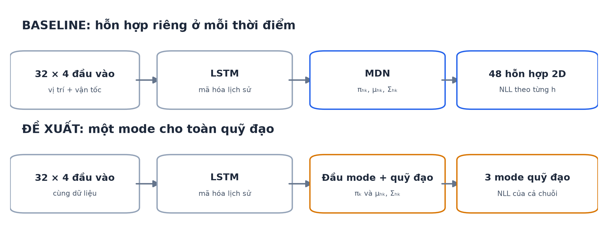
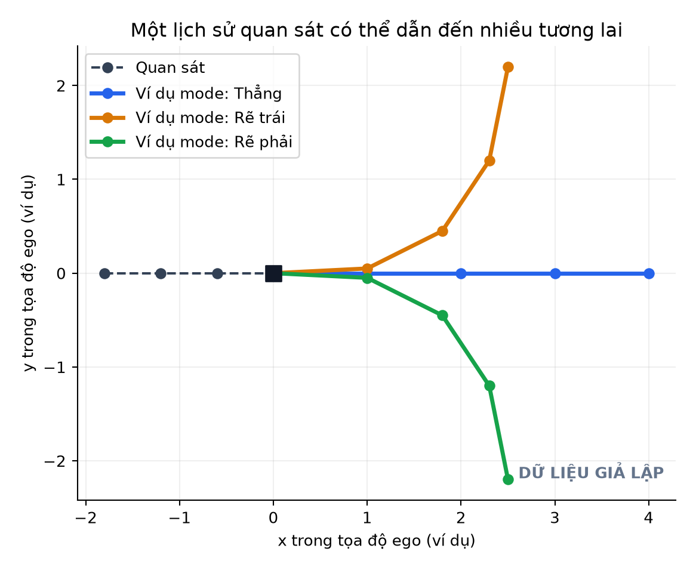
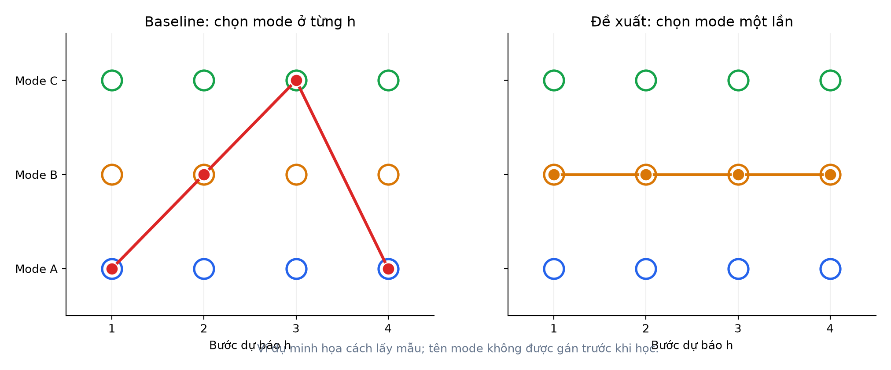
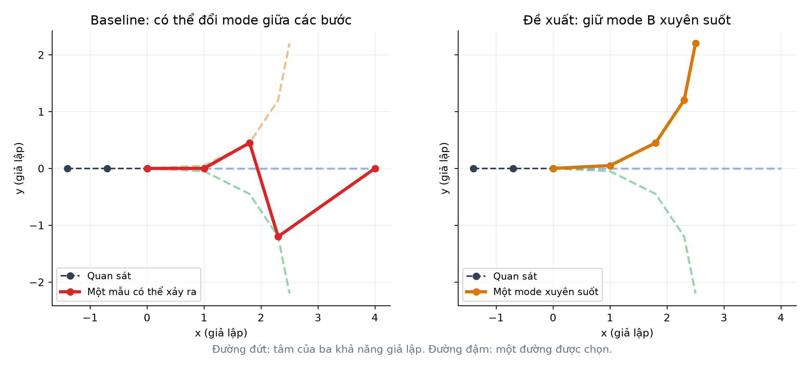
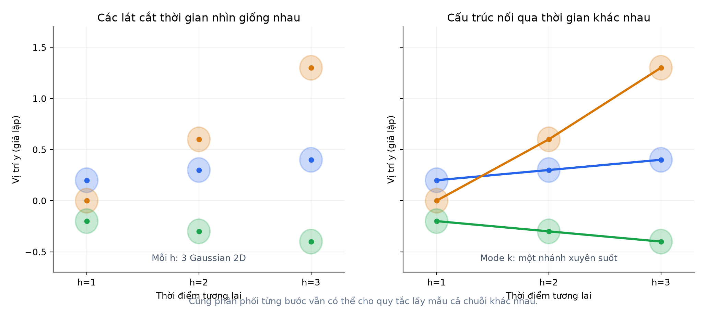
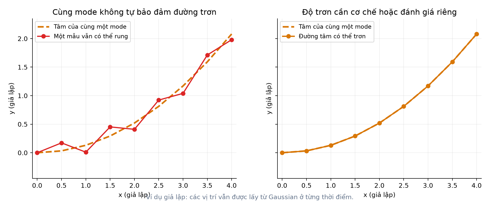

# Đề xuất cải tiến: MDN có mode nhất quán cho toàn quỹ đạo

> **Trạng thái:** Phương pháp đã được triển khai và huấn luyện trong [thư mục riêng](../../mode_consistent_mdn/README.md); baseline M3 được giữ nguyên. Sáu hình trong tài liệu này dùng tọa độ **giả lập để giải thích**, không phải dự báo hay kết quả đo trên IMPTC. Hình từ đầu ra thật được lưu trong run của phương pháp mới.

## 1. Ý tưởng trong một phút

Baseline LSTM–MDN của repo dự báo **một hỗn hợp 3 Gaussian hai chiều tại mỗi thời điểm tương lai**. Từng thời điểm có trọng số và tham số Gaussian riêng. Điều này đủ để trả lời: *“Ở giây thứ 2, người đi bộ có thể ở đâu?”* Nhưng code chưa định nghĩa một biến mode chung để trả lời: *“Người này sẽ đi theo phương án nào từ đầu đến cuối 4,8 giây?”*

Đề xuất này bổ sung một biến mode (z\in\{1,2,3\}) **cho cả quỹ đạo**. Mô hình ước lượng xác suất chọn mỗi mode, đồng thời dự báo 48 phân phối vị trí dọc theo từng mode. Khi tạo một quỹ đạo mẫu, ta chọn mode **một lần** rồi lấy các vị trí tương lai từ mode đã chọn.

**Hình 1.** Đầu vào, LSTM và số thành phần Gaussian được giữ để đối chiếu. Thay đổi chính nằm ở cách xác định mode và cách tính xác suất cho chuỗi tương lai.

## 2. Động cơ: thiếu ràng buộc mode xuyên thời gian

Một lịch sử chuyển động có thể dẫn đến nhiều tương lai. Ví dụ giả lập dưới đây chỉ dùng ba đường để dễ nhìn: đi thẳng, rẽ trái, rẽ phải. Trong dữ liệu thật, ba mode **không được đặt nhãn sẵn** và cũng không nhất thiết tương ứng với ba hành vi này.

**Hình 2.** Cùng một quỹ đạo quan sát có ba khả năng tương lai minh họa.

Với cấu hình IMPTC, đầu vào baseline có 32 bước quan sát × 4 đặc trưng; đầu ra có 48 bước × $3 \times 6 = 18$ giá trị thô. Mã dùng đầu ra LSTM ở bước quan sát cuối cùng rồi qua lớp tuyến tính để tạo các tham số này. Mỗi Gaussian hai chiều được mô tả bằng trọng số $\pi$, tâm $(\mu_x,\mu_y)$, độ lệch chuẩn $(\sigma_x,\sigma_y)$ và hệ số tương quan $\rho$. Xem [cấu hình IMPTC](../../base_mdn/configs/imptc/default_peds_imptc.json), [mô hình và loss](../../base_mdn/base_lstm.py), [giải mã phân phối](../../base_mdn/utils/mdn_distribution.py).

Tại bước dự báo $h$, baseline có phân phối:

$$
p_h(y_h\mid X)=\sum_{k=1}^{3}\pi_{h,k}\,\mathcal N_2(y_h;\mu_{h,k},\Sigma_{h,k}),
\qquad \sum_k\pi_{h,k}=1.
$$

Code tính `-mixture.log_prob(target).mean()`: tức NLL trung bình qua các mẫu và các bước dự báo. **Đây là các phân phối vị trí theo từng bước**; không nên gọi chúng là một hỗn hợp duy nhất đã được huấn luyện cho toàn quỹ đạo. Ở phần lấy mẫu hiện tại, `MixtureSameFamily.sample` lấy vị trí trên tensor chứa các bước tương lai, mà không có biến mode chung cố định qua các bước; xem [sample_with_probs](../../base_mdn/eval.py).

Do đó, trong **một ví dụ lấy mẫu giả lập**, thành phần được lấy ở các bước có thể là A → B → C → A. Điều đó không chứng minh tất cả mẫu baseline đều gãy khúc: các tâm dự báo có thể gần nhau, và mô hình có thể học chuyển động hợp lý. Nó chỉ cho thấy **kiến trúc và loss hiện tại không áp đặt việc giữ cùng một mode**.

**Hình 3.** Mỗi vòng tròn là một thành phần Gaussian tại một bước. Đường đỏ minh họa chọn thành phần khác nhau qua các bước; đường cam giữ cùng mode B.

**Hình 4.** Các đường đứt là tâm của ba tương lai giả lập. Một đường được ghép từ nhiều mode có thể đổi hướng bất thường; chọn một mode chung giữ phương án chuyển động nhất quán hơn.

## 3. Phương pháp mới chính xác là gì?

Cho $X$ là lịch sử quan sát, $Y=(y_1,\ldots,y_H)$ là quỹ đạo thật, $H=48$ và $K=3$.

1. **LSTM mã hóa** $X$ thành vector biểu diễn lịch sử, tương tự baseline.
2. **Đầu phân loại mode** tạo ba xác suất $\pi_1,\pi_2,\pi_3$, với $\sum_k\pi_k=1$. Đây là xác suất cho **toàn bộ tương lai**, không có chỉ số thời gian $h$.
3. **Đầu quỹ đạo xác suất** tạo $\mu_{h,k}$ và $\Sigma_{h,k}$ cho từng cặp bước $h$, mode $k$.
4. **Loss mới** tính xác suất mà *mỗi mode giải thích toàn bộ quỹ đạo thật*, rồi cộng theo mode:

$$
p(Y\mid X)=\sum_{k=1}^{3}\pi_k
\prod_{h=1}^{48}\mathcal N_2(y_h;\mu_{h,k},\Sigma_{h,k}).
$$

$$
\mathcal L_{\mathrm{joint}}=-\log p(Y\mid X).
$$

Trong code, cần tính ở miền log bằng `logsumexp` để tránh tích 48 mật độ rất nhỏ gây tràn số. Việc chuẩn hóa loss theo 48 bước có thể giúp đối chiếu thang giá trị, nhưng phải ghi rõ công thức khi báo cáo; **NLL toàn quỹ đạo và NLL trung bình từng bước không cùng một đại lượng**.

Hiệp phương sai ở mỗi $(h,k)$ vẫn có đúng dạng repo dùng:

$$
\Sigma_{h,k}=\begin{bmatrix}
\sigma_{x,h,k}^{2} & \rho_{h,k}\sigma_{x,h,k}\sigma_{y,h,k}\\
\rho_{h,k}\sigma_{x,h,k}\sigma_{y,h,k} & \sigma_{y,h,k}^{2}
\end{bmatrix}.
$$

Ở lúc lấy mẫu: (i) rút **một** $z\sim\mathrm{Categorical}(\pi)$; (ii) với mọi $h$, rút $y_h$ từ Gaussian thứ $z$ ở bước đó. Với mô hình đơn giản này, các vị trí được xem là độc lập **sau khi đã biết mode**; sự phụ thuộc cấp quỹ đạo đến từ biến $z$ chung. Chưa có giả định hay chứng minh rằng các điểm liên tiếp liên tục hoặc trơn tuyệt đối.

### Tại sao đây là thay đổi phương pháp, không chỉ đổi siêu tham số?

Baseline tối ưu xác suất của **từng vị trí tương lai**. Đề xuất tối ưu xác suất của **cả dãy vị trí dưới cùng một mode**. Cần thay đổi cách tạo xác suất mode, công thức loss và cách lấy mẫu quỹ đạo. Các tham số học của mô hình mới phải được huấn luyện lại. Giữ $K=3$ chỉ giúp so sánh có kiểm soát; điều tạo nên phương pháp mới là **cấu trúc xác suất và mục tiêu học**.

## 4. Một điểm dễ nhầm: ảnh từng thời điểm có thể giống nhau

Nếu cùng ba Gaussian ở mỗi bước và đặt $\pi_{h,k}=\pi_k$, phân phối **riêng tại từng bước** của hai cách có thể trông giống hệt nhau. Khác biệt nằm ở **cách các bước nối thành một quỹ đạo ngẫu nhiên**. Nhìn một ảnh contour ở một thời điểm sẽ không đủ để chứng minh cải tiến.

**Hình 5.** Hai phía dùng cùng các Gaussian giả lập ở từng thời điểm. Phía phải biểu diễn liên kết theo mode qua thời gian; đây là khác biệt ở cấp *quỹ đạo*, không nhất thiết ở một lát cắt thời gian.

## 5. Mục đích và giả thuyết cần kiểm chứng

**Mục đích:** tạo các dự báo đa phương án mà một quỹ đạo mẫu theo cùng một phương án từ đầu đến cuối; đánh giá xem điều này có hữu ích cho dự báo chuyển động người đi bộ trên IMPTC hay không.

**Giả thuyết, chưa phải kết quả:** cách học mode toàn quỹ đạo *có thể* giảm hiện tượng đổi mode bất thường trong các mẫu tương lai và cải thiện chất lượng quỹ đạo. Nó cũng *có thể* làm kém kết quả ở một số tình huống vì ba mode toàn quỹ đạo phải gánh nhiều dạng chuyển động, hoặc vì giả định độc lập có điều kiện còn đơn giản.

Các câu hỏi cụ thể:

- Mẫu quỹ đạo có ít lần đổi hướng bất thường hơn không, đặc biệt ở ca khó hoặc rẽ hướng?
- minADE₍20₎, minFDE₍20₎, reliability và sharpness trên **cùng split test** thay đổi thế nào?
- Các phân phối vị trí ở từng mốc 0,8–4,8 giây còn được hiệu chuẩn tốt không?
- Chi phí huấn luyện và suy luận thay đổi bao nhiêu?

Không nên dùng mỗi một ảnh đẹp để kết luận. Cần xem cả trường hợp tốt, khó/không chắc chắn và thất bại, với cùng sample ID giữa hai mô hình.

## 6. Những điều phương pháp này **không** bảo đảm

**Không bảo đảm quỹ đạo trơn.** Các điểm sau khi chọn mode vẫn được lấy mẫu từ Gaussian theo từng thời điểm và có thể dao động quanh đường tâm. Muốn kiểm soát độ trơn cần một thành phần mô hình hoặc tiêu chí riêng, rồi đánh giá nó riêng.

**Hình 6.** Cùng một mode có đường tâm mượt, nhưng một dãy điểm lấy mẫu vẫn có thể rung. Hình này là phản ví dụ giả lập, không phải lỗi đã đo được trên baseline.

**Không bảo đảm ba mode có ý nghĩa “thẳng/trái/phải”.** Tên mode là ẩn, có thể hoán đổi thứ tự trong huấn luyện; một mode có thể bao gồm nhiều hành vi gần nhau. Nếu muốn nhãn hành vi rõ ràng, cần dữ liệu gán nhãn hoặc thiết kế bổ sung.

**Không bảo đảm metric tốt hơn.** Mô hình baseline M3 đã chạy xong; lợi ích của đề xuất phải được kiểm tra bằng thực nghiệm. Nếu kết quả kém hơn, đó vẫn là kết quả cần phân tích trung thực.

## 7. Cách so sánh công bằng với baseline

| Thành phần | Baseline M3 | Đề xuất |
|---|---|---|
| Dữ liệu, tọa độ ego, 32 bước × 4 đặc trưng | Theo cấu hình IMPTC | Giữ giống |
| Số mode/Gaussian | 3 mỗi bước | 3 cho toàn quỹ đạo |
| Phân phối ở một bước | Hỗn hợp 2D | Hỗn hợp 2D sau khi lấy biên từ mô hình quỹ đạo |
| Xác suất mode | $\pi_{h,k}$ tại từng bước | $\pi_k$ dùng chung 48 bước |
| Loss huấn luyện | NLL trung bình từng bước | Joint NLL của chuỗi |
| Lấy mẫu 20 quỹ đạo | Theo mã đánh giá baseline | Chọn một mode cho mỗi quỹ đạo |

Nên giữ nguyên split dữ liệu, seed, lịch train và checkpoint policy trong khả năng thực tế. Các metric chính thức theo **từng thời điểm** như reliability và sharpness có thể tính từ phân phối biên:

$$
p_h(y_h\mid X)=\sum_{k=1}^{3}\pi_k\mathcal N_2(y_h;\mu_{h,k},\Sigma_{h,k}).
$$

Với minADE₍20₎/minFDE₍20₎, cần ghi rõ cách lấy 20 quỹ đạo ở **mỗi** phương pháp. Mã đánh giá baseline hiện xử lý mẫu và xếp hạng xác suất theo từng bước; nếu đổi cách lấy mẫu để nghiên cứu tính nhất quán, hãy báo cáo đó là **phân tích bổ sung** và chạy cùng quy trình cho cả hai mô hình. Không thay lặng lẽ kết quả metric chính thức trong repo bằng metric mới. Đồng thời nên lưu cả NLL từng bước để so sánh phân phối vị trí; joint NLL chỉ có ý nghĩa khi mô hình thực sự định nghĩa phân phối chung như đề xuất.

## 8. Nguồn và phạm vi kết luận

- **Bài báo baseline:** [PDF trong repo](../../2410.06905.pdf), mục 3 (Method) và 4 (Experiments).
- **Mã baseline:** [base_lstm.py](../../base_mdn/base_lstm.py), [mdn_distribution.py](../../base_mdn/utils/mdn_distribution.py), [eval.py](../../base_mdn/eval.py).
- **Cảm hứng nghiên cứu liên quan:** [MultiPath: Multiple Probabilistic Anchor Trajectory Hypotheses for Behavior Prediction](https://arxiv.org/abs/1910.05449) dùng các giả thuyết quỹ đạo và xác suất tương ứng. Thiết kế trong repo không khẳng định trùng kiến trúc hoặc kết quả của MultiPath; kết quả thực nghiệm phải đọc từ run riêng và đánh giá test.

**Tóm tắt trình bày:** “Baseline tạo ba Gaussian cho từng thời điểm. Chúng em đề xuất học ba mode ở cấp cả quỹ đạo, dùng cùng một mode cho 48 bước và huấn luyện bằng xác suất của toàn bộ chuỗi. Mục tiêu là tăng tính nhất quán của các phương án dự báo; hiệu quả về sai số, hiệu chuẩn và độ trơn phải được đo trên IMPTC.”
