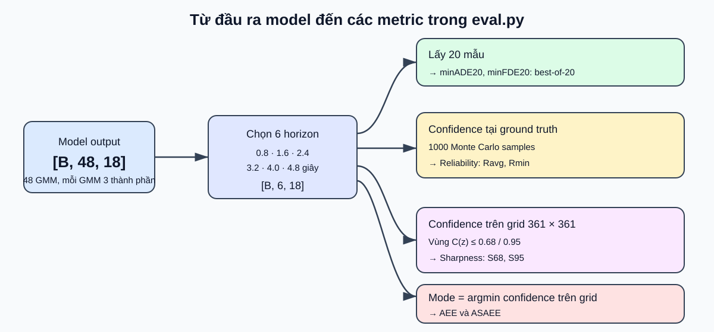
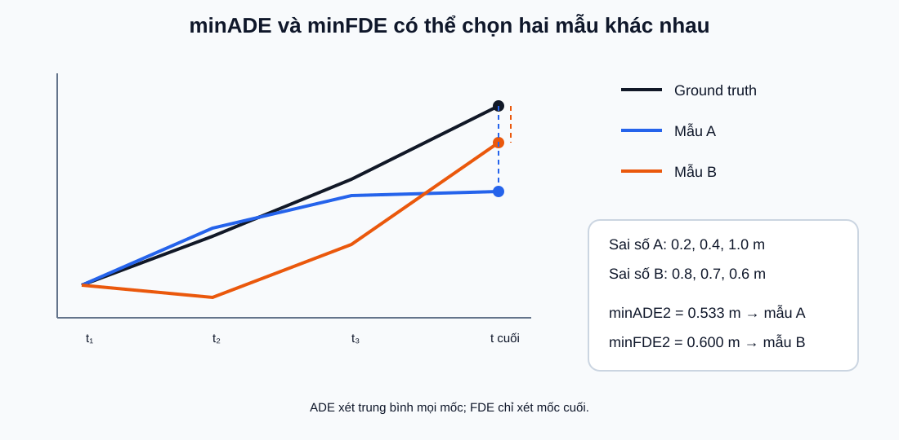
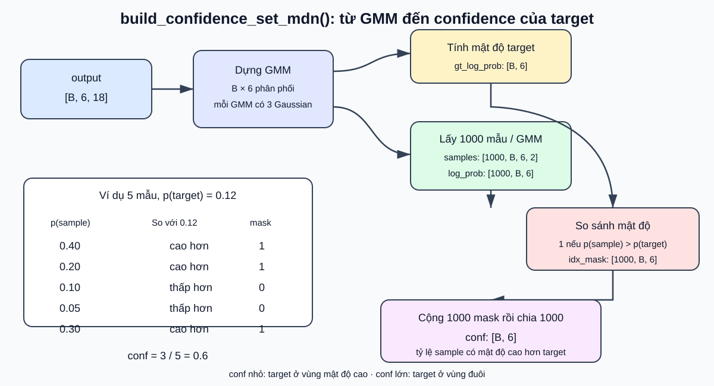
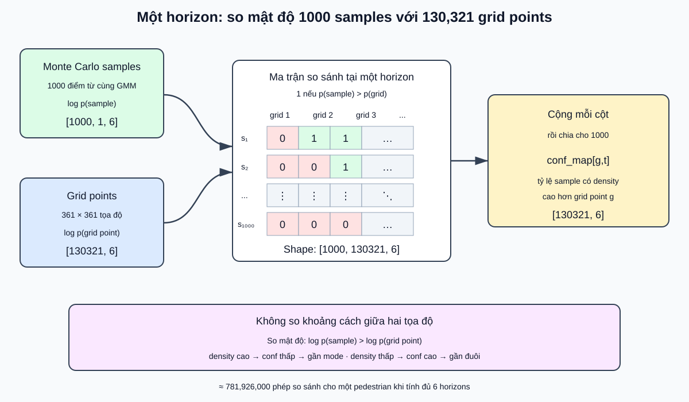
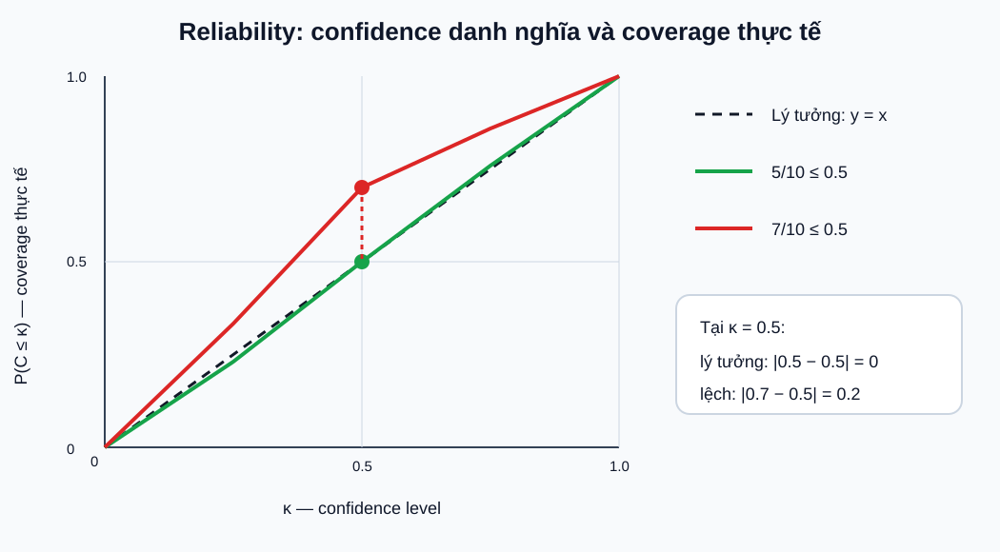
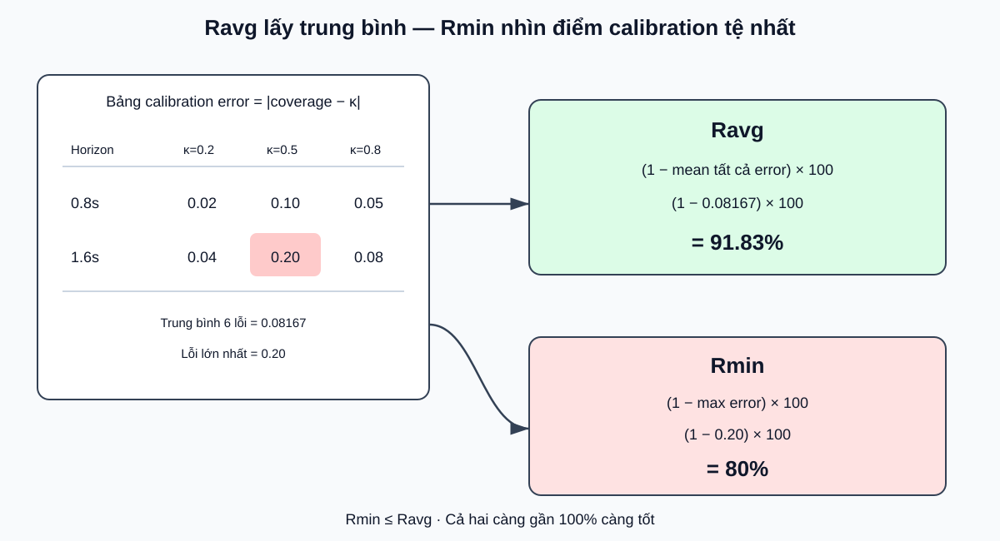
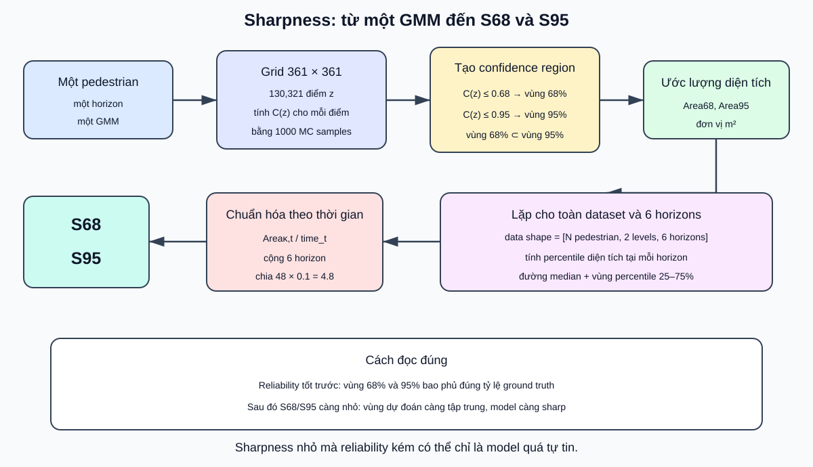
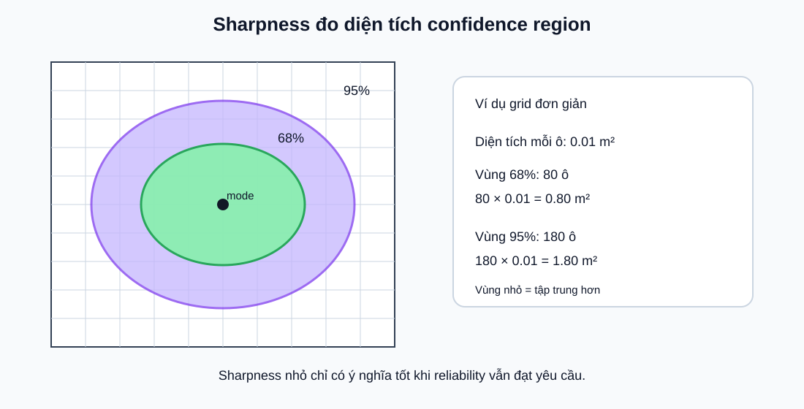
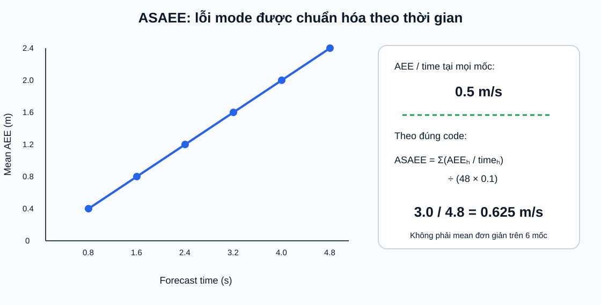

# Đọc hiểu `base_mdn/eval.py`: các metric đánh giá

Tài liệu này giải thích **model được đánh giá như thế nào sau khi đã dự đoán**, không phải cách model học. Các metric trong file này không được dùng để `backward()` hay cập nhật trọng số.

## 1. Bức tranh tổng quát



Với cấu hình IMPTC hiện tại:

- model nhận đầu vào có shape `[B, 32, 4]`;
- model trả về `[B, 48, 18]`, tức 48 phân phối GMM hai chiều;
- khi đánh giá, code chỉ lấy các index `[7, 15, 23, 31, 39, 47]`;
- do `delta_t = 0.1`, chúng tương ứng với `0.8, 1.6, 2.4, 3.2, 4.0, 4.8 giây`;
- mỗi timestep được mô tả bởi một GMM gồm 3 Gaussian hai chiều.

Sau bước lọc, ta có:

```text
filtered_outputs: [B, 6, 18]
filtered_targets: [B, 6, 2]
```

Các nhóm metric:

| Metric | Câu hỏi metric muốn trả lời | Tốt hơn khi |
|---|---|---|
| minADE20 | Trong 20 mẫu, có mẫu nào gần toàn bộ tương lai thật không? | nhỏ hơn |
| minFDE20 | Trong 20 mẫu, có điểm cuối nào gần điểm cuối thật không? | nhỏ hơn |
| Reliability | Xác suất model nói có khớp tần suất xảy ra thực tế không? | gần 100% |
| S68, S95 | Vùng bất định 68% và 95% rộng bao nhiêu? | nhỏ hơn, **nếu reliability vẫn tốt** |
| ASAEE | Mode của phân phối sai bao nhiêu khi có xét thời gian dự báo? | nhỏ hơn |
| Inference time | Một batch chỉ chạy model mất bao lâu? | nhỏ hơn |

---

## 2. `minADE20` và `minFDE20`

### 2.1 Code làm gì?

```python
k_samples, k_probs = self.sample_with_probs(
    filtered_outputs,
    num_gaussians=self.num_gaussians,
    n_samples=self.test_params['num_k_samples']
)
```

Với `num_k_samples = 20`, GMM sinh ra 20 bộ vị trí tương lai:

```text
k_samples: [20, B, 6, 2]
```

Code tính khoảng cách Euclid giữa từng vị trí lấy mẫu và ground truth:

```python
euc_errors = sqrt(sum((filtered_targets - k_sorted_samples)^2))
```

Shape của sai số là:

```text
[20, B, 6]
  K   mẫu  timestep
```

Sau đó:

```python
minADE = euc_errors.mean(axis=2).min(axis=0)
minFDE = euc_errors[:, :, -1].min(axis=0)
```

### 2.2 Ví dụ tính tay

Giả sử chỉ có `K=2` dự đoán và 3 mốc tương lai:

```text
Mẫu A có sai số: [0.2, 0.4, 1.0] m
Mẫu B có sai số: [0.8, 0.7, 0.6] m
```

ADE của từng mẫu:

```text
ADE(A) = (0.2 + 0.4 + 1.0) / 3 = 0.533 m
ADE(B) = (0.8 + 0.7 + 0.6) / 3 = 0.700 m

minADE2 = min(0.533, 0.700) = 0.533 m
```

FDE chỉ nhìn timestep cuối:

```text
FDE(A) = 1.0 m
FDE(B) = 0.6 m

minFDE2 = min(1.0, 0.6) = 0.6 m
```



Điểm rất quan trọng: `minADE20` chọn mẫu tốt nhất theo **trung bình cả 6 mốc**, còn `minFDE20` chọn mẫu tốt nhất theo **mốc cuối**. Hai metric có thể chọn hai mẫu khác nhau, như ví dụ trên.

### 2.3 Ý nghĩa và giới hạn

- `minADE20` nhỏ: ít nhất một trong 20 khả năng bám khá sát toàn bộ tương lai thật.
- `minFDE20` nhỏ: ít nhất một trong 20 khả năng kết thúc gần vị trí thật.
- Đây là metric kiểu **best-of-K/oracle**: code được phép nhìn ground truth rồi chọn mẫu tốt nhất.
- Khi tăng `K`, hai metric thường có lợi hơn vì model có nhiều cơ hội lấy trúng mẫu gần ground truth.
- Metric này không nói trực tiếp xác suất có được hiệu chỉnh đúng hay không; đó là nhiệm vụ của reliability.

### 2.4 Một chi tiết trong code

Code sắp xếp 20 mẫu theo mật độ xác suất, nhưng sau đó vẫn giữ đủ cả 20 mẫu:

```python
torch.topk(k_probs, k=num_k_samples, dim=0)
```

Vì `k` đúng bằng tổng số mẫu, việc đổi thứ tự không làm thay đổi phép `min`. Do đó kết quả thực chất vẫn là minimum trên toàn bộ 20 mẫu.

Ngoài ra, mỗi GMM timestep được sample riêng bởi `torch.distributions`. Vì vậy một dãy gồm 6 vị trí sample không nên được diễn giải quá mạnh thành một phân phối joint trajectory duy nhất, trừ khi code có thêm quan hệ phụ thuộc giữa các timestep — ở đây không thấy quan hệ đó.

---

## 3. Reliability: xác suất dự đoán có đáng tin không?

### 3.1 Confidence value của một ground truth

Với một ground-truth `z`, code xây dựng:

```python
gt_log_prob = gmm.log_prob(target)
samples = gmm.sample([1000])
samples_log_prob = gmm.log_prob(samples)
confidence = mean(samples_log_prob > gt_log_prob)
```

Viết gần đúng:

```text
C(z) = P[p(Z) > p(z)], với Z được lấy mẫu từ chính GMM
```

Hiểu trực giác:

- `C(z)` gần `0`: `z` nằm ở vùng mật độ rất cao, gần mode;
- `C(z)` gần `1`: `z` nằm ở vùng mật độ thấp, xa phần lớn khối xác suất.

Đây là lý do vùng confidence mức `κ` được viết là:

```text
{z : C(z) <= κ}
```

### 3.1.1 Đọc từng dòng `build_confidence_set_mdn()`

Hàm đầy đủ:

```python
def build_confidence_set_mdn(self, output, target, num_gaussians, n_samples):
    gmm = self.build_distribution(output=output,
                                  num_gaussians=num_gaussians)

    gt_log_prob = gmm.log_prob(target)
    samples = gmm.sample(sample_shape=torch.Size([n_samples]))
    samples_log_prob = gmm.log_prob(samples)
    idx_mask = (samples_log_prob > gt_log_prob).float()
    conf = torch.sum(idx_mask, 0) / samples.shape[0]
    return conf
```

Hàm này trả lời câu hỏi:

> Bao nhiêu phần trăm mẫu ngẫu nhiên lấy từ GMM có mật độ lớn hơn mật độ tại điểm `target`?

Viết dưới dạng công thức Monte Carlo:

```text
                  số mẫu z có p(z) > p(target)
C(target) ≈       ─────────────────────────────
                       tổng số mẫu ngẫu nhiên
```

Hay tương đương:

```text
C(target) ≈ P_Z~GMM[p(Z) > p(target)]
```



#### Biến `output`

Khi tính reliability:

```text
output = filtered_outputs
output.shape = [B, 6, 18]
```

Trong đó:

```text
B  = số pedestrian trong batch
6  = sáu horizon 0.8, 1.6, 2.4, 3.2, 4.0, 4.8 giây
18 = tham số raw tạo một GMM gồm ba Gaussian
```

Mỗi `output[b,t]` chứa 18 giá trị để dựng đúng một GMM của pedestrian `b` tại timestep `t`:

```text
output[b,t]
   ↓ decode
pi, mu, sigma, rho, covariance
   ↓
GMM[b,t]
```

#### Biến `target`

`target` là tọa độ cần kiểm tra xem nó nằm ở vùng mật độ cao hay thấp của GMM. Tên biến này có hai cách sử dụng trong `eval.py`:

1. Khi tính reliability, `target` là ground truth:

```text
target.shape = [B, 6, 2]
target[b,t]  = [x_true, y_true]
```

2. Khi tính sharpness hoặc tìm mode, `target` là toàn bộ mesh grid:

```text
target.shape = [130321, 1, 2]
```

Vì vậy tên tổng quát chính xác hơn có thể là `query_points`; nó không phải lúc nào cũng là ground truth.

#### Biến `gmm`

```python
gmm = self.build_distribution(output=output,
                              num_gaussians=num_gaussians)
```

Với `output.shape = [B,6,18]`, PyTorch tạo ra:

```text
gmm.batch_shape = [B, 6]
gmm.event_shape = [2]
```

Nghĩa là có `B × 6` GMM, còn một event của mỗi GMM là một tọa độ hai chiều `(x,y)`.

#### Biến `gt_log_prob`

```python
gt_log_prob = gmm.log_prob(target)
```

Khi `target` là ground truth:

```text
target.shape      = [B, 6, 2]
gt_log_prob.shape = [B, 6]
```

Mỗi giá trị:

```text
gt_log_prob[b,t] = log p_GMM[b,t](target[b,t])
```

Với ba Gaussian:

```text
p(z) = pi_1 N(z | mu_1, Sigma_1)
     + pi_2 N(z | mu_2, Sigma_2)
     + pi_3 N(z | mu_3, Sigma_3)
```

`log_prob()` trả về log của **mật độ toàn GMM**, không chỉ mật độ của một component.

Ví dụ:

```text
target = (2.3, 1.4)
p(target) = 0.12
gt_log_prob = log(0.12) ≈ -2.120
```

#### Biến `samples`

```python
samples = gmm.sample(sample_shape=torch.Size([n_samples]))
```

Trong cấu hình hiện tại:

```text
n_samples = 1000
samples.shape = [1000, B, 6, 2]
```

Với cùng pedestrian `b` và timestep `t`:

```python
samples[:, b, t, :]
```

là 1000 điểm `(x,y)` lấy độc lập từ cùng một `GMM[b,t]`.

Không được nhầm 1000 mẫu này với 20 mẫu của `minADE20/minFDE20`:

```text
20 mẫu   → dùng cho best-of-K minADE/minFDE
1000 mẫu → dùng để xấp xỉ confidence, reliability và confidence map
```

#### Biến `samples_log_prob`

```python
samples_log_prob = gmm.log_prob(samples)
```

Shape thay đổi:

```text
samples          [1000, B, 6, 2]
                         ↓ log_prob trên event (x,y)
samples_log_prob [1000, B, 6]
```

Mỗi phần tử:

```text
samples_log_prob[s,b,t]
= log p_GMM[b,t](samples[s,b,t])
```

Hàm không cộng qua sáu timestep. Nó giữ lại một log-density riêng cho từng timestep.

#### Biến `idx_mask`

```python
idx_mask = (samples_log_prob > gt_log_prob).float()
```

PyTorch broadcast:

```text
samples_log_prob [1000, B, 6]
gt_log_prob             [B, 6]
                         ↓ broadcast
idx_mask         [1000, B, 6]
```

Mỗi phần tử là:

```text
1 nếu p(sample) > p(target)
0 nếu p(sample) <= p(target)
```

So sánh log-density cho kết quả thứ tự giống so sánh density vì hàm `log` đồng biến. Dùng log giúp tính toán ổn định hơn.

#### Biến `conf`

```python
conf = torch.sum(idx_mask, 0) / samples.shape[0]
```

Ở đây `dim=0` là chiều 1000 Monte Carlo samples:

```text
idx_mask [1000, B, 6]
    ↓ sum(dim=0)
          [B, 6]
    ↓ chia 1000
conf      [B, 6]
```

Mỗi giá trị:

```text
conf[b,t]
= số sample có mật độ cao hơn target[b,t] / 1000
```

#### Ví dụ tính tay

Để dễ tính, giả sử chỉ lấy 5 mẫu thay vì 1000:

```text
p(target) = 0.12

sample       p(sample)       p(sample) > p(target)?
1               0.40                    1
2               0.20                    1
3               0.10                    0
4               0.05                    0
5               0.30                    1
```

Khi đó:

```text
idx_mask = [1, 1, 0, 0, 1]
conf = (1 + 1 + 0 + 0 + 1) / 5 = 0.6
```

`conf = 0.6` nghĩa là khoảng 60% khối xác suất lấy mẫu có mật độ cao hơn mật độ tại target.

#### Cách đọc giá trị `conf`

```text
conf gần 0
→ rất ít sample có mật độ cao hơn target
→ target nằm ở vùng mật độ cao, gần mode

conf gần 1
→ phần lớn sample có mật độ cao hơn target
→ target nằm ở vùng mật độ thấp, gần đuôi phân phối
```

Do đó tên `confidence` hơi ngược trực giác: giá trị nhỏ tương ứng với điểm có mật độ cao hơn.

### 3.1.2 Hai trường hợp gọi hàm và shape tương ứng

#### Trường hợp A: reliability tại ground truth

```python
build_confidence_set_mdn(
    output=filtered_outputs,
    target=filtered_targets,
    num_gaussians=3,
    n_samples=1000
)
```

Luồng shape:

```text
output             [B, 6, 18]
target             [B, 6, 2]
gt_log_prob        [B, 6]
samples            [1000, B, 6, 2]
samples_log_prob   [1000, B, 6]
idx_mask           [1000, B, 6]
conf               [B, 6]
```

Mỗi `conf[b,t]` cho biết ground truth của pedestrian `b` tại timestep `t` nằm ở mức mật độ nào của GMM dự đoán.

#### Trường hợp B: confidence map trên grid

```python
build_confidence_set_mdn(
    output=filtered_outputs[idx][None, ...],
    target=grid,
    num_gaussians=3,
    n_samples=1000
)
```

Shape:

```text
output             [1, 6, 18]
grid               [130321, 1, 2]
gt_log_prob        [130321, 6]
samples            [1000, 1, 6, 2]
samples_log_prob   [1000, 1, 6]
idx_mask           [1000, 130321, 6]
conf_map           [130321, 6]
```

Broadcasting cho phép so sánh 1000 sample với toàn bộ 130,321 điểm grid ở cả 6 timestep. Sau đó:

```text
conf_map <= 0.68 → vùng confidence 68%
conf_map <= 0.95 → vùng confidence 95%
argmin(conf_map) → xấp xỉ mode trên grid
```

Đây là phần tính toán rất nặng của evaluation.

#### Broadcasting ở đây thực sự làm gì?

Câu trả lời ngắn:

> Đúng, tại mỗi timestep, từng điểm trong 1000 Monte Carlo samples được so sánh với từng điểm trong 130,321 grid points.

Tuy nhiên code **không so sánh khoảng cách tọa độ** giữa hai điểm. Nó so sánh mật độ của chúng dưới cùng một GMM:

```text
log p(sample_s) > log p(grid_point_g)
```



Với một pedestrian và một horizon cố định:

```text
1000 sample points
→ 1000 giá trị samples_log_prob

130,321 grid points
→ 130,321 giá trị grid_log_prob
```

Code tạo mọi cặp so sánh:

```text
1000 × 130,321
```

Mỗi ô của ma trận so sánh là:

```text
1 nếu log p(sample_s) > log p(grid_g)
0 nếu ngược lại
```

Sau đó cộng theo chiều 1000 samples:

```text
conf_map[g]
= số sample có mật độ cao hơn grid point g / 1000
```

Do có 6 horizon, toàn bộ mask có shape:

```text
[1000, 130321, 6]
```

#### Ví dụ thu nhỏ: 4 samples và 5 grid points

Xét một GMM tại một timestep. Giả sử mật độ của 4 Monte Carlo samples là:

```text
sample density = [0.80, 0.50, 0.20, 0.10]
```

Mật độ tại 5 điểm grid:

```text
grid density = [0.90, 0.60, 0.40, 0.15, 0.05]
```

So sánh mọi sample với mọi grid point:

| Sample density | Grid 1 `0.90` | Grid 2 `0.60` | Grid 3 `0.40` | Grid 4 `0.15` | Grid 5 `0.05` |
|---:|---:|---:|---:|---:|---:|
| `0.80` | 0 | 1 | 1 | 1 | 1 |
| `0.50` | 0 | 0 | 1 | 1 | 1 |
| `0.20` | 0 | 0 | 0 | 1 | 1 |
| `0.10` | 0 | 0 | 0 | 0 | 1 |
| **Tổng** | **0** | **1** | **2** | **3** | **4** |
| **Chia 4** | **0.00** | **0.25** | **0.50** | **0.75** | **1.00** |

Kết quả:

```text
conf_map = [0.00, 0.25, 0.50, 0.75, 1.00]
```

Cách đọc:

```text
Grid 1 có density 0.90
→ không sample nào có density cao hơn
→ conf = 0/4 = 0
→ đây là điểm mật độ rất cao

Grid 5 có density 0.05
→ cả 4 sample đều có density cao hơn
→ conf = 4/4 = 1
→ đây là điểm mật độ rất thấp
```

Sau đó:

```text
conf <= 0.68
→ lấy Grid 1, Grid 2, Grid 3
→ xấp xỉ vùng 68%

conf <= 0.95
→ lấy thêm Grid 4
→ xấp xỉ vùng 95%
```

Ví dụ chỉ có bốn Monte Carlo samples nên confidence nhảy theo các mức `0, 0.25, 0.5, 0.75, 1`. Với 1000 samples, bước nhảy nhỏ hơn:

```text
1 / 1000 = 0.001
```

#### Shape broadcasting từng bước

Với một pedestrian:

```text
samples_log_prob
= [1000, 1, 6]
```

Có thể hiểu là:

```text
1000 samples × 1 vị trí broadcast × 6 horizons
```

Mật độ grid:

```text
gt_log_prob
= [130321, 6]
```

Khi so sánh, PyTorch xem nó như:

```text
[1, 130321, 6]
```

Hai tensor:

```text
[1000,      1, 6]
[   1, 130321, 6]
```

được broadcast thành:

```text
[1000, 130321, 6]
```

Sau đó:

```python
torch.sum(idx_mask, dim=0)
```

loại chiều 1000:

```text
[1000, 130321, 6]
          ↓ sum(dim=0)
       [130321, 6]
```

Chia cho 1000 tạo `conf_map`:

```text
conf_map[g,t]
= tỷ lệ Monte Carlo samples tại horizon t
  có mật độ cao hơn grid point g
```

#### Tại sao `argmin(conf_map)` xấp xỉ mode?

Điểm grid có mật độ càng cao thì càng ít Monte Carlo samples có mật độ cao hơn nó:

```text
density cao → conf thấp
density thấp → conf cao
```

Vì vậy:

```python
torch.argmin(conf_map, dim=0)
```

chọn điểm grid có confidence nhỏ nhất, tức một trong các điểm có mật độ gần lớn nhất. Đây là mode được xấp xỉ với độ phân giải grid `0.1m`.

#### Tại sao tính toán nặng?

Chỉ riêng số phép so sánh boolean cho một pedestrian đã xấp xỉ:

```text
1000 × 130,321 × 6
= 781,926,000 phép so sánh
```

Ngoài ra còn phải:

- tính log-density cho 130,321 grid points ở 6 horizon;
- tính log-density cho 1000 Monte Carlo samples;
- tạo hoặc xử lý mask broadcasting;
- lặp lại cho từng pedestrian.

Vì vậy phần confidence map, sharpness và ASAEE nặng hơn rất nhiều so với một lần forward LSTM.

### 3.2 Từ confidence value đến calibration curve

Nếu phân phối dự đoán được hiệu chỉnh tốt, qua rất nhiều ground truth:

```text
tỷ lệ C(z) <= κ  ≈  κ
```

Ví dụ có 10 ground truth và xét `κ = 0.5`:

```text
C = [0.05, 0.12, 0.18, 0.31, 0.42,
     0.54, 0.62, 0.76, 0.88, 0.96]
```

Có 5/10 giá trị `<= 0.5`, nên empirical coverage là `0.5`. Điểm trên đường calibration là `(0.5, 0.5)`, đúng đường lý tưởng.

Nếu có 7/10 giá trị `<= 0.5`, điểm là `(0.5, 0.7)` và lỗi tại bin này là:

```text
|0.7 - 0.5| = 0.2
```



### 3.3 Ravg và Rmin

Trong `vis.py`, tại mọi bin `κ` và mọi horizon:

```text
error(κ) = |empirical_CDF(κ) - κ|
```

Sau đó:

```text
Ravg = (1 - trung bình toàn bộ error) × 100%
Rmin = (1 - error lớn nhất) × 100%
```

- `Ravg` đo mức calibration trung bình.
- `Rmin` phản ánh điểm calibration tệ nhất.
- Cả hai càng gần `100%` càng tốt.

Tên `Rmin` dễ gây hiểu nhầm: nó không phải confidence nhỏ nhất; nó là score được tạo từ **sai lệch calibration lớn nhất**.

#### Hiểu `Ravg` và `Rmin` từ đầu

Trước hết, tại mỗi horizon `t` và mỗi confidence bin `κ`, code có một lỗi:

```text
error[t, κ]
= |empirical coverage[t, κ] - κ|
```

Ví dụ tại horizon `2.4s`, xét `κ = 0.5`:

```text
κ                  = 0.50
empirical coverage = 0.70

error = |0.70 - 0.50| = 0.20
```

`0.20` nghĩa là coverage thực tế lệch 20 điểm phần trăm so với mức model tuyên bố.

Code tính những lỗi như vậy cho:

```text
nhiều confidence bins
×
6 forecast horizons
```

Ta có thể hình dung `reliability_errors` là một bảng:

```text
                 κ=0.2    κ=0.5    κ=0.8
horizon 0.8s       0.02     0.10     0.05
horizon 1.6s       0.04     0.20     0.08
```

Đây là ví dụ rút gọn chỉ có hai horizon và ba bin. Code thật dùng sáu horizon và toàn bộ `reliability_bins` trong config.



#### `Ravg`: chất lượng calibration trung bình

Code:

```python
reliability_avg_score = (1 - np.mean(reliability_errors)) * 100
```

Với bảng ví dụ:

```text
mean error
= (0.02 + 0.10 + 0.05 + 0.04 + 0.20 + 0.08) / 6
= 0.08167
```

Do đó:

```text
Ravg = (1 - 0.08167) × 100
     = 91.83%
```

Đọc bằng lời:

> Sau khi lấy trung bình sai lệch calibration của mọi bin và mọi horizon, score còn lại là 91.83%.

`Ravg` cao nghĩa là calibration nhìn chung tốt. Tuy nhiên một điểm rất tệ có thể bị nhiều điểm tốt che bớt khi lấy trung bình.

#### `Rmin`: chất lượng tại điểm tệ nhất

Code:

```python
reliability_min_score = (1 - np.max(reliability_errors)) * 100
```

Trong bảng ví dụ, lỗi lớn nhất là:

```text
max error = 0.20
```

Do đó:

```text
Rmin = (1 - 0.20) × 100
     = 80%
```

Đọc bằng lời:

> Tại bin/horizon có calibration tệ nhất, score còn 80%.

Tên `Rmin` xuất hiện vì code biến từng error thành một reliability score:

```text
score = 1 - error
```

Error lớn nhất sẽ tạo ra score nhỏ nhất:

```text
max error 0.20
↔
min reliability score 1 - 0.20 = 0.80
```

Vì vậy:

```text
Rmin không phải min(C(z))
Rmin không phải ground truth có confidence nhỏ nhất
Rmin không phải minimum coverage

Rmin = score ứng với calibration error lớn nhất
```

#### Score theo từng horizon được in ra thế nào?

Trong `eval.py`, code còn in một score trung bình cho từng horizon:

```python
(1 - np.mean(RLS_bins[idx])) * 100
```

Với bảng ví dụ:

```text
Horizon 0.8s:
mean error = (0.02 + 0.10 + 0.05) / 3 = 0.0567
score      = (1 - 0.0567) × 100 = 94.33%

Horizon 1.6s:
mean error = (0.04 + 0.20 + 0.08) / 3 = 0.1067
score      = (1 - 0.1067) × 100 = 89.33%
```

Cuối cùng:

```text
Ravg = trung bình trên tất cả horizon và bin
Rmin = điểm tệ nhất trong tất cả horizon và bin
```

#### Cách đọc một kết quả thực tế

Giả sử:

```text
Ravg = 96%
Rmin = 82%
```

Diễn giải:

```text
Ravg 96%
→ sai lệch calibration trung bình khoảng 4%
→ nhìn chung đường reliability khá gần đường lý tưởng

Rmin 82%
→ sai lệch lớn nhất là khoảng 18%
→ vẫn tồn tại ít nhất một cặp horizon/bin bị lệch đáng kể
```

Do đó chỉ nhìn `Ravg` có thể bỏ sót trường hợp xấu cục bộ. `Rmin` đóng vai trò cảnh báo điểm calibration tệ nhất.

#### Quan hệ luôn đúng

Do lỗi lớn nhất luôn lớn hơn hoặc bằng lỗi trung bình:

```text
max(error) >= mean(error)
```

nên:

```text
Rmin <= Ravg
```

Nếu cả hai đều gần `100%`, model vừa tốt trung bình vừa không có bin/horizon nào lệch quá mạnh.

### 3.4 Reliability không phải accuracy

Một model có thể tạo vùng rất rộng và bao phủ ground truth đúng tỷ lệ, nên reliability tốt nhưng dự đoán thiếu sắc nét. Vì thế cần đọc reliability cùng sharpness.

---

## 4. Sharpness: `S68` và `S95`

### 4.0 Sharpness đang đo điều gì?

Sharpness trả lời câu hỏi:

> Vùng không gian mà model cho là có khả năng chứa pedestrian rộng bao nhiêu?

Ví dụ hai model đều dự đoán vị trí quanh `(3m, 1m)`:

```text
Model A: vùng 68% có diện tích 0.8 m²
Model B: vùng 68% có diện tích 3.0 m²
```

Model A tập trung hơn, nên **sharp hơn**. Nếu cả hai có reliability tương đương và tốt thì A hữu ích hơn vì khoanh vùng vị trí tương lai gọn hơn.

Sharpness không trực tiếp đo khoảng cách tới ground truth. Nó đo kích thước của vùng bất định do model tạo ra.



### 4.0.1 Phân biệt bốn khái niệm

| Khái niệm | Ý nghĩa | Đơn vị |
|---|---|---|
| `κ = 0.68` | Confidence level được chọn | Không có đơn vị |
| Vùng 68% | Tập điểm grid có `C(z) <= 0.68` | Vùng trong mặt phẳng |
| Diện tích vùng 68% | Kích thước vùng của một sample tại một horizon | `m²` |
| `S68` | Score tổng hợp diện tích 68% qua dataset và các horizon | `m²/s` theo code |

Tương tự cho `κ = 0.95`, vùng 95%, diện tích 95% và `S95`.

Do đó:

```text
68 và 95 không phải số timestep
68 và 95 không phải số Gaussian
68% và 95% là confidence levels
```

### 4.0.2 Một pedestrian, một timestep

Giả sử đang xét pedestrian `b=0` tại `2.4s`. Model có một GMM tại thời điểm này.

Code lấy toàn bộ grid `[-18,18] × [-18,18]`, rồi tính cho từng điểm `z`:

```text
C(z) ≈ tỷ lệ Monte Carlo samples có mật độ cao hơn z
```

Sau đó tạo hai mask:

```text
mask68(z) = 1 nếu C(z) <= 0.68, ngược lại 0
mask95(z) = 1 nếu C(z) <= 0.95, ngược lại 0
```

Các điểm có mask bằng 1 hợp lại thành confidence region.

Vì điều kiện `C(z) <= 0.68` chặt hơn `C(z) <= 0.95`:

```text
vùng 68% nằm bên trong vùng 95%
```

Thông thường:

```text
Area95 >= Area68
```

### 4.0.3 Tại sao gọi là vùng 68%?

`C(z)` xếp hạng điểm theo mật độ từ cao ra thấp. Tập:

```text
R_0.68 = {z : C(z) <= 0.68}
```

xấp xỉ vùng mật độ cao chứa 68% probability mass của GMM.

Tương tự:

```text
R_0.95 = {z : C(z) <= 0.95}
```

xấp xỉ vùng mật độ cao chứa 95% probability mass.

Với GMM đa mode, vùng này có thể gồm nhiều phần rời nhau:

```text
      mode 1              mode 2
     ╭──────╮            ╭──────╮
     │  ●   │            │  ●   │
     ╰──────╯            ╰──────╯

hai “đảo” vẫn có thể thuộc cùng một confidence region
```

### 4.0.4 Code ước lượng diện tích như thế nào?

Hàm:

```python
def estimate_sharpness(self, confidence_map, kappa):
    area = torch.where(confidence_map <= kappa, 1.0, 0.0)
    area = area.mean(dim=0)
    return area
```

`confidence_map` có shape:

```text
[130321, 6]
```

Tức:

```text
130,321 điểm grid × 6 horizon
```

Sau `torch.where`, mỗi điểm trở thành `0` hoặc `1`. Lấy mean theo các điểm grid cho ra tỷ lệ diện tích:

```text
area_fraction[t]
= số điểm grid có C(z) <= κ / tổng số điểm grid
```

Grid bao phủ hình vuông:

```text
[-18,18] × [-18,18]
```

Tổng diện tích:

```text
mesh_area = 36 × 36 = 1296 m²
```

Code đổi tỷ lệ thành diện tích:

```text
area_m²[t] = area_fraction[t] × 1296
```

### 4.0.5 Ví dụ diện tích một vùng

Giả sử tại `2.4s`:

```text
Tổng số điểm grid              = 130,321
Số điểm thuộc vùng 68%         = 100
```

Code ước lượng:

```text
area_fraction = 100 / 130321
              ≈ 0.0007673

Area68 = 0.0007673 × 1296
       ≈ 0.994 m²
```

Nếu vùng 95% chứa 250 điểm:

```text
Area95 = (250 / 130321) × 1296
       ≈ 2.486 m²
```

Ở đây:

```text
Area68 ≈ 0.994 m²
Area95 ≈ 2.486 m²
```

Đây mới chỉ là hai diện tích của **một pedestrian tại một timestep**, chưa phải score `S68/S95` cuối cùng.

### 4.0.6 Từ diện tích của từng pedestrian đến dữ liệu sharpness

Với mỗi pedestrian, code tính:

```text
2 confidence levels × 6 horizons
```

Sau khi gộp toàn dataset:

```text
sharpness data shape = [N, 2, 6]
```

Trong đó:

```text
N = số pedestrian được đánh giá
2 = mức 0.95 và 0.68 trong config
6 = sáu forecast horizons
```

Ví dụ:

```python
data[b, level, t]
```

là diện tích `m²` của confidence region của pedestrian `b`, confidence level `level`, tại horizon `t`.

### 4.0.7 Biểu đồ sharpness vẽ gì?

Tại từng horizon và confidence level, `plot_sharpness_over_time()` tính các percentile của diện tích qua tất cả pedestrian:

```text
percentile 25%   → cạnh dưới vùng tô
percentile 50%   → median, đường chính
percentile 75%   → cạnh trên vùng tô
```

Do đó trên biểu đồ:

```text
trục x = thời gian dự báo, đơn vị giây
trục y = diện tích confidence region, đơn vị m²
đường = median diện tích
vùng tô = khoảng percentile 25% đến 75%
```

Đường thường tăng theo horizon nếu phân phối tương lai mở rộng, nhưng đây không phải điều được giả định trước; phải quan sát đầu ra thật.

### 4.0.8 Code tạo `S68` và `S95` như thế nào?

Trong `vis.py`, với từng confidence level `κ`, code tính:

```python
sharpness_score = sum([
    np.mean(SDist[idx, :] / ((step + 1) * dt))
    for idx, step in enumerate(steps)
]) * (1 / (num_steps * dt))
```

Đọc thành ba bước:

1. Ở mỗi horizon, lấy 101 percentile diện tích từ 0% đến 100%.
2. Chia các diện tích cho thời gian của horizon đó.
3. Cộng sáu horizon rồi chia cho tổng forecast duration `48 × 0.1 = 4.8`.

Tương ứng:

```text
Sκ
= [tổng qua horizon của mean_percentile(Areaκ,t / time_t)]
  / 4.8
```

Chạy với:

```text
κ = 0.68 → S68
κ = 0.95 → S95
```

Đây là công thức riêng của repository; khi tái lập baseline cần giữ nguyên.

### 4.0.9 Ví dụ tính `S68` đơn giản

Giả sử mọi pedestrian có cùng diện tích 68%, nên tất cả percentile tại mỗi horizon bằng nhau:

```text
Thời gian:       0.8   1.6   2.4   3.2   4.0   4.8 s
Area68:          0.4   0.8   1.2   1.6   2.0   2.4 m²
```

Chia diện tích cho thời gian:

```text
0.4/0.8 = 0.5
0.8/1.6 = 0.5
1.2/2.4 = 0.5
1.6/3.2 = 0.5
2.0/4.0 = 0.5
2.4/4.8 = 0.5
```

Cộng sáu horizon:

```text
0.5 × 6 = 3.0 m²/s
```

Chuẩn hóa tiếp theo code:

```text
S68 = 3.0 / (48 × 0.1)
    = 3.0 / 4.8
    = 0.625 m²/s
```

Nếu Area95 tại mọi horizon gấp đôi Area68:

```text
S95 = 1.25 m²/s
```

Trong ví dụ đó:

```text
S95 > S68
```

vì vùng 95% rộng hơn vùng 68%.

### 4.0.10 S68/S95 càng thấp càng tốt không?

Chỉ khi reliability vẫn tốt.

Ví dụ:

```text
Model A:
S68 = 0.4 m²/s
Ravg = 55%

Model B:
S68 = 0.7 m²/s
Ravg = 97%
```

Không thể kết luận A tốt hơn. A có thể tạo vùng cực nhỏ nhưng thường bỏ lỡ ground truth, tức quá tự tin.

Cách đọc đúng:

```text
Reliability
→ vùng 68%/95% có bao phủ đúng tỷ lệ không?

Sharpness
→ sau khi coverage đáng tin, vùng đó có gọn không?
```

Mục tiêu là:

```text
Ravg/Rmin cao
+
S68/S95 thấp
+
ADE/FDE thấp
```

### 4.1 Vùng 68% và 95% nằm ở đâu?

Với từng sample và từng horizon, code tạo grid:

```text
x ∈ [-18, 18]
y ∈ [-18, 18]
resolution = 0.1 m
```

Tổng vùng hình vuông là:

```text
36 × 36 = 1296 m²
```

Tại mỗi điểm grid `z`, code tính `C(z)` bằng 1000 Monte Carlo samples. Sau đó:

```text
vùng 68% = {z : C(z) <= 0.68}
vùng 95% = {z : C(z) <= 0.95}
```

Code ước lượng diện tích bằng tỷ lệ điểm grid nằm trong vùng nhân với `1296 m²`.

### 4.2 Ví dụ tính tay

Để dễ tính, giả sử grid minh họa có mỗi ô diện tích `0.01 m²`:

```text
vùng 68% chứa 80 ô  -> diện tích ≈ 80 × 0.01 = 0.80 m²
vùng 95% chứa 180 ô -> diện tích ≈ 180 × 0.01 = 1.80 m²
```



Vùng 95% thường lớn hơn vùng 68% vì nó phải giữ nhiều khối xác suất hơn. Với GMM đa mode, một confidence region có thể gồm nhiều “đảo” rời nhau; nó không nhất thiết là một ellipse duy nhất.

### 4.3 Từ diện tích đến sharpness score

`plot_sharpness_over_time()` lấy phân vị diện tích qua toàn bộ sample. Đường được vẽ là median, vùng tô là khoảng từ percentile 25 đến percentile 75.

Score cho mỗi confidence level được code tính theo đúng biểu thức:

```text
SSκ = [Σ_h mean_percentile(areaκ,h / time_h)] / (48 × 0.1)
```

Trong đó `mean_percentile` là trung bình của 101 percentile từ 0% đến 100%, không phải chỉ median. Kết quả được báo với đơn vị `m²/s`:

- `S68`: score cho `κ = 0.68`;
- `S95`: score cho `κ = 0.95`.

### 4.4 Đọc metric đúng cách

- vùng nhỏ hơn → dự đoán tập trung hơn → sharpness tốt hơn;
- nhưng vùng nhỏ giả tạo có thể bỏ lỡ ground truth;
- vì vậy chỉ kết luận “sharpness tốt” khi reliability cũng đạt mức tốt.

Ví dụ:

```text
Model A: S68 = 0.7 m²/s, reliability = 60%
Model B: S68 = 1.0 m²/s, reliability = 96%
```

Không thể nói A tốt hơn chỉ vì `0.7 < 1.0`; A có thể quá tự tin và sai calibration.

---

## 5. AEE và ASAEE

### 5.1 Model chọn một vị trí đại diện thế nào?

Code không lấy trung bình của 3 `mu`. Nó tìm điểm có confidence nhỏ nhất trên grid:

```python
mode = grid[argmin(confidence_map)]
```

Do confidence càng nhỏ khi mật độ càng cao, đây là cách xấp xỉ **mode của toàn bộ GMM** bằng grid. Resolution `0.1 m` giới hạn độ chính xác của phép tìm mode.

Tại từng horizon:

```text
AEE_h = khoảng cách Euclid(mode_h, ground_truth_h)
```

### 5.2 Ví dụ AEE

Giả sử ở `t = 2.4 s`:

```text
mode         = (2.0, 1.0)
ground truth = (2.3, 1.4)
```

Khi đó:

```text
AEE = sqrt((2.3 - 2.0)² + (1.4 - 1.0)²)
    = sqrt(0.09 + 0.16)
    = 0.5 m
```

### 5.3 Ví dụ ASAEE theo đúng code

Giả sử mean AEE tại 6 mốc là:

```text
Thời gian (s): 0.8, 1.6, 2.4, 3.2, 4.0, 4.8
Mean AEE (m):  0.4, 0.8, 1.2, 1.6, 2.0, 2.4
```

Mỗi tỷ số `AEE/time` đều bằng `0.5 m/s`. Nhưng code không lấy trung bình đơn giản trên 6 mốc. Nó chuẩn hóa bằng toàn bộ `forecast_horizon × dt = 48 × 0.1 = 4.8`:

```text
ASAEE = (0.5 + 0.5 + 0.5 + 0.5 + 0.5 + 0.5) / 4.8
       = 0.625 m/s
```



Đây là **công thức của repository**, nên khi tái lập baseline phải giữ nguyên. Không nên âm thầm thay bằng trung bình 6 tỷ số (`0.5 m/s`), dù cách đó có vẻ trực giác hơn, vì sẽ không còn so sánh đúng với kết quả chính thức.

### 5.4 Phân biệt ASAEE với ADE/FDE

- AEE: lỗi mode tại một horizon.
- ADE trong biểu đồ AEE: median của toàn bộ các AEE trong data.
- FDE trong biểu đồ AEE: median AEE tại horizon cuối.
- ASAEE: tổng các mean AEE đã chia thời gian, rồi chuẩn hóa theo công thức repository.
- minADE20/minFDE20: best-of-20 stochastic samples, không phải mode.

Vì dùng đại lượng đại diện khác nhau, không nên mong `ADE/FDE` trong biểu đồ AEE bằng `minADE20/minFDE20`.

---

## 6. Inference time

Code đo thời gian quanh đúng lệnh:

```python
outputs = self.model(inputs)
```

Mỗi giá trị là thời gian chạy **một batch**, cấu hình hiện tại tối đa 128 sample:

```text
inference_ms_per_batch = trung bình thời gian các batch
```

Ví dụ, ba batch mất `4.8, 5.1, 5.4 ms`:

```text
average = (4.8 + 5.1 + 5.4) / 3 = 5.1 ms/batch
```

Metric này không bao gồm:

- dựng confidence map trên grid;
- sample Monte Carlo;
- tính metric;
- vẽ và lưu hình.

Nó cũng không phải trực tiếp là `ms/sample`. Nếu muốn ước lượng trên batch đủ 128 sample thì `5.1 / 128 ≈ 0.040 ms/sample`, nhưng phép chia này không phản ánh chính xác latency khi chạy từng sample riêng lẻ.

---

## 7. Tại sao evaluation này chậm?

Phần nặng nhất không phải forward LSTM. Với từng sample, code xét khoảng:

```text
361 × 361 = 130,321 điểm grid
```

Tại mỗi điểm, cho 6 horizon, confidence lại được xấp xỉ bằng 1000 GMM samples. Sharpness và ASAEE còn lặp riêng từng sample trong batch. Vì vậy full evaluation có thể tốn rất nhiều bộ nhớ và thời gian.

Đó cũng là lý do hợp lý để:

- training loss/validation loss được theo dõi thường xuyên;
- bộ official metrics đầy đủ chỉ chạy theo chu kỳ checkpoint đã định;
- không nhầm thời gian metric với `inference_ms_per_batch`.

---

## 8. Luồng shape trong `evaluate()`

```text
inputs                   [B, 32, 4]
  │
  └─ model
       outputs           [B, 48, 18]
          │
          └─ chọn 6 horizons
               filtered_outputs  [B, 6, 18]
               filtered_targets  [B, 6, 2]

Nhánh minADE/minFDE:
samples                  [20, B, 6, 2]
euclidean errors         [20, B, 6]

Nhánh reliability:
confidence tại GT        [B, 6]

Nhánh sharpness/ASAEE cho từng sample:
grid                     [130321, 1, 2]
confidence map           [130321, 6]
sharpness                [2 confidence levels, 6]
mode                     [6, 2]
AEE                      [6]
```

## 9. Cách đọc một bảng kết quả

Giả sử có kết quả minh họa:

```text
minADE20 = 0.42 m
minFDE20 = 0.71 m
Ravg     = 96.0%
Rmin     = 89.0%
S68      = 0.80 m²/s
S95      = 1.90 m²/s
ASAEE    = 0.36 m/s
```

Cách diễn giải đúng:

1. Trong 20 khả năng lấy mẫu, khả năng tốt nhất có sai số trung bình `0.42 m`.
2. Ở điểm cuối, khả năng tốt nhất lệch `0.71 m`; nó không nhất thiết là cùng khả năng đã tạo minADE.
3. Xác suất nhìn chung được calibration khá tốt (`Ravg 96%`), nhưng điểm bin/horizon tệ nhất thấp hơn (`Rmin 89%`).
4. Khi reliability chấp nhận được, S68/S95 cho biết vùng bất định tập trung đến mức nào.
5. Mode của GMM, theo score chuẩn hóa của repository, có ASAEE `0.36 m/s`.

Không có một metric đơn lẻ nào đủ để tuyên bố model tốt toàn diện. Cần đọc đồng thời:

```text
độ chính xác/vị trí: minADE20, minFDE20, ASAEE
độ đúng của xác suất: Ravg, Rmin
độ tập trung: S68, S95
tốc độ model: inference_ms_per_batch
```

## 10. Kết luận ngắn

`eval.py` biến 48 GMM đầu ra thành bốn góc nhìn bổ sung cho nhau:

- sample tốt nhất có thể gần ground truth đến đâu;
- xác suất có đáng tin hay không;
- vùng bất định có gọn không;
- mode của phân phối sai bao nhiêu theo thời gian.

Các metric này phục vụ **đánh giá**. Loss dùng để huấn luyện vẫn là NLL trên ground truth ở toàn bộ 48 timestep, được giải thích trong các tài liệu train trước đó.
