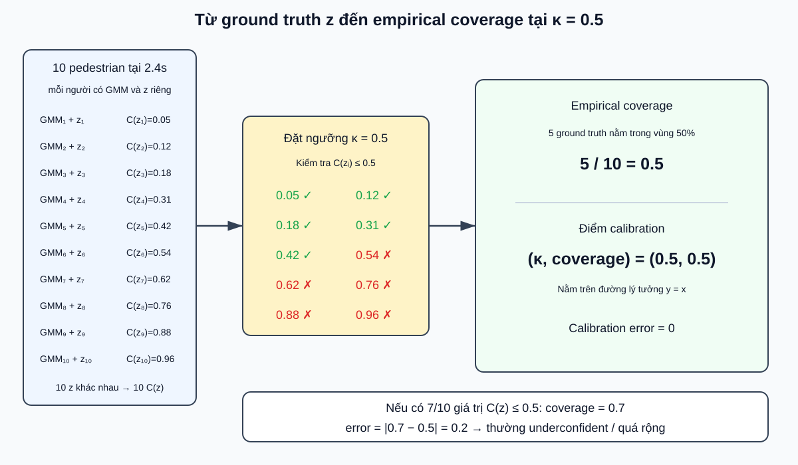

# Confidence và calibration trong mô hình MDN/GMM

Tài liệu này giải thích riêng các ký hiệu:

```text
z, C(z), κ và empirical coverage
```

Đây là các khái niệm được dùng khi tính reliability trong `base_mdn/eval.py` và `base_mdn/vis.py`.

## 1. Bức tranh tổng quát



Luồng chính:

```text
Mỗi pedestrian
→ có một GMM dự đoán riêng tại timestep đang xét
→ có một ground truth z riêng
→ tính một giá trị C(z)

Qua nhiều pedestrian
→ đếm tỷ lệ C(z) <= κ
→ empirical coverage tại mức κ
```

Điểm quan trọng:

> Mười giá trị `C(z)` là của mười ground truth khác nhau, thuộc mười pedestrian/GMM khác nhau; không phải một ground truth có mười confidence.

---

## 2. `z` là gì?

`z` là một vị trí ground truth hai chiều tại một timestep cụ thể:

```text
z = (x_true, y_true)
```

Ví dụ, với pedestrian số 3 tại `2.4s`:

```text
z_3 = (2.3, 1.4)
```

Trong code, nó tương ứng với:

```python
target[b, t]
```

Trong đó:

```text
b = pedestrian thứ b trong dataset/batch
t = horizon đang xét
```

Nếu đang xét 10 pedestrian tại cùng horizon `2.4s`, ta có:

```text
Pedestrian 1  → GMM_1  → ground truth z_1
Pedestrian 2  → GMM_2  → ground truth z_2
...
Pedestrian 10 → GMM_10 → ground truth z_10
```

Mỗi pedestrian có lịch sử chuyển động khác nhau nên model tạo ra GMM khác nhau.

---

## 3. `C(z)` là gì?

`C(z)` là giá trị confidence của điểm `z` đối với GMM tương ứng.

Code xấp xỉ nó bằng Monte Carlo:

```text
             số sample Z có p(Z) > p(z)
C(z) ≈       ───────────────────────────
                   tổng số sample
```

Repository thường lấy 1000 sample:

```text
             số sample có mật độ cao hơn z
C(z) ≈       ────────────────────────────
                         1000
```

Trong code:

```python
gt_log_prob = gmm.log_prob(target)
samples = gmm.sample(torch.Size([1000]))
samples_log_prob = gmm.log_prob(samples)
idx_mask = (samples_log_prob > gt_log_prob).float()
conf = torch.sum(idx_mask, dim=0) / 1000
```

### Ví dụ

Giả sử ground truth có:

```text
p(z) = 0.12
```

Để dễ tính, chỉ lấy 5 sample:

| Sample | `p(sample)` | Có lớn hơn `p(z)=0.12`? | Mask |
|---:|---:|---|---:|
| 1 | 0.40 | Có | 1 |
| 2 | 0.20 | Có | 1 |
| 3 | 0.10 | Không | 0 |
| 4 | 0.05 | Không | 0 |
| 5 | 0.30 | Có | 1 |

Khi đó:

```text
C(z) = (1 + 1 + 0 + 0 + 1) / 5 = 0.6
```

Nghĩa là 60% sample lấy từ GMM có mật độ cao hơn mật độ tại ground truth `z`.

### Cách đọc `C(z)`

```text
C(z) gần 0
→ rất ít sample có mật độ cao hơn z
→ z nằm ở vùng mật độ cao, thường gần mode

C(z) gần 1
→ phần lớn sample có mật độ cao hơn z
→ z nằm ở vùng mật độ thấp, gần đuôi phân phối
```

`C(z)` không phải khoảng cách mét và cũng không phải probability chính xác rằng dự đoán đúng. Nó là **thứ hạng mật độ** của `z` trong phân phối GMM.

---

## 4. `κ` là gì?

Ký hiệu `κ` đọc là **kappa**. Đây là ngưỡng confidence do người đánh giá chọn.

Ví dụ:

```text
κ = 0.50 → xét vùng confidence 50%
κ = 0.68 → xét vùng confidence 68%
κ = 0.95 → xét vùng confidence 95%
```

`κ` không phải:

- số Gaussian;
- số sample;
- timestep;
- một tham số model học được.

Vùng confidence mức `κ` được định nghĩa:

```text
R_κ = {z : C(z) <= κ}
```

Đọc bằng lời:

> Vùng confidence `κ` chứa những điểm có `C(z)` nhỏ hơn hoặc bằng `κ`.

Ví dụ với `κ = 0.5`:

```text
C(z) = 0.31 <= 0.5 → z nằm trong vùng 50%
C(z) = 0.76 > 0.5  → z nằm ngoài vùng 50%
```

Vùng 95% thường bao quanh vùng 68%, và vùng 68% thường bao quanh vùng 50%:

```text
          vùng 95%
    ┌───────────────────┐
    │      vùng 68%     │
    │   ┌───────────┐   │
    │   │ vùng 50%  │   │
    │   │   mode ●  │   │
    │   └───────────┘   │
    └───────────────────┘
```

Với GMM đa mode, các vùng này có thể gồm nhiều “đảo” rời nhau chứ không nhất thiết là một ellipse.

---

## 5. Empirical coverage là gì?

“Empirical” nghĩa là đo từ dữ liệu thực tế.

Tại một horizon và một mức `κ`, empirical coverage là:

```text
                         số ground truth có C(z) <= κ
empirical coverage(κ) =  ────────────────────────────
                              tổng số ground truth
```

Hay nói đơn giản:

> Trong dữ liệu thực tế, có bao nhiêu phần trăm ground truth nằm trong vùng confidence `κ` của GMM tương ứng?

### Ví dụ 10 pedestrian tại cùng một horizon

Giả sử tại `2.4s` ta có:

```text
C(z_1)  = 0.05
C(z_2)  = 0.12
C(z_3)  = 0.18
C(z_4)  = 0.31
C(z_5)  = 0.42
C(z_6)  = 0.54
C(z_7)  = 0.62
C(z_8)  = 0.76
C(z_9)  = 0.88
C(z_10) = 0.96
```

Xét:

```text
κ = 0.5
```

Năm giá trị đầu thỏa mãn `C(z) <= 0.5`, nên:

```text
empirical coverage(0.5)
= 5 / 10
= 0.5
```

Điểm trên calibration curve là:

```text
(κ, empirical coverage) = (0.5, 0.5)
```

Nó nằm đúng trên đường lý tưởng `y=x`.

---

## 6. Calibration tốt nghĩa là gì?

Nếu model được calibration tốt:

```text
empirical coverage(κ) ≈ κ
```

Hay:

```text
P(C(z) <= κ) ≈ κ
```

Đọc bằng lời:

> Vùng mà model gọi là vùng `κ%` phải thực sự chứa xấp xỉ `κ%` ground truth trong dữ liệu.

Ví dụ:

```text
Vùng 10%  → chứa khoảng 10% ground truth
Vùng 50%  → chứa khoảng 50% ground truth
Vùng 68%  → chứa khoảng 68% ground truth
Vùng 95%  → chứa khoảng 95% ground truth
```

Code đánh giá điều này riêng tại mỗi horizon:

```text
0.8s, 1.6s, 2.4s, 3.2s, 4.0s, 4.8s
```

---

## 7. Nếu vùng 50% chứa 70% ground truth thì sao?

Giả sử có 10 pedestrian, và 7 ground truth thỏa mãn:

```text
C(z_i) <= 0.5
```

Khi đó:

```text
empirical coverage = 7/10 = 0.7
```

Sai lệch calibration:

```text
|empirical coverage - κ|
= |0.7 - 0.5|
= 0.2
```

Điểm calibration là:

```text
(0.5, 0.7)
```

Nghĩa là:

```text
Model gọi đây là vùng 50%
nhưng vùng đó chứa 70% ground truth thực tế.
```

Điều này thường cho thấy model **underconfident** hoặc phân phối dự đoán quá rộng so với sai số thực tế.

### Tại sao `C(z)` thấp nhưng phân phối vẫn có thể rộng?

Hai đại lượng nói về hai điều khác nhau:

```text
C(z)
→ vị trí tương đối của ground truth trong phân phối

Diện tích vùng / sharpness
→ phân phối rộng bao nhiêu mét vuông
```

Một ground truth có thể nằm gần mode của một phân phối rất rộng:

```text
sigma rất lớn
→ vùng GMM rất rộng

ground truth vẫn gần mode
→ C(z) vẫn thấp
```

Do đó không có mâu thuẫn giữa:

```text
ground truth thường nằm gần mode
```

và:

```text
phân phối rộng hơn mức cần thiết.
```

“Quá rộng” là cách giải thích thường gặp chứ không phải nguyên nhân duy nhất. Với GMM, calibration sai còn có thể do `pi`, vị trí mode, covariance hoặc cấu trúc đa mode không phù hợp.

---

## 8. Nếu vùng 50% chỉ chứa 30% ground truth thì sao?

```text
κ = 0.5
empirical coverage = 0.3
error = |0.3 - 0.5| = 0.2
```

Model gọi đây là vùng 50%, nhưng chỉ 30% ground truth nằm trong đó. Phân phối thường quá hẹp hoặc model quá tự tin:

```text
Model: “Tôi tin ground truth nằm trong vùng nhỏ này.”
Thực tế: nhiều ground truth rơi ra ngoài vùng.
```

Trường hợp này thường được gọi là **overconfident**.

---

## 9. Ba trường hợp cần nhớ

| `κ` | Empirical coverage | Diễn giải |
|---:|---:|---|
| 0.50 | 0.50 | Calibrated tốt tại mức này |
| 0.50 | 0.70 | Coverage cao hơn danh nghĩa; thường underconfident/quá rộng |
| 0.50 | 0.30 | Coverage thấp hơn danh nghĩa; thường overconfident/quá hẹp |

Code tính error bằng:

```text
error(κ) = |empirical coverage(κ) - κ|
```

Nó dùng nhiều giá trị `κ`, không chỉ `0.5`, rồi tổng hợp thành `Ravg` và `Rmin`.

---

## 10. `C(z)` càng thấp có phải càng tốt không?

### Với một ground truth riêng lẻ

```text
C(z) thấp
→ ground truth nằm ở vùng mật độ cao của GMM
```

Điều này thường thuận lợi cho sample đó.

### Với toàn bộ dataset

Không phải mọi `C(z)` càng thấp càng tốt. Điều cần đạt là:

```text
P(C(z) <= κ) ≈ κ
```

Nói cách khác, các `C(z)` qua nhiều ground truth cần tạo ra calibration curve gần đường `y=x`.

Để đánh giá model đầy đủ cần đọc đồng thời:

```text
Reliability: xác suất có calibrated không?
Sharpness:   vùng dự đoán có gọn không?
ADE/FDE:     vị trí dự đoán có gần ground truth không?
```

---

## 11. Code có tự calibration lại model không?

Repository có **đo calibration**:

```text
build_confidence_set_mdn()
→ tạo C(z)

plot_reliability_calibration()
→ tạo empirical coverage
→ so sánh với đường y=x
→ tính Ravg và Rmin
```

Nhưng repository không có bước post-hoc calibration để sửa lại `pi`, `sigma` hoặc GMM sau training.

NLL trong quá trình train giúp model học phân phối xác suất, nhưng không bảo đảm calibration hoàn hảo. Vì vậy reliability vẫn cần được đo riêng trên validation/test.

---

## 12. Tóm tắt ký hiệu

| Ký hiệu | Ý nghĩa |
|---|---|
| `z` | Một ground-truth point `(x_true,y_true)` tại một horizon |
| `p(z)` | Mật độ của GMM tại ground truth `z` |
| `C(z)` | Tỷ lệ sample từ GMM có mật độ cao hơn `p(z)` |
| `κ` | Ngưỡng confidence đang kiểm tra, ví dụ `0.5`, `0.68`, `0.95` |
| `C(z) <= κ` | Ground truth nằm trong vùng confidence `κ` |
| Empirical coverage | Tỷ lệ ground truth trong dataset có `C(z) <= κ` |
| Calibration tốt | `empirical coverage(κ) ≈ κ` |

Câu quan trọng nhất:

> Với một ground truth, `C(z)` cho biết nó nằm ở mức mật độ nào trong GMM. Qua nhiều ground truth, empirical coverage cho biết vùng confidence của model có bao phủ đúng tỷ lệ mà model tuyên bố hay không.
