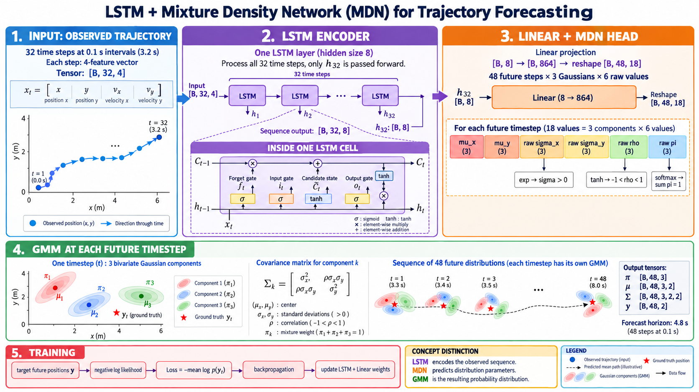
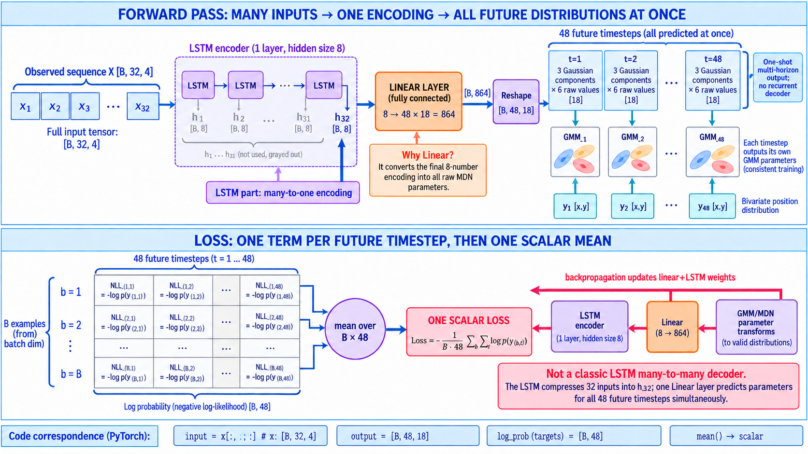
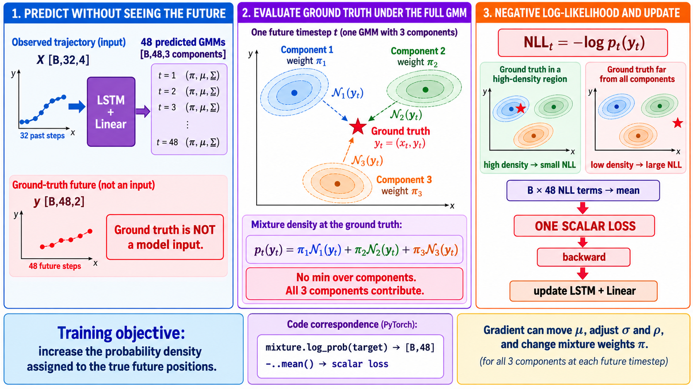

# LSTM–MDN/GMM visual guide



## LSTM, Linear và Loss nằm ở đâu?



Luồng forward của đúng implementation hiện tại là:

```text
32 vector quan sát
X [B, 32, 4]
      |
      v
LSTM encoder
lstm_out [B, 32, 8]
      |
      | chỉ lấy lstm_out[:, -1, :] = h_32
      v
h_32 [B, 8]
      |
      v
Linear/Fully Connected: 8 -> 864
raw output [B, 864]
      |
      v
reshape [B, 48, 18]
      |
      v
MDN parameter transforms
      |
      v
48 GMM hai chiều, mỗi GMM có 3 Gaussian
      |
      | so sánh xác suất với target y [B, 48, 2]
      v
NLL theo từng sample và timestep [B, 48]
      |
      | mean trên B x 48 phần tử
      v
một scalar loss
      |
      v
backpropagation qua MDN transforms -> Linear -> LSTM
```

### Tại sao cần lớp Linear?

LSTM không trực tiếp tạo các tham số GMM. Sau khi đọc hết 32 timestep, nó tóm tắt chuỗi quan sát thành vector cuối:

```text
h_32 [B, 8]
```

Nhưng model cần dự đoán:

```text
48 timestep x 3 Gaussian x 6 raw parameters = 864 values
```

Do đó lớp Linear học phép biến đổi affine:

```text
z = h_32 W^T + b

[B, 8] -> [B, 864]
```

Trong code, lớp này là:

```python
self.fc = nn.Linear(
    in_features=self.lstm_hidden_size,              # 8
    out_features=self.output_size*self.forecast_horizon  # 18*48 = 864
)
```

`Linear` có trọng số và bias được học trong training. Với cấu hình này, riêng lớp Linear có:

```text
864 x 8 + 864 = 7,776 tham số
```

Sau Linear, code chỉ reshape 864 giá trị thành `[B,48,18]`. Reshape không học tham số mới.

MDN trong repository này cũng không phải một `nn.Module` riêng đứng sau Linear. Tên **MDN head** chỉ toàn bộ ý tưởng:

```text
Linear tạo raw values
-> exp(raw_sigma)
-> tanh(raw_rho)
-> softmax(raw_pi)
-> dựng GMM hợp lệ
```

### Đây là many-to-one hay many-to-many?

Câu trả lời chính xác cần tách hai phần:

- **Phần LSTM encoder là many-to-one:** nó nhận 32 input timestep nhưng chỉ `h_32` được đưa vào Linear. Các output `h_1 ... h_31` không được đưa trực tiếp vào head.
- **Toàn model tạo nhiều output horizon cùng lúc:** từ một vector `h_32`, Linear sinh tham số cho cả 48 timestep tương lai trong một lần forward.

Vì vậy cách gọi sát implementation nhất là:

```text
many-to-one LSTM encoder
+ one-shot multi-horizon probabilistic output
```

Nó **không phải** kiến trúc many-to-many LSTM encoder-decoder cổ điển, vì không có LSTM decoder chạy lặp 48 lần và không đưa prediction của bước trước vào bước sau.

Điều này cũng có nghĩa 48 phân phối được sinh đồng thời từ cùng `h_32`; code hiện tại không tạo quan hệ autoregressive trực tiếp giữa các timestep tương lai.

### Một loss hay 48 loss?

Cả hai cách nói đều đúng nếu phân biệt trước và sau phép `mean`.

Trước tiên, với mỗi sample `b` và future timestep `t`, model tính một số hạng:

```text
NLL_(b,t) = -log p(y_(b,t) | X_b)
```

Trong đó `p(y_(b,t) | X_b)` là mật độ xác suất do GMM ba thành phần tại timestep `t` gán cho tọa độ ground truth `y_(b,t)`.

Với batch size `B` và 48 future timestep:

```python
mixture.log_prob(target)
```

trả về tensor:

```text
[B, 48]
```

Tức là có `B x 48` log-probability, hay `B x 48` số hạng loss cục bộ. Sau đó code gọi:

```python
params_loss = -mixture.log_prob(target).mean()
```

nên loss dùng cho `backward()` là một scalar:

```text
Loss = -(1 / (B x 48))
       x sum_b sum_t log p(y_(b,t) | X_b)
```

Do đó:

- có một NLL contribution cho mỗi sample và mỗi future timestep;
- chúng được lấy trung bình thành **một loss duy nhất cho batch**;
- code chỉ gọi `loss.backward()` một lần cho batch;
- gradient từ tất cả 48 timestep cùng đóng góp vào cập nhật Linear và LSTM.

Không có 48 lần `optimizer.step()` cho 48 timestep. Training loop thực hiện:

```text
forward toàn batch
-> tạo toàn bộ 48 GMM
-> mean toàn bộ B x 48 NLL
-> một backward
-> một optimizer.step
```

### Loss của một epoch

Trainer lưu scalar loss của từng batch vào `train_loss_list`, sau đó tính:

```python
train_loss = mean(train_loss_list)
```

Vì vậy có hai cấp trung bình:

```text
Cấp 1: mean B x 48 phần tử -> một batch loss
Cấp 2: mean các batch loss -> train loss của epoch
```

Các batch thường có cùng kích thước 4096; batch cuối có thể nhỏ hơn. Cấp 2 hiện lấy trung bình đều theo batch, không weighting lại theo số sample của batch cuối. Đây là hành vi thực tế của code, không phải thay đổi được đề xuất.

## Ground truth tham gia vào NLL loss như thế nào?



### Kết luận trước

Ground truth `y` **có xuất hiện trực tiếp trong training loss**, nhưng **không được đưa vào LSTM để tạo prediction**.

```text
X quá khứ -> LSTM + Linear -> 48 GMM dự đoán
                                  |
y tương lai ground truth ----------+-> NLL loss
```

Hai luồng dữ liệu có vai trò khác nhau:

- `X [B,32,4]` là input của model;
- `y [B,48,2]` là đáp án dùng để chấm output của model;
- model phải dự đoán chỉ từ `X`, không được nhìn `y` trước;
- sau khi prediction đã được tạo, `y` mới được đưa vào hàm NLL.

Trong training loop:

```python
inputs = torch.tensor(train_data_X[...])
targets = torch.tensor(train_data_y[...])

outputs = self.model(inputs)       # model chỉ nhận inputs
loss, diverged = self.loss_fn(
    outputs,
    targets                       # ground truth chỉ đi vào loss
)
```

### Xét một sample và một future timestep

Tại timestep tương lai `t`, target là một tọa độ thật:

```text
y_t = (x_t, y_t)
```

Model tạo **một GMM gồm ba Gaussian hai chiều**:

```text
p_t(z) = pi_1 N_1(z) + pi_2 N_2(z) + pi_3 N_3(z)
```

Để tính loss, ta đặt tọa độ thật `y_t` vào hàm mật độ này:

```text
p_t(y_t)
= pi_1 N_1(y_t)
+ pi_2 N_2(y_t)
+ pi_3 N_3(y_t)
```

Ý nghĩa từng phần:

- `N_k(y_t)` là mật độ mà Gaussian component `k` gán cho vị trí thật;
- `pi_k` là trọng số của component đó;
- tổng ba thành phần là mật độ của **toàn bộ GMM** tại ground truth.

Sau đó NLL tại timestep này là:

```text
NLL_t = -log p_t(y_t)
```

Nếu ground truth nằm trong vùng mật độ cao:

```text
p_t(y_t) lớn -> log p_t(y_t) lớn -> -log p_t(y_t) nhỏ
```

Nếu ground truth nằm xa các component:

```text
p_t(y_t) nhỏ -> log p_t(y_t) rất âm -> -log p_t(y_t) lớn
```

Vì vậy optimizer giảm NLL cũng chính là khuyến khích model tăng mật độ tại các vị trí tương lai thật.

### Không chọn Gaussian có loss nhỏ nhất

Loss của repository **không** tính theo kiểu:

```text
min(-log N_1(y_t), -log N_2(y_t), -log N_3(y_t))
```

Nó cũng không chọn trước component có mean gần ground truth nhất. Công thức thật là:

```text
-log[pi_1 N_1(y_t) + pi_2 N_2(y_t) + pi_3 N_3(y_t)]
```

Cả ba component cùng tham gia vào mật độ mixture. Component nào vừa có mật độ cao tại ground truth vừa có `pi` lớn sẽ đóng góp nhiều hơn.

Ví dụ:

```text
pi_1 = 0.6, N_1(y_t) = 0.8
pi_2 = 0.3, N_2(y_t) = 0.1
pi_3 = 0.1, N_3(y_t) = 0.01

p_t(y_t)
= 0.6*0.8 + 0.3*0.1 + 0.1*0.01
= 0.511

NLL_t = -log(0.511) ~= 0.671
```

Gaussian 1 giải thích ground truth tốt nhất trong ví dụ này, nhưng Gaussian 2 và 3 vẫn có mặt trong tổng; code không dùng phép `min`.

### Từ một timestep đến toàn batch

PyTorch tính log-density cho từng sample và từng future timestep:

```python
log_probabilities = mixture.log_prob(target)
```

Shape:

```text
output GMM:       48 phân phối cho mỗi sample
target:           [B,48,2]
log_probabilities [B,48]
```

Mỗi ô `[b,t]` chứa:

```text
log p_(b,t)(y_(b,t))
```

Code sau đó thực hiện:

```python
params_loss = -mixture.log_prob(target).mean()
```

Tức là:

```text
Loss = -(1/(B*48)) sum_b sum_t log p_(b,t)(y_(b,t))
```

Kết quả là một scalar loss cho toàn batch. Scalar này được dùng cho một lần:

```python
loss.backward()
optimizer.step()
```

### Gradient có thể làm model thay đổi điều gì?

Khi ground truth có mật độ thấp, gradient đi ngược qua GMM parameterization, Linear và LSTM. Nó có thể khuyến khích model:

- dịch chuyển `mu_x, mu_y` của component hữu ích về vùng ground truth;
- điều chỉnh `sigma_x, sigma_y` để độ rộng phù hợp;
- điều chỉnh `rho` để hướng nghiêng của covariance ellipse phù hợp;
- tăng `pi` cho component giải thích dữ liệu tốt hơn;
- thay đổi hidden representation `h_32` do LSTM tạo ra.

Điều này không có nghĩa mọi Gaussian đều bị kéo thẳng đến cùng một ground truth với mức như nhau. Mức gradient của mỗi component phụ thuộc vào trọng số và mức độ component đó giải thích ground truth trong tổng mixture.

### Vì sao model không chỉ làm `sigma` thật lớn?

Gaussian rất rộng có thể bao phủ ground truth, nhưng probability density bị dàn trải trên vùng lớn. Khi đó mật độ ngay tại ground truth không nhất thiết cao. Ngược lại:

- Gaussian quá hẹp nhưng lệch ground truth -> NLL lớn;
- Gaussian quá rộng -> density bị loãng;
- mean và covariance phù hợp -> density tại ground truth cao hơn.

NLL vì vậy đồng thời tác động đến độ chính xác vị trí và độ rộng bất định.

### Liên hệ trực tiếp với source code

Trong `base_mdn/base_lstm.py`:

```python
mixture = build_mdn_distribution(output, num_gaussians)
params_loss = -mixture.log_prob(target).mean()
```

Có thể đọc hai dòng này thành câu:

> Dựng 48 GMM từ output của model; đo log-density mà từng GMM gán cho tọa độ ground truth tương ứng; đổi dấu và lấy trung bình trên toàn batch cùng 48 timestep.

Không có phép chọn Gaussian gần nhất và cũng không có ground truth đi vào forward của LSTM.

Tài liệu này minh họa pipeline trong cấu hình IMPTC hiện tại:

```text
X [B, 32, 4]
-> LSTM một lớp, hidden size 8
-> hidden output cuối h_32 [B, 8]
-> Linear [B, 864]
-> reshape [B, 48, 18]
-> giải mã tham số MDN
-> một GMM hai chiều gồm 3 Gaussian tại mỗi timestep tương lai
```

## Cách đọc hình

1. **Input:** 32 timestep quan sát, cách nhau 0.1 giây, tương ứng 3.2 giây lịch sử.
2. **LSTM encoder:** LSTM đọc tuần tự 32 vector đầu vào. Code chỉ chuyển output ở timestep cuối `h_32` sang lớp fully connected.
3. **Linear + MDN head:** lớp Linear sinh `48 x 3 x 6 = 864` raw values rồi reshape thành `[B, 48, 18]`.
4. **MDN decoding:** tại mỗi timestep, 18 giá trị được tách thành `mu_x`, `mu_y`, `raw_sigma_x`, `raw_sigma_y`, `raw_rho`, `raw_pi`, mỗi nhóm có 3 giá trị.
5. **GMM:** sau `exp`, `tanh` và `softmax`, mỗi timestep có 3 Gaussian hai chiều cùng trọng số mixture.
6. **Training:** negative log-likelihood đo xác suất mà GMM gán cho vị trí ground truth; gradient được lan truyền ngược để cập nhật LSTM và Linear.

## Các phương trình trong một LSTM cell

Hình inset trình bày luồng cổng. Dạng phương trình đầy đủ là:

```text
f_t       = sigmoid(W_f [h_(t-1), x_t] + b_f)
i_t       = sigmoid(W_i [h_(t-1), x_t] + b_i)
C_tilde_t = tanh(W_C [h_(t-1), x_t] + b_C)
C_t       = f_t * C_(t-1) + i_t * C_tilde_t
o_t       = sigmoid(W_o [h_(t-1), x_t] + b_o)
h_t       = o_t * tanh(C_t)
```

`*` ở đây là phép nhân theo từng phần tử. Cell state `C_t` giữ bộ nhớ dài hạn; hidden state `h_t` là biểu diễn được chuyển sang timestep tiếp theo. Trong model này, `h_32` là biểu diễn cuối được MDN head sử dụng.

## Tham số của một Gaussian hai chiều

Với Gaussian thứ `k` tại một timestep tương lai:

```text
mu_k = [mu_x, mu_y]

Sigma_k = [[sigma_x^2,               rho * sigma_x * sigma_y],
           [rho * sigma_x * sigma_y,               sigma_y^2]]
```

Các phép biến đổi trong code:

```text
sigma = exp(raw_sigma)   -> sigma > 0
rho   = tanh(raw_rho)    -> -1 < rho < 1
pi    = softmax(raw_pi)  -> pi_k >= 0 và tổng pi_k = 1
```

Tensor sau giải mã:

```text
pi         [B, 48, 3]
mu         [B, 48, 3, 2]
covariance [B, 48, 3, 2, 2]
target y   [B, 48, 2]
```

Điểm quan trọng: implementation tạo **một phân phối mixture hai chiều tại mỗi timestep tương lai**. Hình không biểu diễn một joint Gaussian mixture duy nhất cho toàn bộ quỹ đạo 48 bước.

## Ghi chú cần xác minh

- Hình minh họa bốn input feature là `(x, y, v_x, v_y)`. Config và model chỉ chứng minh input có kích thước 4; tên/ý nghĩa chính xác của bốn feature vẫn cần đối chiếu với dữ liệu pickle hoặc code preprocessing.
- Các mốc `3.3 s ... 8.0 s` trong hình là thời gian trên timeline gồm cả 3.2 giây quan sát. Forecast horizon riêng vẫn dài 4.8 giây.

## File code liên quan

- `base_mdn/configs/imptc/default_peds_imptc.json`: kích thước và hyperparameter.
- `base_mdn/base_lstm.py`: LSTM, Linear và NLL loss.
- `base_mdn/utils/mdn_distribution.py`: giải mã MDN và dựng GMM.
- `base_mdn/mdn.py`: vòng lặp training/validation.
- `base_mdn/eval.py`: sampling và evaluation từ phân phối dự đoán.
