# Hiểu sparsemax_mdn từ đầu: mô hình đang làm gì và khác base_mdn ở đâu?

Tài liệu dành cho người mới đọc mô hình, đối chiếu trực tiếp mã nguồn trong repo ngày 04/10/2026. **Ý chính: LSTM đọc quá khứ; MDN sinh các Gaussian cho tương lai; sparsemax quyết định Gaussian nào có trọng số dương ở từng bước.** Đây là thay đổi cách phân phối trọng số, không phải thuật toán tự thêm hoặc xóa neuron.

Tài liệu này chỉ đọc source và artifact đã có. Các hình mới được vẽ từ file dự đoán đã lưu; không huấn luyện, không chạy đánh giá mới trên test.

## Lộ trình đọc

1. Bài toán và dữ liệu.
2. LSTM, MDN và GMM: ba vai trò khác nhau.
3. Một Gaussian 2D và các tham số.
4. Softmax của baseline.
5. Sparsemax: trực giác, ví dụ và thuật toán.
6. Luồng code từ input đến phân phối.
7. NLL và gradient: mô hình học như thế nào?
8. K hoạt động, kích thước mạng và những giới hạn.
9. Cách đọc hình và kết quả thực tế.
10. Bản đồ source, từ điển và lời giải thích dùng trong thuyết trình.

**Quy ước hình:** “sơ đồ” giải thích cấu trúc; “minh họa tính toán” dùng số giả định; “artifact thật” đọc kết quả đã lưu. Hình minh họa không phải bằng chứng về độ chính xác.

## 1. Bài toán: biết quá khứ, dự đoán tương lai

Một người đi bộ có nhiều vị trí theo thời gian. Từ đoạn đã quan sát, mô hình cần dự đoán người đó có thể ở đâu trong những giây tiếp theo. Người có thể đi thẳng, đổi hướng hoặc giảm tốc, nên một đường duy nhất không diễn tả hết khả năng.

Cấu hình đang xét là [sparsemax_k16_peds_imptc.json](../../sparsemax_mdn/configs/imptc/sparsemax_k16_peds_imptc.json):

| Đại lượng | Giá trị | Ý nghĩa |
|---|---:|---|
| `max_input_horizon` | 32 | 32 bước quan sát |
| `lstm_input_shape` | 4 | 4 đặc trưng mỗi bước |
| `forecast_horizon` | 48 | 48 bước tương lai |
| `delta_t` | 0.1 s | Dữ liệu 10 Hz |
| `num_gaussians` | 16 | Trần số Gaussian mỗi bước |

Với batch gồm B mẫu, input có dạng `[B, 32, 4]`, target là `[B, 48, 2]`. Hai tọa độ đầu của input là vị trí x, y, phù hợp cách vẽ trong [vis.py](../../base_mdn/vis.py). Loader đọc `X` đã tiền xử lý từ pickle và lấy hai tọa độ đầu của `y`; bản thân loader không chứng minh ý nghĩa hai kênh input còn lại, vì vậy không nên tự gán tên cho chúng khi chưa đối chiếu bước tạo dataset.

Theo quy ước upstream, dữ liệu nằm trong hệ **human-ego-centric**: vị trí tại bước quan sát cuối là gốc, các vị trí khác được biểu diễn tương đối sau phép biến đổi tọa độ. Hình trong tài liệu giữ tọa độ đã lưu, không đổi sang tọa độ bản đồ.

Mô hình xuất **48 phân phối vị trí 2D**, thay vì chỉ 48 điểm. Mỗi phân phối trả lời: “Ở bước tương lai này, vị trí nào có mật độ xác suất cao?”

## 2. Phân biệt LSTM, MDN và GMM

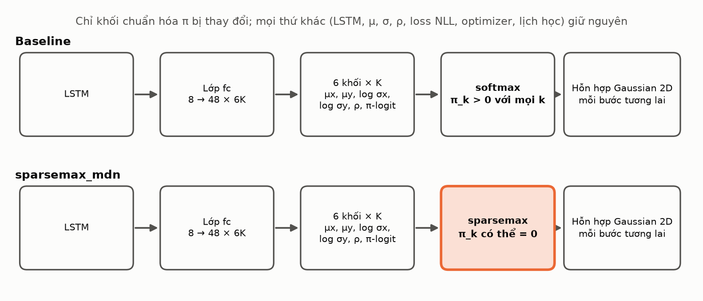

**Hình 1 — sơ đồ.** Hai nhánh dùng cùng loại LSTM và cùng cách tạo tham số; hàm chuẩn hóa trọng số khác nhau. Khi so K=3 với K=16, kích thước lớp đầu ra cũng khác.

**LSTM là bộ đọc chuỗi.** Nó xử lý các bước quan sát theo thứ tự để tạo trạng thái biểu diễn quá khứ. Code lấy `lstm_out[:, -1, :]`, tức trạng thái ở bước cuối, làm đầu vào lớp tuyến tính `fc`. LSTM không trực tiếp là phân phối Gaussian.

**MDN là đầu sinh tham số.** `fc` biến trạng thái LSTM thành các số dùng để xác định trọng số, tâm và hình dạng Gaussian. Trong code này, các bước tương lai được sinh cùng lúc từ trạng thái cuối, không có vòng lặp đưa dự đoán bước trước vào LSTM để sinh bước sau.

**GMM là phân phối đầu ra.** Sau giải mã các tham số, ta có tổng có trọng số của nhiều Gaussian. Nó không phải một GMM độc lập được fit bằng EM: tham số phụ thuộc quỹ đạo đầu vào và được mạng học bằng backpropagation.

Một cách đọc ngắn:

```text
Quá khứ X → LSTM → trạng thái h cuối
          → fc → tham số của 48 bước
          → giải mã → GMM 2D tại từng bước t
```

## 3. Một Gaussian 2D gồm những gì?

Một Gaussian mô tả vị trí y=(x,y) bằng tâm và độ phân tán:

| Tham số | Vai trò |
|---|---|
| `mu_x`, `mu_y` | Tâm của Gaussian |
| `sigma_x`, `sigma_y` | Độ lệch chuẩn theo hai trục |
| `rho` | Tương quan giữa hai tọa độ, ảnh hưởng độ nghiêng |
| `pi` / `alpha` | Trọng số Gaussian trong hỗn hợp |

Theo [decode_mdn_output](../../base_mdn/utils/mdn_distribution.py), tham số thô được đổi thành:

$$\sigma_x=\exp(s_x),\quad \sigma_y=\exp(s_y),\quad \rho=\tanh(r).$$

Ma trận hiệp phương sai là:

$$\Sigma_k=\begin{bmatrix}\sigma_{x,k}^2 & \rho_k\sigma_{x,k}\sigma_{y,k}\\\rho_k\sigma_{x,k}\sigma_{y,k}&\sigma_{y,k}^2\end{bmatrix}.$$

Đây là công thức **legacy đang chạy trong source**, không suy ra từ ký hiệu của paper. Trong số học thực, exp cho sigma dương và tanh cho rho trong (-1,1); số thực máy vẫn có thể tràn hoặc bão hòa, nên phân phối có thể lỗi số học.

Tại một bước tương lai t:

$$p(y_t\mid X)=\sum_{k=1}^{K_{\max}}\pi_{t,k}(X)\,\mathcal N_2(y_t;\mu_{t,k}(X),\Sigma_{t,k}(X)).$$

Trọng số không âm và tổng bằng 1. `pi=0.6` nghĩa Gaussian đó chiếm 60% khối lượng trộn; không có nghĩa đúng 60% khả năng người sẽ nằm tại chính tâm. Vị trí liên tục được mô tả bằng **mật độ**; xác suất một vùng cần tích phân mật độ trên vùng đó.

## 4. Baseline dùng softmax như thế nào?

Lớp `fc` sinh K số z gọi là **logit trọng số**. Chúng chưa phải xác suất: có thể âm, dương và không có tổng cố định. Decoder baseline đổi chúng bằng:

$$\pi_k=\frac{e^{z_k}}{\sum_j e^{z_j}}.$$

Softmax cho mọi trọng số dương trong toán học. Một logit thấp tạo trọng số rất nhỏ, nhưng chưa bằng 0. Trong số thực máy, giá trị cực nhỏ vẫn có thể underflow về 0; đó không phải cơ chế sparsity chủ đích của softmax.

Baseline đã có trọng số phụ thuộc mẫu và bước; nó không bắt buộc mọi Gaussian có trọng số bằng nhau. Khác biệt của sparsemax là tạo **số 0 chính xác một cách có cấu trúc**.

## 5. Sparsemax: chỉ dành trọng số cho các logit vượt ngưỡng

Sparsemax là phép chuẩn hóa đã được Martins và Astudillo công bố tại ICML 2016. Công trình gốc giới thiệu phép biến đổi có thể sinh xác suất thưa và dùng trong mạng học bằng gradient. Xem [bài báo gốc](https://proceedings.mlr.press/v48/martins16.html). Việc áp dụng nó vào MDN trong repo không tự chứng minh đây là ý tưởng mới trong nghiên cứu.

Trong triển khai này:

$$\pi_k=\max(z_k-\tau,0),\qquad \sum_k\pi_k=1.$$

Ngưỡng tau không do người dùng đặt cố định. Nó được tính riêng cho **mỗi mẫu và mỗi bước**, sao cho tổng trọng số bằng 1. Logit dưới ngưỡng bị đưa về 0; logit trên ngưỡng giữ phần vượt ngưỡng.

### 5.1. Ví dụ tự tính được

Cho `z = [2.0, 1.4, 0.5, 0.0, -0.5, -1.0]`.

1. Các số đã được sắp giảm dần.
2. Một phần tử đầu: `1 + 1×2.0 > 2.0`, đúng.
3. Hai phần tử đầu: `1 + 2×1.4 > 3.4`, đúng.
4. Ba phần tử đầu: `1 + 3×0.5 > 3.9`, sai. Các phần tử sau cũng không đạt.
5. Support có 2 phần tử; `tau = (2.0 + 1.4 - 1)/2 = 1.2`.
6. Trừ ngưỡng và chặn tại 0: `pi = [0.8, 0.2, 0, 0, 0, 0]`.

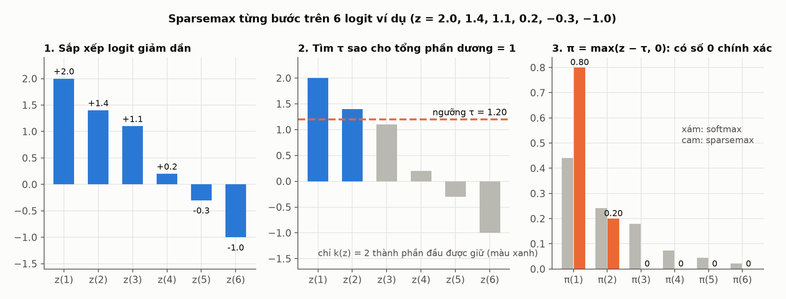

**Hình 2 — minh họa tính toán.** Chú ý sparsemax không phải “lấy top-2”: số 2 là kết quả của logit trong ví dụ. Mẫu khác có thể dùng 1, 4 hoặc nhiều thành phần.

Nếu mọi logit bằng nhau, sparsemax cho phân phối đều, tức **không có thành phần nào bị tắt**. Sparsemax cho phép thưa; không bảo đảm luôn thưa hay luôn cho K tối ưu.

### 5.2. Góc nhìn hình học

$$\operatorname{sparsemax}(z)=\arg\min_{p\in\Delta^{K-1}}\|p-z\|_2^2,\quad\Delta^{K-1}=\{p:p_k\ge0,\sum_kp_k=1\}.$$

Simplex là tập các vector trọng số hợp lệ. Với K=3, nó là tam giác: trong lòng có cả ba trọng số dương, trên cạnh có một số 0, tại đỉnh có hai số 0.

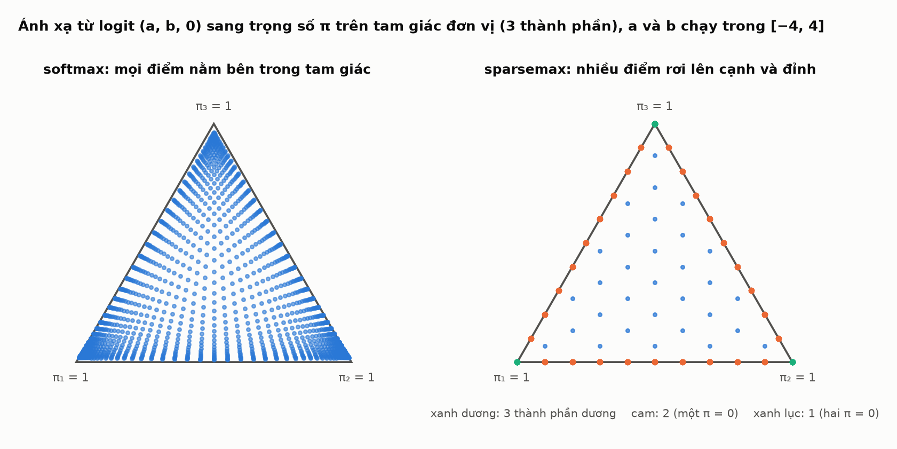

**Hình 3 — minh họa tính toán.** Sparsemax có thể chiếu lên cạnh và đỉnh. Tỉ lệ số 0 trong hình chỉ mô tả lưới logit minh họa, không phải tỉ lệ của dataset.

### 5.3. Thuật toán trong sparsemax.py

[sparsemax.py](../../sparsemax_mdn/sparsemax.py) thực hiện lần lượt: chuyển chiều cần chuẩn hóa về cuối; trừ logit lớn nhất để cải thiện số học; sort giảm dần; cumsum; kiểm tra `1 + k*z_sorted > cumsum`; lấy số phần tử thỏa điều kiện; tính tau; `clamp(z-tau, min=0)`; trả lại thứ tự chiều tensor.

Trừ một hằng số chung không đổi kết quả sparsemax. Việc sort chỉ dùng tìm ngưỡng; đầu ra cuối vẫn tương ứng các chỉ số Gaussian ban đầu.

## 6. Từ input đến đầu ra: đọc đúng kích thước và thứ tự

[LSTM_Trajectory_Forecast](../../base_mdn/base_lstm.py) có hidden size 8 và một lớp LSTM. Với K=16:

```text
X                         [B, 32, 4]
LSTM output               [B, 32, 8]
Trạng thái cuối           [B, 8]
fc                        [B, 4608]       4608 = 48 × 6 × 16
reshape                   [B, 48, 96]     96 = 6 × 16
```

**96 số được chia theo khối**, không phải nhóm sáu số liền nhau cho từng Gaussian:

| Slice tại một bước | Nội dung |
|---|---|
| `0:16` | 16 mu_x |
| `16:32` | 16 mu_y |
| `32:48` | 16 log sigma_x |
| `48:64` | 16 log sigma_y |
| `64:80` | 16 rho_pre |
| `80:96` | 16 logit trọng số ban đầu |

[SparsemaxMDN.forward](../../sparsemax_mdn/model.py) kế thừa forward baseline, giữ nguyên 5 khối đầu và biến đổi khối cuối:

```python
raw = super().forward(x)
pi = sparsemax(raw[..., 5*k:], dim=-1)
log_pi = torch.where(pi > 0,
                     torch.log(pi.clamp_min(1e-30)),
                     torch.full_like(pi, -1e9))
return torch.cat([raw[..., :5*k], log_pi], dim=-1)
```


**Hình 4 — sơ đồ.** Decoder chung vẫn gọi softmax. Với trọng số dương, `softmax(log(pi))` khôi phục pi nếu tổng pi bằng 1; ở vị trí 0, sentinel -1e9 khiến exp underflow về 0 trong float32. Kết quả có sai số làm tròn nhỏ ở các trọng số dương.

Vì vậy không nên đọc code rồi kết luận “mô hình vẫn dùng softmax nên sparsemax vô tác dụng”. Softmax ở decoder đóng vai trò **khôi phục trọng số đã được sparsemax tính trước đó**. Khối cuối của đầu ra model lúc này không còn là logit fc gốc; nó chứa log trọng số đã biến đổi.

Các tensor giải mã có dạng:

```text
pi          [B, 48, 16]
mu, sigma   [B, 48, 16, 2]
rho         [B, 48, 16]
covariance  [B, 48, 16, 2, 2]
```

## 7. Mô hình học bằng NLL, không có nhãn “dùng bao nhiêu Gaussian”

Target chỉ là vị trí tương lai thật. Không có target K, không có nhãn Gaussian nào phải hoạt động.

$$\mathcal L=-\frac1{BH}\sum_{b=1}^{B}\sum_{t=1}^{H}\log\left[\sum_k\pi_{b,t,k}\mathcal N_2(y_{b,t};\mu_{b,t,k},\Sigma_{b,t,k})\right].$$

NLL thấp nghĩa mô hình đặt mật độ cao hơn tại các vị trí thật. NLL có thể âm vì mật độ liên tục có thể lớn hơn 1; đây không phải lỗi “xác suất vượt 100%”. NLL tốt cũng chưa đủ chứng minh reliability hay sai số quỹ đạo tốt.

### 7.1. Vì sao cần loss riêng?

Baseline tạo `Categorical(probs=pi)` rồi dùng `MixtureSameFamily`. Trong đường tính log-prob của PyTorch, xác suất 0 có thể được kẹp về epsilon trước khi lấy log. Gaussian lẽ ra bị tắt vẫn có thể đóng góp rất nhỏ, đặc biệt đáng kể nếu mật độ của nó tại ground truth cực lớn.

[loss.py](../../sparsemax_mdn/loss.py) tính trực tiếp:

```text
log_N = log mật độ từng Gaussian tại target
log_pi = log(pi) nếu pi > 0, ngược lại là -inf
loss = -mean(logsumexp(log_pi + log_N))
```

`logsumexp` giúp cộng mật độ trong miền log ổn định hơn. `clamp_min(1e-30)` trước log tránh lỗi backward ở nhánh bị che; nó không gán trọng số dương cho thành phần pi=0 vì nhánh đó được thay bằng -inf.

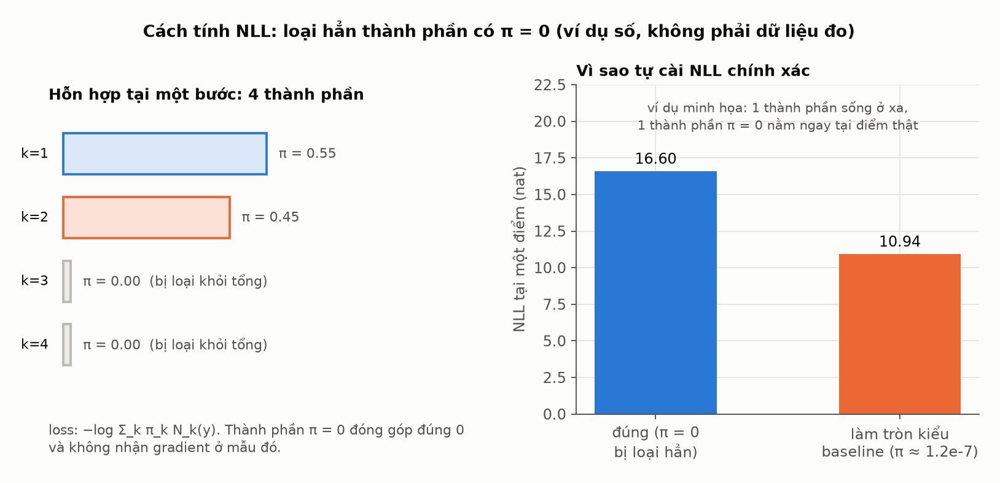

**Hình 5 — ví dụ số giả định.** Hàm mục tiêu vẫn là NLL hỗn hợp; không thêm penalty L1, entropy hay loss sparsemax phân loại của bài báo gốc. Khác biệt là tính đúng đóng góp bằng 0.

### 7.2. Gradient và “thành phần bị tắt”

Trong một vùng support không đổi, sparsemax có đạo hàm:

$$\frac{\partial\pi_i}{\partial z_j}=\begin{cases}\delta_{ij}-1/|S|,&i,j\in S,\\0,&\text{còn lại},\end{cases}\quad S=\{k:\pi_k>0\}.$$

Các Gaussian đang hoạt động chia sẻ ảnh hưởng qua chuẩn hóa. Gaussian có pi=0 không nhận gradient từ đóng góp mật độ của nó tại **mẫu và bước đang xét**. Tại ranh giới support, phép biến đổi có điểm không trơn; autograd xử lý theo các phép toán trong code.

“Tắt tại một mẫu” không có nghĩa “bị xóa khỏi mạng”. Thành phần có thể hoạt động với mẫu khác hoặc bước khác. Cập nhật tham số dùng chung cũng có thể làm nó đổi trạng thái ở lần forward sau. Nếu support chỉ còn một thành phần, trọng số của nó bằng 1 và gradient cục bộ theo logit bằng 0, trong khi tâm và covariance của Gaussian đó vẫn có thể học.

Một lưu ý thực tế: loss vẫn tạo và kiểm tra phân phối cho **tất cả** Gaussian trước khi mask. Một covariance lỗi của Gaussian pi=0 vẫn có thể khiến loss báo `diverged`; mask không bỏ qua mọi lỗi số học của thành phần bị tắt.

## 8. “Tự chọn K” thực sự nghĩa là gì?

$$K(X,t)=\sum_{k=1}^{K_{\max}}\mathbf1[\pi_k(X,t)>0].$$

K_max=16 là số slot mà mạng luôn sinh. K(X,t) là số slot có trọng số dương tại một mẫu và một bước. K trung bình 3.98 không có nghĩa mạng chỉ còn 3.98 Gaussian về cấu trúc.

| Câu nói | Diễn giải chính xác |
|---|---|
| “Mô hình tự chọn K” | Support trọng số thay đổi theo đầu vào và bước |
| “Gaussian k bị tắt” | pi_k=0 ở vị trí đang xét |
| “Không có thành phần chết” | Mỗi chỉ số có hoạt động ít nhất một lần trên tập được kiểm tra |
| “Không thêm tham số” | Sparsemax không có tham số học thêm **khi giữ cùng K** |
| “K nhỏ hơn nên chạy nhanh hơn” | Chưa được chứng minh; fc và loss vẫn tính đủ K_max |

Đặc biệt, run sparsemax có K_max=16 còn baseline chính có K=3. LSTM giữ cùng cấu trúc, nhưng `fc` lớn hơn: số tham số theo cấu hình này là **41,920** so với **8,224**. Vì vậy so sánh này thay đổi cả hàm chuẩn hóa lẫn dung lượng đầu ra. Muốn tách riêng tác động của sparsemax, đối chứng softmax cùng K=16 sẽ hữu ích; chưa có đối chứng đó trong phần kết quả đang dùng.

Trọng số 0 cũng không khiến phân phối vị trí có các vùng mật độ bằng 0: các Gaussian còn hoạt động vẫn có đuôi trên toàn mặt phẳng khi covariance hợp lệ. “Sparse” nói về **vector trọng số**, không phải bản đồ tọa độ bị cắt thành các ô rỗng.

K hoạt động không phải số hướng hành vi vật lý. Hai Gaussian có thể chồng lên nhau và cùng tạo một đỉnh mật độ. Chỉ số k ở bước t cũng chưa được bảo đảm là cùng hành vi với chỉ số k ở bước t+1.

## 9. Đọc dự đoán thật bằng hình

### 9.1. Quỹ đạo nào đang được vẽ?

Một GMM không tự có “một đường dự đoán duy nhất”. Có thể vẽ trung bình hỗn hợp, tâm thành phần có trọng số lớn nhất, mode mật độ hoặc mẫu ngẫu nhiên; mỗi cách trả lời một câu hỏi khác.

Hình dưới dùng **trung bình hỗn hợp**:

$$\bar\mu_t=\sum_k\pi_{t,k}\mu_{t,k}.$$

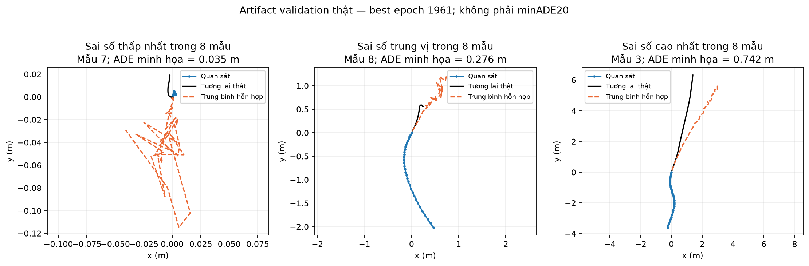

**Hình 6 — artifact thật**, best epoch 1961. Chọn mẫu sai số thấp nhất, trung vị và cao nhất **trong 8 mẫu cố định**, theo ADE của trung bình hỗn hợp. Đây là mô tả minh họa, **không phải minADE20 chính thức**, không đại diện toàn bộ validation. Trong ba hình, mẫu lần lượt là 7, 8 và 3 (đánh số từ 1).

Trung bình hỗn hợp có thể nằm giữa hai nhánh xác suất cao, ở vùng không thuận lợi cho hành vi thật. Vì thế một đường trung bình chưa diễn tả hết giá trị của dự đoán xác suất.

### 9.2. Gaussian ở các thời điểm khác nhau

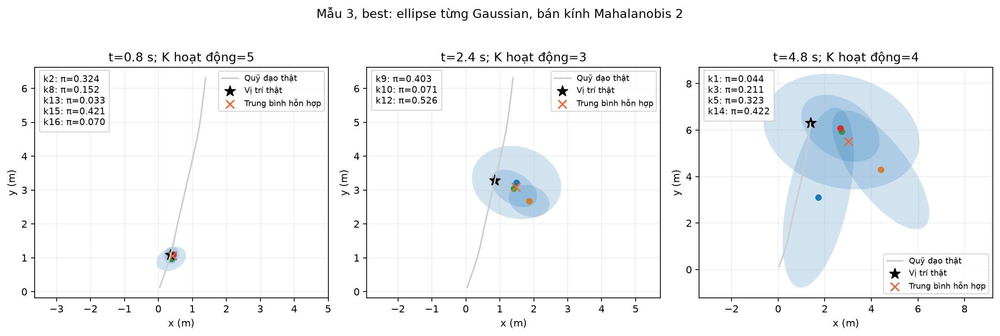

**Hình 7 — artifact thật**, mẫu 3 tại 0.8, 2.4 và 4.8 s. Chỉ vẽ Gaussian có pi>0, chú thích chỉ số và trọng số, đánh dấu tâm trung bình và vị trí thật. Các ellipse có bán kính Mahalanobis 2, chứa khoảng 86.5% xác suất của **từng Gaussian riêng**. Chúng không phải tập tin cậy 68% hoặc 95% của toàn GMM.

Đọc hình bằng cách nhìn đồng thời: ground truth gần Gaussian nào, Gaussian đó có trọng số bao nhiêu, ellipse có rộng và nghiêng ra sao. Không suy ra bất định chỉ từ K; một Gaussian rộng có thể bất định hơn nhiều Gaussian hẹp.

Nếu cần một đại lượng phân tán tổng hợp, covariance của hỗn hợp còn gồm cả độ phân tán giữa các tâm:

$$\operatorname{Cov}(Y_t\mid X)=\sum_k\pi_{t,k}\left[\Sigma_{t,k}+(\mu_{t,k}-\bar\mu_t)(\mu_{t,k}-\bar\mu_t)^T\right].$$

Đây là công thức diễn giải, không phải một metric chính thức mới. Không mặc định ellipse phải lớn dần theo thời gian; hãy đọc tham số thật ở từng bước.

### 9.3. Cùng một mẫu qua checkpoint

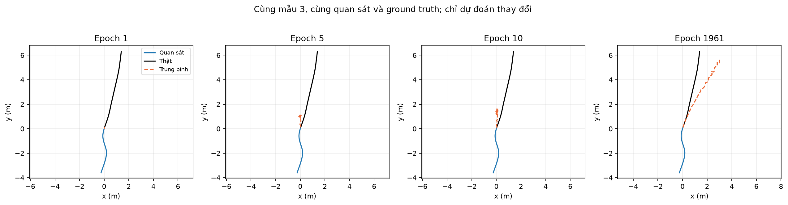

**Hình 8 — artifact thật**, cùng mẫu 3 ở epoch 1, 5, 10 và best. Script kiểm tra `sample_ids` trùng với file input trước khi vẽ. Quan sát và ground truth giữ nguyên; chỉ đầu ra model thay đổi. Các trục tự co giãn theo từng ô, vì vậy phải đọc số trên trục khi so độ lệch.

### 9.4. Trọng số đổi theo mẫu và theo bước

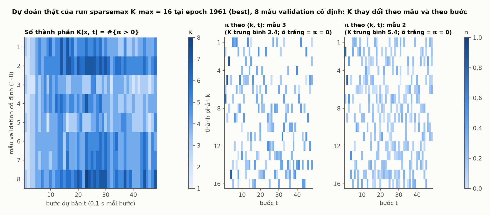

**Hình 9 — artifact thật**, 8 mẫu validation cố định. Ô trắng trong bản đồ pi nghĩa trọng số 0; một Gaussian có thể tắt ở bước này và bật ở bước khác. Chưa chứng minh tính nhất quán hành vi xuyên thời gian.

Code định nghĩa GMM theo từng bước. Loss là trung bình NLL theo bước; **không chứng minh một biến latent chung chọn cùng Gaussian cho cả tương lai**. Do đó không mô tả đầu ra là “16 kịch bản quỹ đạo hoàn chỉnh với 16 xác suất”. Các bước cùng phụ thuộc trạng thái LSTM, nhưng liên hệ đó khác một mô hình xác suất joint có tương quan thời gian được đặc tả rõ.

## 10. Học được gì từ artifact hiện tại?

### 10.1. NLL trong quá trình học

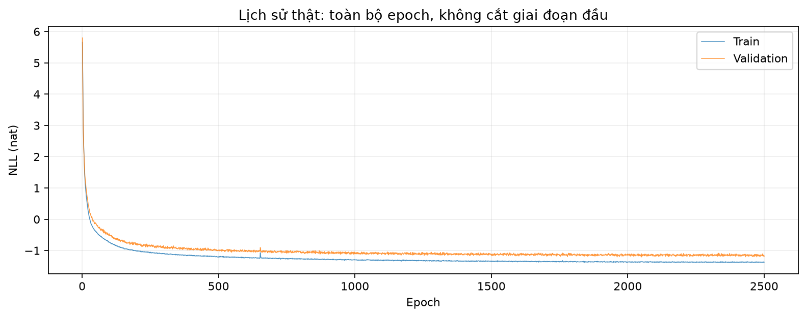

**Hình 10 — artifact thật**, toàn bộ lịch sử 2500 epoch. Đồ thị không cắt giai đoạn đầu; giá trị ban đầu lớn có thể khiến phần sau khó phân biệt. Đồ thị tiếp theo cung cấp góc nhìn phóng vào giai đoạn sau và diễn biến support.

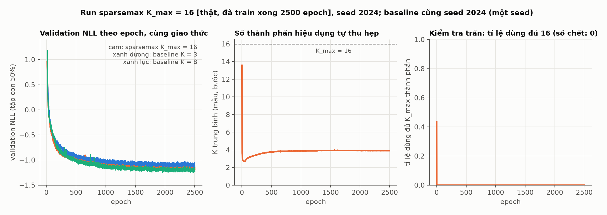

**Hình 11 — artifact thật.** Các đường validation dao động, cần dùng số trong history thay vì kết luận chỉ bằng mắt. Theo cấu hình, train và validation mỗi epoch dùng reduction 0.5; điểm best dựa trên giao thức này, không đồng nghĩa full-validation NLL được tính lại.

### 10.2. Số thành phần hoạt động thật

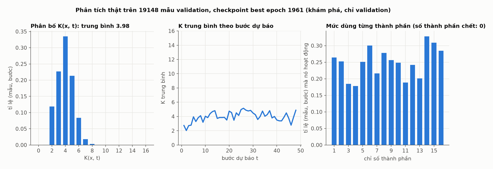

**Hình 12 — artifact thật.** Nguồn [k_usage.json](../../results/trained_models/sparsemax_mdn/imptc/sparsemax_k16_peds_imptc/runs/sparsemax_k16_seed2024/analysis/k_usage.json), best epoch 1961, toàn bộ 19,148 mẫu validation.

- K trung bình: **3.9829**, độ lệch chuẩn **1.2161**.
- Khoảng **33.5%** cặp (mẫu, bước) có K=4; **22.7%** có K=3; **21.3%** có K=5.
- Có **652** cặp K=1, và **5** cặp K>9; giá trị lớn nhất trong file là **13**.
- Không có cặp K=16; cả 16 chỉ số đều hoạt động ở một số mẫu/bước.

**Đính chính khi đọc tài liệu cũ:** câu “không có mẫu/bước nào dùng hơn 9 thành phần” trong `SPARSEMAX_MDN.md` không khớp histogram artifact hiện tại. Bản này dùng histogram để báo cáo cả những trường hợp rất hiếm; không diễn giải trục biểu đồ chỉ đến 9 thành giới hạn thực tế.

Tracker ghi K mỗi epoch trên **2048 mẫu validation đầu tiên**, còn phân tích trên dùng toàn bộ validation. Không đánh đồng hai phạm vi đo. “Không dùng hết 16” cho thấy trần không bị chạm trong phép đo; chưa chứng minh 16 là trần tối ưu.

### 10.3. K lớn có nghĩa mẫu khó hơn không?

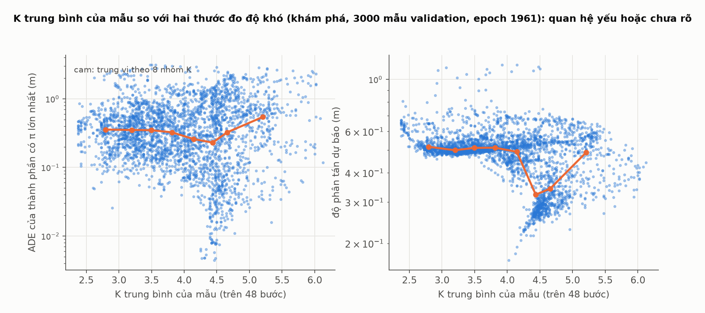

**Hình 13 — artifact thật**, scatter minh họa trên 3000 mẫu. Phân tích toàn validation ghi Spearman khoảng **−0.087** giữa K trung bình và ADE tâm thành phần trọng số cao nhất; khoảng **−0.250** với độ phân tán nội thành phần có trọng số. Đại lượng phân tán đó không gồm toàn bộ độ phân tán giữa các tâm.

Dữ liệu này chưa ủng hộ khẳng định “mẫu càng khó thì mạng luôn bật càng nhiều Gaussian”. K là kết quả của trọng số học được, không phải thước đo độ khó được giám sát.

### 10.4. Có tốt hơn baseline không?

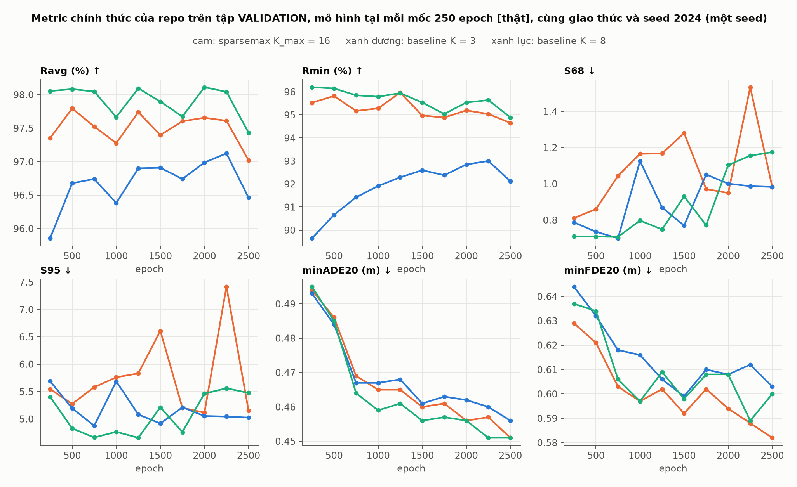

**Hình 14 — artifact thật**, validation theo các checkpoint định kỳ, cùng seed 2024. Xem báo cáo chi tiết và bảng số trong [SPARSEMAX_MDN.md](SPARSEMAX_MDN.md). Đây là kết quả một seed, không phải đánh giá cuối trên test.

Đọc các loại metric riêng biệt:

| Loại đo | Câu hỏi |
|---|---|
| NLL | Model đặt mật độ bao nhiêu ở vị trí thật? |
| minADE20 / minFDE20 | Trong 20 quỹ đạo lấy mẫu, dự đoán tốt nhất lệch bao nhiêu? Số 20 không phải số Gaussian. |
| Reliability: Ravg / Rmin | Các mức tin cậy của model có phù hợp với ground truth theo định nghĩa repo không? |
| Sharpness: S68 / S95 | Vùng tin cậy có rộng không, theo phép tổng hợp chính thức? |
| ASAEE | Chỉ số sai số tổng hợp theo code repo; không thay bằng ADE thông thường. |

Metric cần đi cùng nhau: vùng quá rộng có thể bao phủ tốt nhưng ít hữu ích; vùng quá hẹp có thể bỏ sót ground truth. Trong repo, sharpness chính thức tổng hợp qua lưới **101 phân vị** diện tích theo mẫu, không đơn giản là trung bình diện tích mọi mẫu. Vì thế các trường hợp cực rộng có thể ảnh hưởng mạnh; cần giữ đúng định nghĩa khi so sánh.

Theo bảng validation hiện có, sparsemax cải thiện một số tiêu chí so với baseline K=3, nhưng không thắng đồng loạt; với K=8, kết quả cũng hỗn hợp. Độ lệch chuẩn qua các checkpoint **không phải** độ lệch chuẩn giữa các seed độc lập và không phải kiểm định ý nghĩa thống kê. Vì vậy câu kết luận phù hợp là: **cơ chế trọng số thưa đã hoạt động; lợi ích chất lượng cần đánh giá trên nhiều tiêu chí, chưa thể khẳng định vượt baseline toàn diện.**

Lưu ý triển khai đánh giá: mặc định dùng forecaster gốc với đường `Categorical` kẹp pi; `--exact-pi` dùng đường trọng số chính xác. NLL training riêng đã mask đúng 0. Cần ghi rõ chế độ khi báo cáo và không gộp kết quả từ hai chế độ thành một phép đo.

## 11. Cấu hình và file cần đọc theo thứ tự

| Thứ tự | File | Cần hiểu gì? |
|---:|---|---|
| 1 | [base_lstm.py](../../base_mdn/base_lstm.py) | LSTM, fc, lấy trạng thái cuối, reshape |
| 2 | [mdn_distribution.py](../../base_mdn/utils/mdn_distribution.py) | Thứ tự 6 khối, exp, tanh, covariance, softmax |
| 3 | [sparsemax.py](../../sparsemax_mdn/sparsemax.py) | Sort, support, tau, clamp |
| 4 | [model.py](../../sparsemax_mdn/model.py) | Kế thừa baseline, thay khối trọng số |
| 5 | [loss.py](../../sparsemax_mdn/loss.py) | NLL logsumexp có mặt nạ |
| 6 | [train.py](../../sparsemax_mdn/train.py) | Lắp model, loss, optimizer, tracker vào pipeline |
| 7 | [artifacts.py](../../sparsemax_mdn/artifacts.py) | Support statistics, checkpoint, fixed predictions |
| 8 | [analyze_k.py](../../sparsemax_mdn/analyze_k.py) | Thống kê K và liên hệ với proxy độ khó |
| 9 | [evaluate.py](../../sparsemax_mdn/evaluate.py) | Metric chính thức, exact-pi, lưu dữ liệu từng mẫu |

Run K=16 dùng Adam, lr ban đầu 0.001, LinearLR, batch 4096, 2500 epoch theo cấu hình. Các giá trị này không phải phần mới của sparsemax. Artifact nằm tại:

```text
results/trained_models/sparsemax_mdn/imptc/
  sparsemax_k16_peds_imptc/runs/sparsemax_k16_seed2024/
    history.csv
    checkpoints/
    fixed_samples/inputs.npz
    fixed_samples/predictions/best.npz
    metrics/
    analysis/k_usage.json
```

Bốn hình bổ sung của bản này được tạo bằng [generate_beginner_figures.py](generate_beginner_figures.py). Script chỉ đọc history và fixed predictions đã lưu. Mười hình còn lại dùng tài sản hình sẵn có trong repo. Không cần chạy training để đọc tài liệu.

## 12. Những hiểu nhầm cần tránh

| Hiểu nhầm | Điều source thực sự cho thấy |
|---|---|
| Sparsemax thay thế LSTM | Nó thay chuẩn hóa trọng số ở đầu ra MDN |
| Sparsemax là attention | Trong repo này nó chuẩn hóa pi, không gán trọng số cho bước quan sát |
| Model học bằng EM | Model dùng gradient của NLL để cập nhật mạng |
| Có penalty bắt K nhỏ | Không có penalty K riêng trong loss hiện tại |
| Sparsemax là chọn top-k cố định | Support được suy ra từ logit và tau |
| Ít Gaussian thì uncertainty nhỏ | Phải xét covariance và khoảng cách giữa các tâm |
| Gaussian 0 bị xóa vĩnh viễn | Nó vẫn là slot của mạng, có thể hoạt động nơi khác |
| 16 Gaussian nghĩa 16 tương lai trọn vẹn | Code cho GMM tại từng bước, chưa có latent chung xuyên thời gian |
| Cải tiến chắc chắn chống overfit | Đây là giả thuyết cần kiểm chứng, không phải bảo đảm toán học |
| NLL âm là sai | Mật độ liên tục có thể vượt 1 |
| Một seed đủ khẳng định thắng | Cần phân biệt quan sát hiện có với kết luận tổng quát |

## 13. Từ điển ngắn

- **Logit:** điểm số chưa chuẩn hóa do fc sinh.
- **Mixture weight pi:** tỉ trọng của một Gaussian trong tổng hỗn hợp.
- **Support:** tập chỉ số có trọng số dương.
- **K_max:** số slot Gaussian được cấu hình trước.
- **K(X,t):** số slot đang hoạt động cho đầu vào X tại bước t.
- **Covariance:** ma trận mô tả độ phân tán và liên hệ giữa x, y.
- **NLL:** âm log mật độ mô hình gán cho target, trung bình trên mẫu và bước.
- **Checkpoint:** trạng thái mô hình tại một mốc học.
- **Fixed sample:** mẫu có ID, quan sát và ground truth giữ nguyên qua các checkpoint.

## 14. Đoạn giải thích dùng khi thuyết trình

> Mô hình nền dùng LSTM để mã hóa quỹ đạo quá khứ và một đầu MDN để sinh phân phối hỗn hợp Gaussian 2D tại từng thời điểm tương lai. Baseline chuẩn hóa trọng số bằng softmax, nên các Gaussian đều có trọng số dương trong toán học. Phương pháp của nhóm thay chuẩn hóa này bằng sparsemax, cho phép một số trọng số bằng đúng 0. Với trần 16 Gaussian, số thành phần hoạt động có thể thay đổi theo từng mẫu và từng bước; mô hình vẫn học bằng NLL, không cần nhãn số Gaussian. Trên artifact validation hiện có, số hoạt động trung bình khoảng 4. Tuy nhiên, mạng vẫn giữ đủ 16 slot và kết quả chất lượng chưa tốt hơn baseline trên mọi tiêu chí. Đây là cơ chế tạo trọng số thưa thích nghi, cần đánh giá cùng độ chính xác, reliability và sharpness.

Khi người nghe hỏi “đổi cái gì?”, chỉ vào Hình 1 và Hình 4. Khi hỏi “tại sao K tự thay đổi?”, dùng ví dụ ngưỡng ở Hình 2 rồi bản đồ trọng số Hình 9. Khi hỏi “có hiệu quả không?”, dùng Hình 12 và Hình 14, phân biệt **cơ chế đã hoạt động** với **chất lượng đã vượt đối chứng hay chưa**.
