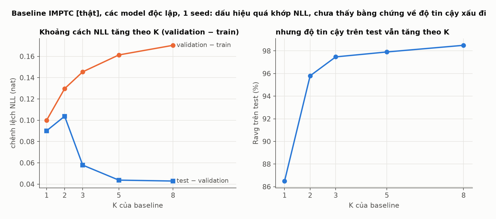
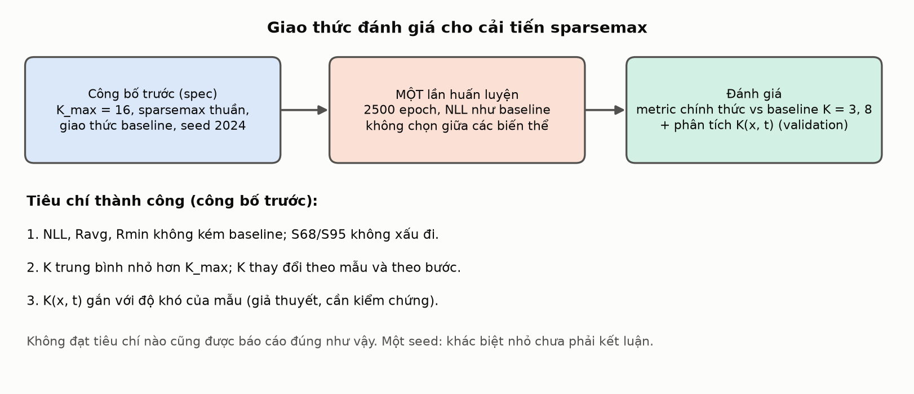
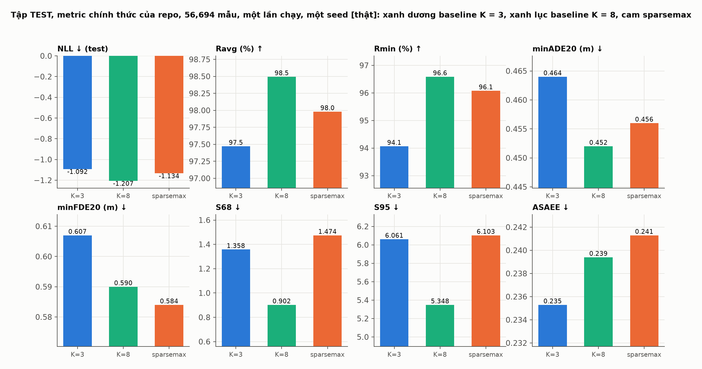
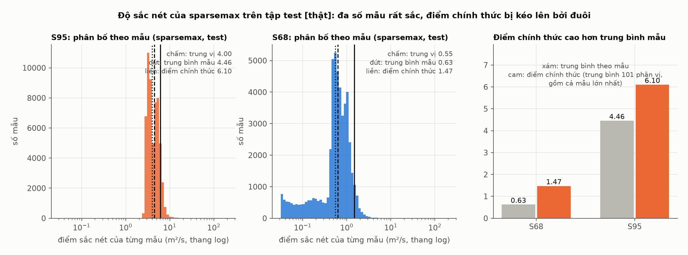

# sparsemax_mdn: để mô hình tự quyết định số thành phần K theo từng mẫu

> **Trạng thái (2026-10-04).** Phương pháp đã được cài đặt trong [sparsemax_mdn/](../../sparsemax_mdn/README.md) (55 unit test, smoke run, review độc lập). Run `sparsemax_k16_seed2024` (K_max = 16, 2500 epoch, seed 2024) **đã train xong** và đã được đánh giá trên **tập test đúng một lần** (mục 6.7). Kết quả: sparsemax **tốt hơn baseline K = 3 nhưng không vượt baseline K = 8**; nó cho K thích nghi (khoảng 4 thành phần hoạt động mỗi mẫu) chứ không cho độ chính xác cao hơn. Đây là **một seed**.
>
> **Cách đọc hình.** **[thật]**: đọc từ artifact trong `results/` (baseline và run sparsemax đã train xong). **[tính]**: tính bằng code của repo trên số minh họa. **[sơ đồ]**: hình giải thích, không có số đo. Hình sinh bằng [generate_figures.py](generate_figures.py); chạy lại script sẽ tạo lại các hình từ artifact hiện có.

## Mục lục
1. [Tóm tắt trong một phút](#1-tóm-tắt-trong-một-phút)
2. [Động cơ](#2-động-cơ)
3. [Ý tưởng: thay softmax bằng sparsemax](#3-ý-tưởng-thay-softmax-bằng-sparsemax)
4. [Cải tiến được cài đặt như thế nào](#4-cải-tiến-được-cài-đặt-như-thế-nào)
5. [Giao thức đánh giá, công bố trước](#5-giao-thức-đánh-giá-công-bố-trước)
6. [Kết quả của run đã train xong](#6-kết-quả-của-run-đã-train-xong-validation-một-seed)
7. [Giới hạn và những điều chưa biết](#7-giới-hạn-và-những-điều-chưa-biết)
8. [Bản đồ file và cách chạy lại](#8-bản-đồ-file-và-cách-chạy-lại)

---

## 1. Tóm tắt trong một phút

| | Baseline `base_mdn` | `sparsemax_mdn` (đề xuất) |
|---|---|---|
| Số thành phần Gaussian | cố định K = 3 (đặt tay) | trần K_max = 16; **số thành phần thật sự dùng do mô hình quyết định** |
| Trọng số π | softmax: mọi thành phần luôn có π > 0 | **sparsemax**: thành phần không cần có π = 0 chính xác |
| Số thành phần mỗi mẫu | cùng K cho mọi mẫu | $K(x,t)=\#\{k:\pi_k(x,t)>0\}$, **khác nhau theo mẫu và theo bước dự báo** |
| Số lần huấn luyện | 1 | **1**, không chọn giữa các biến thể |
| Loss, LSTM, μ, σ, ρ, optimizer, lịch học | | giữ nguyên |

Cải tiến chỉ là **đổi hàm chuẩn hóa của trọng số π**; không thêm tham số, không thêm số hạng vào loss.


**Hình 1** *[sơ đồ]*. Chỉ khối "chuẩn hóa π" thay đổi.

## 2. Động cơ

**2.1. K = 3 là con số đặt tay.** Baseline (và paper) đặt K = 3. Bản ghi `ablation.json` nêu rằng paper không báo cáo ablation số thành phần. Vì vậy chưa có câu trả lời bằng dữ liệu cho "K nên là bao nhiêu".

**2.2. Quét K trên baseline cho thấy K ảnh hưởng nhiều và không đều.** Baseline đã train với K = 1, 2, 3, 5, 8 (cùng seed, mỗi K một model độc lập, một seed):


**Hình A** **[thật]** (từ tài liệu [growing_mdn](../growing_mdn/GROWING_MDN.md)). NLL giảm khi K tăng, lợi ích trên mỗi thành phần không giảm đều.


**Hình B** **[thật]**, tập test. minADE/minFDE và độ tin cậy tốt dần khi K tăng, còn độ sắc nét (S68, S95) và ASAEE **không đơn điệu**. Tăng K không bảo đảm mọi tiêu chí cùng cải thiện.

**2.3. Vì sao không dừng ở "chạy nhiều K rồi chọn".** Cách đó là **chọn mô hình** (tìm siêu tham số). Một cải tiến phải đổi **mô hình hoặc hàm mục tiêu**, huấn luyện một lần với cấu hình công bố trước, và K phải thoát ra từ chính quá trình đó. Chúng tôi từng làm hướng "tăng dần K rồi chọn" ([growing_mdn](../growing_mdn/GROWING_MDN.md)); nó đóng vai trò phân tích bổ trợ, không phải cải tiến chính.


**Hình 2** *[sơ đồ]*.

**2.4. Baseline đã có K hiệu dụng khác nhau theo mẫu, nhưng không được điều khiển.** Với baseline K = 8, số thành phần hiệu dụng $\exp(H(\pi))$ trên 8 mẫu validation cố định nằm trong khoảng 1.8 đến 6.4 (trung bình 4.1; xem Hình 5 trong [growing_mdn](../growing_mdn/GROWING_MDN.md)). Đó là kết quả ngẫu nhiên của quá trình train, vì π là softmax nên luôn dương, không có đại lượng nào đếm số thành phần và không có cơ chế nào làm nó nhỏ lại khi dữ liệu không cần.

**2.5. Mối lo về quá khớp.** NLL trên validation hầu như luôn cải thiện khi K tăng vì mô hình hỗn hợp linh hoạt hơn; một thành phần hẹp (σ nhỏ) có thể bám vào cụm mẫu train làm NLL tốt hơn mà dự đoán không tin cậy hơn. Dữ liệu baseline cho thấy một dấu hiệu nhẹ:



**Hình 3** **[thật]**, các model baseline độc lập, một seed. Khoảng cách validation − train tăng đều theo K (0.10 đến 0.17), đúng chiều quá khớp. Nhưng khoảng cách test − validation giảm và độ tin cậy trên test tăng theo K, nên **chưa có bằng chứng** rằng K lớn làm dự đoán kém tin cậy hơn trên dữ liệu chưa thấy. **Sparsemax không giải quyết mối lo này** (xem mục 7); nó chỉ loại bỏ thiên lệch do *chọn* K bằng nhiều lần chạy.

## 3. Ý tưởng: thay softmax bằng sparsemax

**Softmax** biến logit thành π dương và tổng bằng 1, nên mọi thành phần đều có trọng số dương. **Sparsemax** (Martins và Astudillo, 2016; trích dẫn cần kiểm tra lại) là phép chiếu Euclid lên simplex:

$$
\text{sparsemax}(z)=\arg\min_{p\in\Delta^{K-1}}\|p-z\|_2^2,\qquad
p_k=\max(z_k-\tau,\,0),
$$

trong đó $\tau$ được chọn sao cho $\sum_k p_k=1$. Điểm khác biệt quan trọng: **nhiều thành phần nhận trọng số bằng đúng 0**.


**Hình 4** *[tính]*, tính bằng đúng hàm `sparsemax` của repo trên lưới logit $(a,b,0)$ với $a,b\in[-4,4]$. Softmax (trái) chỉ cho điểm nằm bên trong tam giác. Sparsemax (phải) đẩy nhiều điểm lên **cạnh** (một π = 0, màu cam) hoặc **đỉnh** (hai π = 0, màu xanh lục). Trên lưới này, 98% điểm ra ít nhất một số 0 chính xác (con số này phụ thuộc vào khoảng giá trị của logit: logit càng gần nhau thì càng ít số 0).

Cách tìm $\tau$: sắp xếp logit giảm dần, tìm số thành phần $k(z)$ lớn nhất thỏa $1+k\,z_{(k)}>\sum_{j\le k}z_{(j)}$, rồi đặt $\tau=(\sum_{j\le k(z)}z_{(j)}-1)/k(z)$.


**Hình 5** *[tính]*, ví dụ 6 logit. Ngưỡng $\tau=1.20$ chỉ giữ lại 2 thành phần đầu, trọng số $0.80$ và $0.20$, bốn thành phần còn lại bằng đúng 0. Cùng logit đó, softmax cho cả 6 thành phần trọng số dương.

**Vì sao điều này cho K theo từng mẫu.** Logit của π do `fc` sinh ra từ trạng thái LSTM của mẫu và từ bước dự báo, nên $\pi_k(x,t)$ phụ thuộc đầu vào. Số thành phần có $\pi_k>0$ vì vậy phụ thuộc đầu vào:

$$K(x,t)=\#\{k:\pi_k(x,t)>0\}\le K_{\max}.$$

Mô hình tự quyết định thành phần nào "tắt" cho mẫu nào, chỉ qua việc huấn luyện NLL thông thường. Đây là một **đếm theo chỉ số đầu ra**, không phải số "mode hành vi" nhất quán giữa các mẫu và các bước.

## 4. Cải tiến được cài đặt như thế nào

Yêu cầu cài đặt: **không sửa `base_mdn`** và dùng lại toàn bộ code đánh giá của baseline. Cách làm: mô hình trả về đầu ra thô theo đúng định dạng baseline, chỉ thay khối π bằng $\log\pi$ (nơi $\pi>0$) hoặc một hằng số rất âm (nơi $\pi=0$):


**Hình 6** *[sơ đồ]*. softmax của $(\log\pi,\,-10^9)$ cho đúng $\pi$, vì mục có $-10^9$ ra đúng 0 trong float32 và $\sum\pi=1$. Nhờ vậy tracker, dự đoán cố định và các metric chính thức của baseline chạy không cần sửa.

**Hàm loss** vẫn là NLL trung bình như baseline, nhưng tính bằng log-sum-exp *có mặt nạ*: thành phần có $\pi=0$ đóng góp đúng 0 và không nhận gradient ở mẫu đó.


**Hình 7** *[sơ đồ + ví dụ số]*. Trái: thành phần có π = 0 bị loại khỏi tổng. Phải: lý do tự cài NLL chính xác. Lớp `Categorical` của baseline làm tròn xác suất 0 thành khoảng $1.2\times10^{-7}$; nếu một thành phần "chết" nằm đúng ở điểm thật thì NLL bị kéo xuống một cách giả tạo (ví dụ minh họa: 16.60 so với 10.94 nat, không phải dữ liệu đo).

| Giữ nguyên so với baseline | Thay đổi |
|---|---|
| LSTM (hidden 8), μ, σ, ρ, decoder legacy, ma trận Σ | khối π: softmax → sparsemax |
| Adam, lr 1e-3, LinearLR, batch 4096, train/validation reduction 0.5, seed 2024 | NLL tính bằng log-sum-exp có mặt nạ (khi mọi π > 0 trùng với NLL của baseline, có test) |
| 2500 epoch, 8 mẫu validation cố định, metric chính thức mỗi 250 epoch | `num_gaussians` = K_max = 16 |
| `base_mdn/` không bị sửa (có hash kiểm tra) | thêm log mỗi epoch: số thành phần trung bình, tỉ lệ dùng đủ K_max, số thành phần chết |

Cấu hình của run **chỉ khác** cấu hình baseline `default_peds_imptc.json` ở `num_gaussians` và các khóa mô tả thí nghiệm (có test kiểm tra). Review độc lập không phát hiện sai khác nào trong vòng huấn luyện làm hỏng việc so sánh với baseline, và ghi nhận hai lưu ý về cách chấm điểm (mục 7).

## 5. Giao thức đánh giá, công bố trước

Giao thức được viết thành [spec](../superpowers/specs/2026-10-04-sparsemax-mdn-design.md) **trước khi** huấn luyện: cấu hình, tiêu chí thành công và các rủi ro.



**Hình 8** *[sơ đồ]*. Một lần huấn luyện, cấu hình công bố trước, đánh giá theo tiêu chí công bố trước. Nếu không đạt tiêu chí nào thì báo cáo đúng như vậy.

**Vì sao K_max = 16.** Run đầu có K_max = 8 bị dừng sau 48 epoch theo yêu cầu nâng trần, để K không bị cắt bởi một trần thấp. Run K_max = 8 đó không cho thấy dấu hiệu bị chặn (số thành phần hiệu dụng giảm về khoảng 2.2 trên 8 chỉ sau vài chục epoch), artifact của nó được giữ lại. Với K_max = 16, số tham số là 41 920 (baseline K = 3 là 8 224, K = 8 là 21 184); phần lớn thành phần dự kiến không hoạt động. Baseline đối chứng là K = 3 và K = 8 (không có baseline K = 16).

**Kiểm tra trần.** Mỗi epoch ghi tỉ lệ (mẫu, bước) dùng đủ K_max thành phần. Nếu tỉ lệ này đáng kể và kéo dài, trần đang chặn và kết quả chỉ là cận dưới của K thật.

## 6. Kết quả của run đã train xong (validation, một seed)

Toàn bộ số liệu dưới đây là trên tập **validation**, từ run `sparsemax_k16_seed2024` và các baseline cùng seed 2024, cùng giao thức. Một seed nên chênh lệch nhỏ chưa phải khẳng định. Tập test chưa được dùng.

### 6.1. Diễn biến huấn luyện


**Hình 9** **[thật]**. Trái: validation NLL (tập con 50%, cùng giao thức) của sparsemax (cam), baseline K = 3 (xanh dương) và K = 8 (xanh lục); ba đường chồng lên nhau và nhiễu theo epoch, nên khó đọc chênh lệch bằng mắt (bảng ở 6.2 chính xác hơn). Giữa: số thành phần hiệu dụng giảm rất nhanh từ khoảng 13.6 ở epoch đầu xuống khoảng 3, rồi **tăng chậm và ổn định quanh 3.9**. Phải: tỉ lệ (mẫu, bước) dùng đủ 16 thành phần chỉ khác 0 ở vài epoch đầu, sau đó bằng 0 suốt run; không có thành phần chết. Trần 16 **không bị chặn**.

Validation NLL của checkpoint tốt nhất (giao thức baseline: tập con 50% ngẫu nhiên): sparsemax **−1.204** (epoch 1961), baseline K = 3 **−1.150** (epoch 1961), baseline K = 8 **−1.250** (epoch 2473). Tức là sparsemax tốt hơn K = 3 và kém K = 8 về NLL.

### 6.2. Metric chính thức so với baseline


**Hình 13** **[thật]**, metric chính thức của repo trên validation, tính cho mô hình tại các mốc mỗi 250 epoch. Các đường dao động mạnh giữa các mốc, nên bảng dưới lấy **trung bình ± độ lệch chuẩn qua 6 mốc (epoch 1250 đến 2500)**:

| Metric | sparsemax K_max = 16 | baseline K = 3 | baseline K = 8 |
|---|---:|---:|---:|
| Ravg (%) ↑ | 97.51 ± 0.24 | 96.85 ± 0.21 | 97.88 ± 0.25 |
| Rmin (%) ↑ | 95.12 ± 0.41 | 92.54 ± 0.31 | 95.43 ± 0.36 |
| S68 ↓ | 1.147 ± 0.21 | 0.943 ± 0.10 | 0.980 ± 0.18 |
| S95 ↓ | 5.89 ± 0.86 | 5.06 ± 0.09 | 5.19 ± 0.36 |
| ASAEE ↓ | 0.240 ± 0.002 | 0.233 ± 0.002 | 0.239 ± 0.003 |
| minADE20 (m) ↓ | 0.458 ± 0.004 | 0.462 ± 0.004 | 0.455 ± 0.003 |
| minFDE20 (m) ↓ | 0.593 ± 0.007 | 0.606 ± 0.004 | 0.602 ± 0.007 |

Đọc bảng (chỉ để mô tả, một seed):
- So với **K = 3**: sparsemax tốt hơn rõ về độ tin cậy (Ravg +0.65, Rmin +2.6, lớn hơn độ lệch chuẩn qua các mốc) và minFDE.
- So với **K = 8**: độ tin cậy và minADE gần như tương đương (Ravg −0.37, Rmin −0.31, trong khoảng 1 đến 1.5 độ lệch chuẩn), minFDE nhỉnh hơn, NLL kém hơn (6.1).
- **Độ sắc nét (S68, S95)**: trên các mốc này S95 của sparsemax cao hơn ở 8 trong 10 mốc (trung vị qua 10 mốc 5.56 so với 5.07 của K = 3 và 5.02 của K = 8), **nhưng dao động rất mạnh** (từ 5.1 đến 7.4; độ lệch chuẩn qua 6 mốc là 0.86, so với 0.09 của K = 3). Phép chẩn đoán ở 6.2b **không xác nhận** một sự kém sắc nét mang tính hệ thống.

#### 6.2b. Chẩn đoán độ sắc nét (validation, chạy bằng chính hàm của repo)

Điểm sắc nét chính thức là **trung bình** diện tích tập tin cậy theo từng mẫu, nên rất nhạy với vài mẫu có dự đoán cực rộng. Để xem điều đó có xảy ra không, [diagnose_sharpness.py](../../sparsemax_mdn/diagnose_sharpness.py) tính diện tích **từng mẫu** (cùng công thức `build_confidence_set_mdn` và `estimate_sharpness`) trên cùng các mẫu validation đầu tiên cho sparsemax và baseline K = 3 tại epoch 1500. Số liệu là điểm sắc nét kiểu chính thức theo mẫu (m²/s):

| 6000 mẫu validation, epoch 1500 | sparsemax | baseline K = 3 |
|---|---:|---:|
| S68: trung bình / trung vị | 0.679 / 0.569 | 0.703 / 0.570 |
| S68: p99 / lớn nhất | 2.05 / 63 | 2.97 / 11 |
| S95: trung bình / trung vị | 4.62 / 4.07 | 4.79 / 4.00 |
| S95: p99 / lớn nhất | 8.3 / 201 | 15.2 / 33 |
| S95: số mẫu vượt 20 | 16 | 28 |

Trên cùng các mẫu này sparsemax **không kém sắc nét hơn K = 3**: trung bình thấp hơn một chút, trung vị gần như bằng nhau, p99 thấp hơn. Ở checkpoint tốt nhất trên 600 mẫu đầu: S68 0.514 (sparsemax), 0.559 (K = 3), 0.491 (K = 8); S95 4.24, 4.52, 3.97. Điều đáng chú ý là **đuôi**: sparsemax có vài mẫu với diện tích cực lớn (lớn nhất 63 cho S68 và 201 cho S95, so với 11 và 33 của K = 3). **Điểm sắc nét chính thức còn nhạy hơn một trung bình thường.** Đọc code `plot_sharpness_over_time` cho thấy điểm được tính bằng cách lấy **101 phân vị** (0%, 1%, ..., 100%) của diện tích theo mẫu ở mỗi mốc dự báo rồi lấy trung bình các phân vị đó. Phân vị 100% chính là **mẫu có diện tích lớn nhất**, nên một mẫu duy nhất chiếm trọng số khoảng 1% của điểm (so với 1/N trong một trung bình thông thường). Vì vậy một mô hình có vài mẫu dự đoán cực rộng bị phạt nặng hơn nhiều so với tác động thật của chúng lên đa số mẫu, và tập con ngẫu nhiên có chứa hay không mẫu cực đại đó làm điểm nhảy giữa các mốc. Đây là một tính chất của metric (đọc từ code), không phải của sparsemax. Cách giải thích khả dĩ cho việc sparsemax có đuôi nặng hơn, **chưa kiểm chứng**: với một số đầu vào mơ hồ, sparsemax dồn trọng số vào ít thành phần rộng nên diện tích tập tin cậy rất lớn; chỉ cần vài mẫu như vậy lọt vào tập con 50% ngẫu nhiên dùng khi chấm điểm là điểm trung bình nhảy lên. Tôi **không tái tạo được** bằng phép đo trung bình thường các mốc có S95 = 6.6 (epoch 1500) hay 7.4 (epoch 2250) bằng phép đo này (ở epoch 1500 trên 6000 mẫu, S95 chỉ là 4.62), nên nguyên nhân chính xác của các đỉnh đó vẫn chưa rõ.

### 6.3. Mức dùng thành phần trên toàn bộ validation


**Hình 11** **[thật]**, toàn bộ 19 148 mẫu validation, checkpoint best (epoch 1961), phân tích khám phá.
- $K(x,t)$ **trung bình 3.98** (độ lệch chuẩn 1.22), trải từ 2 đến 9: 12% ở K = 2, 23% ở K = 3, 34% ở K = 4, 21% ở K = 5, 8% ở K = 6 và khoảng 2% ở K ≥ 7. **Không có (mẫu, bước) nào dùng hơn 9 trong 16 thành phần.**
- K trung bình theo bước dự báo: 2.7 ở bước đầu, khoảng 4.4 ở bước 12, và 4 đến 5 ở các bước sau.
- Cả 16 thành phần đều được dùng (mỗi thành phần hoạt động trong 18% đến 33% số (mẫu, bước)); không có thành phần chết.

### 6.4. Dự đoán trên 8 mẫu cố định


**Hình 10** **[thật]**, checkpoint best, 8 mẫu validation cố định. Trái: $K(x,t)$ thay đổi theo mẫu (hàng) và theo bước (cột). Phải: ma trận $\pi_k(x,t)$ của mẫu có K trung bình nhỏ nhất và lớn nhất; ô trắng là $\pi=0$ chính xác. Các thành phần được bật ở những bước khác nhau, phù hợp với việc K là đếm theo chỉ số đầu ra.

### 6.5. K có gắn với độ khó của mẫu không?


**Hình 12** **[thật]**, 3000 mẫu validation, checkpoint best. Với toàn bộ validation, hệ số Spearman giữa K trung bình của mẫu và hai thước đo độ khó là **−0.09** (với sai số của thành phần có π lớn nhất) và **−0.25** (với độ phân tán dự báo). Tức là **giả thuyết "mẫu khó có K lớn hơn" không được ủng hộ**; với độ phân tán dự báo quan hệ còn đi ngược chiều (mẫu có phân phối rộng dùng ít thành phần hơn, điều có thể do một thành phần rộng đã đủ phủ). Hai thước đo này chỉ là xấp xỉ, nên đây là quan sát khám phá chứ không phải kết luận.

### 6.6. Đối chiếu với tiêu chí đã công bố trước

| Tiêu chí (spec mục 5) | Kết quả trên validation, một seed |
|---|---|
| 1. NLL, Ravg, Rmin không kém baseline; S68/S95 không xấu đi | **Đạt một phần.** Không kém K = 3 về NLL, Ravg, Rmin; gần K = 8 về Ravg, Rmin nhưng NLL kém K = 8. **Độ sắc nét chưa kết luận được**: S95 chính thức cao hơn ở 8/10 mốc nhưng dao động mạnh, và phép chẩn đoán trên 6000 mẫu không cho thấy kém hơn K = 3 (có vài mẫu dự đoán cực rộng). |
| 2. K trung bình nhỏ hơn K_max; K thay đổi theo mẫu và theo bước | **Đạt.** Trung bình 3.98 trên 16, trải từ 2 đến 9, thay đổi theo bước. |
| 3. K gắn với độ khó của mẫu | **Không được ủng hộ** (Spearman −0.09 và −0.25). |

Tóm lại: sparsemax cho một K thích nghi theo mẫu (trung bình khoảng 4 thành phần hoạt động) với chất lượng nằm giữa baseline K = 3 và K = 8: tốt về độ tin cậy và minFDE, NLL kém K = 8, còn độ sắc nét chưa kết luận được. Nó **chưa chứng tỏ là cải tiến rõ rệt về độ chính xác**; điểm có thể nói là **K được mô hình tự quyết định trong một lần train, với chất lượng gần baseline K = 8 mà chỉ khoảng 4 thành phần hoạt động mỗi (mẫu, bước)** (lưu ý model vẫn có 41 920 tham số so với 8 224 của K = 3 và 21 184 của K = 8).

### 6.7. Kết quả trên tập test (đánh giá một lần)

Theo giao thức công bố trước, tập test được dùng **đúng một lần**, cho checkpoint tốt nhất theo validation (epoch 1961), bằng code đánh giá chính thức của repo (cách chấm kiểu baseline). Baseline K = 3 và K = 8 dùng kết quả test đã có sẵn (cùng giao thức, cùng seed 2024). Tập test có 56 694 mẫu.



**Hình 14** **[thật]**.

| Metric (test) | sparsemax K_max = 16 | baseline K = 3 | baseline K = 8 |
|---|---:|---:|---:|
| NLL ↓ | −1.134 | −1.092 | **−1.207** |
| Ravg (%) ↑ | 97.98 | 97.47 | **98.49** |
| Rmin (%) ↑ | 96.08 | 94.06 | **96.59** |
| minADE20 (m) ↓ | 0.456 | 0.464 | **0.452** |
| minFDE20 (m) ↓ | **0.584** | 0.607 | 0.590 |
| S68 ↓ | 1.474 | 1.358 | **0.902** |
| S95 ↓ | 6.103 | 6.061 | **5.348** |
| ASAEE ↓ | 0.2413 | **0.2353** | 0.2394 |

(NLL của sparsemax là NLL chính xác trên toàn bộ tập test, NLL của baseline là giá trị đã lưu trong `ablation.json`. Số thành phần hoạt động trên test: trung bình 3.99, không (mẫu, bước) nào dùng đủ 16, không thành phần chết.)

Đọc kết quả (một seed, chỉ mô tả):
- **So với K = 3:** sparsemax tốt hơn về NLL, Ravg (+0.51), Rmin (+2.0), minADE và minFDE; **kém hơn** về S68 (+8.6%), ASAEE (+2.5%) và gần như bằng về S95 (+0.7%).
- **So với K = 8:** sparsemax **kém hơn trên hầu hết các tiêu chí**: NLL (−1.134 so với −1.207), Ravg và Rmin (kém khoảng 0.5 điểm), S68 (1.474 so với 0.902) và S95 (6.10 so với 5.35); chỉ minFDE nhỉnh hơn một chút (0.584 so với 0.590).
- Kết quả trên test **không xác nhận** hình ảnh trên validation, vốn cho thấy sparsemax gần K = 8: trên test, K = 8 rõ ràng tốt hơn.



**Hình 15** **[thật]**, sparsemax trên tập test. Đa số mẫu có dự đoán rất sắc: trung vị S95 theo mẫu là 4.00 và trung vị S68 là 0.55. Nhưng điểm chính thức lại cao hơn nhiều so với trung bình theo mẫu (S68: 1.47 so với 0.63; S95: 6.10 so với 4.46), vì cách tính lấy trung bình 101 phân vị và mẫu có diện tích lớn nhất đóng góp trọng số khoảng 1% (6.2b). Có 68 trong 56 694 mẫu có điểm S95 trên 20, lớn nhất là 139 (S95) và 84 (S68). Số liệu từng mẫu của baseline K = 3 trên test đã được tính ở 6.9: phần chênh lệch S68/S95 với K = 3 đến từ mẫu cực đại ở mỗi mốc chứ không phải từ phần thân.

### 6.8. Đối chiếu tiêu chí công bố trước, trên tập test

| Tiêu chí (spec mục 5) | Kết quả |
|---|---|
| 1. NLL, Ravg, Rmin không kém baseline; S68/S95 không xấu đi | **Đạt một phần.** Đạt so với K = 3 về NLL, Ravg, Rmin (S68 kém hơn 8.6%, S95 ngang). **Không đạt so với K = 8**: kém hơn về NLL, Ravg, Rmin, S68 và S95. |
| 2. K trung bình nhỏ hơn K_max; K thay đổi theo mẫu và theo bước | **Đạt** (3.99 trên 16; trải từ 2 đến 9). |
| 3. K gắn với độ khó của mẫu | **Không được ủng hộ** (đo trên validation: Spearman −0.09 và −0.25; chưa đo trên test). |

**Kết luận thận trọng:** sparsemax_mdn học được một K thích nghi theo mẫu trong một lần huấn luyện (trung bình khoảng 4 thành phần hoạt động), với chất lượng tốt hơn baseline K = 3 nhưng **không bằng baseline K = 8** trên tập test. Vì vậy **chưa thể gọi đây là cải tiến về độ chính xác** so với baseline mạnh nhất; điểm có thể nêu là tính thích nghi và tính gọn (số thành phần hoạt động nhỏ) chứ không phải chất lượng dự báo. Kết quả là một seed, nên chênh lệch nhỏ chưa phải khẳng định.

### 6.9. Vì sao S68/S95 của sparsemax lớn hơn K = 3 trên test? Không phải sai công thức

Câu hỏi: có nhầm hay khác công thức đánh giá không? **Không.** Các metric được tính bằng đúng hàm của baseline (xem trả lời ở phần trên và 6.7); công thức điểm sắc nét tái tạo được chính xác bằng bản sao 101 phân vị (sai khác 0.0). Lý do thật nằm ở **cách điểm được tổng hợp và vài mẫu cực đoan**.

**Điểm chính thức = trung bình 101 phân vị của diện tích theo mẫu, ở mỗi mốc dự báo.** Phân vị thứ 100 là *mẫu rộng nhất*, nên **một mẫu duy nhất ở mỗi mốc chiếm khoảng 1% điểm**, bất kể có bao nhiêu mẫu. Hai hệ quả: (1) điểm phụ thuộc vào số mẫu, vì giá trị lớn nhất tăng theo cỡ tập; (2) điểm do vài mẫu cực đoan chi phối.

**Kiểm tra 1: cùng các mẫu validation, cùng công thức chính thức, hai checkpoint tốt nhất (4000 mẫu đầu).** Ở đây sparsemax **sắc hơn** K = 3, không rộng hơn:

| | sparsemax | baseline K = 3 |
|---|---:|---:|
| S95 chính thức | 4.43 | 4.81 |
| S68 chính thức | 0.625 | 0.687 |
| S95: trung vị theo mẫu | 3.90 | 3.86 |
| S95: chênh lệch phần "thân" (phân vị 0–50 và 50–90) | −0.06 so với K = 3 | |
| S95: chênh lệch phần "đuôi" (phân vị 90 đến 100) | −0.31 so với K = 3 | |

Phần thân (đa số mẫu) gần như bằng nhau; sparsemax sắc hơn ở đuôi.

**Kiểm tra 2: phân rã điểm test của sparsemax (56 694 mẫu).**

| | S68 | S95 |
|---|---:|---:|
| Điểm chính thức | 1.474 | 6.103 |
| Từ phân vị 0 đến 99 ("thân" và đuôi vừa) | 0.569 | 4.26 |
| **Từ phân vị 100 (mẫu rộng nhất ở mỗi mốc)** | **0.905 (61%)** | **1.84 (30%)** |

Phần thân của S68 test (0.57) thậm chí thấp hơn điểm S68 của K = 3 trên validation (0.69). Hơn nửa điểm S68 chính thức của sparsemax là do **mẫu rộng nhất ở mỗi mốc**: diện tích lớn nhất ở một mốc là 985 m² (S68) và 1296 m² (S95), chính bằng toàn bộ lưới đo 36 × 36 m.

**Những mẫu cực đoan trông như thế nào (validation, checkpoint tốt nhất).** Mỗi mô hình có vài quỹ đạo mà nó dự đoán cực rộng, và hai mô hình **không trùng nhau** (0 trong 20 mẫu rộng nhất trùng):
- sparsemax: các mẫu 2293 đến 2297 (các khung liên tiếp của cùng một người đi bộ), ở bước 39 có 4 thành phần hoạt động với σ từ 1.7 đến 3.7 m, tâm lệch nhau 3.5 đến 4.7 m, diện tích 76 đến 89 m².
- baseline K = 3: các mẫu 2368 đến 2371, ở bước 47 có một thành phần rộng σ ≈ 6.3 đến 6.5 m với π ≈ 0.32 đến 0.44, diện tích 249 đến 287 m². Trên validation đuôi của K = 3 thậm chí rộng hơn.

**Kiểm tra 3: baseline K = 3 trên chính tập test (56 694 mẫu), cùng harness.** Đã chạy lại baseline K = 3 trên test với đúng cùng công cụ (một lần đọc test thêm cho baseline, không dùng để chọn gì). Trước hết, **các metric chính thức của baseline tái tạo đúng từng chữ số** so với giá trị đã lưu trong `ablation.json` (sai khác tương đối 0.0 cho cả 7 metric và NLL), nên cách so sánh là công bằng và nhiễu Monte Carlo không phải vấn đề với cùng seed.

| Test, 56 694 mẫu | S68 sparsemax | S68 K = 3 | S95 sparsemax | S95 K = 3 |
|---|---:|---:|---:|---:|
| Điểm chính thức | 1.474 | 1.358 | 6.103 | 6.061 |
| Phần "thân" (phân vị 0 đến 99) | **0.569** | 0.627 | **4.261** | 4.464 |
| Phần mẫu rộng nhất mỗi mốc (phân vị 100) | 0.905 | 0.730 | 1.842 | 1.598 |
| Trung bình theo mẫu | **0.628** | 0.694 | **4.456** | 4.705 |
| Phân vị 99 theo mẫu | **2.07** | 2.83 | **8.3** | 15.0 |
| Số mẫu có điểm trên 20 | 38 | 48 | **68** | **258** |

Đọc bảng: **trên đa số mẫu sparsemax sắc hơn K = 3** (thân thấp hơn 9% ở S68 và 5% ở S95, trung bình và phân vị 99 đều thấp hơn; với S95 K = 3 có nhiều mẫu rộng hơn rất nhiều: 258 mẫu so với 68). Phần chênh lệch của điểm chính thức đến **hoàn toàn từ một mẫu rộng nhất ở mỗi mốc**: ví dụ ở mốc bước 40, mẫu rộng nhất của sparsemax có diện tích 985 m² (S68), còn của K = 3 là 280 m²; ở mốc cuối thì ngược lại (219 so với 741). Tức là đó là chuyện của một vài mẫu cực đoan khác nhau ở mỗi mô hình, không phải dự đoán điển hình rộng hơn.

**Kết luận.**
- Sparsemax lớn hơn K = 3 ở S68 và S95 chính thức trên test là do **mẫu cực đại ở mỗi mốc dự báo chi phối điểm** (phân vị 100 chiếm 1% điểm), không phải do dự đoán điển hình rộng hơn và không phải do công thức khác.
- Với đa số mẫu, sparsemax sắc hơn K = 3. Khi trình bày nên báo kèm trung vị, phân vị 99 và số mẫu rộng bất thường bên cạnh điểm chính thức.
- Lưu ý chưa làm: số liệu từng mẫu của baseline **K = 8** trên test chưa được tính.

## 7. Giới hạn và những điều chưa biết

- **Tập test đã dùng một lần** (6.7), nên không thể dùng nó để chỉnh phương pháp nữa; mọi cải tiến thêm phải kiểm trên validation hoặc dùng một tập/seed khác. Chưa kiểm tra lại bằng đánh giá "trọng số chính xác" trên toàn bộ validation; trên 500 mẫu validation đầu, đánh giá chính xác và đánh giá kiểu baseline cho các metric giống nhau đến 5 chữ số thập phân (S95 khác ở chữ số thứ 5), nên ảnh hưởng của việc làm tròn $1.2\times10^{-7}$ có vẻ rất nhỏ ở đây, nhưng đây là mẫu nhỏ.
- **Một seed.** Phương sai giữa các seed của baseline chưa biết, nên chênh lệch nhỏ chưa phải khẳng định.
- **Điểm sắc nét chính thức nhạy với vài mẫu ngoại lai** (6.2b); đề xuất báo thêm trung vị và các phân vị khi so sánh. Một số mẫu có dự đoán cực rộng có thể cần giới hạn trên cho σ (thí nghiệm riêng).
- **Không giải quyết quá khớp.** Sparsemax không phạt σ nhỏ và không chặn việc mở nhiều thành phần hẹp; nếu độ tin cậy xấu đi ở các mẫu mở nhiều thành phần thì cần một cơ chế khác (ví dụ chặn dưới cho σ, là một thí nghiệm riêng, nêu rõ là thay đổi bộ giải mã baseline).
- **Cách chấm điểm chính thức chưa hoàn toàn chính xác.** Các metric của baseline dựa trên `Categorical`, chấm thành phần π = 0 với trọng số khoảng $1.2\times10^{-7}$ thay vì 0. Sau khi train xong sẽ kiểm tra lại bằng đánh giá chính xác từ checkpoint. NLL train/validation của baseline cũng dùng cách làm tròn đó nên hai NLL không hoàn toàn cùng một đại lượng khi so sánh.
- **Thành phần "chết" có thể xuất hiện** (π = 0 thì không có gradient); hiện chưa xảy ra.
- **Hằng số thiết kế:** K_max = 16 và α = 2 (sparsemax thuần) được chọn trước; không được dùng để chọn kết quả báo cáo.
- **Không tuyên bố phương pháp mới.** Chưa tra cứu xem sparsemax cho trọng số của MDN quỹ đạo đã có ai làm chưa; trích dẫn Martins và Astudillo (2016) cần được kiểm tra trước khi dùng.
- **Tốc độ:** khoảng 5.3 giây mỗi epoch khi chia GPU với một run khác, nhanh hơn khi chạy một mình (chậm hơn K = 8 vì K lớn hơn và phép sắp xếp).
- Tập test đã được dùng đúng một lần, có sự đồng ý của người dùng.

## 8. Bản đồ file và cách chạy lại

| Việc | File |
|---|---|
| Sparsemax (sort/cumsum, autograd) | [sparsemax.py](../../sparsemax_mdn/sparsemax.py) |
| Mô hình, đầu ra thô theo định dạng baseline | [model.py](../../sparsemax_mdn/model.py) |
| NLL có mặt nạ | [loss.py](../../sparsemax_mdn/loss.py) |
| Tracker, thống kê K mỗi epoch | [artifacts.py](../../sparsemax_mdn/artifacts.py) |
| Huấn luyện, phân tích K (chỉ validation) | [train.py](../../sparsemax_mdn/train.py), [analyze_k.py](../../sparsemax_mdn/analyze_k.py) |
| Cấu hình | [sparsemax_k16_peds_imptc.json](../../sparsemax_mdn/configs/imptc/sparsemax_k16_peds_imptc.json) |
| Thiết kế và giao thức công bố trước | [spec](../superpowers/specs/2026-10-04-sparsemax-mdn-design.md) |

```bash
# kiểm thử
.venv/bin/python -m unittest discover -s sparsemax_mdn/tests -t .
# phân tích K trên validation (không dùng test)
.venv/bin/python -m sparsemax_mdn.analyze_k --run-id sparsemax_k16_seed2024 --config sparsemax_k16_peds_imptc --gpu -1
# đánh giá validation, so sánh cách chấm kiểu baseline và chính xác
.venv/bin/python -m sparsemax_mdn.evaluate --run-id sparsemax_k16_seed2024 --config sparsemax_k16_peds_imptc --split validation --limit 500 --gpu -1
.venv/bin/python -m sparsemax_mdn.evaluate --run-id sparsemax_k16_seed2024 --config sparsemax_k16_peds_imptc --split validation --limit 500 --exact-pi --gpu -1
# sinh lại các hình của tài liệu này
.venv/bin/python docs/sparsemax_mdn/generate_figures.py
```
