# sparsemax_mdn (K_max = 8): để mô hình tự quyết định số thành phần K theo từng mẫu

> **Trạng thái (2026-10-05).** Phương pháp đã được cài đặt trong [sparsemax_mdn/](../../sparsemax_mdn/README.md) (67 unit test, smoke run, review độc lập). Tài liệu này mô tả run **`sparsemax_k8_v2_seed2024`** (K_max = 8, 2500 epoch, seed 2024), đã train xong và đã được đánh giá trên **tập test đúng một lần**. Kết quả được so sánh **chỉ với baseline K = 3**. Trên test, sparsemax K_max = 8 **tốt hơn K = 3 ở NLL, Ravg, Rmin, S68, minADE, minFDE, nhưng kém hơn ở S95 và ASAEE**; nó học được K thích nghi (trung bình khoảng 3.3 thành phần hoạt động mỗi mẫu). Đây là **một seed**.
>
> **Lịch sử cấu hình (nói rõ để không gây hiểu lầm).** Cấu hình được **công bố trước** là K_max = 16 (tài liệu riêng: [../sparsemax_mdn/SPARSEMAX_MDN.md](../sparsemax_mdn/SPARSEMAX_MDN.md)). Run K_max = 8 này được chạy **sau** đó, theo yêu cầu của người dùng, và được chọn làm cấu hình trình bày chính **sau khi đã biết kết quả test của K_max = 16**. Vì vậy test được dùng **hai lần** cho họ phương pháp này (một lần cho mỗi K_max) và việc chọn K_max = 8 mang tính chọn sau khi xem kết quả. Tài liệu này không bàn tới K_max = 16 ngoài ghi chú này; cần đọc tài liệu K_max = 16 để thấy đầy đủ hai điểm của phân tích theo trần.
>
> **Cách đọc hình.** **[thật]**: đọc từ artifact trong `results/` (baseline K = 3 và run sparsemax K_max = 8). **[tính]**: tính bằng code của repo trên số minh họa. **[sơ đồ]**: hình giải thích, không có số đo. Hình sinh bằng [generate_figures.py](generate_figures.py) và [generate_beginner_figures.py](generate_beginner_figures.py); số liệu giải thích S95 sinh bằng [analyze_s95.py](analyze_s95.py) (ghi vào [data/s95_explained.json](data/s95_explained.json)).

## Mục lục
1. [Tóm tắt trong một phút](#1-tóm-tắt-trong-một-phút)
2. [Động cơ](#2-động-cơ)
3. [Ý tưởng: thay softmax bằng sparsemax](#3-ý-tưởng-thay-softmax-bằng-sparsemax)
4. [Cải tiến được cài đặt như thế nào](#4-cải-tiến-được-cài-đặt-như-thế-nào)
5. [Giao thức đánh giá](#5-giao-thức-đánh-giá)
6. [Kết quả](#6-kết-quả-của-run-đã-train-xong)
7. [Giới hạn và những điều chưa biết](#7-giới-hạn-và-những-điều-chưa-biết)
8. [Bản đồ file và cách chạy lại](#8-bản-đồ-file-và-cách-chạy-lại)

---

## 1. Tóm tắt trong một phút

| | Baseline `base_mdn` | `sparsemax_mdn` (K_max = 8) |
|---|---|---|
| Số thành phần Gaussian | cố định K = 3 (đặt tay) | trần K_max = 8; **số thành phần thật sự dùng do mô hình quyết định** |
| Trọng số π | softmax: mọi thành phần luôn có π > 0 | **sparsemax**: thành phần không cần có π = 0 chính xác |
| Số thành phần mỗi mẫu | cùng K cho mọi mẫu | $K(x,t)=\#\{k:\pi_k(x,t)>0\}$, **khác nhau theo mẫu và theo bước dự báo** |
| Số lần huấn luyện | 1 | 1 |
| Loss, LSTM, μ, σ, ρ, optimizer, lịch học | | giữ nguyên |
| Số tham số | 8 224 | 21 184 (đầu ra có 8 thành phần thay vì 3) |

Cải tiến chỉ là **đổi hàm chuẩn hóa của trọng số π**; không thêm tham số riêng cho sparsemax, không thêm số hạng vào loss. (Số tham số tăng chỉ vì lớp đầu ra sinh tham số cho tối đa 8 thành phần.)


**Hình 1** *[sơ đồ]*. Chỉ khối "chuẩn hóa π" thay đổi.

## 2. Động cơ

**2.1. K = 3 là con số đặt tay.** Baseline (và paper) đặt K = 3. Bản ghi `ablation.json` nêu rằng paper không báo cáo ablation số thành phần, nên chưa có câu trả lời bằng dữ liệu cho "K nên là bao nhiêu".

**2.2. Vì sao không dừng ở "chạy nhiều K rồi chọn".** Cách đó là **chọn mô hình** (tìm siêu tham số). Một cải tiến phải đổi **mô hình hoặc hàm mục tiêu**, huấn luyện một lần với cấu hình công bố trước, và K phải thoát ra từ chính quá trình huấn luyện đó.

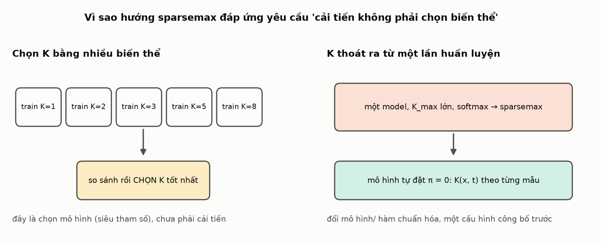

**Hình 2** *[sơ đồ]*.

**2.3. Baseline không điều khiển được số thành phần hiệu dụng.** Với softmax, π luôn dương, không có đại lượng nào đếm số thành phần và không có cơ chế nào làm nó nhỏ lại khi dữ liệu không cần. Sparsemax cho phép mô hình tự đặt π = 0 cho các thành phần không cần, theo từng mẫu và từng bước.

## 3. Ý tưởng: thay softmax bằng sparsemax

**Softmax** biến logit thành π dương và tổng bằng 1, nên mọi thành phần đều có trọng số dương. **Sparsemax** (Martins và Astudillo, 2016; trích dẫn cần kiểm tra lại) là phép chiếu Euclid lên simplex:

$$
\text{sparsemax}(z)=\arg\min_{p\in\Delta^{K-1}}\|p-z\|_2^2,\qquad
p_k=\max(z_k-\tau,\,0),
$$

trong đó $\tau$ được chọn sao cho $\sum_k p_k=1$. Điểm khác biệt quan trọng: **nhiều thành phần nhận trọng số bằng đúng 0**.


**Hình 4** *[tính]*, tính bằng đúng hàm `sparsemax` của repo trên lưới logit $(a,b,0)$ với $a,b\in[-4,4]$. Softmax (trái) chỉ cho điểm nằm bên trong tam giác. Sparsemax (phải) đẩy nhiều điểm lên **cạnh** (một π = 0, màu cam) hoặc **đỉnh** (hai π = 0, màu xanh lục). Trên lưới này, 98% điểm ra ít nhất một số 0 chính xác (con số này phụ thuộc vào khoảng giá trị của logit: logit càng gần nhau thì càng ít số 0).

Cách tìm $\tau$: sắp xếp logit giảm dần, tìm số thành phần $k(z)$ lớn nhất thỏa $1+k\,z_{(k)}>\sum_{j\le k}z_{(j)}$, rồi đặt $\tau=(\sum_{j\le k(z)}z_{(j)}-1)/k(z)$.


**Hình 5** *[tính]*, ví dụ 6 logit. Ngưỡng $\tau=1.20$ chỉ giữ lại 2 thành phần đầu, trọng số $0.80$ và $0.20$, bốn thành phần còn lại bằng đúng 0. Cùng logit đó, softmax cho cả 6 thành phần trọng số dương.

**Vì sao điều này cho K theo từng mẫu.** Logit của π do `fc` sinh ra từ trạng thái LSTM của mẫu và từ bước dự báo, nên $\pi_k(x,t)$ phụ thuộc đầu vào. Số thành phần có $\pi_k>0$ vì vậy phụ thuộc đầu vào:

$$K(x,t)=\#\{k:\pi_k(x,t)>0\}\le K_{\max}.$$

Mô hình tự quyết định thành phần nào "tắt" cho mẫu nào, chỉ qua việc huấn luyện NLL thông thường. Đây là một **đếm theo chỉ số đầu ra**, không phải số "mode hành vi" nhất quán giữa các mẫu và các bước.

## 4. Cải tiến được cài đặt như thế nào

Yêu cầu cài đặt: **không sửa `base_mdn`** và dùng lại toàn bộ code đánh giá của baseline. Cách làm: mô hình trả về đầu ra thô theo đúng định dạng baseline, chỉ thay khối π bằng $\log\pi$ (nơi $\pi>0$) hoặc một hằng số rất âm (nơi $\pi=0$):

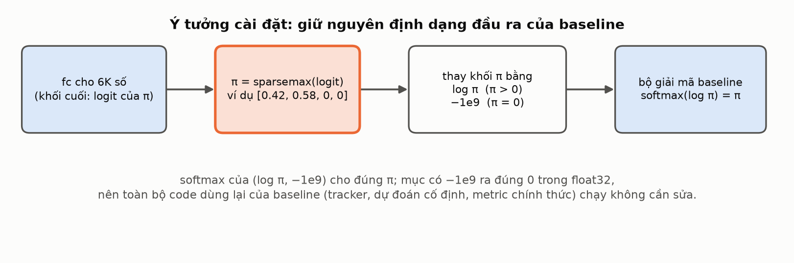

**Hình 6** *[sơ đồ]*. softmax của $(\log\pi,\,-10^9)$ cho đúng $\pi$, vì mục có $-10^9$ ra đúng 0 trong float32 và $\sum\pi=1$. Nhờ vậy tracker, dự đoán cố định và các metric chính thức của baseline chạy không cần sửa.

**Hàm loss** vẫn là NLL trung bình như baseline, nhưng tính bằng log-sum-exp *có mặt nạ*: thành phần có $\pi=0$ đóng góp đúng 0 và không nhận gradient ở mẫu đó.


**Hình 7** *[sơ đồ + ví dụ số]*. Trái: thành phần có π = 0 bị loại khỏi tổng. Phải: lý do tự cài NLL chính xác. Lớp `Categorical` của baseline làm tròn xác suất 0 thành khoảng $1.2\times10^{-7}$; nếu một thành phần "chết" nằm đúng ở điểm thật thì NLL bị kéo xuống một cách giả tạo (ví dụ minh họa: 16.60 so với 10.94 nat, không phải dữ liệu đo).

| Giữ nguyên so với baseline | Thay đổi |
|---|---|
| LSTM (hidden 8), μ, σ, ρ, decoder legacy, ma trận Σ | khối π: softmax → sparsemax |
| Adam, lr 1e-3, LinearLR, batch 4096, train/validation reduction 0.5, seed 2024 | NLL tính bằng log-sum-exp có mặt nạ (khi mọi π > 0 trùng với NLL của baseline, có test) |
| 2500 epoch, 8 mẫu validation cố định, metric chính thức mỗi 250 epoch | `num_gaussians` = K_max = 8 |
| `base_mdn/` không bị sửa (có hash kiểm tra) | thêm log mỗi epoch: số thành phần trung bình, tỉ lệ dùng đủ K_max, số thành phần chết |

Cấu hình của run **chỉ khác** cấu hình baseline `default_peds_imptc.json` ở `num_gaussians` và các khóa mô tả thí nghiệm (có test kiểm tra). Review độc lập không phát hiện sai khác nào trong vòng huấn luyện làm hỏng việc so sánh với baseline, và ghi nhận hai lưu ý về cách chấm điểm (mục 7).

## 5. Giao thức đánh giá

Giao thức gốc được viết thành [spec](../superpowers/specs/2026-10-04-sparsemax-mdn-design.md) **trước khi** huấn luyện (với K_max = 16): cấu hình, tiêu chí thành công và các rủi ro. Run K_max = 8 dùng **đúng cấu hình đó, chỉ đổi K_max** (đã đối chiếu bằng `diff` giữa hai file cấu hình; seed 2024, 2500 epoch, batch 4096, cùng baseline).

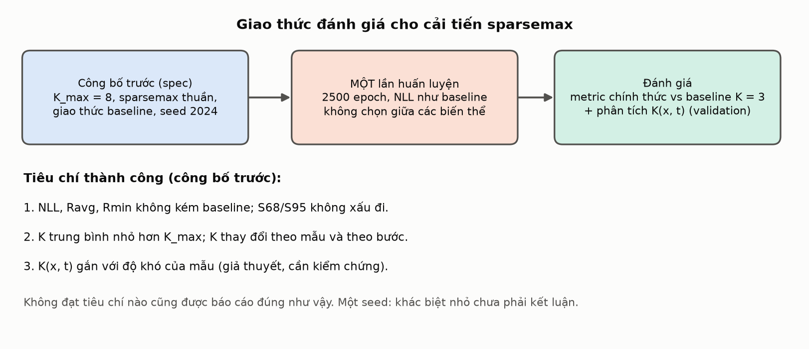

**Hình 8** *[sơ đồ]*. Một lần huấn luyện, cấu hình công bố trước, đánh giá theo tiêu chí công bố trước. Nếu không đạt tiêu chí nào thì báo cáo đúng như vậy.

**Kiểm tra trần.** Mỗi epoch ghi tỉ lệ (mẫu, bước) dùng đủ K_max = 8 thành phần. Tỉ lệ này **rất nhỏ nhưng không bằng 0** (khoảng 0.05% trên validation và 0.04% trên test), nên trần hầu như không chặn nhưng chưa phải không bao giờ chạm tới.

## 6. Kết quả của run đã train xong

Mục 6.1 đến 6.6 là trên tập **validation**, từ run `sparsemax_k8_v2_seed2024` và baseline K = 3 cùng seed 2024, cùng giao thức. Mục 6.7 đến 6.9 là trên tập **test** (đánh giá một lần). Một seed nên chênh lệch nhỏ chưa phải khẳng định.

### 6.1. Diễn biến huấn luyện

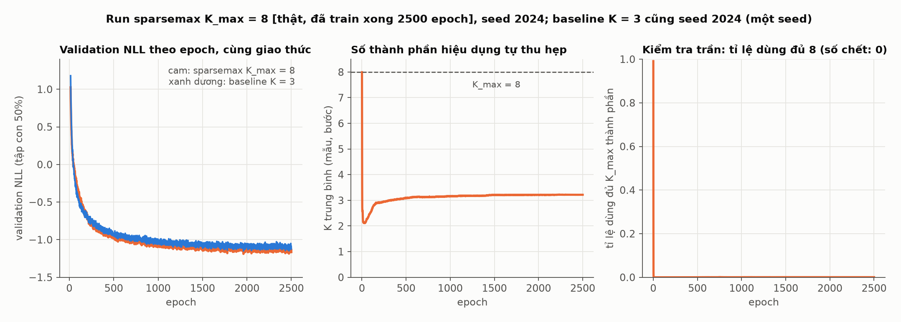

**Hình 9** **[thật]**. Trái: validation NLL (tập con 50%, cùng giao thức) của sparsemax K_max = 8 (cam) và baseline K = 3 (xanh dương). Giữa: số thành phần hiệu dụng trung bình. Phải: tỉ lệ (mẫu, bước) dùng đủ 8 thành phần.

- Số thành phần trung bình theo `history.csv`: **7.99** ở epoch đầu, giảm nhanh xuống **2.11** (epoch 33) rồi tăng nhẹ và ổn định quanh **3.2** (3.22 ở epoch 2500). Không có thành phần chết.
- Validation NLL của checkpoint tốt nhất (tập con 50% ngẫu nhiên, giao thức baseline): sparsemax **−1.189** (epoch 1961), baseline K = 3 **−1.150** (epoch 1961).

### 6.2. Metric chính thức so với baseline K = 3 (validation)

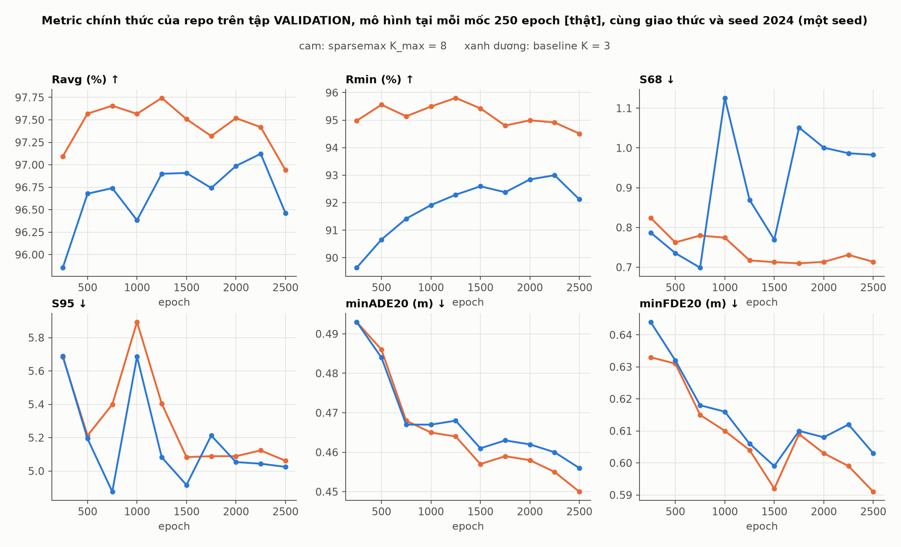

**Hình 13** **[thật]**, metric chính thức của repo trên validation, tính cho mô hình tại các mốc mỗi 250 epoch. Bảng dưới là **trung bình ± độ lệch chuẩn qua 6 mốc (epoch 1250 đến 2500)**:

| Metric (validation) | sparsemax K_max = 8 | baseline K = 3 |
|---|---:|---:|
| Ravg (%) ↑ | 97.41 ± 0.25 | 96.85 ± 0.21 |
| Rmin (%) ↑ | 95.08 ± 0.43 | 92.54 ± 0.31 |
| S68 ↓ | 0.716 ± 0.007 | 0.943 ± 0.095 |
| S95 ↓ | 5.14 ± 0.12 | 5.06 ± 0.09 |
| ASAEE ↓ | 0.238 ± 0.003 | 0.233 ± 0.002 |
| minADE20 (m) ↓ | 0.457 ± 0.004 | 0.462 ± 0.004 |
| minFDE20 (m) ↓ | 0.600 ± 0.006 | 0.606 ± 0.004 |

Đọc bảng (chỉ để mô tả, một seed):
- **Tốt hơn K = 3:** độ tin cậy (Ravg +0.56, Rmin +2.5, lớn hơn độ lệch chuẩn qua các mốc) và S68 (0.716 so với 0.943; S68 của K = 3 dao động từ 0.77 đến 1.05 qua các mốc, của sparsemax chỉ 0.71 đến 0.73).
- **Gần như bằng:** S95 (5.14 so với 5.06, trong khoảng 1 độ lệch chuẩn), minADE và minFDE (sparsemax nhỉnh hơn nhưng trong khoảng nhiễu).
- **Kém nhẹ:** ASAEE (0.238 so với 0.233).

### 6.3. Mức dùng thành phần trên toàn bộ validation

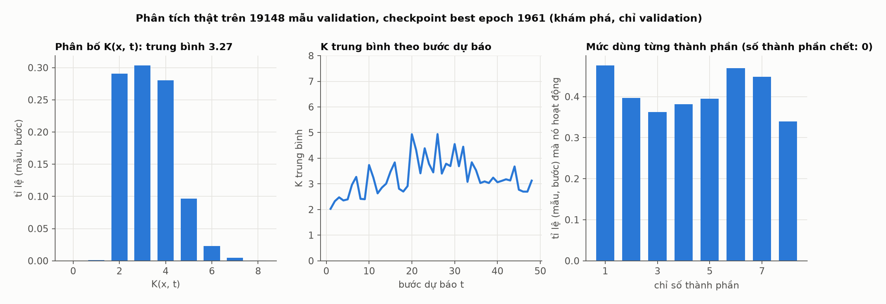

**Hình 11** **[thật]**, toàn bộ 19 148 mẫu validation, checkpoint best (epoch 1961), phân tích khám phá.
- $K(x,t)$ **trung bình 3.27** (độ lệch chuẩn 1.08): 29% ở K = 2, 30% ở K = 3, 28% ở K = 4, 9.7% ở K = 5, 2.3% ở K = 6, 0.4% ở K = 7, **0.05% ở K = 8** (dùng đủ trần), 0.1% ở K = 1.
- K trung bình theo bước dự báo: **2.0 ở bước đầu**, 2.6 ở bước 12, 3.8 ở bước 24 và 3.1 ở bước cuối; lớn nhất 4.9. Tức là K thay đổi theo bước dự báo (ít ở các bước gần, nhiều hơn ở giữa).
- Cả 8 thành phần đều được dùng (mỗi thành phần hoạt động trong 34% đến 48% số (mẫu, bước)); không có thành phần chết.

### 6.4. Dự đoán trên 8 mẫu cố định

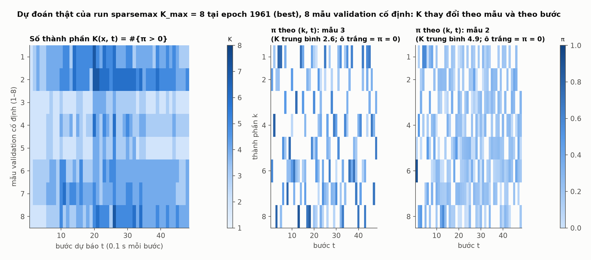

**Hình 10** **[thật]**, checkpoint best, 8 mẫu validation cố định. Trái: $K(x,t)$ thay đổi theo mẫu (hàng) và theo bước (cột); K trung bình của từng mẫu từ 2.6 đến 4.9. Phải: ma trận $\pi_k(x,t)$ của mẫu có K trung bình nhỏ nhất và lớn nhất; ô trắng là $\pi=0$ chính xác. Các thành phần được bật ở những bước khác nhau, phù hợp với việc K là đếm theo chỉ số đầu ra.

### 6.5. K có gắn với độ khó của mẫu không?

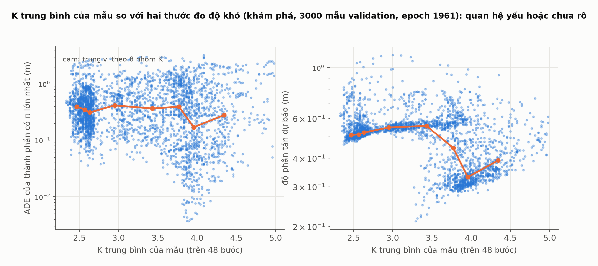

**Hình 12** **[thật]**, 3000 mẫu validation, checkpoint best. Với toàn bộ validation, hệ số Spearman giữa K trung bình của mẫu và hai thước đo độ khó là **−0.19** (với sai số của thành phần có π lớn nhất) và **−0.29** (với độ phân tán dự báo). Tức là **giả thuyết "mẫu khó có K lớn hơn" không được ủng hộ**; quan hệ còn đi ngược chiều (mẫu có phân phối rộng dùng ít thành phần hơn, điều có thể do một thành phần rộng đã đủ phủ). Hai thước đo này chỉ là xấp xỉ, nên đây là quan sát khám phá chứ không phải kết luận.

### 6.6. Đối chiếu với tiêu chí đã công bố trước (validation)

| Tiêu chí (spec mục 5) | Kết quả trên validation, một seed |
|---|---|
| 1. NLL, Ravg, Rmin không kém baseline; S68/S95 không xấu đi | **Đạt**, so với K = 3: NLL, Ravg, Rmin, S68 tốt hơn; S95 gần như bằng (5.14 so với 5.06). |
| 2. K trung bình nhỏ hơn K_max; K thay đổi theo mẫu và theo bước | **Đạt.** Trung bình 3.27 trên 8, trải từ 1 đến 8, thay đổi theo bước. |
| 3. K gắn với độ khó của mẫu | **Không được ủng hộ** (Spearman −0.19 và −0.29). |

### 6.7. Kết quả trên tập test (đánh giá một lần)

Theo giao thức, tập test được dùng **đúng một lần cho run này**, cho checkpoint tốt nhất theo validation (epoch 1961), bằng code đánh giá chính thức của repo (cách chấm kiểu baseline). Baseline K = 3 dùng kết quả test đã có (cùng giao thức, cùng seed 2024); khi chạy lại baseline K = 3 bằng cùng công cụ, các metric tái tạo đúng từng chữ số (sai khác 0.0). Tập test có 56 694 mẫu.

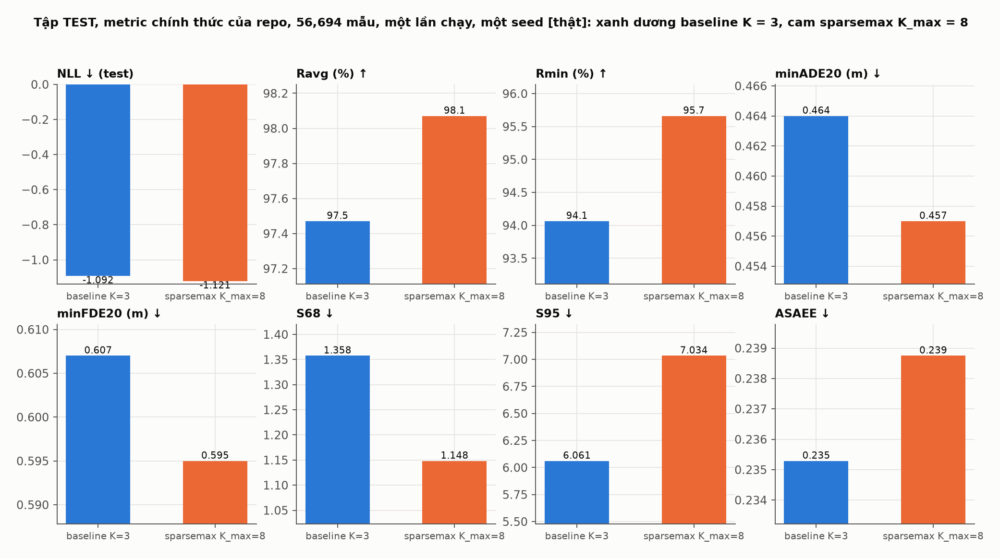

**Hình 14** **[thật]**.

| Metric (test) | sparsemax K_max = 8 | baseline K = 3 |
|---|---:|---:|
| NLL ↓ | **−1.122** | −1.092 |
| Ravg (%) ↑ | **98.07** | 97.47 |
| Rmin (%) ↑ | **95.66** | 94.07 |
| minADE20 (m) ↓ | **0.457** | 0.464 |
| minFDE20 (m) ↓ | **0.595** | 0.607 |
| S68 ↓ | **1.148** | 1.358 |
| S95 ↓ | 7.034 | **6.061** |
| ASAEE ↓ | 0.239 | **0.235** |

(NLL của sparsemax là NLL chính xác trên toàn bộ tập test, NLL của baseline là giá trị đã lưu trong `ablation.json`. Số thành phần hoạt động trên test: trung bình **3.29**, 0.04% (mẫu, bước) dùng đủ 8, không thành phần chết.)

Đọc kết quả (một seed, chỉ mô tả):
- **Tốt hơn K = 3:** NLL (hơn 0.03), Ravg (+0.60), Rmin (+1.6), minADE, minFDE và **S68 (thấp hơn 15%)**.
- **Kém hơn K = 3:** **S95 (cao hơn 16%: 7.03 so với 6.06)** và ASAEE (cao hơn 1.6%).
- Trên validation S95 gần bằng K = 3 (5.14 so với 5.06), nên mức tăng S95 trên test **không xuất hiện ở validation**. Mục 6.9 giải thích bằng số liệu từng mẫu.

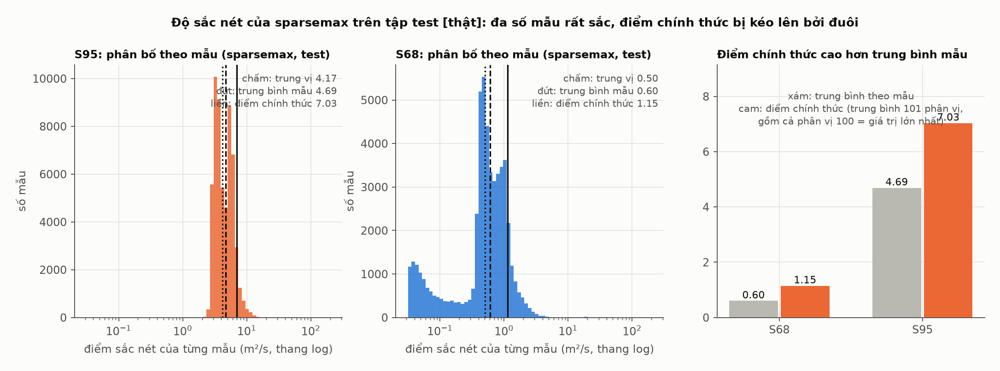

**Hình 15** **[thật]**, sparsemax K_max = 8 trên tập test. Đa số mẫu có dự đoán rất sắc: trung vị S95 theo mẫu là 4.17 và trung vị S68 là 0.50. Điểm chính thức cao hơn trung bình theo mẫu (S68: 1.15 so với 0.60; S95: 7.03 so với 4.69) vì cách tính lấy trung bình 101 phân vị và mẫu có diện tích lớn nhất đóng góp trọng số khoảng 1% (mục 6.9). Có 92 trong 56 694 mẫu có điểm S95 trên 20 (lớn nhất 132) và 12 mẫu có điểm S68 trên 20 (lớn nhất 45).

### 6.8. Đối chiếu tiêu chí công bố trước, trên tập test

| Tiêu chí (spec mục 5) | Kết quả trên test |
|---|---|
| 1. NLL, Ravg, Rmin không kém baseline; S68/S95 không xấu đi | **Đạt một phần, so với K = 3.** Đạt NLL, Ravg, Rmin, S68. **Không đạt S95** (cao hơn 16%). |
| 2. K trung bình nhỏ hơn K_max; K thay đổi theo mẫu và theo bước | **Đạt** (3.29 trên 8; thay đổi theo bước). |
| 3. K gắn với độ khó của mẫu | **Không được ủng hộ** (đo trên validation: Spearman −0.19 và −0.29; chưa đo trên test). |

**Kết luận thận trọng:** sparsemax K_max = 8 học được một K thích nghi (trung bình khoảng 3.3 thành phần hoạt động) trong một lần huấn luyện, và so với baseline K = 3 cải thiện NLL, độ tin cậy (Ravg, Rmin), quỹ đạo (minADE, minFDE) và S68 trên test, nhưng làm **S95 xấu đi** và ASAEE kém nhẹ. Đây là kết quả một seed; chênh lệch nhỏ (đặc biệt về ADE, FDE, ASAEE, Ravg) chưa phải khẳng định.

### 6.9. Vì sao S95 của sparsemax K_max = 8 cao hơn K = 3 trên test?

Trả lời ngắn: **đó là hệ quả của cách tính điểm chính thức, và toàn bộ chênh lệch nằm ở một phần của điểm là "mẫu rộng nhất ở mỗi mốc dự báo", không phải ở phần lớn mẫu.** Các số dưới đây tính từ số liệu từng mẫu của hai mô hình trên test (cùng 56 694 mẫu, cùng harness; script [analyze_s95.py](analyze_s95.py)).

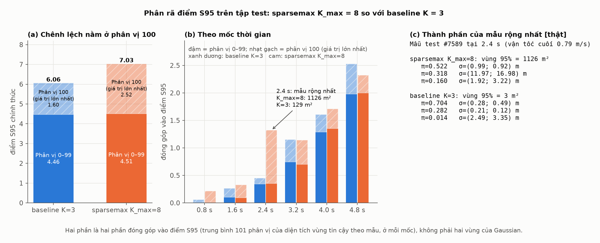

**Hình 18** **[thật]**.

**Điểm chính thức = trung bình 101 phân vị của diện tích vùng tin cậy theo mẫu, ở mỗi mốc dự báo.** Phân vị 100 là **giá trị lớn nhất**, tức diện tích của *mẫu rộng nhất* ở mốc đó (còn phân vị 0 là giá trị nhỏ nhất); lưới có đúng 101 điểm (0, 1, ..., 100) nên mỗi điểm có trọng số 1/101. Vì vậy **một mẫu duy nhất (mẫu rộng nhất) chiếm khoảng 1% điểm** của mỗi mốc, bất kể có bao nhiêu mẫu.

**Bước 1. Phân rã điểm: phần đóng góp của phân vị 0–99 gần như bằng nhau, chênh lệch nằm ở phân vị 100 (giá trị lớn nhất).**

*Lưu ý về từ "phân vị":* "phân vị 0–99" và "phân vị 100" ở đây là các điểm của **lưới 101 phân vị trong công thức điểm chính thức** (tính theo từng mốc); chúng là hai phần đóng góp vào điểm S95, **không phải hai vùng của Gaussian**. Các hàng "phân vị 90/99/99.9 theo mẫu" ở cuối bảng là một khái niệm khác: phân vị của điểm sắc nét tính cho từng mẫu.

| Test, 56 694 mẫu | S95 sparsemax | S95 K = 3 | S68 sparsemax | S68 K = 3 |
|---|---:|---:|---:|---:|
| Điểm chính thức | 7.034 | 6.061 | 1.148 | 1.358 |
| Phân vị 0 đến 99 (100 trong 101 điểm của lưới, từ giá trị nhỏ nhất đến phân vị 99) | 4.511 | 4.463 | **0.562** | 0.627 |
| **Phân vị 100 (giá trị lớn nhất, mẫu rộng nhất mỗi mốc)** | **2.523** | 1.598 | 0.587 | 0.730 |
| Trung bình theo mẫu | 4.691 | 4.705 | **0.603** | 0.694 |
| Trung vị theo mẫu | 4.174 | 3.925 | 0.503 | 0.546 |
| Phân vị 90 theo mẫu | 6.51 | 6.88 | 1.13 | 1.35 |
| Phân vị 99 theo mẫu | **10.4** | 15.0 | 2.42 | 2.83 |
| Phân vị 99.9 theo mẫu | **26.9** | 42.8 | 7.11 | 15.0 |
| Số mẫu có điểm trên 20 | **92** | 258 | **12** | 48 |

Chênh lệch S95 chính thức là **+0.973**, trong đó phân vị 0–99 chỉ **+0.048** (+1%) còn phân vị 100 là **+0.925**. Nói cách khác, nếu bỏ mẫu rộng nhất ở mỗi mốc thì S95 của hai mô hình gần như bằng nhau, và các thống kê đuôi theo mẫu (phân vị 90, 99, 99.9, số mẫu rộng bất thường) của sparsemax còn **tốt hơn** K = 3. Với S68, sparsemax tốt hơn ở cả phân vị 0–99 lẫn phân vị 100.

**Bước 2. Chênh lệch tập trung ở một mốc: 2.4 giây.** Đóng góp của phân vị 100 vào điểm S95, theo mốc:

| Mốc | sparsemax | K = 3 | Chênh lệch | Diện tích mẫu rộng nhất (m²): sparsemax / K = 3 |
|---|---:|---:|---:|---|
| 0.8 s | 0.203 | 0.049 | +0.154 | 79 / 19 |
| 1.6 s | 0.231 | 0.162 | +0.069 | 179 / 126 |
| **2.4 s** | **0.968** | 0.110 | **+0.858** | **1126 / 129** |
| 3.2 s | 0.440 | 0.408 | +0.032 | 682 / 633 |
| 4.0 s | 0.357 | 0.318 | +0.039 | 693 / 618 |
| 4.8 s | 0.324 | 0.550 | −0.226 | 754 / 1280 |
| Tổng | 2.523 | 1.598 | +0.925 | |

Riêng mốc 2.4 s đóng góp **+0.858**, tức khoảng 93% của +0.925. Ở mốc cuối (4.8 s) mẫu rộng nhất của K = 3 lại rộng hơn của sparsemax (1280 so với 754 m²). Vì vậy đây là chuyện của **một vài mẫu cực đoan khác nhau ở mỗi mô hình**, không phải dự đoán điển hình rộng hơn.

**Bước 3. Mẫu rộng nhất trông như thế nào.** Mẫu test #7589 ở 2.4 s (người đi với vận tốc cuối 0.79 m/s). Các thành phần của hai mô hình ở bước đó:

| | π | σ (x; y) |
|---|---:|---|
| **sparsemax K_max = 8** (vùng 95%: 1126 m²) | 0.522 | (0.99; 0.92) m |
| | **0.318** | **(11.97; 16.98) m** |
| | 0.160 | (1.92; 3.22) m |
| **baseline K = 3** (vùng 95%: 3 m²) | 0.704 | (0.28; 0.49) m |
| | 0.282 | (0.21; 0.12) m |
| | 0.014 | (2.49; 3.35) m |

Sparsemax đặt **32% xác suất vào một thành phần rất rộng** (σ khoảng 12 và 17 m); để vùng tin cậy 95% phủ được khối lượng đó nó phải trải rộng tới khoảng 1126 m² (gần bằng toàn bộ lưới 1296 m²). K = 3 cho các thành phần rất hẹp nên vùng chỉ khoảng 3 m². Đây là một hiện tượng **hiếm**: trên validation, tỉ lệ mẫu có thành phần với σ lớn hơn 5 m mang hơn 5% khối lượng xác suất chỉ là 0.01% ở 2.4 s và 0.14% ở 4.8 s cho sparsemax, so với 0.00% và 0.71% cho K = 3 (dữ liệu trong [data/s95_explained.json](data/s95_explained.json)). Ở hầu hết các mốc tỉ lệ này của sparsemax thấp hơn hoặc bằng K = 3 (ở 2.4 s cả hai đều rất nhỏ: 0.01% so với 0.00%), nên về tổng thể không có bằng chứng rằng sparsemax dùng thành phần rộng nhiều hơn K = 3.

**Điều tài liệu này không chứng minh, và những lưu ý:**
- Ở 2.4 s đuôi trên của sparsemax rộng hơn của K = 3 không chỉ ở một mẫu: 6 mẫu rộng nhất có diện tích 1126, 476, 360, 358, 232, 230 m², so với 129, 122, 108, 98, 97, 97 m² của K = 3. Hai trong số đó có chỉ số liên tiếp (#48289 và #48290), gợi ý các khung liên tiếp của cùng một người đi bộ, nhưng **chưa kiểm tra**.
- **Giả thuyết chưa kiểm chứng** về cơ chế: một thành phần rộng có trọng số lớn có thể là "bảo hiểm" cho NLL (hàm mục tiêu thưởng việc phủ được các điểm hiếm). Chưa có thí nghiệm nào xác nhận quan hệ nhân quả.
- **Một seed:** mẫu rộng nhất là một giá trị cực trị nên rất nhạy với seed; chưa biết mức dao động.
- Việc xác định mẫu #7589 và đọc thành phần của nó là **một lần đọc chẩn đoán trên đầu vào test** (để giải thích, không dùng để chọn hay chỉnh mô hình).
- S95 chính thức của sparsemax vẫn **cao hơn K = 3 theo đúng metric của repo**: giải thích trên cho thấy nguyên nhân, không biến nó thành tốt hơn.

**Cách báo cáo đề xuất:** nêu điểm chính thức (S95 7.03 so với 6.06, sparsemax xấu hơn) cùng với trung vị, phân vị 99 và số mẫu rộng bất thường (sparsemax tốt hơn), và nói rõ chênh lệch nằm ở mẫu cực đại ở mốc 2.4 s.

## 7. Giới hạn và những điều chưa biết

- **Test đã dùng cho run này** (6.7) và, như ghi chú ở đầu, test cũng đã được dùng cho K_max = 16; việc chọn K_max = 8 để trình bày diễn ra sau khi biết kết quả test của K_max = 16. Không dùng test để chỉnh phương pháp nữa; mọi cải tiến thêm phải kiểm trên validation hoặc một tập/seed khác.
- **Một seed.** Phương sai giữa các seed chưa biết, nên chênh lệch nhỏ chưa phải khẳng định. Các chỉ số đuôi (S68, S95, Rmin) đặc biệt nhạy.
- **Điểm sắc nét chính thức nhạy với vài mẫu ngoại lai** (6.9); nên báo thêm trung vị và các phân vị khi so sánh. Một số mẫu dự đoán cực rộng có thể cần giới hạn trên cho σ (thí nghiệm riêng).
- **Không giải quyết quá khớp.** Sparsemax không phạt σ nhỏ và không chặn việc mở nhiều thành phần hẹp.
- **Cách chấm điểm chính thức chưa hoàn toàn chính xác.** Các metric của baseline dựa trên `Categorical`, chấm thành phần π = 0 với trọng số khoảng $1.2\times10^{-7}$ thay vì 0. NLL train/validation của baseline cũng dùng cách làm tròn đó nên hai NLL không hoàn toàn cùng một đại lượng khi so sánh.
- **Số tham số** của sparsemax K_max = 8 là 21 184 so với 8 224 của K = 3 (do đầu ra có 8 thành phần); cải thiện có thể một phần đến từ đầu ra lớn hơn, không chỉ từ sparsemax. Tài liệu này chưa tách hai yếu tố đó.
- **Thành phần "chết" có thể xuất hiện** (π = 0 thì không có gradient); hiện chưa xảy ra.
- **Hằng số thiết kế:** K_max và α = 2 (sparsemax thuần) không được dùng để chọn kết quả báo cáo; K_max = 8 được chọn sau khi biết kết quả của K_max = 16.
- **Không tuyên bố phương pháp mới.** Chưa tra cứu xem sparsemax cho trọng số của MDN quỹ đạo đã có ai làm chưa; trích dẫn Martins và Astudillo (2016) cần được kiểm tra trước khi dùng.
- **Tốc độ:** khoảng 1.9 giây mỗi epoch (có lúc chia GPU với run khác), so với 0.65 giây của baseline K = 3.

## 8. Bản đồ file và cách chạy lại

| Việc | File |
|---|---|
| Sparsemax (sort/cumsum, autograd) | [sparsemax.py](../../sparsemax_mdn/sparsemax.py) |
| Mô hình, đầu ra thô theo định dạng baseline | [model.py](../../sparsemax_mdn/model.py) |
| NLL có mặt nạ | [loss.py](../../sparsemax_mdn/loss.py) |
| Tracker, thống kê K mỗi epoch | [artifacts.py](../../sparsemax_mdn/artifacts.py) |
| Huấn luyện, phân tích K (chỉ validation), đánh giá | [train.py](../../sparsemax_mdn/train.py), [analyze_k.py](../../sparsemax_mdn/analyze_k.py), [evaluate.py](../../sparsemax_mdn/evaluate.py) |
| Cấu hình K_max = 8 | [sparsemax_k8_peds_imptc.json](../../sparsemax_mdn/configs/imptc/sparsemax_k8_peds_imptc.json) |
| Thiết kế và giao thức công bố trước | [spec](../superpowers/specs/2026-10-04-sparsemax-mdn-design.md) |
| Phân tích S95 và hình 18 | [analyze_s95.py](analyze_s95.py), [data/s95_explained.json](data/s95_explained.json) |

```bash
# kiểm thử
.venv/bin/python -m unittest discover -s sparsemax_mdn/tests -t .
# phân tích K trên validation (không dùng test)
.venv/bin/python -m sparsemax_mdn.analyze_k --run-id sparsemax_k8_v2_seed2024 --config sparsemax_k8_peds_imptc --gpu -1
# đánh giá test (chỉ một lần; đã chạy)
# .venv/bin/python -m sparsemax_mdn.evaluate --run-id sparsemax_k8_v2_seed2024 --config sparsemax_k8_peds_imptc --split test --confirm-test-once --gpu 0
# phân tích S95 và sinh lại các hình
.venv/bin/python docs/sparsemax_mdn_k8/analyze_s95.py
.venv/bin/python docs/sparsemax_mdn_k8/generate_beginner_figures.py
.venv/bin/python docs/sparsemax_mdn_k8/generate_figures.py
```
