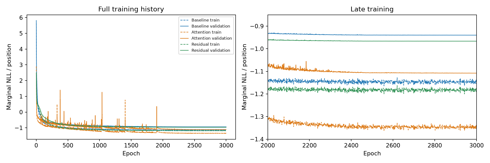
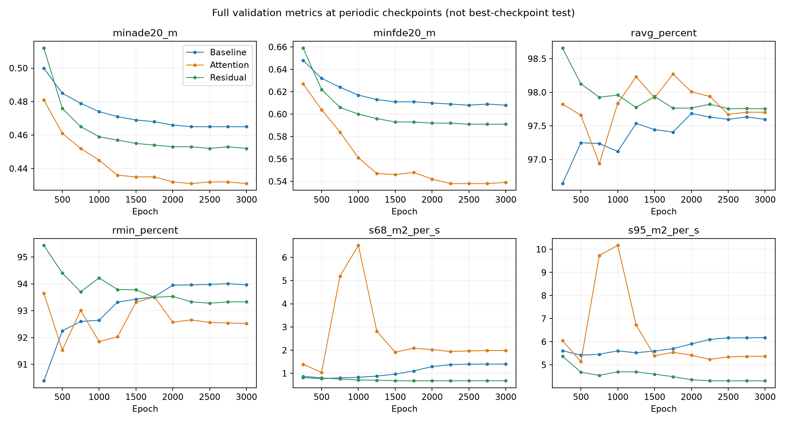
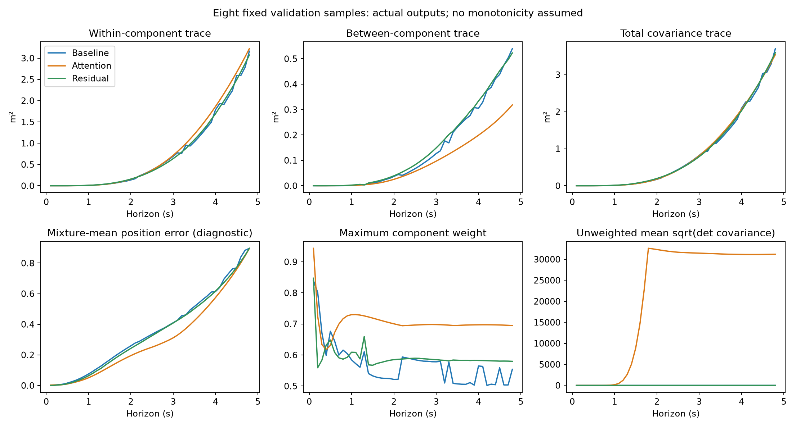
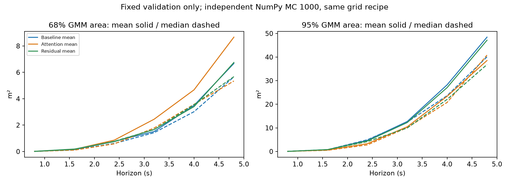
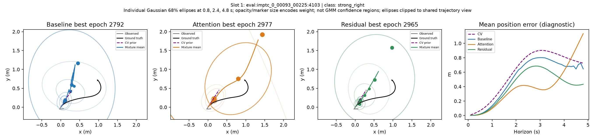
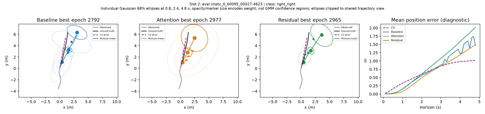
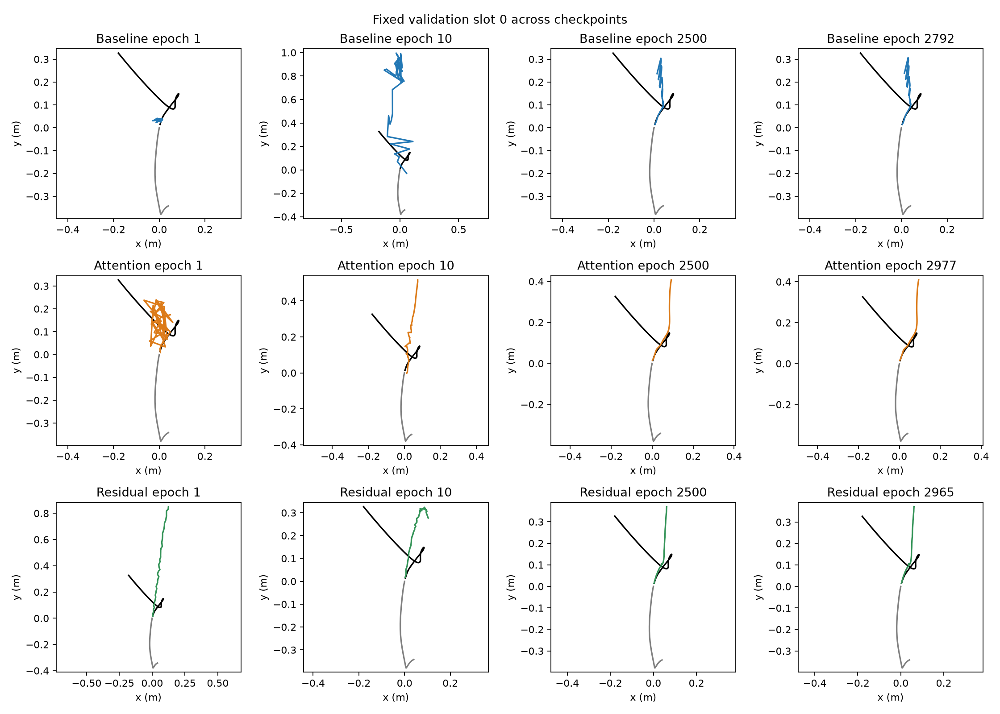

# Phân tích baseline stable, attention và residual MDN

Audit toàn bộ confidence area đã hoàn tất sau báo cáo ban đầu: [AREA_AUDIT.md](AREA_AUDIT.md). Audit tái hiện scalar test và xác nhận Q100 giải thích toàn bộ mức tăng sharpness residual so với baseline; phần Q0–Q99 giảm nhẹ. Các đoạn dưới mô tả phân tích ban đầu và giới hạn lúc chưa có per-sample area.

## Kết luận có thể sử dụng trong đồ án

Residual CV + LSTM–MDN cải thiện NLL và sai số vị trí trung bình so với baseline stable trên test ở seed 2024. Tuy nhiên, Rmin giảm và điểm sharpness tăng. Attention đạt NLL/ADE/FDE tốt nhất trong ba model nhưng cũng đánh đổi reliability/sharpness. Chưa có model tốt nhất trên mọi tiêu chí; chưa có kiểm định nhiều seed.

Phân tích đầu ra cho thấy residual không tăng covariance đồng đều trên mọi mẫu. Một số outlier test có vùng confidence rất rộng, đặc biệt ở horizon ngắn. Cách tổng hợp sharpness hiện tại có sử dụng phân vị cực đại, nên nhạy với các trường hợp này. Đây là bằng chứng về một nguyên nhân có thể đóng góp; chưa phân rã đầy đủ mức chênh lệch S68/S95 chính thức.

## Kết quả test chính thức đã lưu

56.694 mẫu test; best chọn bằng full validation NLL; cùng seed/evaluator/MC/grid. Đây là các số từ evaluation.json, không thay bằng metric chẩn đoán mới.

| Chỉ số | Baseline | Attention | Residual |
|---|---:|---:|---:|
| test_nll | -0.926869 | -1.107224 | -0.964047 |
| minade20_m | 0.468000 | 0.436000 | 0.457000 |
| minfde20_m | 0.612000 | 0.541000 | 0.592000 |
| ravg_percent | 98.181587 | 98.189501 | 98.236488 |
| rmin_percent | 94.626415 | 92.677356 | 93.054186 |
| s68_m2_per_s | 0.847620 | 3.583653 | 3.070744 |
| s95_m2_per_s | 5.735489 | 6.897894 | 8.478262 |
| asaee_m_per_s | 0.236905 | 0.232492 | 0.242489 |

## Lịch sử học và metric validation





Sau khoảng 2.000–2.500 epoch, đường validation NLL và displacement metric cải thiện chậm. Việc thêm 500 epoch không tạo thay đổi lớn. Các đường metric là checkpoint định kỳ, không phải metric test của best checkpoint. Sharpness residual trên validation định kỳ thấp hơn baseline; thứ hạng này không được giữ trên test. Vì vậy, chỉ xem validation trung bình hoặc một vài ví dụ sẽ bỏ sót trường hợp bất thường.

## Kiểm tra 8 mẫu validation cố định

Đã kiểm tra sample_id, X và y bằng array equality giữa cả ba model; đường CV cũng được đối chiếu với artifact residual. Best epoch lần lượt 2792 / 2977 / 2965. Không chọn lại các mẫu theo kết quả thuận lợi.

Mixture mean dùng cho hình là Σ pi_k mu_k. Sai số của đường này là chẩn đoán bổ sung, không phải minADE20/minFDE20 của repository. Đường nối các mean chỉ để đọc vị trí theo thời gian; không chứng minh một phân phối joint trên toàn quỹ đạo.

Phân rã covariance marginal:

- Within = Σ pi_k trace(Sigma_k).
- Between = Σ pi_k ||mu_k − mu_bar||².
- Total = Within + Between, tức trace của covariance GMM.

| Model | Within trung bình (m²) | Between trung bình (m²) | Sai số mixture mean trung bình (m) |
|---|---:|---:|---:|
| Baseline | 0.7409 | 0.1397 | 0.3529 |
| Attention | 0.8035 | 0.0900 | 0.3008 |
| Residual | 0.7418 | 0.1473 | 0.3419 |



Within của residual gần baseline trên 8 mẫu này. Attention có Gaussian cực rộng nhưng trọng số rất nhỏ ở một số mẫu: trung bình covariance không có trọng số vì thế khác hẳn covariance GMM có trọng số. Không thể kết luận chất lượng uncertainty từ sigma riêng lẻ.



Diện tích GMM 68%/95% được chẩn đoán với grid [-18,18]², 361×361 điểm, 1.000 MC samples. Đây là 8 mẫu validation và RNG NumPy riêng; không phải chạy lại toàn bộ metric test hay tái hiện từng bit RNG Torch. Đường solid là mean, dashed là median. Không dùng các số này để thay thế bảng test.

## Mẫu tốt, khó và thất bại

Tất cả 8 mẫu đều có hình. Nhãn movement_class lấy nguyên từ manifest; đây không phải đánh giá tự động mức độ dễ/khó.

| Slot | Nhãn dữ liệu | Baseline mean error | Attention mean error | Residual mean error | Hình |
|---|---|---:|---:|---:|---|
| 0 | light_left | 0.064 | 0.081 | 0.085 | [Xem](sample_00.png) |
| 1 | strong_right | 0.510 | 0.387 | 0.401 | [Xem](sample_01.png) |
| 2 | light_right | 0.740 | 0.652 | 0.860 | [Xem](sample_02.png) |
| 3 | straight | 0.436 | 0.130 | 0.408 | [Xem](sample_03.png) |
| 4 | light_left | 0.573 | 0.593 | 0.563 | [Xem](sample_04.png) |
| 5 | standing | 0.061 | 0.039 | 0.043 | [Xem](sample_05.png) |
| 6 | standing | 0.054 | 0.043 | 0.047 | [Xem](sample_06.png) |
| 7 | light_right | 0.384 | 0.481 | 0.328 | [Xem](sample_07.png) |

- Slot 5–6 (standing): cả ba có sai số mean nhỏ, residual cải thiện nhẹ so với baseline.
- Slot 1 (strong_right): residual giảm mean error so với baseline; attention tốt ở các mốc đầu nhưng tăng lỗi gần cuối horizon.
- Slot 2 (light_right): residual có mean error cao hơn baseline, là ví dụ thất bại của cải tiến.
- Slot 3 (straight): attention tốt hơn rõ trên mẫu này; residual vẫn có lỗi đáng kể. Prior CV không đảm bảo dự báo tốt trên mọi mẫu đi thẳng.





Các ellipse biểu diễn 68% của từng Gaussian bivariate, không phải vùng 68% của toàn GMM. Kích thước marker và opacity biểu diễn trọng số. Trục chung được giới hạn quanh observed/GT/CV/mixture mean để đọc đường dự báo; ellipse lớn bị cắt ở mép hình. Tham số đầy đủ vẫn có trong NPZ nguồn.



## Audit covariance toàn bộ validation và test

Chạy inference best checkpoint trên toàn bộ 19.148 validation và 56.694 test, không optimizer/training. Các số sau lấy trung bình trace GMM qua sáu horizon chính thức trên từng mẫu, rồi tổng hợp giữa các mẫu. Đây là diagnostic về covariance, không phải sharpness confidence area.

| Model | Split | Mean trace (m²) | Median trace | P99 trace | Max trace |
|---|---|---:|---:|---:|---:|
| Baseline | validation | 1.289 | 1.184 | 4.373 | 117.144 |
| Baseline | test | 1.299 | 1.180 | 4.333 | 66.318 |
| Attention | validation | 1.254 | 0.849 | 4.778 | 1468.267 |
| Attention | test | 8.119 | 0.844 | 5.136 | 328759.000 |
| Residual | validation | 1.150 | 0.998 | 3.121 | 79.028 |
| Residual | test | 1.254 | 1.004 | 3.229 | 1426.372 |

Residual test có median trace thấp hơn baseline, nhưng max trace lớn hơn nhiều. Attention có median nhỏ nhưng mean bị kéo lên bởi outlier cực lớn. Đây là lý do cần xem cả phân vị và các trường hợp cực trị.

Đối chiếu grid/MC trên ba mẫu có total trace lớn nhất mỗi split:

| Model / split | Index | Source | Area68 @0.8s | Area95 @0.8s | Area68 @4.8s | Area95 @4.8s |
|---|---:|---|---:|---:|---:|---:|
| Baseline/validation | 5458 | imptc_0_00122_00161 | 1.99 | 6.61 | 465.42 | 814.77 |
| Baseline/validation | 4001 | imptc_0_00093_00116 | 0.26 | 1.06 | 24.63 | 698.86 |
| Baseline/validation | 4000 | imptc_0_00093_00115 | 0.19 | 1.01 | 13.69 | 705.43 |
| Baseline/test | 33794 | imptc_0_00739_00021 | 0.11 | 0.28 | 119.69 | 1117.70 |
| Baseline/test | 33784 | imptc_0_00739_00011 | 0.17 | 0.41 | 30.60 | 81.27 |
| Baseline/test | 33785 | imptc_0_00739_00012 | 0.17 | 0.48 | 26.11 | 69.94 |
| Attention/validation | 13232 | imptc_0_00272_00004 | 0.05 | 0.15 | 667.93 | 1007.05 |
| Attention/validation | 5458 | imptc_0_00122_00161 | 10.74 | 30.60 | 396.93 | 657.78 |
| Attention/validation | 5456 | imptc_0_00122_00158 | 32.87 | 86.75 | 189.61 | 321.19 |
| Attention/test | 38269 | imptc_0_00814_00025 | 0.23 | 1.10 | 866.60 | 1296.00 |
| Attention/test | 48271 | imptc_0_01002_00023 | 0.11 | 0.26 | 1296.00 | 1296.00 |
| Attention/test | 48272 | imptc_0_01002_00024 | 0.10 | 0.22 | 993.81 | 1296.00 |
| Residual/validation | 5470 | imptc_0_00122_00173 | 0.21 | 0.58 | 49.20 | 133.52 |
| Residual/validation | 5471 | imptc_0_00122_00174 | 0.18 | 0.54 | 50.06 | 138.51 |
| Residual/validation | 5472 | imptc_0_00122_00175 | 0.11 | 0.48 | 40.59 | 118.98 |
| Residual/test | 33794 | imptc_0_00739_00021 | 530.26 | 890.31 | 785.47 | 1275.02 |
| Residual/test | 33793 | imptc_0_00739_00020 | 326.27 | 624.79 | 850.10 | 1296.00 |
| Residual/test | 33795 | imptc_0_00739_00022 | 302.54 | 512.75 | 410.62 | 676.09 |

Đáng chú ý: residual test index 33794 có Area68 tại 0.8 s khoảng 530 m²; baseline cùng index chỉ khoảng 0.109 m² trong phép chẩn đoán này. Các index 33793–33795 thuộc các cửa sổ gần nhau của cùng source, nên không xem chúng là bằng chứng độc lập về tần suất lỗi. Một số confidence area chạm trần 1.296 m² của grid: diện tích thực ngoài grid chưa được đo; metric bị giới hạn bởi miền tích phân.

## Công thức sharpness thực tế và giới hạn

Nguồn: stable_mdn/eval.py (build_confidence_set_mdn, estimate_sharpness) và stable_mdn/vis.py (plot_sharpness_over_time).

1. Với mỗi điểm grid z, confidence = tỷ lệ sample GMM có log density lớn hơn log density tại z.
2. Area_kappa(h) = tỷ lệ điểm grid có confidence ≤ kappa × 36 × 36.
3. Giữa các mẫu, tính các phân vị q=0,1,…,100 tại từng horizon.
4. Scalar hiện tại = (1/4.8) × Σ_h [mean_q Q_q(Area_kappa(h)) / t_h], với t_h=0.8,1.6,…,4.8 s.

Đường vẽ trong evaluator là Q50; scalar dùng mean của 101 phân vị, gồm Q100 (max), không phải median. Với N rất lớn, riêng max vẫn có trọng số 1/101; một mẫu cực trị có thể ảnh hưởng đáng kể dù tần suất nhỏ. Phép chia cho t_h cũng tăng tác động của diện tích bất thường ở horizon sớm. Vì vậy, scalar không đồng nhất với trung bình diện tích trên toàn bộ mẫu.

Bảng official giữ nguyên nhãn đơn vị và phép tổng hợp local hiện có. Phép chuẩn hóa thêm 1/(num_steps*dt) cần được rà soát khi giải thích thứ nguyên học thuật; tài liệu này không tự sửa metric hoặc gán cách tổng hợp đó cho paper. Trường sharpness_formula_version='corrected' nói về phần diện tích grid đã sửa, không chứng minh toàn bộ scalar đã được chuẩn hóa theo paper.

Chưa lưu toàn bộ per-sample confidence area của lần test trước, nên chưa thể phân rã chính xác đóng góp Q100 vào chênh lệch scalar đã công bố. Audit hiện tại chỉ xác nhận covariance và confidence-area outlier tồn tại. Không coi chúng là nguyên nhân duy nhất; reliability, thay đổi hình dạng mixture, MC noise và clipping grid còn ảnh hưởng.

## Bước cải tiến đề xuất sau phân tích

1. Nếu cần kết luận uncertainty chặt chẽ: chạy một audit evaluator riêng, lưu per-sample area theo horizon cùng ID, MC/grid/provenance; giữ evaluator chính thức hiện tại để so sánh. Báo riêng mean/median/P95/P99/max và tỷ lệ confidence region chạm biên. Chưa chạy audit full này trong bước phân tích hiện tại.
2. Nếu cần thử model mới: ưu tiên nghiên cứu covariance có giới hạn vật lý hoặc regularization chống outlier. Đây là giả thuyết xuất phát từ validation/outlier audit; giới hạn sigma, trọng số regularization và lựa chọn model phải được chốt bằng train/validation. Không tự chọn ngưỡng theo các index test ở trên, không sửa checkpoint/model đang có.
3. Nếu mục tiêu hoàn thiện đồ án: kết quả ba model hiện đủ để trình bày ablation về trade-off. Dùng baseline làm mốc, attention cho cải thiện displacement rõ hơn, residual cho thay đổi nhỏ với cùng số tham số. Không cần tiếp tục kéo dài cùng run chỉ vì chưa có một model thắng mọi metric.
4. Khi tuyên bố cải thiện ổn định, cần nhiều seed và protocol cố định. Mọi training mới cần được duyệt riêng.

## Tái tạo và nguồn

```bash
.venv/bin/python residual_mdn/analysis/compare_models.py
.venv/bin/python residual_mdn/analysis/scan_distribution.py
.venv/bin/python residual_mdn/analysis/write_report.py
```

Nguồn kết quả test: results/comparisons/stable_three_models/comparison.json. Nguồn hình: fixed_samples/inputs.npz và predictions/best.npz của từng run continuation500; lịch sử lấy cả run2500 và continuation500. Nguồn định danh nằm trong diagnostics.json; full_split_distribution.json chứa thống kê và index/source outlier. fixed_diagnostics.npz lưu diện tích chẩn đoán 8 mẫu. Model/checkpoint/config/loss/official metrics không được thay đổi bởi các script này.
