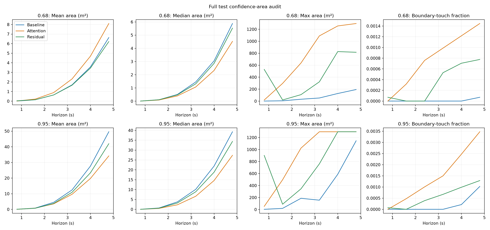

# Audit diện tích confidence theo từng mẫu

Audit best checkpoint cả validation/test, seed 2024, sáu horizon, grid [-18,18]² với resolution 0.1, MC 1000. Lưu areas_m2.npy, touches_boundary.npy, identifiers.npz và summary.json trong results/comparisons/confidence_area_audit/full. Replay thứ tự sampling ADE/reliability/grid của evaluator; phép rank bằng searchsorted tương đương strict > và đã kiểm tra ties/đầu ra checkpoint khi smoke. Không sửa metric chính thức.

Boundary-touch nghĩa là ít nhất một điểm vùng confidence nằm trên biên grid, không phải tỷ lệ probability mass ngoài grid. Confidence area chạm trần 1296 m² bị giới hạn bởi miền đo. Scalar local trung bình 101 phân vị và có thêm chuẩn hóa horizon như code hiện tại; Q100 contribution dưới đây là thành phần chính xác của scalar audit, không phải độ cải thiện model.

| Model | Split | Level | Scalar audit | Scalar test trước | Delta | Q100 contribution | Q100 / scalar |
|---|---|---:|---:|---:|---:|---:|---:|
| Baseline | validation | 0.95 | 6.186817 | — | — | 1.638238 | 26.48% |
| Baseline | validation | 0.68 | 1.399084 | — | — | 0.770453 | 55.07% |
| Baseline | test | 0.95 | 5.735489 | 5.7354894989455145 | 8.881784197001252e-16 | 1.091409 | 19.03% |
| Baseline | test | 0.68 | 0.847620 | 0.8476199744815084 | 0.0 | 0.221121 | 26.09% |
| Attention | validation | 0.95 | 5.326437 | — | — | 2.140293 | 40.18% |
| Attention | validation | 0.68 | 1.969373 | — | — | 1.266888 | 64.33% |
| Attention | test | 0.95 | 6.897894 | 6.897894195648916 | 8.881784197001252e-16 | 3.715760 | 53.87% |
| Attention | test | 0.68 | 3.583653 | 3.583653268833687 | 4.440892098500626e-16 | 2.884365 | 80.49% |
| Residual | validation | 0.95 | 4.306685 | — | — | 0.369889 | 8.59% |
| Residual | validation | 0.68 | 0.684006 | — | — | 0.082547 | 12.07% |
| Residual | test | 0.95 | 8.478262 | 8.478261774970989 | 0.0 | 4.449805 | 52.48% |
| Residual | test | 0.68 | 3.070744 | 3.07074391320609 | 0.0 | 2.468853 | 80.40% |

## Phân rã chênh lệch test so với baseline

| Model | Level | Delta scalar | Delta phần Q100 | Delta phần Q0–Q99 |
|---|---|---:|---:|---:|
| Attention | 0.68 | +2.736033 | +2.663243 | +0.072790 |
| Attention | 0.95 | +1.162405 | +2.624351 | -1.461947 |
| Residual | 0.68 | +2.223124 | +2.247732 | -0.024608 |
| Residual | 0.95 | +2.742772 | +3.358396 | -0.615624 |

Đây là phân rã đại số của scalar: Delta = Delta Q100 + Delta Q0–Q99. Không phải phép thử thay model, không loại mẫu, không đổi metric. Nếu Delta Q100 lớn hơn Delta scalar, phần Q0–Q99 đang bù lại theo chiều ngược. Không suy ra mean area hoặc mọi mẫu đều cải thiện chỉ từ phần Q0–Q99.

## Kết luận từ audit

- Scalar test audit khớp score đã lưu trong phạm vi sai số làm tròn (xem delta bảng trên). Vì thế phân rã Q100 giải thích trực tiếp score test hiện có.
- Residual S68 tăng 2.223124 so với baseline; riêng Q100 tăng 2.247732, phần Q0–Q99 giảm 0.024608. Với S95, Q100 tăng 3.358396 trong khi Q0–Q99 giảm 0.615624. Phần tăng scalar tập trung ở cực đại, không phải bằng chứng mọi vùng dự báo đều rộng hơn.
- Tại 4.8 s, residual mean Area68 là 6.218 m² và median là 5.529 m², thấp hơn baseline 6.637 / 5.877 m². Mean Area95 residual cũng thấp hơn ở mốc này (41.977 so với 49.612 m²). Ngược lại, tại 0.8 s mean Area68 residual cao hơn baseline (0.036 so với 0.009 m²). Kết luận phụ thuộc horizon và phép tổng hợp.
- Các vùng chạm biên hiếm nhưng có thật; không dùng grid hiện tại để suy ra diện tích vô hạn hay xác suất ngoài grid. Reliability residual vẫn kém hơn ở Rmin, nên area nhỏ hơn ở nhiều mẫu không tự chứng minh uncertainty tốt hơn toàn diện.
- Hướng tiếp theo có cơ sở hơn là kiểm tra input/raw log-sigma của outlier validation và thiết kế kiểm soát covariance trên train/validation. Cần đánh giá khả năng làm giảm coverage khi giới hạn sigma. Chưa thay parameterization, loss hoặc chạy training mới.

## Diện tích và chạm biên theo horizon

### Baseline / validation

| Level | Horizon | Mean m² | Median m² | P95 m² | P99 m² | Max m² | Touch boundary % | Full-grid % |
|---|---:|---:|---:|---:|---:|---:|---:|---:|
| 0.95 | 0.8 | 0.045 | 0.040 | 0.090 | 0.179 | 7.091 | 0.0000 | 0.0000 |
| 0.95 | 1.6 | 0.819 | 0.686 | 1.701 | 3.431 | 53.960 | 0.0000 | 0.0000 |
| 0.95 | 2.4 | 4.459 | 3.739 | 8.937 | 18.071 | 502.246 | 0.0052 | 0.0000 |
| 0.95 | 3.2 | 12.173 | 10.004 | 22.495 | 43.466 | 547.613 | 0.0052 | 0.0000 |
| 0.95 | 4.0 | 27.264 | 21.640 | 53.150 | 111.862 | 785.450 | 0.0052 | 0.0000 |
| 0.95 | 4.8 | 48.732 | 38.754 | 93.105 | 193.842 | 839.370 | 0.0522 | 0.0000 |
| 0.68 | 0.8 | 0.009 | 0.010 | 0.020 | 0.040 | 2.238 | 0.0000 | 0.0000 |
| 0.68 | 1.6 | 0.141 | 0.109 | 0.338 | 0.706 | 21.550 | 0.0000 | 0.0000 |
| 0.68 | 2.4 | 0.647 | 0.507 | 1.681 | 3.103 | 164.385 | 0.0000 | 0.0000 |
| 0.68 | 3.2 | 1.724 | 1.482 | 4.008 | 7.608 | 261.137 | 0.0000 | 0.0000 |
| 0.68 | 4.0 | 3.606 | 3.113 | 8.569 | 15.748 | 430.873 | 0.0052 | 0.0000 |
| 0.68 | 4.8 | 6.696 | 5.987 | 15.570 | 28.042 | 477.275 | 0.0052 | 0.0000 |

Outlier 68% tại horizon đầu (xếp theo diện tích; cửa sổ gần nhau không độc lập):

- Index 5458: `eval:imptc_0_00122_00161:5458`, source `imptc_0_00122_00161`.
- Index 5457: `eval:imptc_0_00122_00159:5457`, source `imptc_0_00122_00159`.
- Index 5459: `eval:imptc_0_00122_00162:5459`, source `imptc_0_00122_00162`.
- Index 4001: `eval:imptc_0_00093_00116:4001`, source `imptc_0_00093_00116`.
- Index 5456: `eval:imptc_0_00122_00158:5456`, source `imptc_0_00122_00158`.
### Baseline / test

| Level | Horizon | Mean m² | Median m² | P95 m² | P99 m² | Max m² | Touch boundary % | Full-grid % |
|---|---:|---:|---:|---:|---:|---:|---:|---:|
| 0.95 | 0.8 | 0.046 | 0.040 | 0.090 | 0.209 | 3.779 | 0.0000 | 0.0000 |
| 0.95 | 1.6 | 0.841 | 0.696 | 1.760 | 3.859 | 19.362 | 0.0000 | 0.0000 |
| 0.95 | 2.4 | 4.499 | 3.779 | 9.249 | 18.101 | 187.089 | 0.0000 | 0.0000 |
| 0.95 | 3.2 | 12.429 | 10.124 | 23.062 | 46.396 | 155.933 | 0.0000 | 0.0000 |
| 0.95 | 4.0 | 27.664 | 21.938 | 54.441 | 116.498 | 587.740 | 0.0212 | 0.0000 |
| 0.95 | 4.8 | 49.612 | 39.291 | 95.946 | 208.504 | 1145.627 | 0.1023 | 0.0000 |
| 0.68 | 0.8 | 0.009 | 0.010 | 0.020 | 0.040 | 1.333 | 0.0000 | 0.0000 |
| 0.68 | 1.6 | 0.145 | 0.109 | 0.378 | 0.806 | 5.847 | 0.0000 | 0.0000 |
| 0.68 | 2.4 | 0.648 | 0.507 | 1.840 | 3.202 | 31.704 | 0.0000 | 0.0000 |
| 0.68 | 3.2 | 1.701 | 1.452 | 4.236 | 7.758 | 52.577 | 0.0000 | 0.0000 |
| 0.68 | 4.0 | 3.571 | 3.053 | 9.083 | 15.744 | 127.521 | 0.0000 | 0.0000 |
| 0.68 | 4.8 | 6.637 | 5.877 | 16.183 | 29.059 | 193.722 | 0.0071 | 0.0000 |

Outlier 68% tại horizon đầu (xếp theo diện tích; cửa sổ gần nhau không độc lập):

- Index 29769: `test:imptc_0_00666_00150:29769`, source `imptc_0_00666_00150`.
- Index 29768: `test:imptc_0_00666_00149:29768`, source `imptc_0_00666_00149`.
- Index 29767: `test:imptc_0_00666_00148:29767`, source `imptc_0_00666_00148`.
- Index 29766: `test:imptc_0_00666_00147:29766`, source `imptc_0_00666_00147`.
- Index 29770: `test:imptc_0_00666_00151:29770`, source `imptc_0_00666_00151`.
### Attention / validation

| Level | Horizon | Mean m² | Median m² | P95 m² | P99 m² | Max m² | Touch boundary % | Full-grid % |
|---|---:|---:|---:|---:|---:|---:|---:|---:|
| 0.95 | 0.8 | 0.037 | 0.030 | 0.060 | 0.099 | 76.793 | 0.0000 | 0.0000 |
| 0.95 | 1.6 | 0.647 | 0.477 | 1.392 | 2.894 | 254.057 | 0.0157 | 0.0000 |
| 0.95 | 2.4 | 3.193 | 2.287 | 7.628 | 14.615 | 401.785 | 0.0313 | 0.0000 |
| 0.95 | 3.2 | 9.140 | 6.663 | 24.033 | 41.438 | 609.778 | 0.0836 | 0.0000 |
| 0.95 | 4.0 | 19.175 | 14.768 | 49.567 | 77.291 | 838.436 | 0.1567 | 0.0000 |
| 0.95 | 4.8 | 33.652 | 27.795 | 81.288 | 119.722 | 1033.262 | 0.2925 | 0.0000 |
| 0.68 | 0.8 | 0.010 | 0.010 | 0.020 | 0.030 | 31.187 | 0.0000 | 0.0000 |
| 0.68 | 1.6 | 0.154 | 0.090 | 0.388 | 0.815 | 136.789 | 0.0104 | 0.0000 |
| 0.68 | 2.4 | 0.729 | 0.408 | 2.068 | 4.252 | 231.333 | 0.0157 | 0.0000 |
| 0.68 | 3.2 | 2.055 | 1.094 | 6.550 | 11.790 | 376.953 | 0.0313 | 0.0000 |
| 0.68 | 4.0 | 4.360 | 2.397 | 14.758 | 24.052 | 515.363 | 0.0679 | 0.0000 |
| 0.68 | 4.8 | 7.761 | 4.734 | 25.677 | 38.697 | 704.083 | 0.0940 | 0.0000 |

Outlier 68% tại horizon đầu (xếp theo diện tích; cửa sổ gần nhau không độc lập):

- Index 5456: `eval:imptc_0_00122_00158:5456`, source `imptc_0_00122_00158`.
- Index 5458: `eval:imptc_0_00122_00161:5458`, source `imptc_0_00122_00161`.
- Index 5457: `eval:imptc_0_00122_00159:5457`, source `imptc_0_00122_00159`.
- Index 5459: `eval:imptc_0_00122_00162:5459`, source `imptc_0_00122_00162`.
- Index 5460: `eval:imptc_0_00122_00163:5460`, source `imptc_0_00122_00163`.
### Attention / test

| Level | Horizon | Mean m² | Median m² | P95 m² | P99 m² | Max m² | Touch boundary % | Full-grid % |
|---|---:|---:|---:|---:|---:|---:|---:|---:|
| 0.95 | 0.8 | 0.041 | 0.030 | 0.060 | 0.109 | 52.607 | 0.0000 | 0.0000 |
| 0.95 | 1.6 | 0.776 | 0.487 | 1.472 | 3.351 | 496.349 | 0.0476 | 0.0000 |
| 0.95 | 2.4 | 3.519 | 2.297 | 7.886 | 16.380 | 1023.417 | 0.1005 | 0.0000 |
| 0.95 | 3.2 | 9.659 | 6.623 | 24.782 | 44.735 | 1296.000 | 0.1499 | 0.0018 |
| 0.95 | 4.0 | 19.763 | 14.609 | 50.857 | 85.211 | 1296.000 | 0.2469 | 0.0018 |
| 0.95 | 4.8 | 34.174 | 27.368 | 82.919 | 133.418 | 1296.000 | 0.3475 | 0.0053 |
| 0.68 | 0.8 | 0.012 | 0.010 | 0.020 | 0.030 | 18.895 | 0.0000 | 0.0000 |
| 0.68 | 1.6 | 0.217 | 0.090 | 0.398 | 0.916 | 296.222 | 0.0317 | 0.0000 |
| 0.68 | 2.4 | 0.893 | 0.398 | 2.088 | 4.684 | 636.608 | 0.0758 | 0.0000 |
| 0.68 | 3.2 | 2.320 | 1.074 | 6.613 | 12.839 | 1089.370 | 0.0988 | 0.0000 |
| 0.68 | 4.0 | 4.696 | 2.327 | 14.907 | 25.529 | 1255.605 | 0.1217 | 0.0000 |
| 0.68 | 4.8 | 8.102 | 4.525 | 26.019 | 40.466 | 1296.000 | 0.1446 | 0.0018 |

Outlier 68% tại horizon đầu (xếp theo diện tích; cửa sổ gần nhau không độc lập):

- Index 11966: `test:imptc_0_00317_00012:11966`, source `imptc_0_00317_00012`.
- Index 11965: `test:imptc_0_00317_00011:11965`, source `imptc_0_00317_00011`.
- Index 11963: `test:imptc_0_00317_00009:11963`, source `imptc_0_00317_00009`.
- Index 11964: `test:imptc_0_00317_00010:11964`, source `imptc_0_00317_00010`.
- Index 11967: `test:imptc_0_00317_00013:11967`, source `imptc_0_00317_00013`.
### Residual / validation

| Level | Horizon | Mean m² | Median m² | P95 m² | P99 m² | Max m² | Touch boundary % | Full-grid % |
|---|---:|---:|---:|---:|---:|---:|---:|---:|
| 0.95 | 0.8 | 0.036 | 0.030 | 0.070 | 0.119 | 4.465 | 0.0000 | 0.0000 |
| 0.95 | 1.6 | 0.689 | 0.607 | 1.412 | 2.039 | 17.125 | 0.0000 | 0.0000 |
| 0.95 | 2.4 | 3.656 | 3.172 | 7.508 | 10.268 | 31.057 | 0.0000 | 0.0000 |
| 0.95 | 3.2 | 10.599 | 8.751 | 20.993 | 27.915 | 130.971 | 0.0000 | 0.0000 |
| 0.95 | 4.0 | 22.724 | 18.457 | 43.767 | 61.487 | 266.686 | 0.0574 | 0.0000 |
| 0.95 | 4.8 | 40.854 | 33.394 | 76.216 | 104.100 | 203.985 | 0.1201 | 0.0000 |
| 0.68 | 0.8 | 0.009 | 0.010 | 0.020 | 0.040 | 1.641 | 0.0000 | 0.0000 |
| 0.68 | 1.6 | 0.140 | 0.109 | 0.368 | 0.646 | 6.394 | 0.0000 | 0.0000 |
| 0.68 | 2.4 | 0.629 | 0.487 | 1.651 | 2.854 | 10.850 | 0.0000 | 0.0000 |
| 0.68 | 3.2 | 1.643 | 1.343 | 4.207 | 6.917 | 27.318 | 0.0000 | 0.0000 |
| 0.68 | 4.0 | 3.413 | 2.954 | 8.513 | 13.356 | 37.611 | 0.0000 | 0.0000 |
| 0.68 | 4.8 | 6.194 | 5.718 | 15.016 | 22.426 | 55.253 | 0.0783 | 0.0000 |

Outlier 68% tại horizon đầu (xếp theo diện tích; cửa sổ gần nhau không độc lập):

- Index 5456: `eval:imptc_0_00122_00158:5456`, source `imptc_0_00122_00158`.
- Index 5457: `eval:imptc_0_00122_00159:5457`, source `imptc_0_00122_00159`.
- Index 5462: `eval:imptc_0_00122_00165:5462`, source `imptc_0_00122_00165`.
- Index 5466: `eval:imptc_0_00122_00169:5466`, source `imptc_0_00122_00169`.
- Index 5464: `eval:imptc_0_00122_00167:5464`, source `imptc_0_00122_00167`.
### Residual / test

| Level | Horizon | Mean m² | Median m² | P95 m² | P99 m² | Max m² | Touch boundary % | Full-grid % |
|---|---:|---:|---:|---:|---:|---:|---:|---:|
| 0.95 | 0.8 | 0.091 | 0.030 | 0.080 | 0.159 | 901.107 | 0.0071 | 0.0000 |
| 0.95 | 1.6 | 0.717 | 0.607 | 1.462 | 2.208 | 88.567 | 0.0000 | 0.0000 |
| 0.95 | 2.4 | 3.780 | 3.202 | 7.657 | 10.472 | 344.941 | 0.0388 | 0.0000 |
| 0.95 | 3.2 | 10.930 | 8.891 | 21.341 | 28.563 | 760.967 | 0.0670 | 0.0000 |
| 0.95 | 4.0 | 23.383 | 18.835 | 44.244 | 59.618 | 1296.000 | 0.0988 | 0.0018 |
| 0.95 | 4.8 | 41.977 | 34.389 | 77.191 | 104.002 | 1296.000 | 0.1288 | 0.0018 |
| 0.68 | 0.8 | 0.036 | 0.010 | 0.020 | 0.040 | 529.365 | 0.0071 | 0.0000 |
| 0.68 | 1.6 | 0.146 | 0.109 | 0.398 | 0.686 | 19.840 | 0.0000 | 0.0000 |
| 0.68 | 2.4 | 0.645 | 0.477 | 1.790 | 2.983 | 108.367 | 0.0000 | 0.0000 |
| 0.68 | 3.2 | 1.663 | 1.313 | 4.495 | 7.071 | 322.347 | 0.0529 | 0.0000 |
| 0.68 | 4.0 | 3.448 | 2.864 | 8.984 | 13.634 | 827.656 | 0.0706 | 0.0000 |
| 0.68 | 4.8 | 6.218 | 5.529 | 15.553 | 22.943 | 815.971 | 0.0776 | 0.0000 |

Outlier 68% tại horizon đầu (xếp theo diện tích; cửa sổ gần nhau không độc lập):

- Index 33794: `test:imptc_0_00739_00021:33794`, source `imptc_0_00739_00021`.
- Index 33793: `test:imptc_0_00739_00020:33793`, source `imptc_0_00739_00020`.
- Index 33795: `test:imptc_0_00739_00022:33795`, source `imptc_0_00739_00022`.
- Index 33796: `test:imptc_0_00739_00023:33796`, source `imptc_0_00739_00023`.
- Index 33797: `test:imptc_0_00739_00025:33797`, source `imptc_0_00739_00025`.

## Cách diễn giải

Đối chiếu scalar audit với test trước khi dùng đóng góp phân vị để giải thích kết quả cũ. Nếu delta đáng kể, kiểm tra phiên bản runtime/device và thứ tự RNG trước khi coi đây là tái hiện đúng. Q100 cho biết phần đóng góp của cực đại trong phép tổng hợp; không tự loại Q100 khỏi metric hoặc thay score đã công bố. Mean/median/P95/P99 giúp phân biệt cải thiện ở phần lớn mẫu và lỗi hiếm. Test chỉ dùng phân tích; mọi lựa chọn covariance/regularization tiếp theo phải chốt bằng train/validation, với một protocol mới được ghi rõ.
