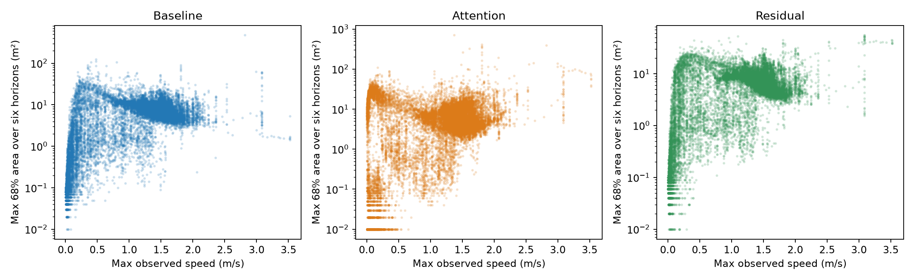
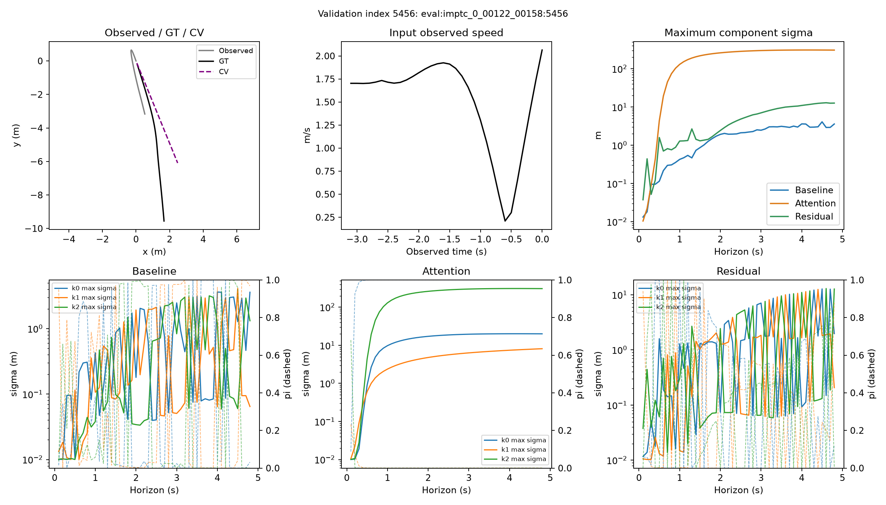
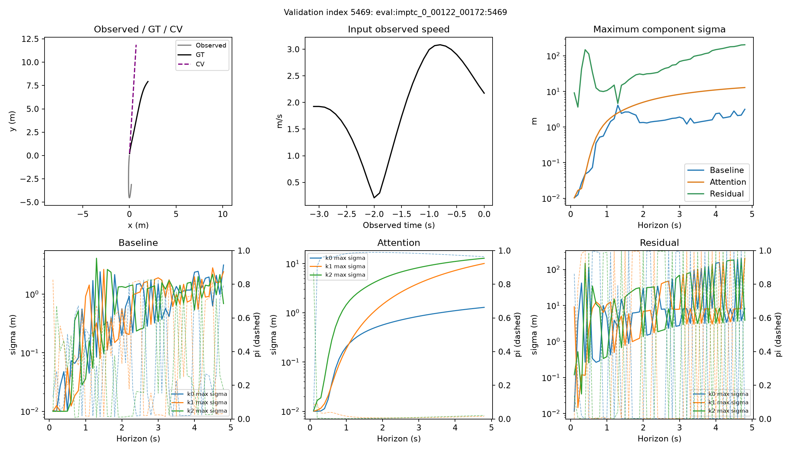
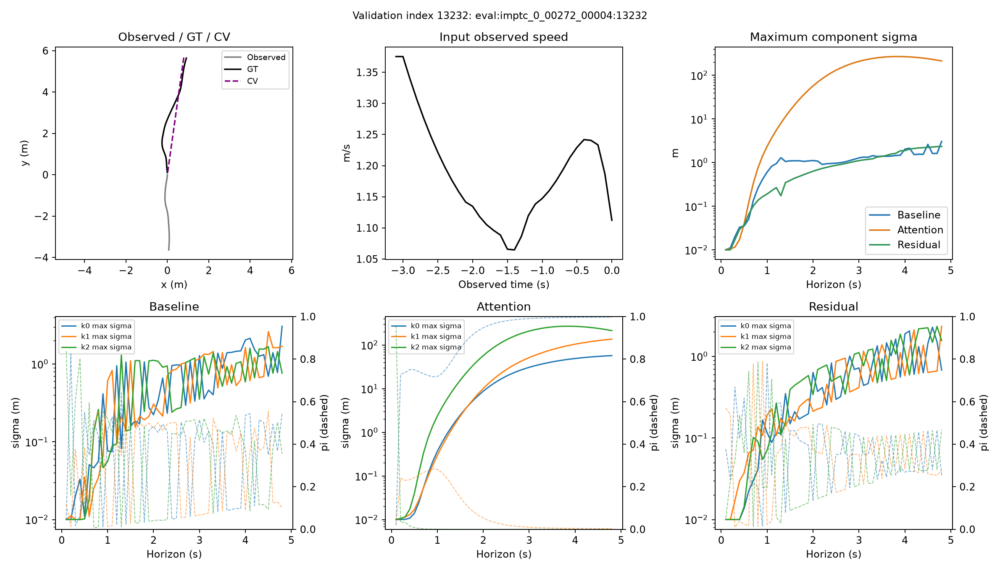

# Truy nguyên các outlier validation

Chọn hợp các top2 diện tích confidence ở từng model/level/horizon từ audit validation. Không dùng test để chọn mẫu hay ngưỡng; không sửa model/dataset. Dữ liệu tham số đầy đủ: parameters.npz; nguồn ID và thống kê: diagnostics.json.

## Kiểm tra input

Có 18 mẫu validation được chọn. Sai khác lớn nhất giữa velocity đã lưu và diff(position)/0.1 ở toàn validation: 4.441e-16. Điều này đối chiếu preprocessing hiện có, không chứng minh sensor/track gốc không có lỗi.

| Input feature | Train median | Train P99 | Train max | Validation median | Validation P99 | Validation max |
|---|---:|---:|---:|---:|---:|---:|
| max_speed_m_s | 1.192 | 2.153 | 5.198 | 1.288 | 2.087 | 3.523 |
| recent5_mean_velocity_norm_m_s | 0.943 | 1.926 | 5.119 | 1.131 | 1.938 | 3.520 |
| max_acceleration_m_s2 | 0.363 | 1.563 | 8.126 | 0.373 | 1.627 | 3.816 |
| observed_extent_m | 2.944 | 5.847 | 11.057 | 3.488 | 5.840 | 10.278 |

Đồ thị cho thấy mối liên hệ mô tả, không chứng minh speed gây ra covariance lớn.

## Các trường hợp đại diện

### Residual:0.68:0.8 — index 5456

Source: `imptc_0_00122_00158`.

- max_speed_m_s: 2.064; phân vị train 98.72%, validation 98.81%.
- recent5_mean_velocity_norm_m_s: 1.370; phân vị train 72.79%, validation 70.13%.
- max_acceleration_m_s2: 3.816; phân vị train 99.93%, validation 99.96%.
- observed_extent_m: 3.211; phân vị train 52.91%, validation 46.16%.

| Model | Sigma lớn nhất | Pi tại sigma lớn nhất | Horizon thành phần đóng góp covariance lớn nhất | Pi | Sigma x | Sigma y | Rho | Weighted trace |
|---|---:|---:|---:|---:|---:|---:|---:|---:|
| Baseline | 4.109 | 4.029e-02 | 4.5 | 4.029e-02 | 1.055 | 4.109 | -0.40014 | 0.725 |
| Attention | 310.554 | 1.329e-07 | 4.2 | 9.999e-01 | 4.229 | 20.136 | -0.89041 | 423.296 |
| Residual | 12.964 | 1.069e-04 | 1.3 | 6.377e-01 | 1.515 | 2.685 | -0.09506 | 6.060 |

Tham số ở horizon được chọn 0.8 s (component không phải mode quỹ đạo chung):

| Model | k | Pi | Sigma x (m) | Sigma y (m) | Raw log sigma x | Raw log sigma y | Rho | sqrt(det Sigma) (m²) |
|---|---:|---:|---:|---:|---:|---:|---:|---:|
| Baseline | 0 | 8.342e-01 | 0.141 | 0.308 | -2.031 | -1.212 | -0.40961 | 0.040 |
| Baseline | 1 | 4.104e-02 | 0.025 | 0.017 | -4.187 | -5.024 | -0.20813 | 0.000 |
| Baseline | 2 | 1.247e-01 | 0.012 | 0.044 | -6.198 | -3.378 | -0.47240 | 0.000 |
| Attention | 0 | 9.999e-01 | 1.498 | 6.838 | 0.398 | 1.921 | -0.89337 | 4.604 |
| Attention | 1 | 1.096e-04 | 0.444 | 1.749 | -0.835 | 0.553 | -0.85219 | 0.406 |
| Attention | 2 | 2.030e-08 | 16.328 | 74.941 | 2.792 | 4.317 | -0.98710 | 195.919 |
| Residual | 0 | 2.847e-06 | 0.132 | 0.147 | -2.102 | -1.987 | 0.32207 | 0.018 |
| Residual | 1 | 1.637e-03 | 0.015 | 0.012 | -5.255 | -6.385 | 0.38626 | 0.000 |
| Residual | 2 | 9.984e-01 | 0.322 | 0.763 | -1.164 | -0.284 | 0.03305 | 0.246 |

### Residual:0.68:4.8 — index 5469

Source: `imptc_0_00122_00172`.

- max_speed_m_s: 3.084; phân vị train 99.76%, validation 99.79%.
- recent5_mean_velocity_norm_m_s: 2.477; phân vị train 99.79%, validation 99.86%.
- max_acceleration_m_s2: 3.816; phân vị train 99.93%, validation 99.99%.
- observed_extent_m: 4.532; phân vị train 81.82%, validation 81.67%.

| Model | Sigma lớn nhất | Pi tại sigma lớn nhất | Horizon thành phần đóng góp covariance lớn nhất | Pi | Sigma x | Sigma y | Rho | Weighted trace |
|---|---:|---:|---:|---:|---:|---:|---:|---:|
| Baseline | 4.105 | 8.597e-03 | 4.8 | 7.918e-01 | 3.147 | 2.916 | -0.24702 | 14.577 |
| Attention | 12.829 | 2.102e-02 | 4.8 | 2.102e-02 | 0.613 | 12.829 | -0.33380 | 3.468 |
| Residual | 203.870 | 3.508e-03 | 4.8 | 3.508e-03 | 60.432 | 203.870 | 0.51283 | 158.623 |

Tham số ở horizon được chọn 4.8 s (component không phải mode quỹ đạo chung):

| Model | k | Pi | Sigma x (m) | Sigma y (m) | Raw log sigma x | Raw log sigma y | Rho | sqrt(det Sigma) (m²) |
|---|---:|---:|---:|---:|---:|---:|---:|---:|
| Baseline | 0 | 7.918e-01 | 3.147 | 2.916 | 1.143 | 1.067 | -0.24702 | 8.894 |
| Baseline | 1 | 3.252e-02 | 1.324 | 2.414 | 0.273 | 0.877 | 0.68303 | 2.335 |
| Baseline | 2 | 1.757e-01 | 0.690 | 0.221 | -0.385 | -1.558 | -0.44574 | 0.136 |
| Attention | 0 | 9.637e-01 | 0.499 | 1.290 | -0.715 | 0.247 | -0.29022 | 0.616 |
| Attention | 1 | 1.525e-02 | 3.123 | 10.039 | 1.136 | 2.305 | -0.33130 | 29.583 |
| Attention | 2 | 2.102e-02 | 0.613 | 12.829 | -0.506 | 2.551 | -0.33380 | 7.414 |
| Residual | 0 | 1.770e-03 | 4.158 | 8.243 | 1.423 | 2.108 | -0.25547 | 33.137 |
| Residual | 1 | 3.508e-03 | 60.432 | 203.870 | 4.101 | 5.317 | 0.51283 | 10576.840 |
| Residual | 2 | 9.947e-01 | 1.971 | 3.855 | 0.673 | 1.347 | 0.08736 | 7.569 |

### Attention:0.68:4.8 — index 13232

Source: `imptc_0_00272_00004`.

- max_speed_m_s: 1.375; phân vị train 62.20%, validation 58.12%.
- recent5_mean_velocity_norm_m_s: 1.202; phân vị train 60.96%, validation 54.63%.
- max_acceleration_m_s2: 1.221; phân vị train 97.01%, validation 97.99%.
- observed_extent_m: 3.635; phân vị train 59.56%, validation 52.77%.

| Model | Sigma lớn nhất | Pi tại sigma lớn nhất | Horizon thành phần đóng góp covariance lớn nhất | Pi | Sigma x | Sigma y | Rho | Weighted trace |
|---|---:|---:|---:|---:|---:|---:|---:|---:|
| Baseline | 3.063 | 5.442e-01 | 4.8 | 5.442e-01 | 3.063 | 2.118 | 0.44992 | 7.548 |
| Attention | 269.756 | 1.609e-05 | 4.8 | 9.971e-01 | 57.271 | 29.438 | 0.97392 | 4134.674 |
| Residual | 2.340 | 2.784e-01 | 4.7 | 2.804e-01 | 0.951 | 2.331 | 0.14241 | 1.778 |

Tham số ở horizon được chọn 4.8 s (component không phải mode quỹ đạo chung):

| Model | k | Pi | Sigma x (m) | Sigma y (m) | Raw log sigma x | Raw log sigma y | Rho | sqrt(det Sigma) (m²) |
|---|---:|---:|---:|---:|---:|---:|---:|---:|
| Baseline | 0 | 5.442e-01 | 3.063 | 2.118 | 1.116 | 0.746 | 0.44992 | 5.794 |
| Baseline | 1 | 1.014e-01 | 0.979 | 1.690 | -0.032 | 0.519 | -0.32748 | 1.563 |
| Baseline | 2 | 3.544e-01 | 0.763 | 0.484 | -0.284 | -0.747 | 0.02530 | 0.369 |
| Attention | 0 | 9.971e-01 | 57.271 | 29.438 | 4.048 | 3.382 | 0.97392 | 382.544 |
| Attention | 1 | 2.829e-03 | 136.764 | 11.306 | 4.918 | 2.424 | 0.77061 | 985.437 |
| Attention | 2 | 3.225e-05 | 213.985 | 14.340 | 5.366 | 2.662 | -0.89369 | 1376.791 |
| Residual | 0 | 2.532e-01 | 0.677 | 0.517 | -0.404 | -0.679 | 0.18805 | 0.344 |
| Residual | 1 | 2.784e-01 | 0.953 | 2.340 | -0.059 | 0.846 | 0.15106 | 2.204 |
| Residual | 2 | 4.684e-01 | 1.563 | 0.941 | 0.440 | -0.072 | 0.11203 | 1.461 |

## Kết luận cụ thể từ các mẫu đã đọc

1. Preprocessing velocity khớp với position differences; không tìm thấy lỗi tính vận tốc trong validation. Các giá trị speed/acceleration vẫn nằm trong miền giá trị từng xuất hiện ở train, dù một số thuộc đuôi rất hiếm. Không đủ căn cứ để xóa mẫu hay gán dữ liệu hỏng.
2. Residual index 5469 có thay đổi tốc độ mạnh; recent velocity thuộc khoảng top 0.21% train. Một Gaussian sigma_y≈204 m nhưng pi≈0.0035. Tại 4.8 s, Gaussian mang pi≈0.9947 có sigma≈(1.97,3.85) m. Do đó không được gán toàn bộ vùng 68% lớn cho component 204 m chỉ vì nó có max sigma/weighted trace lớn nhất; vùng density cao phải xét toàn mixture.
3. Attention index 13232 có max speed≈1.38 m/s, ở khoảng phân vị 62% train. Gaussian mang pi≈0.997 lại có sigma≈(57.27,29.44) m. Đây là ví dụ rõ về output covariance rất rộng trên một input không cực trị theo tốc độ. Không thể giải thích mọi lỗi bằng vận tốc cao.
4. Stable parameterization hiện tại ngăn covariance suy biến/overflow nhưng vẫn cho sigma rất lớn. NLL tốt trung bình không đảm bảo head được kiểm soát ở mọi lịch sử. Cơ chế trực tiếp đã thấy là raw log-sigma của head tạo component rộng; nguyên nhân học được sâu hơn cần ablation, chưa có chứng minh nhân quả.
5. Phép cộng prior CV chỉ dịch mean, không trực tiếp nhân hoặc cộng vào sigma. Nó có thể gián tiếp thay đổi quá trình học của mạng chung, nhưng kết quả hiện tại chưa chứng minh đó là nguyên nhân outlier.

Vì các component đổi vai trò theo timestep, không xem k cố định là một hành vi hay quỹ đạo liên tục. Hình sigma/pi từng k có thể nhảy mà vẫn là marginal GMM hợp lệ.

## Phân biệt cơ chế trong code và nguyên nhân học được

- Mean: residual chỉ cộng cùng một vector CV vào ba component tại mỗi horizon. Phép cộng này dịch chuyển toàn bộ GMM; không thay sigma/rho/pi trong forward. Đã kiểm tra equality phần raw từ sigma đến logits giữa residual_output và forward trên toàn bộ mẫu được chọn. Vùng confidence trên mặt phẳng không giới hạn bất biến theo phép dịch; trên grid hữu hạn, clipping có thể thay đổi diện tích đo.
- Sigma: stable dùng exp(raw_log_sigma) + 0.01, chỉ guard exponent ở sigma khoảng 1000 m. Guard này chống số học overflow, không phải giới hạn uncertainty hợp lý cho pedestrian. Raw log-sigma lớn có thể tạo ellipse rộng mà output vẫn finite và NLL tổng thể vẫn tốt.
- Pi: sigma lớn với pi rất nhỏ không nhất thiết làm confidence region 68% rộng. Phải xét cả pi và covariance có trọng số. Bảng hiển thị riêng max sigma và component đóng góp covariance lớn nhất để tránh nhầm hai khái niệm này.
- Rho: rho gần ±1 làm Gaussian hẹp theo một trục và kéo dài theo trục kia; determinant khác trace. Không thể dùng max sigma để thay sharpness GMM.
- Marginal NLL tối ưu density của GT, không trực tiếp phạt covariance outlier hoặc scalar sharpness cực đại. Đây là đặc điểm objective, chưa chứng minh một cơ chế nhân quả cụ thể trên các mẫu này.

Chưa xác định được nguyên nhân gốc trong dữ liệu cảm biến gốc hoặc vì sao quá trình tối ưu tạo head như vậy. Không tự loại mẫu hay kết luận dữ liệu hỏng chỉ vì nó ở percentile cao. Cần xem lịch sử/track gốc nếu muốn xác nhận lỗi tracking.

## Hướng tiếp theo

Dùng các mẫu validation đã lưu để thiết kế một ablation kiểm soát covariance: giới hạn mềm log-sigma hoặc penalty cho covariance quá lớn, chọn tham số bằng validation và giữ K/LSTM/CV/NLL nền. Kiểm tra NLL, reliability và sharpness cùng nhau vì siết covariance có thể làm undercoverage. Đây là đề xuất thí nghiệm; chưa áp dụng hay train. Giữ các run hiện tại làm đối chứng.

Tái tạo: `.venv/bin/python residual_mdn/analysis/investigate_validation_outliers.py`.
